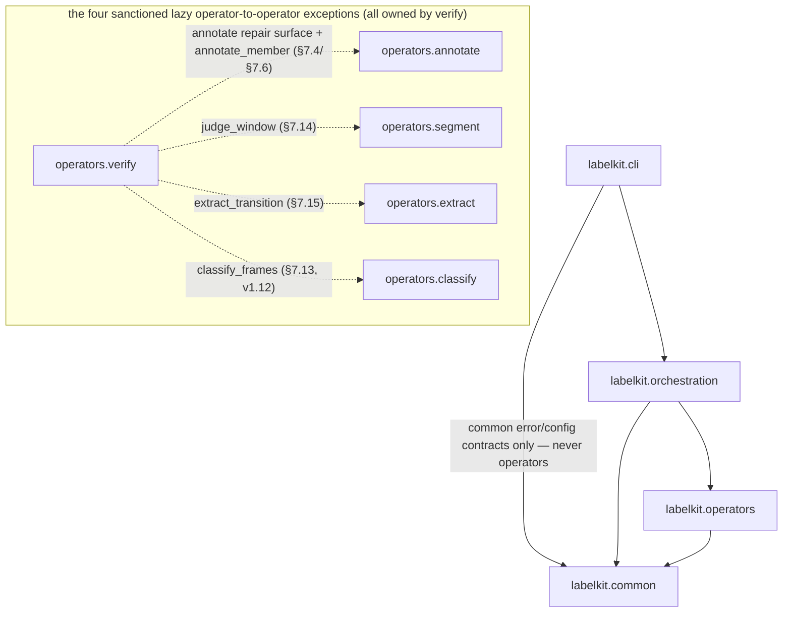

# LabelKit — Cross-Module Interface Contract (CONTRACTS.md)

**Status: FROZEN.** This document is the single interface contract for parallel implementation of
M1–M16 + CLI by independent engineers. It is derived from the design spec v1.4 base through the
v1.16 time-stream sequence-rule revision (`spec/*.md`), which
remains the authority for *algorithms and behavior*; this document is the authority for *names,
signatures, types, defaults, file formats, and prompt text*. Where the spec left a signature or
format implicit, the decision is frozen here and tagged **[FROZEN HERE]** (all such decisions are
also listed in §12). Any deviation requires editing this file first.

Ground rules for every implementer:

- Python ≥ 3.11. Deps: `httpx`, `jsonschema`, `datasketch`, `Pillow`, `imagehash`, `json_repair`,
  `numpy`, stdlib `tomllib`, and — v1.10 (U4, spec §2.6 whitelist revision) — `rich`, CLI-layer
  only: lazily imported inside `labelkit/cli/console.py`, the sole touchpoint (operators/common
  never import it; M1 probes importability via `find_spec` without importing); v1.16 adds the
  narrow algorithm-library exception `ortools==9.15.6755`, imported only by
  `labelkit/common/runtime/sequence_planner.py`. Nothing else. OR-Tools is not an application
  framework, and there is no runtime substitute or version fallback.
- Code identifiers: English. **Comments and docstrings: Chinese** (the 2026-08-14 code-rule
  remediation — see §12 and spec §1.6). **Everything a user or a machine reads — log lines, error
  messages, CLI output, exception text, report/trace payloads: English.** LLM prompt templates are
  the exception in the other direction: the exact Chinese text given in §10 of this document
  (copied from the spec verbatim), together with the spec-frozen output data it produces
  (`thread_seam` step text, defect-table `detail` strings, packaged rubric criteria), stays
  Chinese verbatim.
- Do not rename any field, key, event, or error code defined here. Tests assert exact strings.
- Import discipline (no cycles): production imports use only the layered package paths below;
  the former flat modules and `labelkit.config` package do not exist.
  `labelkit.common.contracts.types` and `labelkit.common.errors` import nothing from `labelkit`;
  `labelkit.common.config.model` imports nothing from `labelkit` except
  shared contract types if needed; `labelkit.common.runtime.llm_client` imports only common-layer
  contracts, errors, config, observability, and — v1.11 — the sibling
  `labelkit.common.runtime.budget` (which itself references llm_client's `PromptBundle` under
  `typing.TYPE_CHECKING` only — the stage.py convention, so no cycle);
  `labelkit.common.runtime.schema_engine` imports the
  common runtime LLM client plus common errors/observability; `labelkit.common.contracts.stage`
  imports runtime/config/observability types under `typing.TYPE_CHECKING` only. Common never imports
  operators or orchestration. v1.16's sibling common runtime modules `declare`, `temporal`, and
  `sequence_planner` may import common config/contracts and each other in that direction;
  M1/M6/M10 call their public surfaces, never a copied solver implementation. Operator modules
  import common and declared stdlib/third-party
  dependencies, never orchestration and **never each other** — with the sanctioned lazy-import
  exceptions that `labelkit.operators.verify` calls the public repair surface from
  `labelkit.operators.annotate` (§7.4; used per §7.6), v1.8, the public direct-call surfaces
  `labelkit.operators.segment.judge_window` / `labelkit.operators.extract.extract_transition`
  (§7.14/§7.15; used by the stream repair driver, §7.6) and, v1.12, the public direct-call surface
  `labelkit.operators.classify.classify_frames` (the fourth sanctioned operator-to-operator
  import — verify's member-reclaim frame-product re-run, §7.13/§7.6; the sibling reclaim
  surface `annotate.annotate_member` is NOT a fifth direction — it joins the §7.4 annotate
  repair-face family on the first leg). Orchestration may import common and
  operators. CLI imports orchestration's public entry points plus common error/config contracts,
  and never imports or instantiates operators.

The same discipline as a dependency graph (the bullet above stays the normative wording;
solid = layered production imports, dotted = the sanctioned lazy exceptions):



---

## 1. Package layout and ownership

```text
labelkit/
├── __init__.py                         # __version__ and TOOL_VERSION only
├── cli/
│   ├── __init__.py                     # public exports: main, build_parser, exit_code_for
│   ├── main.py                         # process entry, exception rendering, sole exit-code mapping
│   ├── parser.py                       # argparse definitions and CliOverrides conversion
│   ├── commands.py                     # run / validate / rubric user-facing handlers
│   └── console.py                      # v1.10 ConsoleRenderer — the SOLE rich lazy-import touchpoint: Live canvas, snapshot rendering, cbreak keyboard, log-stream takeover/restore, degradation (§7.12)
├── common/
│   ├── contracts/
│   │   ├── types.py                    # Ch.4 shared data types and frame/tree helpers
│   │   └── stage.py                    # Stage protocol and RunContext
│   ├── errors.py                       # cross-layer error vocabulary, exit codes, ErrorKind
│   ├── config/
│   │   ├── __init__.py                 # exports load/default_rubric/ResolvedConfig plus v1.16 rule/window types and effective helpers
│   │   ├── model.py                    # all config dataclasses (M1)
│   │   ├── loader.py                   # M1 public entry: load / default_rubric re-export, console-mode verdict, ResolvedConfig assembly
│   │   ├── _collect.py                 # error/warning aggregator and typed table readers (package-private)
│   │   ├── _sections.py                # per-section TOML parsing into config dataclasses (package-private)
│   │   ├── _schemas.py                 # user/frame JSON Schema meta-validation and few-shot dry runs (package-private)
│   │   ├── _rubrics.py                 # rubric resolution: inline table and packaged default:* selectors (package-private)
│   │   ├── _classviews.py              # [class.*] / [frame.class.*] whitelist merge into class views (package-private)
│   │   ├── _constraints.py             # cross-section constraint driver and parse products (package-private)
│   │   └── _generate_stream_constraints.py # v1.16: v1.13-v1.16 time-stream syntax/schema/local/full-flow planner checks
│   ├── runtime/
│   │   ├── budget.py                   # v1.11 context-budget primitives + ImageCostCalibrator (§7.17)
│   │   ├── declare.py                  # v1.16: 15-template evaluator, candidate pairs and CP-SAT helpers (§7.18)
│   │   ├── llm_client.py               # M9 transport, retry/key pools, concurrency, usage
│   │   ├── schema_engine.py            # M8 L0-L3 guarantee, repair, schema validation/stats
│   │   ├── sequence_planner.py         # v1.16: sole joint CP-SAT question/check/sample/layout entry (§7.18)
│   │   └── temporal.py                 # v1.16: integer-us, fixed-offset calendar and duplicate shift helpers (§7.18)
│   ├── observability/
│   │   ├── obslog.py                   # M12 logs, trace, events, metrics, breaker state
│   │   └── console_format.py           # v1.10 plain progress/summary line formats (U21) — pure functions, the single source shared by the M11 emitter and the CLI renderer; byte-frozen (re-frozen 2026-08-14 onto the English strings)
│   └── extensions/
│       └── hooks.py                    # user validator resolution/execution/normalization
├── operators/
│   ├── ingest.py                       # M2
│   ├── segment.py                      # M14
│   ├── stitch.py                       # M16
│   ├── dedup.py                        # M3
│   ├── classify.py                     # M13
│   ├── extract.py                      # M15
│   ├── quality.py                      # M4
│   ├── generate.py                     # M6
│   ├── generate_stream.py              # M6 time-stream pure plan/weave/backfill/assembly logic
│   ├── annotate.py                     # M5
│   ├── verify.py                       # M7
│   └── emitter.py                      # M11
├── orchestration/
│   ├── __init__.py
│   ├── orchestrator.py                 # M10 batch/stage lifecycle and report aggregation
│   ├── factory.py                      # operator construction and frozen pipeline order
│   ├── profile_usage.py                # validate --probe referenced-profile discovery
│   └── runtime.py                      # runtime object-graph assembly and public run/validate entry
└── data/rubrics/
    ├── default_text.toml
    ├── default_ui.toml
    └── default_trajectory.toml
```

`labelkit/common/errors.py`, `labelkit/common/contracts/types.py`,
`labelkit/common/contracts/stage.py`, and `labelkit/common/config/model.py` are the canonical homes
of the verbatim frozen material in sections 3–6. Changes to their frozen content still require
updating this file first.

### 1.1 Canonical paths only

The directories above are the only implementation paths. The package root contains only
`labelkit/__init__.py`; the former flat modules (`labelkit.types`, `labelkit.stage`,
`labelkit.errors`, service/operator modules, and `labelkit.orchestrator`) and the former
`labelkit.config` package are intentionally removed. No re-export shim, module alias, or dynamic
forwarder may recreate them. Consumers must import the layered canonical modules.

`labelkit.cli` remains the public module name as the `labelkit/cli/` package; there is no
coexisting `labelkit/cli.py`. Its `__init__.py` exports the established CLI entry surfaces, and the
console-script target `labelkit.cli:main` remains unchanged. Public direct-call surfaces such as
`annotate_record`, `build_*_prompt`, `judge_window`, `extract_transition`, `classify_frames`
(v1.12 — the fourth sanctioned operator-to-operator import, ground rules above), `RunContext`,
`LLMClient`, and `SchemaEngine` retain their frozen signatures and behavior at their canonical
layered paths only.

### 1.2 Test ownership

Offline tests physically mirror the production owners: contracts under `tests/common/contracts/`,
config under `tests/common/config/`, runtime under `tests/common/runtime/`, observability under
`tests/common/observability/`, extensions under `tests/common/extensions/`, operators under
`tests/operators/`, and orchestration under `tests/orchestration/`. Key-pool unit coverage belongs
in `tests/common/runtime/test_llm_client.py`; stream-ingest coverage belongs in
`tests/operators/test_ingest.py`; v1.9 M16 stitch coverage belongs in
`tests/operators/test_stitch.py` (offline) and `tests/integration/test_stitch_llm.py`
(real-LLM judgments); v1.10 console coverage belongs in `tests/cli/test_console.py`
(renderer snapshots, keyboard, degradation) and
`tests/common/observability/test_console_format.py` (byte-frozen golden snapshots of the
plain line formats — the golden-snapshot layer of the three-layer regression anchor, U24);
v1.13 time-stream generation coverage belongs in `tests/operators/test_generate_stream.py`
(planning draws, weaver mechanics, direct assembly, artifact replay equivalence),
`tests/common/config/test_loader_generate_stream.py` (the M1 constraint matrix, §6.3 rules
50–61 — v1.14's tier and binding clusters and v1.15's per-class tier cluster land in the same
file) and
`tests/integration/test_generate_stream_llm.py` (real-LLM: the DeepSeek endpoint
for blueprint/realize/per-class annotation and, v1.14, for tiers and time-field back-fill, plus
z.ai `glm-5.2` cases pinning `prefixItems` and `allOf`/`contains` L0 pass-through). v1.14's
`apportion_tiers` unit coverage belongs in `tests/common/config/` (it follows the function's
`model.py` home), while the ordinal mapping and the `--limit` commutativity belong in
`tests/operators/`. v1.15's per-class tier coverage lands in exactly the SAME five files and
creates NO new test file (the `EXPECTED_TEST_PY` allowlist is unchanged): `effective_tiers`
and `ClassView.tiers` beside `apportion_tiers` in `tests/common/config/`, rule 61's three
sub-clauses and the per-effective-table / union-scope checks in
`test_loader_generate_stream.py`, mixed-form planning, blueprint subsetting and per-row
truth/generator agreement in `tests/operators/test_generate_stream.py`, the report's two forms
and their double key order in `tests/orchestration/test_orchestrator.py`, and one added
DeepSeek case in `tests/integration/test_generate_stream_llm.py`.
v1.16 sequence-rule coverage adds `tests/common/runtime/test_declare.py`
(all 15 templates against a direct finite-word oracle), `tests/common/runtime/test_temporal.py`
(microseconds/calendar/duplicate shifts), and `tests/common/runtime/test_sequence_planner.py`
(joint satisfiability, session/cross/noise layout, statuses, model-size cap and determinism).
Config/hook/schema/budget/generation/orchestration deltas stay with their existing owners:
`tests/common/config/test_config.py`, `test_loader_generate_stream.py`,
`tests/common/contracts/test_types.py`, `tests/common/extensions/test_hooks.py`,
`tests/common/runtime/test_schema_engine.py`, `test_budget.py`,
`tests/operators/test_generate_stream.py`, `tests/operators/test_ingest.py`,
`tests/orchestration/test_orchestrator.py`, and the real-endpoint
`tests/integration/test_generate_stream_llm.py`. No mock LLM transport is introduced.
A separate compatibility-import test,
`test_key_pool.py`, or
`test_stream_ingest.py` is forbidden. The exact file allowlist is normative in
`docs/dev/SPEC-package-layer-reorganization.md` §6.1.

---

## 2. Architecture recap (normative)

Four physical layers (spec §2.2 and package-layer reorganization spec):
`labelkit.cli → labelkit.orchestration → labelkit.operators → labelkit.common`. Common contains
cross-layer contracts and shared capabilities, not data-processing business logic: M1 config;
M8/M9 under `common.runtime`; M12 under `common.observability`; user hooks under
`common.extensions`; and the cross-layer error vocabulary at the `common.errors` root. Canonical
files: errors at `labelkit/common/errors.py`; SchemaEngine/LLMClient at
`labelkit/common/runtime/schema_engine.py` and `labelkit/common/runtime/llm_client.py`; hooks at
`labelkit/common/extensions/hooks.py`; v1.16 DECLARE/temporal/joint planning at
`labelkit/common/runtime/declare.py`, `temporal.py`, and `sequence_planner.py`; obslog at
`labelkit/common/observability/obslog.py`. Operators
(M2 ingest, M14 segment, M16 stitch, M3 dedup, M13 classify, M15 extract, M4 quality, M5 annotate,
M6 generate, M7 verify, M11 emitter) depend only on common, subject solely to the four sanctioned
lazy operator calls (verify→annotate/segment/extract/classify, §7.4/§7.6/§7.14/§7.15/§7.13 —
the classify leg is v1.12's `classify_frames`). Orchestration may
depend on common and operators and owns construction/order/lifecycle; CLI calls orchestration's
public runtime entry points and owns only parsing, user interaction, and the sole exception-to-exit-
code mapping. Common depends on neither operators nor orchestration; operators never depend on
orchestration; CLI never imports operators.

Pipeline order per batch — the three chain forms (process superset / generation re-flow /
`generate_only`):

```mermaid
flowchart LR
    subgraph PROC["process mode — the single superset chain (v1.9, §7.9); segment / stitch / extract DEFAULT OFF"]
        direction LR
        A1["segment"] --> A2["stitch"] --> A3["dedup"] --> A4["classify"] --> A5["extract"] --> A6["quality"] --> A7["generate (off-path, returns sub-batch)"] --> A8["annotate"] --> A9["verify"] --> A10["emit"]
    end
    subgraph REFLOW["generation re-flow — sub-batches re-enter the queue as new batches (no generate: single-pass, no recursion)"]
        direction LR
        B1["dedup"] --> B2["classify"] --> B3["quality"] --> B4["annotate"] --> B5["verify"] --> B6["emit"]
    end
    subgraph GENONLY["generate_only mode (v1.4) — no M2; GenerateStage.generate_all() produces all Records up front, split by run.batch_size"]
        direction LR
        C0["generate_all()"] --> C1["dedup"] --> C2["classify"] --> C3["quality"] --> C4["annotate"] --> C5["verify"] --> C6["emit"]
    end
    A7 -.->|"sub-batch"| B1
```



segment, stitch and extract are DEFAULT OFF; with all three disabled the process chain degrades
byte-identically to the v1.7 chain
`dedup → classify → quality → generate → annotate → verify → emit`. `generate.enabled` and
`segment.enabled` are mutually exclusive (M1, the segment-precondition rule — §6.3 rule 29) and
`stitch.enabled` requires `segment.enabled` (the stitch-requires-segment rule, §6.3 rule 37), so
the generate slot never coexists with the stream stages (stitch included) and stitch never
appears in the generation re-flow chain. Generation sub-batches run the re-flow chain above
(generated records enter carrying an `"inherited"` Classification, which the idempotent
classify stage skips — §7.13). In `generate_only` mode, classify/quality/annotate are
individually optional per switches; segment/stitch/extract never participate — segment requires
process mode and stitch requires segment, §6.3.

Statuses: `active | dropped_dup | dropped_lowq | dropped_verify | failed | absorbed |
dropped_noise | stitched` (EIGHT values; `absorbed`/`dropped_noise` are v1.8: `absorbed` =
member frame absorbed into an episode envelope by M14, `dropped_noise` = noise/below-min-len
frame dropped by M14 or shrunk out by M7 member surgery; `stitched` is v1.9: merged-fragment
episode shell terminal-marked by M16 stitch — the stitch-rebind exception, §5/§7.16). Stages
never delete list elements; they flip `status` and attach evidence.

---

## 3. `labelkit/common/contracts/types.py` — verbatim

```python
"""Shared data types (spec ch.4). Frozen contract — do not edit without updating CONTRACTS.md."""
from __future__ import annotations

import base64
import io
from dataclasses import dataclass, field
from pathlib import Path
from typing import Literal, Mapping

Status = Literal[
    "active",          # alive, keeps flowing
    "dropped_dup",     # M3 judged duplicate
    "dropped_lowq",    # M4 below quality gate
    "dropped_verify",  # M7 verdict fail with policy=drop (or repair budget exhausted)
    "failed",          # processing error (irreparable schema / provider retries exhausted ...)
    "absorbed",        # v1.8 additive: member frame absorbed into a sequence envelope
                       #   (M14 contract ②b, §5/§7.14); THIRD ROUTE — written to neither
                       #   main output nor rejects, counted only (§7.10/§9.3)
    "dropped_noise",   # v1.8 additive: noise/short-segment frame (M14: reason "noise" /
                       #   "below_min_len", §7.14) or verify repair shrink
                       #   (M7: "off_task_member", §7.6) → rejects (§9.2)
    "stitched",        # v1.9 additive: merged-fragment episode shell (M16 contract ②c,
                       #   §5/§7.16; terminal); FOURTH ROUTE — written to neither main
                       #   output nor rejects, counted only (§7.10/§9.3)
]


@dataclass(frozen=True)
class RecordRef:
    source_file: str                       # path relative to run.input ("" for generated records)
    line_no: int | None                    # text modality: 1-based line number
    pair_index: int | None                 # UI modality: file-pair index
    generated_from: tuple[str, ...]        # process-mode generated sample: seed record ids;
                                           # everything else (incl. generate_only samples): ()
                                           # — synthetic-ness is judged by `generator`, not this (v1.4)
    generator: Mapping | None = None       # generated records: {"llm": <profile>, "style": <name>|None}
                                           # non-generated records: None


@dataclass(frozen=True)
class ImageRef:
    path: Path
    format: Literal["png", "jpeg"]         # ".jpg"/".jpeg" both map to "jpeg"
    size_bytes: int

    def load_base64(self, max_px: int) -> tuple[str, str]:
        """Load from disk at call time. If the longer edge exceeds max_px, downscale
        proportionally (Pillow) before encoding. Returns (media_type, b64) where media_type is
        "image/png" | "image/jpeg". Bytes are not cached — used and discarded (spec §2.6)."""
        ...


@dataclass(frozen=True)
class UINode:
    node_id: str
    parent_id: str | None
    depth: int
    role: str                              # widget role normalized from class/type
    text: str
    content_desc: str
    bounds: tuple[int, int, int, int]      # (l, t, r, b) pixels
    visible: bool
    extra: Mapping[str, str]               # non-whitelisted source fields, values stringified


@dataclass(frozen=True)
class UITree:
    nodes: tuple[UINode, ...]              # depth-first order

    def serialize(self, max_chars: int | None = None, quantize_px: int = 0) -> str:
        """Canonical linearization (spec §4.3), shared by M3 dedup (quantize_px =
        dedup.bounds_quantize_px) and M5 prompts (quantize_px = 0, max_chars =
        input.ui_tree_max_chars).

        Rules (exact):
        - Traverse `nodes` in stored (depth-first) order; skip nodes with visible == False.
        - One line per node, joined with "\\n", no trailing newline:
            line = ("  " * depth) + role
                   + (f' "{text}"' if text else "")
                   + (f' desc="{content_desc}"' if content_desc else "")
                   + f" [{l},{t},{r},{b}]"
                   + "".join(f" {k}={v}" for k, v in extra.items() if v)
          (extra in insertion order; indentation is TWO spaces per depth level — matches the
           worked examples in spec 3.2.7/3.9.4 [FROZEN HERE, see §12].)
        - If quantize_px > 0, each coordinate is floor-divided first: c = c // quantize_px.
        - If max_chars is not None and the full output exceeds it: keep the longest prefix of
          whole lines whose joined length (incl. "\\n" separators and the marker line below)
          ≤ max_chars, then append a final line "…(truncated N nodes)" where N = number of
          visible nodes omitted. [FROZEN HERE]
        """
        ...


@dataclass(frozen=True)
class Record:
    id: str                                # sha256 hex prefix [:16]; rule per modality, see below
    modality: Literal["text", "ui"]
    text: str | None                       # text modality: extracted text; UI modality: None
    raw: Mapping | None                    # text modality: original line object; UI: None
    ui_tree: UITree | None
    image: ImageRef | None
    ref: RecordRef
    kind: Literal["single", "sequence"] = "single"
                                           # v1.8 additive (appended with a default — every
                                           # pre-v1.8 construction site stays unchanged):
                                           # "sequence" = an M14-assembled episode record (§7.14)
    members: tuple["Record", ...] = ()     # v1.8 additive: sequence → member frames in order-key
                                           # ascending order; single → always ().
                                           # Sequence-record field convention (S24, spec §4.1):
                                           # text/raw/ui_tree/image = None; modality = the
                                           # members' modality; id = the sequence rule below
                                           # (fixed at formation — M7 member surgery / M16
                                           # thread rebinding never recompute it, v1.9 T22);
                                           # ref = RecordRef(source_file=first
                                           # member's source, line_no=first member's line_no,
                                           # pair_index=first member's pair_index,
                                           # generated_from=(), generator=None) — full member
                                           # provenance travels in _meta.stream.member_sources
                                           # (§9.1), not in ref
```

**Record id rules (M2/M6/M14, normative):**
- text modality: `sha256(canonical_json(raw).encode("utf-8")).hexdigest()[:16]` where
  `canonical_json(x) = json.dumps(x, sort_keys=True, ensure_ascii=False, separators=(",", ":"))`.
- UI modality: `sha256(uitree_file_bytes + image_file_bytes).hexdigest()[:16]`.
- generated records (M6): `raw = {input.text_field: sample_text}`, then the text rule.
- sequence records (M14, v1.8): `sha256("\n".join(member_ids).encode("utf-8")).hexdigest()[:16]`
  over the member ids in order-key ascending order, fixed at episode formation — M7 member
  surgery never recomputes it (spec 3.14.4, the sequence-assembly record-build step), and
  neither does M16's thread rebinding (the record-rebind write of the stitch-rebind exception,
  §5; v1.9): the surviving envelope keeps its id, which doubles as `thread_id` and
  `_meta.stream.episode_id`/`thread_id` (T22 identity chain).

```python
@dataclass(frozen=True)
class Classification:                      # v1.7: M13 classify verdict (spec 3.13, §4.1)
    label: str                             # routing label of THIS envelope
    labels: tuple[str, ...]                # the record's full hit set (declaration order;
                                           # single assignment: always one element)
    source: Literal["llm", "fallback", "inherited"]
    detail: Mapping                        # reason / sc stats / fallback trace (kind, message)


@dataclass(frozen=True)
class SequenceValidationFrame:             # v1.16: one frame exposed to the sequence hook
    position: int                           # zero-based position in the task sequence
    frame_class: str                        # planner-frozen frame class
    payload: object                         # JSON-compatible DEEP COPY; user mutation cannot
                                            # reach the internal generated payload


@dataclass(frozen=True)
class SequenceValidationInput:             # v1.16: generate.sequence_validator input
    sequence_class: str                     # declared sequence class name
    tier_rank: int | None                   # effective in-class tier rank; None without tiers
    frames: tuple[SequenceValidationFrame, ...]
                                            # declaration/position order, one entry per task frame


@dataclass(frozen=True)
class DedupInfo:
    kind: Literal["unique", "exact", "near_text", "near_image", "near_both", "near_semantic"]
    cluster_key: str                       # exact-dedup key ([:16] hex) of the cluster head;
                                           # unique records carry their own key
    kept_id: str | None                    # duplicates: id of the retained record; unique: None


@dataclass(frozen=True)
class Transition:                          # v1.8: one M15 extract verdict for an adjacent member
                                           # pair (spec §4.2), carried by PipelineItem.transitions
    index: int                             # rebuilt ordinal — ALWAYS equals the position in the
                                           # transitions tuple; renumbered after member surgery so
                                           # the invariant len(transitions) == len(members) - 1
                                           # stays true (S31)
    action: Mapping                        # object that passed action_schema (§10.7):
                                           # {action_type, target, value, description} —
                                           # field semantics per the §10.10 table
    model: str                             # provider model string of the extracting profile
                                           # ("" on a v1.9 thread-seam placeholder — no call)
    attempts: int                          # 1 + number of L3 repair calls (0 on a seam placeholder)
    detail: Mapping                        # fallback trace: {kind: "extraction_invalid", message}
                                           # (S16); surgery re-seam: {reseamed: True} (S31);
                                           # v1.9 thread-seam placeholder: {"kind": "thread_seam",
                                           # "interrupted_by": [...]} (T10, zero-LLM — §7.15/§7.16);
                                           # {} for a clean extraction


@dataclass(frozen=True)
class QualityScore:
    criterion: str                         # rubric criterion key, or "__aggregate__"
    score: float | None                    # [0,1] normalized; None = unscored (all judgments failed)
    mode: Literal["pairwise_bt", "pointwise"]
    detail: Mapping                        # pairwise: {comparisons, wins, ties, log_theta}
                                           # pointwise: {raw_score (0-5), reason}
                                           # __aggregate__: {}


@dataclass(frozen=True)
class Usage:
    prompt_tokens: int = 0
    completion_tokens: int = 0

    def __add__(self, other: "Usage") -> "Usage":          # [FROZEN HERE]
        return Usage(self.prompt_tokens + other.prompt_tokens,
                     self.completion_tokens + other.completion_tokens)

    def __radd__(self, other: object) -> "Usage":          # [FROZEN HERE]
        # Supports `sum(usage_list)`: sum's implicit start is int 0.
        if other == 0:
            return self
        return NotImplemented


@dataclass(frozen=True)
class Annotation:
    output: Mapping                        # object that PASSED the user schema (L2)
    model: str                             # provider model string of the annotating profile
    attempts: int                          # 1 + number of L3 repair calls
                                           # (self-consistency: sum over the SUCCESSFUL samples)
    usage: Usage                           # tokens of first call + repair calls (successful samples if SC)
    sc: Mapping | None = None              # self-consistency only: {"n": int, "agreement_ratio": float}
                                           # [FROZEN HERE: carried here so M11 can write _meta]


@dataclass(frozen=True)
class VerificationResult:
    verdict: Literal["pass", "fail"]
    rounds: int                            # judged rounds incl. the first (pass on first review = 1)
    critiques: tuple[Mapping, ...]         # accumulated over rounds, in order:
                                           # {"aspect": str, "opinion": str[, "judge": str]}
    defects: tuple[Mapping, ...] = ()      # v1.8 additive (S7): stream defect-table entries
                                           # {"kind", "members", "position", "detail"} — kind is
                                           # the six-value enum of defect_verdict_schema (§10.7;
                                           # five v1.8 values + wrong_stitch appended v1.9, T15);
                                           # non-stream paths: always (); travels to
                                           # _meta.verification.defects (§9.1)


@dataclass(frozen=True)
class StageError:
    stage: str                             # stage name that produced the error
    kind: str                              # error classification code (§7.6 / common.errors.ErrorKind)
    message: str
    retryable: bool


@dataclass
class PipelineItem:                        # the ONLY mutable envelope; lifetime = one batch
    record: Record
    status: Status = "active"
    classification: Classification | None = None   # v1.7: written by M13 classify (or inherited)
    dedup: DedupInfo | None = None
    scores: dict[str, QualityScore] = field(default_factory=dict)
    annotation: Annotation | None = None
    verification: VerificationResult | None = None
    errors: list[StageError] = field(default_factory=list)
    session_id: str | None = None          # v1.8 additive: in-batch carrier of the session
                                           # boundary (S4) — stamped by M10 on frame envelopes at
                                           # batching, by M14 on the appended episode envelopes
                                           # (bookkeeping, not business logic); M7's repair
                                           # neighborhood query = session_id filter + batch list
                                           # position order
    thread_id: str | None = None           # v1.9 additive: stamped by M16 stitch on surviving
                                           # thread envelopes at thread opening (== record.id ==
                                           # episode_id, T22; doubles as the stitch idempotency
                                           # gate); None everywhere else. The three M16 duck
                                           # marks seam_indexes / seam_interrupted_by /
                                           # stitch_fragments travel alongside as duck-typed
                                           # envelope attributes (§7.16; copied by
                                           # classify._fan_out, §7.13)
    transitions: tuple[Transition, ...] | None = None
                                           # v1.8 additive: written by M15 extract (§7.15);
                                           # None = extract disabled / not reached (idempotency
                                           # gate: `transitions is not None` → skip)
    member_classifications: dict[str, Classification] | None = None
                                           # v1.12 additive: written by the M13 classify frame
                                           # pass on first-label sequence envelopes (§7.13);
                                           # key = member record.id; None = frame classify off /
                                           # not reached (idempotency gate); fan-out clones SHARE
                                           # the dict BY REFERENCE (the record/dedup family,
                                           # copied explicitly by classify._fan_out)
    member_annotations: dict[str, Annotation] | None = None
                                           # v1.12 additive: written by the M5 annotate frame
                                           # pass (same execution gate); key = member record.id;
                                           # value None = that member's frame annotation FAILED
                                           # irreparably (failed 占键为 None, skipped 不占键 —
                                           # the dict shape is the single source of truth for
                                           # the members[] status三值); clones share by reference


# ── v1.8 shared frame helpers (spec §4.3, S12/S13) ──────────────────────────
# Module-level functions in labelkit/common/contracts/types.py, next to UITree.serialize — the shared
# rendering layer used by M14 segment, M15 extract, M13 classify (sequence
# branch) and M4 quality (sequence branch). Operator modules never depend on
# each other; shared rendering always sinks to this types layer.

def frame_digest(record: Record, max_chars: int) -> str:
    """Best-effort deterministic frame digest (S12 — UINode is a closed nine-field
    type; package/activity names are reachable only via `extra`):
    - UI modality:
        app      = first non-empty `extra` value among package|package_name|pkg
                   (visible nodes);
        activity = first non-empty `extra` value among
                   activity|activity_name|window_title (may be absent);
        title    = first visible non-empty text in DFS order;
        salient  = visible text/content_desc de-duplicated in encounter order;
                   Button/EditText/CheckBox-class interactive roles get a "*" prefix;
      the whole digest is truncated to max_chars (serialize truncation convention).
    - text modality: record.text truncated to max_chars.
    Poverty judgment: zero visible text nodes, or digest length < 8 ⇒ poor — the
    CALLER counts digest_poor_frames (report.stream, §9.3) and WARNs at most once
    per run; v1.11 (V4): the WARN guidance reads "attach frame screenshots by
    pointing segment.llm at a supports_vision=true profile" (the segment.use_vision
    key it formerly pointed at was removed in v1.11; the wording is the 2026-08-14
    English re-freeze of the same guidance). v1.11 (V9): M14 calls this ONCE per frame at
    SESSION level, BEFORE window packing — the digest vector feeds both the
    packer's per-frame costs and the §10.9 prompts (the pre-v1.11 per-window
    recomputation is gone; the poverty-guard path stays independent)."""
    ...


def tree_diff(a: UITree | None, b: UITree | None, quantize_px: int) -> Mapping:
    """Structural-key MULTISET matching over (role, bounds // quantize_px, depth)
    (S13 — node_id is NOT a cross-frame identity and must not be used as a match
    key); visible nodes only; O(n1 + n2); pure statistics, no semantic attribution
    (attribution belongs to M15). Returns:
    {added: int, removed: int, text_changed: int, change_ratio: float,
     app_changed: bool, title_changed: bool}."""
    ...
```

Notes binding on all implementers:

- `QualityScore.score` is `float | None` — the spec's `on_unscored` path requires representing
  "score = null" (spec 3.4.3 判定失败 row, §6.3 example semantics). **[FROZEN HERE]**
- `Annotation.sc` is an additive v1.2 field needed to carry `{n, agreement_ratio}` from M5 to M11
  (`_meta.annotation.sc`, spec 3.5.2/6.3). **[FROZEN HERE]**
- `Classification` / `PipelineItem.classification` are additive v1.7 fields (M13, spec §4.1).
  Multi-assignment fan-out clones share `record` and `dedup` **by reference** with their
  original envelope; all other containers are fresh defaults (§7.13).
- v1.8 additive fields (spec §4.1/§4.2, all appended with defaults — zero changes at
  pre-v1.8 construction sites): `Record.kind`/`Record.members`, `Transition`,
  `VerificationResult.defects`, `PipelineItem.transitions`/`PipelineItem.session_id`, and the
  two `Status` values `absorbed`/`dropped_noise`. Sequence records hold their members **by
  reference** (frozen objects shared, zero copy) — episode formation does not change the
  batch's memory order of magnitude (spec §2.6).
- v1.9 additive deltas (spec §4.1, same appended-with-defaults construction):
  `PipelineItem.thread_id` and the `Status` value `stitched`. The three thread duck marks
  stamped by M16 on surviving thread envelopes are deliberately NOT dataclass fields
  (duck-typed envelope attributes, the `session_split`/`noise_attribution` family):
  ① `seam_indexes: tuple[int, ...]` — each element is the seam pair's LEFT-member index in
  the rebound member tuple, the SAME coordinate as `Transition.index`/`_meta.stream.steps[].index`,
  range `[0, len(members) − 2]`; it has NO conversion relationship with `order_span`'s
  session-order key space (m-8); ② `seam_interrupted_by: tuple[tuple[str, ...], ...]` —
  positionally aligned with `seam_indexes`; the interrupting threads' `task_name`s in gap
  order (M16 computes these — extract has no cross-thread visibility, T10/T20); never empty
  for a seam; ③ `stitch_fragments` — session-ordered fragment table, elements
  `{order_span, member_count, cause ∈ "origin"|"resumed"|"rescued", source_episode}` (M11
  renders it as `_meta.stream.fragments`, §9.1). A fourth, frame-level audit mark
  `rescued_by = <surviving thread record.id>` is stamped on rescue-flipped frames next to
  their retained `noise_attribution` — trace/audit only, never emitted to any output channel.
- `frame_digest`/`tree_diff` are v1.8 module-level helpers whose docstrings above are the
  behavior contract (spec §4.3 末段); M14/M15/M13/M4 consume them — never re-implement
  digest/diff logic inside an operator module.
- Everything except `PipelineItem` is `frozen=True`. No module mutates a `Record`.

---

## 4. `labelkit/common/errors.py` — verbatim

```python
"""Exception hierarchy (spec §4.3) and error classification codes (spec §7.6)."""
from __future__ import annotations

import enum
from typing import Literal


class LabelKitError(Exception):
    """Base for all tool errors."""


class ConfigError(LabelKitError):
    """M1. Aggregates ALL validation errors (never just the first). CLI exit code 2."""
    def __init__(self, errors: list[str]):
        self.errors = errors
        super().__init__("\n".join(errors))


class InputError(LabelKitError):
    """M2, raised when an input.* policy is 'fail' (or no valid record exists /
    path missing at run start). Process mode only. CLI exit code 3."""
    def __init__(self, message: str):
        super().__init__(message)


class ProviderRetryableError(LabelKitError):
    """M9: retryable provider error with retries exhausted (v1.6: incl. park-budget overrun,
    run.max_park_s). Record-level → status='failed'."""
    def __init__(self, message: str, profile: str, retries: int,
                 key_env: str | None = None):
        self.profile = profile
        self.retries = retries
        self.key_env = key_env                # v1.6: env-var NAME of the last key tried (pools)
        super().__init__(message)


class ProviderFatalError(LabelKitError):
    """M9: non-retryable provider error (401/403/400/404, dims mismatch). Feeds the circuit
    breaker; a streak >= run.fatal_error_threshold ends the run with exit code 4.
    v1.6 pools: an auth failure absorbed by key rotation raises nothing — this exception is
    raised for auth only when the LAST live key gets disabled (spec 3.9.3)."""
    def __init__(self, message: str, profile: str, status_code: int | None = None,
                 key_env: str | None = None):
        self.profile = profile
        self.status_code = status_code
        self.key_env = key_env                # v1.6: env-var NAME of the failing key (pools)
        super().__init__(message)


class ContextOverflowError(LabelKitError):
    """v1.11 (V16/V24): the unified context-overflow signal. Record-level →
    status='failed', kind='context_overflow' (§7.6) → rejects; run continues.
    phase='precheck' — the M9 pre-dispatch invariant check fired (V16, zero provider
    interaction), or a packing layer found even the minimal semantic unit unfittable
    (V10 — recorded directly by the operator, no exception crossing);
    phase='reactive' — a real provider interaction identified overflow: budget-gated
    400 body-sniff hit, or the 200-shaped `model_context_window_exceeded` termination
    (V20/V24). M9 itself NEVER feeds `record_provider_result(fatal=True)` for this
    exception and burns no regular retry — the reactive-400 terminal is fed exactly
    once by the OWNING operator after its bounded degrade-retries exhaust (A7; §7.8
    breaker matrix)."""
    def __init__(self, message: str, phase: Literal["precheck", "reactive"]):
        self.phase = phase
        super().__init__(message)


class OutputTruncatedError(LabelKitError):
    """v1.11 (V11): the response terminated by hitting the output cap —
    finish_reason='length' (openai) / stop_reason='max_tokens' (anthropic): input fit
    the window, the model wrote max_output_tokens full. Record-level →
    status='failed', kind='output_truncated' → rejects (own bucket); the truncated
    text NEVER enters the L1–L3 repair loop, and the breaker is never fed (the HTTP
    interaction succeeded — `llm.call` stays status='ok')."""


class SchemaViolation(LabelKitError):
    """M8: L3 budget exhausted, object still invalid. Record-level → status='failed',
    kind='schema_violation' — or 'callback_violation' when the remaining violations
    all come from the output.validator hook (callback_only=True, spec 3.8.2 L2.5)."""
    def __init__(self, errors: list[str], raw_last_output: str, *,
                 callback_only: bool = False):
        self.errors = errors                  # rendered violations: "<json-pointer>: <message>"
        self.raw_last_output = raw_last_output
        self.callback_only = callback_only
        super().__init__("; ".join(errors))


class InternalError(LabelKitError):
    """Invariant breakage (e.g. M11 final validate_only failure). Record-level → 'failed',
    kind='internal_error'; stack goes to stderr log at debug level."""


class CircuitBreakerTripped(LabelKitError):
    """Raised by LLMClient once MetricsSink.circuit_broken is set; Orchestrator converts it
    to a fatal run end (exit 4). [FROZEN HERE]"""


# ── CLI exit codes (spec §2.4) ─────────────────────────────────────────────
EXIT_OK = 0              # run completed (rejects allowed)
EXIT_STRICT = 1          # completed but --strict violated (rejects exist), or report write failed
EXIT_CONFIG = 2          # ConfigError
EXIT_INPUT = 3           # InputError (process mode only; generate_only never returns 3)
EXIT_FATAL = 4           # provider auth failure / circuit breaker / output path unwritable


class ErrorKind(str, enum.Enum):
    """StageError.kind values (spec §7.6). Compare/serialize by .value."""
    BAD_INPUT_LINE = "bad_input_line"                        # M2, record-level
    MISSING_PAIR = "missing_pair"                            # M2, record-level
    INDEX_CONFLICT = "index_conflict"                        # M2, record-level
    IMAGE_TOO_LARGE = "image_too_large"                      # M2, record-level
    IMAGE_DECODE_ERROR = "image_decode_error"                # M3 skip pHash; M5/M7 → failed
    SEGMENTATION_INVALID = "segmentation_invalid"            # v1.8: M14, window-level — M8 repair
                                                             # exhausted; "keep" (default) keeps the
                                                             # session alive as ONE whole episode
                                                             # (evidence in _meta.stream.degraded +
                                                             # error event + segment.failures, NEVER
                                                             # in item.errors — S26); "fail" → all
                                                             # session members failed → rejects
    CLASSIFICATION_INVALID = "classification_invalid"        # v1.7: M13, M8 repair exhausted —
                                                             # fallback keeps record; "fail" → rejects
    EXTRACTION_INVALID = "extraction_invalid"                # v1.8: M15, transition-level — M8 repair
                                                             # exhausted; "fallback" (default) records
                                                             # the step as action_type="other"
                                                             # (evidence in Transition.detail =
                                                             # {kind, message}, episode stays alive,
                                                             # NEVER in item.errors — S16); "fail" →
                                                             # episode failed → rejects
    STITCH_INVALID = "stitch_invalid"                        # v1.9: M16, judgment-level — M8 repair
                                                             # exhausted; "keep" (default) = episode
                                                             # candidate opens its own thread
                                                             # (evidence via error event +
                                                             # stitch.failures, NEVER in item.errors
                                                             # — S26 form); "fail" = episode-
                                                             # candidate envelope failed → rejects
                                                             # (member frames stay absorbed; rescue
                                                             # candidates never take the fail path —
                                                             # a failed rescue judgment is a miss,
                                                             # B-2)
    JUDGMENT_INVALID = "judgment_invalid"                    # M4, comparison-level → counts as tie
    SCHEMA_VIOLATION = "schema_violation"                    # M8 L3 exhausted → failed → rejects
    CALLBACK_VIOLATION = "callback_violation"                # v1.5: L3 exhausted, remaining
                                                             # violations all from output.validator
    PROVIDER_RETRYABLE_EXHAUSTED = "provider_retryable_exhausted"  # M9 → failed, feeds breaker window
    PROVIDER_FATAL = "provider_fatal"                        # M9 run-level, feeds breaker directly
    CONTEXT_OVERFLOW = "context_overflow"                    # v1.11: ContextOverflowError — precheck
                                                             # (V16 throat / V10 minimal unit) or
                                                             # reactive (V20/V24) → failed → rejects;
                                                             # counted in report.budget.
                                                             # overflow_records; breaker matrix §7.8
    OUTPUT_TRUNCATED = "output_truncated"                    # v1.11: OutputTruncatedError (V11) —
                                                             # output hit max_output_tokens →
                                                             # failed → rejects own bucket; never
                                                             # repaired, never feeds the breaker
    INTERNAL_ERROR = "internal_error"                        # any unexpected exception
```

Exception → exit-code mapping is implemented **only** in `labelkit/cli/main.py` (§7.12). No module calls
`sys.exit`.

---

## 5. `labelkit/common/contracts/stage.py` — verbatim

```python
"""Stage protocol (spec §4.3) and RunContext (spec §3.10.3). Frozen contract."""
from __future__ import annotations

import random
from dataclasses import dataclass
from typing import TYPE_CHECKING, Protocol

if TYPE_CHECKING:
    from labelkit.common.config.model import ResolvedConfig
    from labelkit.common.runtime.llm_client import LLMClient
    from labelkit.common.runtime.schema_engine import SchemaEngine
    from labelkit.common.observability.obslog import MetricsSink
    from labelkit.common.contracts.types import PipelineItem


@dataclass
class RunContext:
    """Context handed to every stage.run() invocation. Constructed by M10 orchestrator,
    ONE PER (batch, stage) INVOCATION, because rng is derived per batch and stage.
    Exactly the six fields of spec 3.10.3 — spec 3.12.3 explicitly forbids extending this
    signature; run_id/run_started_at travel via the MetricsSink/Emitter/Orchestrator
    constructors instead (§7.9–§7.11)."""
    cfg: ResolvedConfig
    llm: LLMClient
    schema_engine: SchemaEngine
    metrics: MetricsSink
    rng: random.Random            # random.Random(f"{cfg.run.seed}:{batch_no}:{stage_name}")
    batch_no: int                 # 1-based; run-level events use 0


class Stage(Protocol):
    name: str

    async def run(self, batch: list[PipelineItem], ctx: RunContext) -> list[PipelineItem]:
        """契约：① 只处理 status=='active' 的项；② 不删除列表元素（只改 status）；
           ②a classify 例外（仅 assignment="multi"）——可向传入列表尾部追加派生信封；
           追加物视同批内普通元素、同受 ①③④ 约束；不得删除、重排或替换任何既有元素对象
           （既有元素的 status / classification / errors 字段写入属 ①④ 的正常行为）；
           返回值仍须是传入的同一列表对象（调用方依赖列表身份）；
           ②b segment 例外（v1.8，仅 stream 模式）——segment 可将批内既有 active 成员信封的
           status 置为 absorbed 或 dropped_noise（属①④的正常状态写入），并向传入列表
           尾部追加以这些成员拼装的序列信封；追加物视同批内普通元素、同受①③④约束；
           每个成员信封至多被一个序列信封吸收；不得删除、重排或替换任何既有元素对象；
           返回值仍须是传入的同一列表对象。M7 修复路径豁免：verify 的缺陷修复可在本批内
           将成员信封状态在 absorbed 与 dropped_noise 间双向改写（成员回收/收缩），
           此为契约①的唯一反向豁免；禁止将成员信封翻回 active；
           ②c stitch 例外（v1.9，仅 stream 模式）——stitch 获授权恰好三件事（T6）：
           ①将被并入的 episode 序列信封置 status='stitched'（壳终态）；②以成员并集
           重绑幸存信封的 Record（成员按会话序键升序拼接，record.id 不重算——M7 手术
           先例，thread_id == 幸存信封 record.id == episode_id）；③将 below_min_len
           来源帧由 dropped_noise 翻回 absorbed（仅限救援命中——②b 双向豁免的 M16
           延伸）。幸存者规范（m-7）：一遍中幸存信封恒为线索创始信封（开线索者），
           被并候选信封作壳；二遍复评方向相反——单碎片线索候选信封作壳、目标线索信封
           幸存。不追加、不删除、不重排、不替换任何元素对象；返回值仍须是传入的同一
           列表对象；
           ③ generate 例外——返回新增子批（原批元素不修改）；④ 单条失败不得抛出到批层面，
           必须落入 item.errors 并置 status='failed'。"""
        ...
```

Binding rules:

- **RNG ownership.** Only the orchestrator seeds RNGs. Derivation string is exactly
  `f"{cfg.run.seed}:{batch_no}:{stage_name}"` (spec 3.10.3). Stages use `ctx.rng` for ALL
  randomness (pair sampling, A/B order, seed sampling, style/llm draws) and never call
  `random.*` module functions or create their own `Random`. `generate_only` pre-draw uses
  `random.Random(f"{seed}:0:generate")` (batch_no fixed at 0, spec 3.10.3).
- All stages except `generate` return the same list object they received. `generate.run` returns a
  **new** list of new `PipelineItem`s (the sub-batch) and does not touch the input list.
  v1.7 (the multi-label fan-out exception, spec §4.3): classify may grow that list in place
  (tail-append only); identity of the returned list is unchanged.
- v1.8 (the segment-absorption exception, spec §4.3): segment may flip existing active member
  envelopes to
  `absorbed`/`dropped_noise` and tail-append sequence envelopes assembled from them; each member
  envelope is absorbed by AT MOST one sequence envelope. The M7 repair-path exemption is the
  ONLY sanctioned reverse status write in the whole contract: verify's defect repair may rewrite
  member envelopes bidirectionally between `absorbed` and `dropped_noise` (member reclaim /
  shrink) WITHIN the current batch; flipping a member back to `active` is forbidden — a frame
  and its episode must never both reach the main output.
- v1.9 (the stitch-rebind exception, spec §4.3): stitch is authorized to do EXACTLY three
  things (T6) — ① flip merged
  episode sequence envelopes to `stitched` (terminal shell); ② rebind the surviving envelope's
  `record` to the member union (session-order-key ascending concatenation; `record.id` is never
  recomputed — the M7 surgery precedent; `thread_id == surviving record.id == episode_id`, T22);
  ③ flip `below_min_len`-attributed frames `dropped_noise → absorbed` on a rescue hit only (the
  M16 extension of the segment-absorption exception's bidirectional exemption; the frames
  additionally get the `rescued_by` audit duck mark, §3). Survivor rule (m-7): in pass 1 the
  thread-FOUNDING envelope always
  survives and the merged candidate envelope becomes the shell; the pass-2 re-review runs the
  opposite direction — the single-fragment candidate envelope becomes the shell and the target
  thread's envelope survives (fragments re-sorted in session order; episode_id/thread_id follow
  the surviving envelope, T22). Stitch appends, deletes, reorders and replaces NOTHING; the
  returned value is still the same list object.
- Non-generate stages: return value must be the input list (callers may rely on identity).
- A stage must catch every per-record exception, append
  `StageError(stage=self.name, kind=..., message=..., retryable=...)` to `item.errors`, set
  `status="failed"`, emit the `error` trace event, and continue. Only `CircuitBreakerTripped`,
  `KeyboardInterrupt`/`CancelledError` may escape a stage.

---

## 6. `labelkit/common/config/` — M1

### 6.1 `labelkit/common/config/model.py` — verbatim dataclasses

Every field name, type and default below mirrors the spec §5.1/§5.2/§5.3 tables exactly.
`None` means "absent/optional" unless stated. All arrays become tuples (immutability).

```python
"""Typed, frozen mirror of config.toml + project.toml + CLI overrides (spec ch.5)."""
from __future__ import annotations

from dataclasses import dataclass, field
from typing import Literal, Mapping


# ── config.toml side ───────────────────────────────────────────────────────

@dataclass(frozen=True)
class ToolConfig:
    log_level: str = "info"                       # debug|info|warn|error; overridden by --log-level
    log_format: Literal["text", "jsonl"] = "text" # jsonl forces console plain (spec §7.7)


@dataclass(frozen=True)
class ConsoleConfig:                              # v1.10 (spec 5.1 [console]): the three-mode
                                                  # console/progress face (§7.7); tool-level —
                                                  # deployment property, whole section optional
    mode: Literal["auto", "rich", "plain"] = "auto"
                                                  # overridden by CLI --console; auto decision
                                                  # chain in §7.7 (U5/U25)
    refresh_hz: int = 5                           # rich canvas repaint rate, 1–10 inclusive
                                                  # (out of range = CONFIG_ERROR, spec 3.1.4)
    heartbeat_s: int = 0                          # plain ∧ non-TTY only: one data-free summary
                                                  # line every N s; 0 = off (default, U14 —
                                                  # keeps the regression anchor); < 0 = CONFIG_ERROR
    estimate: bool = False                        # text modality only: startup estimate scan
                                                  # buys the batch-total denominator + ETA
                                                  # (one extra input pass, U17)
    interactive: bool = True                      # rich ∧ stdin TTY ∧ termios: keyboard toggles
                                                  # (closed key set ? l e + - p q; h=?, §7.7);
                                                  # false = render-only (U15)
    mode_resolved: Literal["rich", "plain"] = "plain"
                                                  # parse PRODUCT — computed by the loader at
                                                  # load() end (spec 3.1.4 console row, U21):
                                                  # the frozen auto-chain verdict the emitter
                                                  # static-gates on


@dataclass(frozen=True)
class LLMProfile:
    name: str                                     # the [llm.<name>] key            [FROZEN HERE]
    provider: Literal["openai_compatible", "anthropic"]
    base_url: str
    model: str
    api_key_env: str
    max_concurrency: int = 8
    timeout_s: int = 120
    max_retries: int = 5
    retry_base_delay_s: float = 1.0
    supports_structured_output: bool = False
    supports_vision: bool = False
    max_output_tokens: int = 4096
    context_window: int = 0                       # v1.11 (V6/V26): model context window (tokens).
                                                  # 0 = undeclared = context budget OFF for this
                                                  # profile (v1.10 behavior unchanged); referenced
                                                  # by an enabled stage while 0 → ONE M1 WARN.
                                                  # > 0 requires context_window > max_output_tokens
                                                  # + margin, else CONFIG_ERROR (non-positive
                                                  # budget). Declare the DEPLOYMENT-EFFECTIVE
                                                  # window, never the vendor table value (V26 —
                                                  # under-declaring is always safe: more trimming,
                                                  # never overflow)
    temperature: float = 0.0
    thinking: Literal["enabled", "disabled"] | None = None
                                                  # v1.16: optional provider thinking control.
                                                  # None omits the request field; explicit values
                                                  # become top-level {"thinking": {"type": ...}}
                                                  # on both provider request formats.
    max_image_px: int = 2048
    default_image_px: int = 0                     # v1.11 (V18): default image sampling WORKING
                                                  # POINT (long edge px). 0 = use max_image_px
                                                  # (v1.10 behavior byte-identical). > 0 must be
                                                  # <= max_image_px (CONFIG_ERROR); the V21
                                                  # escalation ladder may probe up to max_image_px
    price_per_mtok_in: float | None = None
    price_per_mtok_out: float | None = None
    api_key: str = field(default="", repr=False)  # resolved from env by M1; NEVER logged
                                                  # [FROZEN HERE]
    api_key_envs: tuple[str, ...] = ()            # v1.6 key pool (spec 3.9.3): TOML accepts
                                                  # exactly one of api_key_env/api_key_envs;
                                                  # M1 normalizes BOTH forms into this tuple
                                                  # (scalar → 1-tuple) — always non-empty after
                                                  # load; api_key_env mirrors element 0
    api_keys: tuple[str, ...] = field(default=(), repr=False)
                                                  # v1.6: resolved values aligned with
                                                  # api_key_envs; NEVER logged; api_key mirrors
                                                  # element 0 for single-key readers


@dataclass(frozen=True)
class EmbeddingProfile:
    name: str                                     # the [embedding.<name>] key      [FROZEN HERE]
    base_url: str
    model: str
    api_key_env: str
    provider: Literal["openai_compatible"] = "openai_compatible"
    max_concurrency: int = 8
    timeout_s: int = 60
    max_retries: int = 5
    retry_base_delay_s: float = 1.0               # same backoff mechanism as llm.* [FROZEN HERE]
    context_window: int = 0                       # v1.11 (V15): 0 = undeclared = embed budget off;
                                                  # > 0 → embed input truncated to
                                                  # budget = context_window − margin (no output
                                                  # reservation; §7.17 embed_budget)
    dims: int | None = None                       # if set, embed() validates returned dims
    api_key: str = field(default="", repr=False)  # resolved from env by M1
    api_key_envs: tuple[str, ...] = ()            # v1.6 key pool — same normalization as
                                                  # LLMProfile.api_key_envs
    api_keys: tuple[str, ...] = field(default=(), repr=False)   # v1.6, NEVER logged


# ── project.toml side ──────────────────────────────────────────────────────

@dataclass(frozen=True)
class RunConfig:
    output: str
    modality: Literal["text", "ui"]
    input: str | None = None                      # required in process mode (CLI --input may fill);
                                                  # MUST be absent in generate_only
    mode: Literal["process", "generate_only"] = "process"
    batch_size: int = 256                         # = QuRating comparison-pool size
    seed: int = 0
    fatal_error_threshold: int = 20
    max_park_s: int = 3600                        # v1.6 (spec 3.9.3/5.2): park budget per logical
                                                  # LLM call while a profile's whole key pool is
                                                  # cooling; 0 = no parking; overrun → the normal
                                                  # retry-exhaustion path (feeds the breaker)


@dataclass(frozen=True)
class InputConfig:
    text_field: str = "text"                      # dotted path (e.g. "conversation.turns")
    on_bad_line: Literal["skip", "fail"] = "skip"
    on_missing_pair: Literal["skip", "fail"] = "skip"
    on_index_conflict: Literal["skip", "fail"] = "fail"
    max_image_mb: int = 20
    ui_tree_max_chars: int = 30000


@dataclass(frozen=True)
class DedupConfig:
    enabled: bool = True
    scope: Literal["global", "batch"] = "global"
    minhash_threshold: float = 0.85
    minhash_num_perm: int = 128
    ngram: int = 5
    image_phash_max_distance: int = 8
    ui_dup_requires: Literal["both", "tree", "image"] = "both"
    bounds_quantize_px: int = 4
    semantic: bool = False
    semantic_embedding: str | None = None         # required iff semantic=True; [embedding.*] name
    semantic_threshold: float = 0.95


@dataclass(frozen=True)
class QualityConfig:
    enabled: bool = True
    mode: Literal["pairwise", "pointwise"] = "pairwise"
    llm: str = "default"
    rounds: int = 4                               # pairwise k
    criteria_per_call: Literal["all", "single"] = "all"
    threshold: float | None = None                # absent = score only, no filtering
    selection: Literal["threshold", "top_ratio"] = "threshold"
    top_ratio: float | None = None                # (0,1]; required iff selection="top_ratio"
    judges: tuple[str, ...] = ()                  # empty = single judge (quality.llm); else odd count
    both_orders: bool = False
    on_unscored: Literal["keep", "drop"] = "keep"
    rubric: str = ""                              # "default:text"|"default:ui"|
                                                  # "default:trajectory" (v1.8)|"inline";
                                                  # "" = auto by modality (M1 resolves);
                                                  # v1.8 (S29): "" under segment.enabled = true
                                                  # resolves to "default:trajectory" instead
                                                  # (both modalities; an explicit selector always
                                                  # wins; class views inherit via base selector)
    judgment_reasons: bool | str = "auto"         # "auto" | True | False


@dataclass(frozen=True)
class GenerateStyle:
    name: str                                     # unique within the table
    prompt: str                                   # non-empty


@dataclass(frozen=True)
class GenerateConfig:
    enabled: bool = False
    llms: tuple[str, ...] = ("default",)
    instruction: str = ""                         # required iff enabled
    mixture: Literal["round_robin", "weighted"] = "round_robin"
    weights: tuple[float, ...] = ()               # required iff mixture="weighted"; len == len(llms)
    styles: tuple[GenerateStyle, ...] = ()
    num_per_record: int = 2
    seeds_per_call: int = 3
    num_per_call: int = 4
    seed_min_score: float | None = None           # None = auto (quality.threshold, else batch median)
    temperature: float = 0.9
    sample_validator: str | None = None           # v1.5 plan-A hook: "module:function",
                                                  # fn(text) -> list[str]; per-sample filter
                                                  # BEFORE the similarity filter (spec 3.6.2)
    sequence_validator: str | None = None         # v1.16: "module:function";
                                                  # fn(SequenceValidationInput) -> list[str];
                                                  # once per realized sequence AFTER declarative
                                                  # correlation/time and BEFORE sequence similarity
    seed_examples: tuple[str, ...] = ()           # generate_only seed-pool form only
    standalone_count: int | None = None           # generate_only seedless form only; mutually
                                                  # exclusive with seed_examples
    sequences: int = 0                            # v1.13 time-stream form: this class's sequence
                                                  # ATTEMPT quota (global default here, overridden
                                                  # by [class.<name>.generate].sequences); 0 = the
                                                  # class does not take part in generation
    len_range: tuple[int, int] = (3, 6)           # v1.13 time-stream form: uniform sampling range
                                                  # of a sequence's step count (1 <= lo <= hi;
                                                  # per-class override as usual)


@dataclass(frozen=True)
class CorrelationSpec:                            # v1.16 typed inline correlation table
    operator: Literal["equal"] = "equal"          # the only legal operator
    source_field: str = ""                        # source frame's top-level required property
    target_field: str = ""                        # target frame's top-level required property


@dataclass(frozen=True)
class SequenceRuleSpec:                           # v1.16 [[*.generate.rules]] row
    template: str                                 # one of the 15 frozen DECLARE template names
    frame_class: str | None = None                # unary templates only
    source: str | None = None                     # binary templates only
    target: str | None = None                     # binary templates only
    count: int | None = None                      # required only for existence/absence/exactly
    time_s: tuple[float, float] | None = None      # half-open seconds [lo, hi), exact integer-us
    correlation: CorrelationSpec | None = None    # optional type-sensitive equality condition


@dataclass(frozen=True)
class SequenceWindowSpec:                         # v1.16 [[*.generate.windows]] row
    frame_class: str                              # every occurrence of this class is constrained
    of_day: tuple[tuple[str, str], ...]           # non-empty same-day half-open wall-clock windows
    of_week: tuple[str, ...] = ("mon", "tue", "wed", "thu", "fri", "sat", "sun")
                                                  # declaration-order tuple; no duplicates


@dataclass(frozen=True)
class TierSpec:                                   # v1.14 (spec 5.2 [[generate.stream.tiers]]):
                                                  # ONE frame-class composition tier. A tier IS its
                                                  # frame-class composition set — it carries NO
                                                  # quality instruction and does not govern
                                                  # intra-frame semantics (裁决·档位即帧类构成).
                                                  # v1.15: the SAME row shape also backs the
                                                  # per-class table [[class.<name>.generate.tiers]]
                                                  # (ClassView.tiers) — the comments below are
                                                  # therefore scoped to ONE EFFECTIVE TABLE
    tier_rank: int                                # the tier's IDENTITY (there is deliberately no
                                                  # `name` key): positive, unique in the table, and
                                                  # EVERY EFFECTIVE TABLE must cover 1..N
                                                  # CONTIGUOUSLY (N = THAT table's length, which
                                                  # may differ per class — v1.15 裁决·rank 类内身份;
                                                  # the same rank in two classes carries NO tool
                                                  # semantics). Also the deterministic tiebreak
                                                  # key for apportionment and the ordering of the
                                                  # in-class ordinal blocks. The TOOL ASSIGNS NO
                                                  # quality direction to rank order (that is the
                                                  # user's, 裁决·tier_rank 即档位身份)
    weight: int                                   # quota weight, integer >= 1; a class's quota is
                                                  # split across ITS EFFECTIVE table's tiers by
                                                  # INTEGER-DOMAIN largest remainder, zero rng
                                                  # (apportion_tiers below)
    frame_classes: tuple[str, ...]                # the composition: this tier's sequences use
                                                  # EXACTLY these frame classes (enum gives "⊆",
                                                  # per-class `contains` gives "⊇"). Non-empty, no
                                                  # dupes inside a tier, every name in the frame
                                                  # class table, and the composition SETS are
                                                  # pairwise distinct WITHIN ONE TABLE (M1, §6.3;
                                                  # v1.15 narrows the scope to a single table —
                                                  # identical compositions ACROSS classes are legal)


def apportion_tiers(sequences: int, tiers: Sequence[TierSpec]) -> tuple[int, ...]:
    """v1.14 (裁决·零抽签配分) — a TierSpec companion PURE function living in `model.py`, not in
    operators: M1's per-nonzero-quota-pair constraint and M6's planning phase share ONE
    implementation, and the layering rule forbids common → operators (M6 imports it backwards,
    which is the legal direction). [FROZEN HERE]

    Integer-domain largest remainder, arithmetic FROZEN — base = `(sequences * weight) //
    Σweight`, remainder key = `(sequences * weight) % Σweight`, then +1 per tier by descending
    remainder with ties broken by ASCENDING tier_rank until the parts sum to `sequences`. NO
    floating-point intermediate is permitted: the tie verdict feeds the in-class ordinal blocks →
    truth → artifact bytes → member ids, so it is a frozen surface and may not hang off
    float comparison semantics. Consumes ZERO rng — the frozen draw-order table (§7.5) is
    UNCHANGED, apportionment slots in between quota expansion ① and length drawing ② as a
    zero-consumption step. Callers pass tiers in tier_rank ascending order (which is how both
    `GenerateStreamConfig.tiers` and `ClassView.tiers` store them) and get parts back in the same
    order; an empty tier table returns ().

    v1.15: the `tiers` argument is that class's EFFECTIVE table (`effective_tiers` below) —
    the SIGNATURE AND BODY ARE UNCHANGED, only the call sites pass a different table. "The table
    covers 1..N contiguously" therefore reads "every effective table does, each with its own N",
    and apportionment still consumes zero rng."""


def effective_tiers(class_tiers: tuple[TierSpec, ...] | None,
                    global_tiers: tuple[TierSpec, ...]) -> tuple[TierSpec, ...]:
    """v1.15 (裁决·表级原子覆盖 + 裁决·全局表为锚) — the SINGLE lookup point for a sequence
    class's EFFECTIVE tier table [FROZEN HERE]. A class that declared its own table uses that
    WHOLE table (never a row-level merge — a row merge would let rank identity drift across
    tables); `None` falls back to the global one:

        return global_tiers if class_tiers is None else class_tiers

    Lives in `model.py` beside `apportion_tiers` and for the same layering reason: M1's
    constraint cluster, M6's planning phase AND M10's report assembly all share ONE
    implementation, and common may not import operators (M6/M10 import it backwards, the legal
    direction). Pure, zero rng, zero IO.

    Because a per-class table REQUIRES the global one to be present (§6.3 rule 61 sub-clause 2),
    the tier FACE is present iff `global_tiers` is non-empty and every participating class is
    therefore guaranteed a non-empty effective table — which is exactly why every v1.14
    presence predicate (`generator.tier_rank`, `truth.tier_rank`, the report sub-block, the
    noise-slot predicate) is UNCHANGED in v1.15. An empty tuple argument is returned as-is; the
    display of a declared-but-empty per-class table is M1's job, not this function's."""


def effective_rules(class_rules: tuple[SequenceRuleSpec, ...] | None,
                    global_rules: tuple[SequenceRuleSpec, ...]) -> tuple[SequenceRuleSpec, ...]:
    """v1.16 SINGLE lookup point for a class's effective rules table [FROZEN HERE].

    `None` means inherit the global WHOLE table; `()` means explicitly clear it; a non-empty
    tuple atomically replaces it. There is NO global anchor requirement and NO row merge. Pure,
    zero rng, zero IO. M1, M6 and M10 must call this helper rather than restating the three-state
    rule."""


def effective_windows(class_windows: tuple[SequenceWindowSpec, ...] | None,
                      global_windows: tuple[SequenceWindowSpec, ...]) -> tuple[SequenceWindowSpec, ...]:
    """v1.16 SINGLE lookup point for a class's effective windows table [FROZEN HERE].

    The independent three states are identical to `effective_rules`: `None` inherits, `()`
    clears, non-empty replaces. Rules and windows are resolved independently; declaring one says
    nothing about the other. Pure, zero rng, zero IO."""


@dataclass(frozen=True)
class GenerateStreamConfig:                       # v1.13 (spec 5.2 [generate.stream]): the
                                                  # generate_only TIME-STREAM form — the LLM makes
                                                  # exactly two content calls per sequence
                                                  # (blueprint + frame realization); session
                                                  # packing / crossing / noise / duplication /
                                                  # timestamps are all done by the mechanical
                                                  # weaver. Default off; all-off is byte-equivalent
                                                  # to v1.12
    enabled: bool = False                         # true ⇒ generate_only ∧ text ∧ generate.enabled
                                                  # ∧ classify.enabled ∧ stream.order_by =
                                                  # "meta:<field>" ∧ output.meta_mode != "none"
                                                  # (M1 hard conjunction, §6.3)
    sessions: int = 0                             # session count (>= 1); v1.15 planned crossed
                                                  # sessions = Σsequences − sessions, hence M1
                                                  # requires sessions <= Σsequences <= 2 × sessions
                                                  # (crossing concurrency is always k ∈ {1, 2});
                                                  # v1.16 report crossing is recomputed after
                                                  # survivor projection from the remaining owner
                                                  # time sequence, not from this algebraic count
    noise_ratio: float = 0.0                      # noise frames / task frames, ∈ [0,1);
                                                  # noise frame count = round(ratio × task frames)
    noise_instruction: str = ""                   # required non-empty iff noise_ratio > 0
    duplicates: int = 0                           # verbatim re-sent sequences (0 = none;
                                                  # <= Σsequences) — byte-identical frames, always
                                                  # a NEW session at the tail of the stream
    frame_gap_s: tuple[float, float] = (5.0, 60.0)
                                                  # uniform sampling range of the intra-session
                                                  # frame gap (seconds); shape is parsed here only.
                                                  # M1 path validation requires, on the v1.15
                                                  # default (including hook-only/no-effective-
                                                  # rules/windows paths), 1e-6 <= lo <= hi <
                                                  # stream.gap_s; only an actual nonzero --limit
                                                  # prefix with effective rules/windows uses the
                                                  # v1.16 path and allows hi == stream.gap_s.
    ts_start: str = "2026-01-01T00:00:00Z"        # stream origin (ISO-8601; NEVER the wall clock —
                                                  # same seed, byte-identical artifact)
    tiers: tuple[TierSpec, ...] = ()              # v1.14 frame-class composition tier table,
                                                  # STORED IN tier_rank ASCENDING ORDER (M1 sorts
                                                  # at parse time, so iteration order IS rank
                                                  # order everywhere downstream). Empty = the tier
                                                  # face is absent entirely: no generator.tier_rank
                                                  # key, no truth.tier_rank key, no report tiers
                                                  # sub-block — byte-equivalent to v1.13
    rules: tuple[SequenceRuleSpec, ...] = ()      # v1.16 GLOBAL rule table; empty = absent
    windows: tuple[SequenceWindowSpec, ...] = ()  # v1.16 GLOBAL occurrence calendar table;
                                                  # empty = absent. Class-only tables are legal.


@dataclass(frozen=True)
class FewShotExample:
    input: str
    output: Mapping                               # must pass the user schema (M1 validates)


@dataclass(frozen=True)
class AnnotateConfig:
    enabled: bool = True
    llm: str = "default"
    instruction: str = ""                         # required iff enabled
    examples: tuple[FewShotExample, ...] = ()
    self_consistency: int = 0                     # 0 = off; else odd, >= 3
    sc_temperature: float = 0.7
    sequence_frames: int = 20                     # v1.8: max keyframes per sequence-annotation
                                                  # request, ∈ [2, 100] (M1; outside → CONFIG_
                                                  # ERROR). n members > k → deterministic
                                                  # downsample, zero rng, first/last always kept,
                                                  # strictly increasing; n <= k takes all (S28).
                                                  # Non-stitched sequences: uniform
                                                  # idx_i = ⌊i·(n−1)/(k−1)⌋, i=0..k−1; stitched
                                                  # threads (v1.9, T14): per-fragment quotas —
                                                  # every fragment keeps ≥ 1 keyframe, surplus
                                                  # k−m split largest-remainder by (Lᵢ−1), local
                                                  # uniform inside fragments (§7.4 formula).
                                                  # > 20 while the annotate profile's
                                                  # max_image_px > 2000 → M1 WARN (§6.3);
                                                  # explicitly set while non-stream → no-op
                                                  # warning


@dataclass(frozen=True)
class VerifyConfig:
    enabled: bool = False
    llm: str = "judge"                            # must exist in [llm.*] iff enabled
    judges: tuple[str, ...] = ()                  # empty = single judge (verify.llm); else odd count
    policy: Literal["drop", "repair"] = "drop"
    max_repair_rounds: int = 1
    extra_criteria: str = ""


@dataclass(frozen=True)
class OutputConfig:
    schema_path: str | None = None                # exactly one of schema_path / schema_inline
    schema_inline: str | None = None
    max_repair_attempts: int = 2                  # schema-engine L3 budget
    repair_llm: str | None = None                 # None = same profile as the caller
    meta_mode: Literal["inline", "sidecar", "none"] = "inline"
    passthrough_fields: tuple[str, ...] = ()
    rejects: Literal["none", "refs", "full"] = "refs"
    validator: str | None = None                  # v1.5 plan-A hook: "module:function",
                                                  # fn(obj, record|None) -> list[str];
                                                  # engine L2.5, user schema only (spec 3.8.2)


@dataclass(frozen=True)
class TraceConfig:
    enabled: bool = False
    path: str = ""                                # M1 resolves "" → "{output_stem}.trace.jsonl"
    channels: tuple[str, ...] = ("quality", "verify", "schema")
                                                  # allowed: ingest|dedup|segment|stitch|extract|
                                                  # classify|quality|annotate|verify|schema|llm —
                                                  # ELEVEN values (v1.7 adds "classify"; v1.8 adds
                                                  # "segment"/"extract"; v1.9 adds "stitch":
                                                  # channel = stage name, S1); the default stays
                                                  # unchanged
    content: Literal["none", "refs", "excerpt", "full"] = "refs"


# ── rubric (appendix A structure, spec §5.3) ───────────────────────────────

@dataclass(frozen=True)
class Criterion:
    key: str                                      # [a-z0-9_]+, globally unique
    description: str
    pairwise_prompt: str
    weight: float = 1.0                           # > 0
    pointwise_levels: tuple[str, ...] = ()        # exactly 6 entries (levels 0-5) in pointwise mode


@dataclass(frozen=True)
class Rubric:
    name: str
    criteria: tuple[Criterion, ...]


# ── classify (v1.7, spec §5.2 [classify] + [class.*]) ──────────────────────

@dataclass(frozen=True)
class ClassSpec:
    name: str                                     # [a-z0-9_]+, unique within the table
    description: str                              # non-empty
    examples: tuple[str, ...] = ()                # optional, input-side only

@dataclass(frozen=True)
class ClassifyConfig:
    enabled: bool = False
    llm: str = "default"
    assignment: Literal["single", "multi"] = "single"
    max_labels: int | None = None                 # M1 back-fills to len(classes)
    instruction: str = ""
    fallback_class: str = ""                      # required iff enabled; must be in classes
    self_consistency: int = 0                     # 0 = off; else odd, >= 3
    sc_temperature: float = 0.7                   # effective only when sc >= 3 (R21)
    on_error: Literal["fallback", "fail"] = "fallback"
    classes: tuple[ClassSpec, ...] = ()           # >= 2 entries iff enabled

@dataclass(frozen=True)
class ClassView:                                  # one class's effective config;
                                                  # class_views = {} when enabled=false
    name: str
    quality: QualityConfig                        # selection-GROUP merge semantics (R6);
                                                  # rubric selector already back-filled
    rubric: Rubric                                # re-parse product (R7)
    annotate: AnnotateConfig
    generate: GenerateConfig
    verify: VerifyConfig
    extract: ExtractConfig                        # v1.8 (S2) — REQUIRED sixth field, no default:
                                                  # per-class effective extract config (whitelist:
                                                  # only `instruction` may differ from global,
                                                  # §6.3 rule 35); `_merge_class_sections` grows
                                                  # from a four- to a five-section tuple. segment
                                                  # has NO per-class view: it runs BEFORE classify,
                                                  # labels do not exist yet (chain-order causality,
                                                  # spec §5.2)
    schema: Mapping | None = None                 # v1.13 (裁决·按类标注 Schema) — DEFAULTED tail
                                                  # field: this class's annotation output schema,
                                                  # the parsed product of
                                                  # [class.<name>.annotate].schema_path /
                                                  # schema_inline (AT MOST ONE); None = no override
                                                  # ⇒ falls back to the global output.schema
                                                  # (override semantics, mirroring the per-class
                                                  # rubric heavy-asset precedent)
    tiers: tuple[TierSpec, ...] | None = None     # v1.15 (裁决·载体 ClassView 顶层字段) — DEFAULTED
                                                  # tail field, the `schema` sibling: this class's
                                                  # frame-class composition tier table, parsed from
                                                  # [[class.<name>.generate.tiers]] and STORED IN
                                                  # tier_rank ASCENDING ORDER (the global table's
                                                  # implementation, reused verbatim).
                                                  # THREE-STATE: None = not declared ⇒ falls back
                                                  # to GenerateStreamConfig.tiers (裁决·表级原子
                                                  # 覆盖 — the WHOLE table, never a row merge);
                                                  # () = an explicit `tiers = []` ⇒ M1 REJECTS it
                                                  # (裁决·空表拒收 — under a unified tier face
                                                  # there is no "this class has no tiers" state;
                                                  # "don't tier this class" is written as a
                                                  # one-row table); non-empty = the override.
                                                  # Deliberately NOT on GenerateConfig: that
                                                  # carrier would make the orchestrator's
                                                  # per-class-override probe treat a pure tier
                                                  # override as an estimate-skewing one, and the
                                                  # dry-run note must NOT fire for tiers (they
                                                  # change no call count — 裁决·note 行不因档位
                                                  # 触发); ClassView.schema is the carrier
                                                  # precedent (v1.13, same None-fallback shape)
    rules: tuple[SequenceRuleSpec, ...] | None = None
                                                  # v1.16 independent THREE-STATE whole-table
                                                  # override: None = inherit global; () =
                                                  # explicitly clear; non-empty = atomically
                                                  # replace. Unlike tiers, an empty table is legal
                                                  # and there is no required global anchor.
    windows: tuple[SequenceWindowSpec, ...] | None = None
                                                  # v1.16 independent THREE-STATE whole-table
                                                  # override, identical state meanings to rules;
                                                  # resolved only through effective_windows()


# ── stream (v1.8, spec §5.2 [stream] + [segment] + [extract]; v1.9 + [stitch]) ──

@dataclass(frozen=True)
class StreamConfig:                               # input-side ordering + sessionization
                                                  # declaration, consumed by M2 (§7.1); effective
                                                  # only under segment.enabled (presence while
                                                  # disabled → no-op warning, §6.3)
    order_by: str = "input_order"                 # "input_order" (text: filename lexicographic →
                                                  # line_no; UI: pair_index ascending) |
                                                  # "meta:<field>" (TEXT MODALITY ONLY; timestamp
                                                  # parsing per spec §6.1 / S20 — see §7.1)
    on_disorder: Literal["skip", "fail"] = "skip" # skip: record skipped, counts bad_input +
                                                  # IngestReport.disorder + ingest.disorder event
                                                  # + ONE stderr WARN per run; fail: InputError →
                                                  # exit 3. Monotonicity cursors are maintained
                                                  # PER PARTITION KEY (S19)
    key: tuple[str, ...] = ()                     # partition keys; key change = session break
                                                  # (groupby semantics, NOT keyBy — input must
                                                  # arrive grouped by key); elements:
                                                  # "meta:<field>" (text only) | "source_dir"
                                                  # (= ref.source_file parent dir, UI-capable,
                                                  # S19)
    gap_s: int = 300                              # break when adjacent time delta > gap_s seconds;
                                                  # effective only under order_by="meta:*" (explicit
                                                  # set without meta:* ordering -> M1 warning,
                                                  # non-blocking; key inert).
                                                  # Default is deliberately large: under-splitting
                                                  # is recoverable by LLM refinement,
                                                  # over-splitting is not (spec §5.2)
    gap_steps: int = 0                            # break when adjacent ordinal delta > gap_steps;
                                                  # 0 = off; combinable with gap_s (either fires)
    session_max_len: int = 200                    # hard cap (frames), break at limit;
                                                  # > run.batch_size → M1 static WARN (S21)
    session_max_span_s: int = 0                   # hard time-span cap (seconds; 0 = off); may be
                                                  # SET only under order_by="meta:*" (M1)


@dataclass(frozen=True)
class SegmentConfig:                              # M14 (§7.14) — the stream-mode master switch
    enabled: bool = False                         # false = stage not in chain; output
                                                  # byte-identical to v1.7 except the always-
                                                  # present _meta.stream: null (§9.1). Enabling
                                                  # requires process mode + generate off +
                                                  # annotate on (§6.3 rule 29)
    strategy: Literal["rules", "llm", "hybrid"] = "hybrid"
                                                  # rules: candidate sessions become episodes
                                                  # as-is, ZERO LLM (noise_filter/min_len
                                                  # ineffective); llm/hybrid: sliding-window
                                                  # refinement — identical behavior inside M14
                                                  # (rule-layer sessionization is always on in M2;
                                                  # "hybrid" names the rules+LLM composition)
    llm: str = "default"                          # joins the existence/key/probe reference sets
                                                  # ONLY when strategy ∈ {llm, hybrid} (S30, §6.3
                                                  # rule 33); v1.11 (V3): never the vision set —
                                                  # vision is ADAPTIVE via vision_resolved below
    window: int = 20                              # v1.11 (V9) semantics revision: UPPER CAP on
                                                  # frames per window call; M1: >= 2. Budget
                                                  # declared (segment profile context_window > 0):
                                                  # windows are GREEDY-PACKED by per-frame cost up
                                                  # to this cap, PRESERVING the 1-frame overlap
                                                  # and the seam-frame-owned-by-the-LATER-window
                                                  # semantics (§7.14; M1 guards w_min ≥ floor,
                                                  # §7.17 min_window); budget off: fixed windows,
                                                  # step = window − 1, byte-identical to v1.10
                                                  # (window >= session length degrades to one
                                                  # whole-session call, S32)
    digest_max_chars: int = 400                   # frame_digest truncation cap (§3)
    noise_filter: bool = True                     # llm/hybrid only; rules + explicit true →
                                                  # no-op warning (§6.3)
    min_len: int = 2                              # segment length floor; applies ONLY to LLM-
                                                  # refined segments (S11) — rule-layer lone-frame/
                                                  # short sessions become episodes untouched;
                                                  # dropped frames get reason "below_min_len"
                                                  # (≠ "noise"), counted separately (§9.3)
    context: str = ""                             # optional domain context injected into the
                                                  # §10.9 template — NOT a boundary definition
                                                  # (the criteria are built in; zero-config works)
    on_error: Literal["keep", "fail"] = "keep"    # keep (default): whole session degrades to ONE
                                                  # episode + _meta.stream.degraded evidence
                                                  # (never item.errors — S26); fail: session
                                                  # members failed → rejects (§4
                                                  # segmentation_invalid)
    vision_resolved: bool = False                 # v1.11 (V1) parse PRODUCT — never a user key
                                                  # (the ConsoleConfig.mode_resolved precedent):
                                                  # frozen by M1 at load() end via
                                                  # dataclasses.replace as
                                                  # (modality=="ui") ∧ enabled ∧
                                                  # strategy∈{llm,hybrid} ∧
                                                  # llm_profiles[segment.llm].supports_vision.
                                                  # NOTE: the former user key `use_vision` was
                                                  # REMOVED in v1.11 — an explicit [segment]
                                                  # use_vision key is a DIRECTED CONFIG_ERROR
                                                  # with migration guidance (V2), never the
                                                  # unknown-key forward-compat warning


@dataclass(frozen=True)
class StitchConfig:                               # v1.9 (spec §5.2 [stitch]): M16 (§7.16)
    enabled: bool = False                         # true ⇒ segment.enabled (M1 rule 37, T17);
                                                  # false = stage not in chain, output
                                                  # byte-identical to v1.8 except the dry-run
                                                  # stderr stitch_calls=0 line (m-11, §7.9)
                                                  # and the unconditional wrong_stitch: 0
                                                  # defects row in stream×verify reports
                                                  # (T15 closed vocabulary, §7.6/§9.3)
    llm: str = "default"                          # judgment profile; joins the reference sets
                                                  # whenever enabled (no strategy condition) —
                                                  # pure-text evidence, NEVER in any
                                                  # vision-required set (T16, §6.3 rule 40)
    max_open: int = 4                             # open-thread pool capacity (suspension-window
                                                  # mean 3 + 1 active, T8 anchor); M1: >= 1
    bias: Literal["conservative", "llm"] = "conservative"
                                                  # conservative = LLM resume AND mechanical-prior
                                                  # whitelist hit (T9 conjunction); llm = pure
                                                  # LLM verdict
    rescue_short: bool = True                     # below_min_len short runs join the candidate
                                                  # stream (T11); rescue never opens threads (B-2)
    repass: bool = True                           # bounded second pass over single-fragment
                                                  # threads (T19); false = pure one-pass greedy
    stale_gap_steps: int = 0                      # ordinal-gap decay threshold; 0 = leg off;
                                                  # double duty: T9 prior downgrade (two legs
                                                  # required beyond the gap) + T8 pool-full
                                                  # eviction priority (distinct from
                                                  # stream.gap_steps); M1: >= 0
    digest_max_chars: int = 400                   # per-frame digest cap inside summary cards
                                                  # (segment key-name semantics, m-9); M1: >= 1
    context: str = ""                             # optional domain hint (what "same task" means),
                                                  # injected into the §10.11 system message
    votes: int = 1                                # T18: 1 (default) = single call; >1 = n samples
                                                  # with a strict (verdict, thread_ref) majority
                                                  # (M-4); M1: odd only — even = CONFIG_ERROR
                                                  # (rule 38); samples run at the profile default
                                                  # temperature (NO sc_temperature key — T18)
    on_error: Literal["keep", "fail"] = "keep"    # keep (default): episode candidate opens its
                                                  # own thread, evidence = error event +
                                                  # stitch.failures (never item.errors); fail
                                                  # applies to episode-candidate envelopes ONLY —
                                                  # rescue candidates never take the fail path
                                                  # (B-2, §4 stitch_invalid)


@dataclass(frozen=True)
class ExtractConfig:                              # M15 (§7.15); UI-modality sequences only
    enabled: bool = False                         # requires segment.enabled AND
                                                  # run.modality = "ui" (§6.3 rule 30)
    llm: str = "default"                          # when enabled: ALWAYS in all four reference
                                                  # sets AND always in the vision set — every
                                                  # request carries 2 images, no text-only tier
                                                  # (S30)
    instruction: str = ""                         # optional domain hint appended to the §10.10
                                                  # system message; the ONLY key overridable via
                                                  # [class.<name>.extract] (§6.3 rule 35)
    include_diff: bool = True                     # inject [树变更摘要] (tree_diff rendering) into
                                                  # the extract prompt (S14: structural tree diff,
                                                  # NOT pixel diff); false = A/B ablation
                                                  # (observable via extract.by_type, §9.3)
    on_error: Literal["fallback", "fail"] = "fallback"
                                                  # fallback (default, S16): the step records
                                                  # action_type="other" + Transition.detail =
                                                  # {kind, message} (never item.errors); fail:
                                                  # episode failed → rejects (§4
                                                  # extraction_invalid)


# ── frame granularity (v1.12, spec §3.1 [frame.classify] + [frame.annotate] + [frame.class.*]) ──

@dataclass(frozen=True)
class FrameClassifyConfig:                        # v1.12: M13 frame-level closed-set classify
                                                  # (default off; stream mode only — §6.3 rule 43).
                                                  # Mirrors ClassifyConfig MINUS assignment/
                                                  # max_labels (帧单一归属地基; explicit keys are
                                                  # DIRECTED CONFIG_ERRORs, rule 48)
    enabled: bool = False                         # true ⇒ segment.enabled = true (rule 43)
    llm: str = "default"                          # joins the reference sets iff enabled; NEVER
                                                  # the vision set (vision 语义分列 — adaptive via
                                                  # vision_resolved below; cost-control face =
                                                  # point it at a text-only profile)
    fallback_class: str = ""                      # required iff enabled; must be in the frame
                                                  # class table (rule 47 — 修复穷尽/窗口失败兜底)
    classes: tuple[ClassSpec, ...] = ()           # frame class table, isomorphic with
                                                  # [[classify.classes]]; INDEPENDENT of the
                                                  # sequence-level table (重名合法、互不约束)
    vision_resolved: bool = False                 # v1.12 parse PRODUCT (segment.vision_resolved
                                                  # sibling, never a user key): frozen by M1 at
                                                  # load() end as (modality=="ui") ∧ enabled ∧
                                                  # llm_profiles[frame.classify.llm].supports_vision
                                                  # (no strategy term, unlike segment)


@dataclass(frozen=True)
class FrameAnnotateConfig:                        # v1.12: M5 frame-level per-member annotation
                                                  # (default off; stream mode only). NO
                                                  # self_consistency (explicit key = DIRECTED
                                                  # CONFIG_ERROR, rule 48)
    enabled: bool = False                         # true ⇒ segment.enabled = true (rule 43)
    llm: str = "default"                          # UNCONDITIONALLY in the vision set under
                                                  # ui ∧ enabled (screenshots are the primary
                                                  # annotation evidence — sequence-annotate mirror)
    instruction: str = ""                         # global frame-annotation instruction;
                                                  # required iff enabled (rule 45)
    examples: tuple[FewShotExample, ...] = ()     # optional few-shot; M1 dry-runs them against
                                                  # the FRAME schema (rule 45)
    schema_path: str | None = None                # frame-level output JSON Schema: exactly one of
    schema_inline: str | None = None              # schema_path/schema_inline iff enabled
                                                  # (mirror of the output.schema branch set,
                                                  # rule 45)


@dataclass(frozen=True)
class FrameClassView:                             # v1.12: one frame class's effective annotate
                                                  # config — global [frame.annotate] merged with
                                                  # the [frame.class.<name>.annotate] whitelist
                                                  # trio (keyed by frame class name); frozen by M1;
                                                  # frame_class_views == {} unless
                                                  # frame.classify.enabled (class_views convention)
    instruction: str                              # effective instruction (class override > global)
    examples: tuple[FewShotExample, ...]          # effective few-shot (class override > global)
    enabled: bool                                 # false ⇒ members of this class skip frame
                                                  # annotation (cost-saving face; rendered
                                                  # status="skipped" in members[])
    gen_instruction: str | None = None            # v1.13 (裁决·帧类生成面): this frame class's
                                                  # CONTENT-generation instruction
                                                  # ([frame.class.<name>.generate].instruction);
                                                  # None = not declared — every frame class must
                                                  # declare one under the time-stream form (M1)
    gen_schema: Mapping | None = None             # v1.13: parsed generation schema of this frame
                                                  # class (at most one of schema_path /
                                                  # schema_inline); None = plain-text frame (the
                                                  # frame content is the text itself)
    time_fields: Mapping[str, str] | None = None  # v1.14 (裁决·绑定即剔除): time-semantics field
                                                  # bindings ([frame.class.<name>.generate
                                                  # .time_fields]) — key = a TOP-LEVEL field name
                                                  # of gen_schema, value = one of the FROZEN
                                                  # four-word vocabulary {ts, gap_prev_s,
                                                  # gap_next_s, elapsed_s}. None = no bindings.
                                                  # Legal on STRUCTURED frames only (gen_schema
                                                  # declared). Bound fields are STRIPPED from the
                                                  # LLM-facing per-position schema and contract
                                                  # line and back-filled mechanically from the
                                                  # laid timeline (§7.5); the whitelist tuple
                                                  # _FRAME_CLASS_SECTION_KEYS["generate"] gains
                                                  # this fourth key


# ── CLI overrides and the aggregate ────────────────────────────────────────

@dataclass(frozen=True)
class CliOverrides:
    input: str | None = None
    output: str | None = None
    limit: int | None = None
    dry_run: bool = False
    strict: bool = False
    log_level: str | None = None
    console: str | None = None                    # v1.10: --console auto|rich|plain (spec §7.7;
                                                  # argparse choices pre-validate the value)


@dataclass(frozen=True)
class ResolvedConfig:
    tool: ToolConfig
    console: ConsoleConfig                        # v1.10 (spec 5.1 [console]) — required, no
                                                  # default (R23 convention); mode_resolved
                                                  # frozen by M1 at load() end (3.1.4, U21)
    llm_profiles: Mapping[str, LLMProfile]        # key = profile name
    embedding_profiles: Mapping[str, EmbeddingProfile]
    run: RunConfig
    input: InputConfig
    stream: StreamConfig                          # v1.8 — required, no default (R23 convention;
                                                  # every construction site passes keywords)
    dedup: DedupConfig
    segment: SegmentConfig                        # v1.8 — required, no default
    stitch: StitchConfig                          # v1.9 — required, no default (R23 convention:
                                                  # every construction site passes keywords)
    extract: ExtractConfig                        # v1.8 — required, no default
    classify: ClassifyConfig                      # v1.7 — required, no default (R23)
    quality: QualityConfig
    generate: GenerateConfig
    annotate: AnnotateConfig
    verify: VerifyConfig
    output: OutputConfig
    trace: TraceConfig
    rubric: Rubric                                # resolved (default pkg or inline)
    class_views: Mapping[str, ClassView]          # v1.7 — required, no default (R23);
                                                  # frozen per-class merged views, keyed by
                                                  # class name; {} when classify disabled
    user_schema: Mapping                          # parsed dict, meta-schema pre-validated
    limit: int | None                             # CLI --limit
    strict: bool
    dry_run: bool
    config_path: str                              # as given on the CLI
    project_path: str
    config_digest: str                            # "sha256:<hex>" of the raw file bytes [FROZEN HERE]
    project_digest: str
    # v1.12 frame-granularity quartet — DEFAULTED, a deliberate deviation from the
    # stream/stitch R23 "required, no default" convention: the all-off defaults are
    # byte-equivalent to v1.11, so every pre-v1.12 construction site stays valid
    # (the loader always passes all four explicitly). Defaults force tail placement.
    frame_classify: FrameClassifyConfig = FrameClassifyConfig()
                                                  # v1.12; vision_resolved frozen by M1 at
                                                  # load() end (segment V1 sibling)
    frame_annotate: FrameAnnotateConfig = FrameAnnotateConfig()
    frame_class_views: Mapping[str, FrameClassView] = field(default_factory=dict)
                                                  # v1.12: key = frame class name; materialized
                                                  # per declared frame class iff
                                                  # frame.classify.enabled (zero-override classes
                                                  # included — class_views convention)
    frame_schema: Mapping | None = None           # v1.12: parsed frame-level output schema
                                                  # (user_schema sibling: meta-validated +
                                                  # few-shot dry-run); None while frame.annotate
                                                  # is disabled
    generate_stream: GenerateStreamConfig = GenerateStreamConfig()
                                                  # v1.13: the time-stream generation form
                                                  # (default off = byte-equivalent to v1.12);
                                                  # follows the same "defaulted tail field"
                                                  # convention as the v1.12 frame quartet
```

The v1.16 public export set of `labelkit.common.config` is additive and exact:
`load`, `default_rubric`, `ResolvedConfig`, `CorrelationSpec`, `SequenceRuleSpec`,
`SequenceWindowSpec`, `effective_rules`, and `effective_windows`. Types/helpers are imported from
`model.py`; the two loader functions retain the existing lazy re-export so importing the model
does not execute loader assembly. `TierSpec`, `apportion_tiers`, and `effective_tiers` retain their
existing canonical `labelkit.common.config.model` surface.

`schema_version` (a required top-level int key in BOTH files, spec §5.1/§5.2 row 1) is validated
by the file-structure-and-version-key rule (§6.3 rule 1) and deliberately **not** mirrored into
any dataclass — it is the constant 1 in
this version and carries no runtime information. This is a conscious, recorded deviation from
spec 3.1.2's "typed mirror of ALL keys" wording. **[FROZEN HERE, see §12]**

Resolution duties of M1 (beyond merging): resolve `quality.rubric` default by modality
(`"default:text"` / `"default:ui"`) — v1.8 (S29): when `segment.enabled = true` the empty
selector resolves to `"default:trajectory"` instead, both modalities, explicit selectors
untouched; resolve `trace.path` default; resolve `run.input`/`run.output`
CLI overrides; parse `output.schema_inline`/`schema_path` into `user_schema`; read every
*referenced* profile's declared key env vars (`api_key_env`, or each element of
`api_key_envs`) into `LLMProfile.api_keys`, mirroring element 0 into `api_key` (v1.6
normalization, the key-pool rule — §6.3 rule 12); `tool.log_level` overridden by
`--log-level`; v1.10: `console.mode` overridden by `--console` (spec §7.7 — the merged mode
then feeds the auto chain M1 freezes into `console.mode_resolved` at load() end, the console
rule — §6.3 rule 42). Precedence: CLI > project.toml > config.toml/built-in defaults.
v1.7: statically merge every `[class.<name>.*]` override family into the frozen
`class_views` mapping (per-key provenance; the per-class selection-group merge and rubric
re-parse semantics of §6.3 rules 26–27) and back-fill `classify.max_labels` to `len(classes)`
when absent. The
per-class merge is project.toml-INTERNAL conditionalization; the three-source precedence
above is unchanged. v1.8: the merge covers the fifth section `extract` (whitelist:
`instruction` only, the per-class extract whitelist — §6.3 rule 35) and every `ClassView`
carries the required `extract` field
(S2); per-class rubric re-resolution inherits the empty-selector resolution rule (S29)
through the base
selector automatically. v1.12: parse `frame.annotate.schema_inline`/`schema_path` into
`frame_schema` (the frame-schema exactly-one rule — rule 45, user_schema sibling), statically
merge every
`[frame.class.<name>.annotate]` override onto the global `[frame.annotate]` into the frozen
`frame_class_views` mapping (the frame-class-override rule, rule 44), and freeze
`FrameClassifyConfig.vision_resolved` at
load() end (the frame-granularity stream-mode rule, rule 43).
v1.16: parse the global and per-class rules/windows tables without collapsing their presence
state; `None`, `()`, and non-empty remain distinguishable on each `ClassView`. Resolve and dry-run
`generate.sequence_validator` at startup; meta-validate every correlation field against the two
frame generation schemas; run all-local candidate-length checks even for zero-quota classes; then,
only when the actual post-`--limit` nonzero prefix has effective rules/windows, use an independent
`Random(f"{run.seed}:0:generate")` copy to call the shared joint-planner build/sample/solve entry.
This check may not advance the runtime RNG and may not replace UNKNOWN with an unsatisfiable claim.

### 6.2 `labelkit/common/config/loader.py` — API (spec 3.1.3, verbatim)

```python
def load(config_path: Path, project_path: Path, cli_overrides: CliOverrides) -> ResolvedConfig:
    """Three-source merge + full validation. On failure raises ConfigError(errors: list[str])
    carrying ALL errors (never first-only); CLI exits 2."""

def default_rubric(name: Literal["default:text", "default:ui",
                                 "default:trajectory"]) -> Rubric:
    """Load a packaged default rubric from labelkit/data/rubrics/*.toml
    (importlib.resources). "default:trajectory" is v1.8 (default_trajectory.toml,
    spec Appendix A.3, rubric name "default-trajectory-v1")."""
```

Error message format (spec 3.1.5): `"<file>:[section].key: <expected>, got <actual>"`, e.g.
`config.toml:[llm.default].timeout_s: expected positive integer, got "abc"`; array-table elements
addressed as `[[rubric.criteria]][N]` with N 1-based. Unknown keys → stderr warning only (forward
compat). Error messages themselves are **English** (2026-08-14 code-rule remediation — the
`<file>:[section].key:` prefix stays machine-stable and every spec sample was re-synced to the
English strings; only comments and docstrings are Chinese).

### 6.3 Validation rules M1 must enforce (complete list, spec 3.1.4 + 2.3.1)

Profile × reference-set × vision navigation table (non-normative consolidation of rules
2/4/23/33/34/40/43 below — the numbered rule text stays authoritative):

| Stage profile key | existence / key-resolution (rule 12) / `validate --probe` sets | vision set (rules 4/34) |
|---|---|---|
| `quality.llm`, `quality.judges[*]` | always when referenced (rule 2) | UI modality: required (rule 4) — EXCEPT under `segment.enabled`: sequence scoring is pure text, the single rule-34 relaxation |
| `annotate.llm`, `verify.llm` (only when verify enabled), `verify.judges[*]`, `generate.llms[*]`, `output.repair_llm` (when set) | always when referenced (rule 2) | UI modality: required (rule 4); under stream, annotate/verify stay required per the rule-34 table |
| `classify.llm` | iff `classify.enabled` (rule 23) | UI modality: required (rule 23); stream mode required — first-frame screenshot (rule 34) |
| `segment.llm` | iff `segment.enabled ∧ strategy ∈ {llm, hybrid}` (rule 33) | NEVER a requirement — vision-ADAPTIVE via the parse product `segment.vision_resolved` (rules 33/34, V1/V3) |
| `extract.llm` | iff `extract.enabled` — then always all four sets (rule 33) | ALWAYS required (every request carries 2 images, rules 33/34) |
| `stitch.llm` | iff `stitch.enabled`, no strategy condition (rule 40) | NEVER — pure-text judgment (T16, rule 40) |
| `frame.classify.llm` | iff `frame.classify.enabled` (rule 43) | NEVER — vision-adaptive via the parse product `FrameClassifyConfig.vision_resolved` (rule 43) |
| `frame.annotate.llm` | iff `frame.annotate.enabled` (rule 43) | UNCONDITIONAL under ui ∧ enabled — the sequence-annotate mirror (rule 43) |

TOML structure:
1. **文件结构与版本键** — Both files contain `schema_version = 1`. Missing required keys →
   error; type mismatches per §5 tables → error; unknown keys → warning.

Profile references:
2. **profile 引用存在** — `quality.llm`, `annotate.llm`, each element of `generate.llms`,
   `verify.llm` (only when
   `verify.enabled = true` — spec §5.2 footnote †; the default `"judge"` must NOT be required
   to exist when verify is disabled), `output.repair_llm` (when set), each element of
   `quality.judges` and `verify.judges` must exist in `[llm.*]`.
3. **judges 奇数** — `quality.judges` / `verify.judges`: when non-empty, length must be odd.
4. **UI 模态 vision 要求** — UI modality: every profile used by quality/annotate/verify must
   have `supports_vision = true`.
   v1.8: under `segment.enabled = true` this rule is superseded by the per-stage vision table
   of rule 34 (quality is exempted there; classify/extract join per their own rows;
   v1.11 — segment's row is vision-ADAPTIVE, never a requirement, V1/V3).
5. **语义去重要求 embedding** — `dedup.semantic = true` ⇒ `dedup.semantic_embedding` set,
   exists in `[embedding.*]`, and that
   profile passes rule 12's key check (exactly one of `api_key_env`/`api_key_envs`, every
   listed variable set and non-empty; v1.6).

Cross-field constraints (v1.2):
6. **top_ratio 与 threshold 互斥** — `quality.selection = "top_ratio"` ⇒ `quality.top_ratio`
   required, ∈ (0,1], and `quality.threshold` must NOT be set (mutually exclusive).
7. **annotate 自洽奇数** — `annotate.self_consistency` is 0 or an odd integer ≥ 3.
8. **weighted 权重对齐** — `generate.mixture = "weighted"` ⇒ `generate.weights` required,
   every element > 0, and `len(weights) == len(llms)`.
9. **styles 表内唯一** — `[[generate.styles]]`: each `name` unique within the table; each
   `prompt` non-empty.

Run mode (v1.4):
10. **generate_only 前提** — `run.mode = "generate_only"` ⇒ `run.input` absent (also rejecting
    CLI `--input`), `run.modality == "text"`, `generate.enabled == true`; exactly ONE of
    `generate.seed_examples` (non-empty array of non-empty strings) and
    `generate.standalone_count` (≥ 1) is provided. v1.13 THREE-WAY form split: under
    `generate_stream.enabled = true` the "exactly one of seed_examples / standalone_count"
    clause DOES NOT run (the time-stream form carries its quota on
    `[class.<name>.generate].sequences × len_range`; writing either key explicitly is a
    DIRECTED CONFIG_ERROR — rule 52). `generate.instruction`'s required-iff-enabled check is
    likewise skipped under the time-stream form (per-class instructions carry the task;
    rule 51 checks the participating classes instead).
11. **process 禁种子形态** — `run.mode = "process"` ⇒ neither `generate.seed_examples` nor
    `generate.standalone_count` may be set.

API keys:
12. **密钥池恰一非空** — For every *referenced* profile, the `api_key_env` environment
    variable exists and is
    non-empty. Unreferenced profiles are not checked. v1.6 key pool (spec 3.1.4/5.1): exactly
    one of `api_key_env` / `api_key_envs` is provided (both or neither → error);
    `api_key_envs` must be a non-empty array of non-empty, distinct env-var names; for a
    referenced profile EVERY listed variable must exist and be non-empty (one aggregated
    error line per missing variable). M1 normalizes the scalar form to a 1-tuple so
    `api_key_envs`/`api_keys` are always populated after load (§6.1).

User schema:
13. **user schema 合法** — Valid JSON; passes `Draft202012Validator.check_schema`; top-level
    `"type": "object"`;
    top-level `properties` must not declare the reserved key `_meta`; every `$ref` in a
    schema position must resolve against the schema document itself (the tool never
    retrieves external schema resources at runtime, so an unresolvable ref — remote URI,
    relative path, or dangling local pointer — is a guaranteed runtime failure and is
    rejected at load time; see §12 #23, the local-$ref-resolution ruling).
14. **输出 Schema 恰一** — Exactly one of `output.schema_path` / `output.schema_inline` is
    provided.
15. **示例输出干跑** — Every `annotate.examples[].output` passes the user schema
    (`SchemaEngine.validate_only`
    semantics; M1 may validate with jsonschema directly to avoid constructing M8).

Rubric:
16. **rubric 准则合法** — `criteria` non-empty; keys unique and match `[a-z0-9_]+`; every
    `weight > 0`;
    `quality.mode = "pointwise"` ⇒ every criterion has exactly 6 `pointwise_levels`.
    `quality.rubric = "inline"` ⇒ `[[rubric.criteria]]` must be provided.

Stage combination (the four stage-combination constraints of spec 2.3.1):
17. **标注与打分至少其一** — the first spec 2.3.1 constraint: `annotate.enabled` or
    `quality.enabled` (at least one) — else CONFIG_ERROR.
18. **verify 要求 annotate** — the second spec 2.3.1 constraint: `verify.enabled = true` ⇒
    `annotate.enabled = true`.
19. **generate 要求文本模态** — the third spec 2.3.1 constraint: `generate.enabled = true` ⇒
    `run.modality == "text"`; in process mode additionally
    `quality.enabled = true` (seeds come from the quality gate). In generate_only mode quality
    is optional.
20. **同 generate_only 前提** — the fourth spec 2.3.1 constraint = rule 10 above.

Paths:
21. **输入输出路径** — process mode: `run.input` must be set (CLI `--input` counts);
    `run.output` must not be
    located inside the input directory (best-effort when the input path does not yet exist).
    Both modes: output parent directory exists and is writable.
    NOTE — input EXISTENCE/readability is NOT an M1 check: a missing/unreadable input path
    at run start is M2's job (`Ingestor.scan()`/`records()` raise `InputError` → exit 3,
    spec §2.4), never a `ConfigError` (exit 2).

Classify (v1.7, spec 3.1.4 分类/按类覆盖合并 rows + 5.2 whitelist table; all checks below
apply only when `classify.enabled = true` unless stated):
22. **类别表合法** — `[[classify.classes]]` has ≥ 2 entries; each `name` matches `[a-z0-9_]+`
    and is unique
    within the table; each `description` is non-empty; `examples`, when present, is an array
    of strings (input-side only). `classify.fallback_class` is required and must be one of
    the class names. v1.13 RELAXATION, time-stream form only (裁决·序列类约束按形态放宽):
    under `generate_stream.enabled = true` the minimum drops to **≥ 1 entry** and
    `fallback_class` becomes **optional** (when written it must still be a declared class
    name) — both rules protect the LLM verdict path, which does not exist under inherited
    labels. Everything else (name/description/examples structure) is unchanged.
23. **classify 引用集** — `classify.llm` must exist in `[llm.*]`; UI modality ⇒ that profile
    has
    `supports_vision = true`. The classify profile joins ALL THREE reference sets (R24):
    the loader's referenced set (rule 12 key resolution), the vision-check set (rule 4),
    and `labelkit.orchestration.profile_usage.referenced_profiles()` (`validate --probe`).
    v1.13 EXEMPTION: under `generate_stream.enabled = true` `classify.llm` does NOT join the
    loader's KEY-RESOLUTION set (the S30 precedent — sequence labels are inherited, classify
    makes zero verdict calls, so no live key may be demanded); EXISTENCE is still checked
    (a misspelt profile name must still fail at startup) and
    `profile_usage.referenced_profiles()` still lists it under `classify.enabled`, so an
    explicit `validate --probe` still probes that profile.
24. **classify 归属与上限** — `classify.assignment` ∈ {"single", "multi"};
    `classify.max_labels` may be set ONLY when
    `assignment = "multi"` and must be ∈ [2, len(classes)] — when absent M1 back-fills it to
    `len(classes)`. `classify.self_consistency` is 0 or an odd integer ≥ 3;
    `classify.on_error` ∈ {"fallback", "fail"}.
25. **按类覆盖白名单** — `[class.<name>.*]`: `<name>` must be a declared class name. Override
    keys must be inside
    the per-section whitelist — `quality`: mode, rounds, rubric (incl. the `[class.*.rubric]`
    inline table), threshold, selection, top_ratio; `annotate`: instruction, examples,
    **schema_path, schema_inline** (v1.13); `generate`: instruction, styles, num_per_record,
    temperature, **sequences, len_range** (v1.13), **tiers** (v1.15 — the SEVENTH key, an array
    of tables `[[class.<name>.generate.tiers]]` whose row shape is the global table's; whole-table
    override semantics, rule 61); `verify`: extra_criteria.
    Any key outside the whitelist → CONFIG_ERROR (R25 exception to rule 1's unknown-key
    warning: `[classify]` / `[class.*]` are explicitly owned namespaces). Note the whitelist must
    grow together with rule 61 — an unlisted `tiers` would be swallowed by this loop as a
    CONFIG_ERROR before rule 61 ever ran.
26. **按类选择组合并** — Per-class merge builds the frozen `class_views` (per-key provenance:
    keys the class
    provides override the global section, all others inherit). Selection GROUP (R6): a class
    providing ANY of selection/threshold/top_ratio evicts the global side's mutually-
    exclusive counterpart keys from the merged view; the rule-6 exclusivity check runs on
    each class's MERGED view (never on the raw key union).
27. **按类 rubric 重解析** — Per-class rubric (R7): merge the selector, then RE-PARSE via the
    `_resolve_rubric`
    helper; the rule-16 pointwise 6-level check runs on every (class-effective mode ×
    class-effective rubric) combination; `[class.X.rubric]` present while that class's
    effective selector is not `"inline"` → table ignored + warning (same convention as the
    global rubric).
28. **类内示例干跑** — Every `[[class.<name>.annotate.examples]]` output dry-runs against the
    CLASS-EFFECTIVE
    schema and the global `output.validator` (rule 15 semantics; error locations rendered
    `[[class.<name>.annotate.examples]][N]`, N 1-based). v1.13 correction: the dry-run target
    was the GLOBAL user schema through v1.12 — with a per-class schema (rule 50) that
    misjudges, so the target is now `class_views[name].schema ?? user_schema`. A class owning
    a schema ALSO re-runs its INHERITED global examples against that class schema (runtime
    sends the class schema); a `$ref`-dead class schema stops only that class's dry-run, never
    the global layer's.

Stream (v1.8, spec §5.2 [stream]/[segment]/[extract] rows + spec 2.3.1; all checks below
apply only when the named switch is on unless stated):
29. **segment 启用前提** — `segment.enabled = true` requires ALL of: `run.mode = "process"`,
    `generate.enabled =
    false` (generate_only is excluded transitively — rule 10 requires `generate.enabled =
    true` there, so stream × generate_only can never co-validate), and
    `annotate.enabled = true` (sequence records have no passthrough output form).
30. **extract 要求 segment 与 UI** — `extract.enabled = true` requires
    `segment.enabled = true` AND `run.modality = "ui"`
    (text sequences are out of scope in v1).
31. **stream 排序与分区键** — `[stream]` fields: `stream.order_by` ∈ {`"input_order"`,
    `"meta:<field>"`};
    `order_by = "meta:*"` is TEXT-MODALITY-ONLY; explicitly setting `stream.gap_s` or
    `stream.session_max_span_s` requires `order_by = "meta:*"`; every `stream.key` element
    is `"meta:<field>"` (text modality only) or `"source_dir"` (either modality).
32. **窗口与关键帧数值界** — `segment.window >= 2`; `2 <= annotate.sequence_frames <= 100`
    (outside the range → CONFIG_ERROR).
33. **segment 引用集条件** — Reference sets (S30 — the "three sets" of rule 23 are FOUR for
    v1.8 profiles:
    key resolution (rule 12) / vision (rule 4/34) / `validate --probe`
    (`labelkit.orchestration.profile_usage.referenced_profiles()`) / existence): `segment.llm`
    joins the existence/key-resolution/probe sets ONLY when
    `segment.enabled` AND `segment.strategy ∈ {llm, hybrid}` (the rules strategy makes zero
    LLM calls — no key may be demanded; these three sets and their gate are UNCHANGED in
    v1.11), and — v1.11 (V1/V3) — NEVER joins the vision set: segment left the
    "requires vision" validation set and is vision-ADAPTIVE instead (whether window calls
    attach images is the M1-derived parse product `segment.vision_resolved`, §6.1 — the
    vision proposition has no failure mode left to validate, and the rule-4/34
    error-message `stages` set can therefore no longer contain "segment");
    `extract.llm`, when `extract.enabled`, ALWAYS joins all
    four sets and ALWAYS the vision set (every extract request carries 2 images).
34. **vision 逐阶段表** — Stream-mode per-stage vision table (S30; UI modality,
    `segment.enabled = true`):
    classify ✓ (first-frame screenshot, §10.8), annotate ✓ (multi-image, §10.1),
    verify ✓ (first/last-frame screenshots, §10.5), extract ✓ (always), segment —
    ADAPTIVE, never required (v1.11, V1/V3: per-frame screenshots ride the window calls
    iff `segment.vision_resolved` — capability follows the chosen profile's
    `supports_vision`; a pure-text segment verdict is expressed by pointing `segment.llm`
    at a text-only profile), **quality ✗** — sequence scoring is pure text (§10.2/§10.3 sequence
    variants); `quality.llm` is the single vision relaxation of rule 4.
35. **按类 extract 白名单** — `[class.<name>.extract]` whitelist: `instruction` ONLY (extends
    rule 25's table; any
    other key → CONFIG_ERROR). `[class.<name>.segment]` does NOT exist as a section:
    segment runs BEFORE classify, class labels do not exist at segmentation time
    (chain-order causality, spec §5.2 note) — it is outside rule 25's section list, so any
    such table falls to the whitelist CONFIG_ERROR.
36. **rubric 选择器枚举** — Rubric selector enumeration is `"default:text" | "default:ui" |
    "default:trajectory"
    (v1.8, packaged default_trajectory.toml) | "inline"`; empty-selector resolution per the
    stream default-trajectory ruling (S29):
    `segment.enabled = true` ⇒ `""` → `"default:trajectory"` (both modalities; explicit
    selectors always win; class views inherit through the base selector). Rules 16/26/27
    apply to the trajectory rubric unchanged.

Stitch (v1.9, spec §5.2 [stitch] rows + spec 2.3.1; T17):
37. **stitch 要求 segment** — `stitch.enabled = true` requires `segment.enabled = true`
    (thread stitching consumes
    segment products only — chain slot segment → stitch → dedup, T5). Transitively this
    inherits rule 29's demands (process mode, generate off, annotate on) and rule 29's
    generate exclusion — stitch can never co-occupy a chain with generate.
38. **votes 奇数** — `stitch.votes` is an odd integer ≥ 1 (parse floor ≥ 1; an EVEN value →
    CONFIG_ERROR —
    the (verdict, thread_ref) strict-majority aggregation needs an odd sample count, T18/M-4;
    the `judges`/`self_consistency` odd-count family). Checked regardless of the switch
    (rule-32 family).
39. **stitch 数值界** — `[stitch]` numeric/enum bounds (parse layer): `max_open ≥ 1`,
    `stale_gap_steps ≥ 0`,
    `digest_max_chars ≥ 1`, `llm` non-empty; `bias ∈ {"conservative", "llm"}`,
    `on_error ∈ {"keep", "fail"}`.
40. **stitch 引用集纯文本** — Reference sets: `stitch.llm` joins the reference sets (rule 12
    key resolution /
    profile existence / `validate --probe` via
    `labelkit.orchestration.profile_usage.referenced_profiles()`) whenever
    `stitch.enabled = true` — with NO strategy condition (unlike `segment.llm`, rule 33) —
    and NEVER joins the rule-4/34 vision set: the stitch judgment is pure text (summary
    cards, no images — T16), so `supports_vision` is never demanded of it. The rule-34
    per-stage vision table is unchanged (stitch has no row; quality stays the single
    relaxation).
41. **按类 stitch 不存在** — `[class.<name>.stitch]` does NOT exist as a section: stitch runs
    BEFORE classify in the
    chain, so class labels do not exist at stitching time (the same chain-order causality
    that excludes `[class.<name>.segment]`, rule 35); it is outside rule 25's section list,
    so any such table falls to the whitelist CONFIG_ERROR.

Console (v1.10, spec §5.1 `[console]` rows + 3.1.4 console row; `[console]` is a tool-level
table, whole section optional — a KNOWN top-level table (never rule 1's unknown-KEY warning
target itself, though unknown keys INSIDE it stay rule-1 forward-compat warnings); checked
regardless of any switch — the rule-32/38 "checked regardless" family):
42. **console 界与冻结** — `console.mode` ∈ {"auto", "rich", "plain"}; `console.refresh_hz` ∈
    [1, 10] (out of range →
    CONFIG_ERROR); `console.heartbeat_s ≥ 0` (< 0 → CONFIG_ERROR); `console.estimate` /
    `console.interactive` are bool — all aggregated with every other error, never first-raise.
    Parse PRODUCT: at load() END (after CLI precedence — `--console` overrides `console.mode`,
    argparse choices pre-validate) M1 freezes the spec §7.7 auto decision chain
    (stderr `isatty()` ∧ `tool.log_format == "text"` ∧ TERM not "dumb"/empty ∧ rich importable
    — probed via `importlib.util.find_spec("rich")` ONLY, never a real import (lazy import
    stays a CLI-layer concern); NO_COLOR does NOT participate, U25) into
    `ConsoleConfig.mode_resolved` ∈ {"rich", "plain"} (spec 3.1.4 console row, U21). Explicit
    `--console rich`/`mode = "rich"` is honored even without a TTY (CI ANSI-recording
    scenario) — only jsonl (below) or rich unimportability demotes it to plain.

Frame granularity (v1.12, SPEC-frame-annotation §3.1 — the seven-row constraint table; all
checks apply only when the named switch is on unless stated):
43. **帧粒度要求流模式** — `frame.classify.enabled ∨ frame.annotate.enabled` ⇒
    `segment.enabled = true`; the error text points non-stream projects at
    `classify + [class.<name>.annotate]`. Reference sets: `frame.classify.llm` /
    `frame.annotate.llm` each join the existence/key-resolution/probe sets
    (`labelkit.orchestration.profile_usage.referenced_profiles()`) iff their own switch is
    on; the vision set takes ONLY `frame.annotate.llm` (ui ∧ enabled, unconditional — the
    sequence-annotate mirror) and NEVER `frame.classify.llm` — frame classify is
    vision-ADAPTIVE via the parse product `FrameClassifyConfig.vision_resolved` =
    (modality=="ui") ∧ enabled ∧ profile.supports_vision, frozen by M1 at load() end
    (segment V1 sibling, no strategy term).
44. **帧类覆盖要求帧分类** — any `[frame.class.<name>]` table present ⇒
    `frame.classify.enabled = true` **∨ `generate_stream.enabled = true`** (v1.13 widening; a
    CONFIG_ERROR — deliberately NOT the parked-config warning family, R8); `<name>` must be a
    declared frame class; the per-class section whitelist is TWO sections (v1.13) —
    `annotate` with keys `instruction` / `examples` / `enabled`, and `generate` with keys
    `instruction` / `schema_path` / `schema_inline` — anything else is a CONFIG_ERROR (the
    [frame.class.*] namespace is M1-owned, R25 family). The `generate` section is legal ONLY
    under the time-stream form: present while `generate_stream.enabled = false` ⇒ a REVERSE
    directed CONFIG_ERROR pointing at `[frame.class.<name>.annotate]` (the whitelist accepts
    the section name, so it must be intercepted by name or it would silently no-op). The
    merge materializes `frame_class_views` per declared frame class (zero-override classes
    included) iff frame.classify **or** generate.stream is enabled; `enabled` defaults true
    per class.
45. **帧 Schema 恰一** — `frame.annotate.enabled` ⇒ exactly one of
    `frame.annotate.schema_path` / `schema_inline`, mirroring the output.schema branch set
    (valid JSON / top-level object / draft 2020-12 meta-schema / top-level `type: "object"` /
    `$ref` resolvability / few-shot dry-run incl. every
    `[[frame.class.<name>.annotate.examples]]` output — no L2.5 hook on the frame side);
    parse product `ResolvedConfig.frame_schema`. The `_meta` reserved-key branch is NOT
    mirrored (frame annotations live INSIDE `_meta.stream.members[].annotation` — no envelope
    collision). `frame.annotate.instruction` is required-iff-enabled (§5.2 † family).
46. **meta_mode 护栏** — frame.classify or frame.annotate enabled ⇒
    `output.meta_mode != "none"`
    (frame products travel ONLY via `_meta.stream.members`; sidecar is legal).
47. **fallback 合法** — `frame.classify.fallback_class` is required iff enabled and must be
    one of
    the frame class table names (an empty table cannot satisfy membership — transitively a
    non-empty table is demanded; there is deliberately NO ≥2-entry rule, unlike rule 22).
    `[[frame.classify.classes]]` parses under rule 22's structural checks (name `[a-z0-9_]+`,
    unique within the table, non-empty description, optional string-array examples). v1.12
    终审补充: any frame class carrying `examples` draws ONE named WARN
    (`<project>:[frame.classify].classes: class examples are not rendered by the batched
    frame-verdict template (§10.12), so this key is ignored`) — the batch-verdict prompt renders
    the class table only, and the static budget precheck (the static-precheck branch of V13)
    deliberately EXCLUDES examples from
    the frame.classify static-part estimate (over-counting would false-trip the precheck).
48. **定向探针** — an explicit `[frame.classify].assignment` or
    `[frame.annotate].self_consistency`
    key is a DIRECTED CONFIG_ERROR (the v1.11 `use_vision` raw-section probe mechanism —
    marked seen so the unknown-key forward-compat warning never double-reports; the guidance
    points at the sequence-level `[classify].assignment` / `[annotate].self_consistency`).
49. **frame 表停放警告** — no-op (non-blocking WARN): the `[frame]` table present ∧ neither
    frame switch on ∧
    `segment.enabled = false` ⇒ "[frame]" joins the v1.8 R8 parked-tables warning (one line
    naming the ignored tables); with either frame switch on, rule 43's CONFIG_ERROR takes
    over and the parked entry never appears. v1.13: `generate_stream.enabled = true` ALSO
    keeps `[frame]` out of the parked list (the frame class table and
    `[frame.class.*.generate]` are live surfaces there), and likewise `[stream]` (the section
    doubles as the generation-side laying contract) — `[segment]`/`[stitch]`/`[extract]` keep
    warning as before (裁决·停放豁免精确化).

Time-stream generation (v1.13, spec 3.1.4 时间流生成 row + 2.3.1; every rule below runs ONLY
when `generate_stream.enabled = true` — with the switch off the loader takes zero new code
paths and the whole system is byte-equivalent to v1.12):
50. **按类标注 Schema** — `[class.<name>.annotate]` accepts AT MOST ONE of `schema_path` /
    `schema_inline` (both present → CONFIG_ERROR; neither = no override, falling back to the
    global `output.schema`). A declared one loads through the full `output.schema` branch set
    (rule 13/14 semantics: valid JSON / top-level object / draft 2020-12 meta-schema /
    top-level `type: "object"`) PLUS the `_meta` reserved-key ban and the `$ref` resolvability
    walk; error locations are prefixed `[class.<name>.annotate].schema_*`. The parse product
    lands on `ClassView.schema` (None = no override). **This rule is NOT gated on the
    time-stream form** — per-class annotation schemas are a standalone v1.13 capability usable
    by any classify-enabled project; it is listed here because the form is its first consumer.
51. **形态前提合取** — `generate_stream.enabled = true` requires ALL of: `run.mode =
    "generate_only"`, `run.modality = "text"`, `generate.enabled`, `classify.enabled` (the
    sequence class table is the quota + per-class conditioning carrier; labels are inherited),
    `stream.order_by` matching `"meta:<field>"` with a non-empty field (that field is the
    artifact's timestamp key — ingest replays by the same declaration), and
    `output.meta_mode != "none"` (frame-class ground truth travels only via `_meta.stream`).
    Artifact-key guard (v1.13, part of this rule): neither `input.text_field` nor the
    `order_by` timestamp field may contain `"."` (artifact rows use them VERBATIM as top-level
    keys while ingest resolves dotted paths — a dotted name cannot round-trip and every
    replayed row would be a bad line), the two must differ, and neither may be `"truth"` (the
    three artifact-row top-level keys are mutually exclusive).
    Quota side: `Σ sequences` over the class-effective views ≥ 1; every PARTICIPATING class
    (effective `sequences >= 1`) has a non-empty effective generate instruction;
    `[[frame.classify.classes]]` is non-empty and every frame class IN SCOPE has a non-empty
    `[frame.class.<name>.generate].instruction`. **Scope is conditional (v1.14, 裁决·指令必填域
    收窄; v1.15, 裁决·校验域并集化)**: with no tier table the scope is the WHOLE frame class table
    (the blueprint enum spans it, so any class may be picked); with a tier table declared the
    scope narrows to the UNION over PARTICIPATING CLASSES (effective `sequences >= 1`) of THEIR
    EFFECTIVE tables' `frame_classes` — i.e. `∪ {c.frame_classes for view in participating for c
    in effective_tiers(view.tiers, gs.tiers)}`, the closed set the blueprint can actually pick
    from. With no per-class table that union collapses to the global table's, byte-identical to
    v1.14. A frame class outside the scope is exempt from the requirement, already-written
    instructions stay legal, and rule 58 warns that its whole generate face is dead config.
    Corollary worth stating: if EVERY participating class declares its own table, the global table
    degenerates to a pure anchor and a frame class appearing only there is still dead config —
    the scope tracks what a blueprint can really pick, not what is merely declared.
52. **禁设键探针** — DIRECTED CONFIG_ERRORs (the v1.11 `use_vision` raw-section probe
    mechanism — never rule 1's unknown-key warning; every message names the replacement
    surface): an explicit `[generate].seed_examples` / `standalone_count` / `num_per_record` /
    `seeds_per_call`; an explicit `[class.<name>.generate].num_per_record` / `seeds_per_call`;
    and `frame.classify.enabled = true` or `frame.annotate.enabled = true` (mutually exclusive
    with the form — frame-class ground truth is already known at blueprint time; frame CONTENT
    contracts go in `[frame.class.<name>.generate]`).
53. **装箱一致性** — `sessions >= 1` and `sessions <= Σsequences <= 2 × sessions` (v1.15
    default packing plans crossed sessions as `Σsequences − sessions`; v1.16 report crossing
    is recomputed after survivor projection from the remaining owner time sequence, so it must
    not reuse that algebraic count; planned crossing concurrency is still k ∈ {1,2});
    `duplicates ∈ [0, Σsequences]`; `noise_ratio ∈ [0,1)` and, when > 0, `noise_instruction`
    non-empty; `frame_gap_s` is a 2-element numeric range. The v1.15 default path,
    including a sequence-validator-only path with no effective rules/windows in the actual
    nonzero `--limit` prefix, requires `1e-6 <= lo <= hi < stream.gap_s`; only that actual
    prefix with effective rules/windows may use the v1.16 constrained path's `hi <= stream.gap_s`.
54. **织造上限与铺设契约** — `2 × max(per-class len_range upper bound) <=
    stream.session_max_len` (a crossed session always holds two sequences); `stream.key == []`
    and `stream.gap_steps == 0` (partition keys and step-gap splitting contradict the
    generation-side laying contract); when `stream.session_max_span_s > 0`, the worst-case
    span `(session_max_len − 1) × frame_gap_s[1]` must not exceed it; `ts_start` must parse
    via `datetime.fromisoformat`.
55. **帧类生成 Schema** — `[frame.class.<name>.generate]` accepts AT MOST ONE of `schema_path`
    / `schema_inline` (declared = structured frame, neither = plain-text frame); a declared
    one loads through the same branch set as rule 50 plus the `$ref` walk, but WITHOUT the
    `_meta` reserved-key branch (frame content lands in the artifact row's text field — no
    envelope collision, the rule-45 precedent). Parse products land on
    `FrameClassView.gen_instruction` / `gen_schema`.
56. **S29 扩展与静态预算两段** — The empty-`quality.rubric` resolution condition widens from
    `segment.enabled` to `segment.enabled ∨ generate_stream.enabled` ⇒ `"default:trajectory"`
    (loader AND the emitter mirror change together, §7.10). The trajectory-rubric ∧
    `extract.enabled = false` advisory WARN does NOT fire here — it lives in the
    `segment.enabled` branch and segment is always off under this form (and there is nothing
    to advise: extract is UI-only while the form is always text). The V13③ static budget precheck
    gains two segments — `generate.stream.plan` = `TEMPLATE_HEAD_TOKENS["generate_plan"]` +
    max(global, per-class) generate instruction + the frame class table text;
    `generate.stream.realize` = `TEMPLATE_HEAD_TOKENS["generate_realize"]` + the same
    instruction term + `max(len_range upper bound) × max(frame-class generation schema text)`
    — under the existing verdict (est ≥ input_budget → CONFIG_ERROR, > 50% → WARN). The
    `annotate` segment's schema term becomes PER-CLASS: the max now runs over the whole
    per-view sum (schema + instruction + few-shot); with no per-class schema declared every
    view resolves to the global one and the value is byte-identical to v1.12.

Frame-class composition tiers and time-field bindings (v1.14, spec 3.1.4 帧类构成档位与时间字段
绑定 row + 2.3.1; both clusters run ONLY inside the time-stream form, and with neither the tier
table nor a bindings sub-table declared the loader takes zero new code paths and the whole system
is byte-equivalent to v1.13 — the ONE exception is rule 59, a v1.13 defect repair):
57. **档位表前提与身份** — `[[generate.stream.tiers]]` present ⇒ `generate_stream.enabled = true`
    (a DIRECTED CONFIG_ERROR: the table is legal only in the time-stream form). Inside the table:
    `tier_rank` is a positive integer, unique across rows, and the set of ranks must cover
    `1..N` CONTIGUOUSLY where N = table length (a gap or a duplicate is a CONFIG_ERROR naming the
    offending rank); `weight` is an integer >= 1; `frame_classes` is non-empty, has no duplicates
    within a row, every name is in `[[frame.classify.classes]]`, and the composition SETS are
    pairwise distinct across rows (identical compositions are semantic duplicates). The parse
    product is `GenerateStreamConfig.tiers`, sorted tier_rank ASCENDING.
    **v1.15 PER-EFFECTIVE-TABLE (裁决·rank 类内身份)**: this identity-and-composition check set
    runs ONCE PER SOURCE TABLE — the global table plus EVERY declared
    `[[class.<name>.generate.tiers]]` — with error locations prefixed
    `[[generate.stream.tiers]]` and `[class.<name>.generate].tiers` respectively. "Covers 1..N"
    is therefore per table (N = that table's length, which may differ per class) and "pairwise
    distinct compositions" narrows to WITHIN ONE TABLE: identical compositions in two different
    classes are legal (every class may own its own "all frame classes" tier). A class with
    `sequences = 0` that declares a table STILL runs this whole check set (裁决·零额结构校验不豁免
    — bad config is reported early); only rule 58's quota-derived checks exempt it. Per-class
    parse product: `ClassView.tiers` (§6.1), same ascending sort.
58. **配分推论与两条 WARN** — `apportion_tiers` (§6.1) is a pure function, so M1 can compute every
    per-(participating class, tier) quota at load time and enforce **长度可覆盖**: for every pair
    whose quota is >= 1, that class's `len_range` LOWER bound must be >= `len(tier.frame_classes)`
    (the tier's every class must appear at least once, which needs at least that many steps);
    ZERO-quota pairs are EXEMPT (no raising a bound for a combination that will never be
    attempted). Two non-blocking WARNs, both value-free: **配分零额** — a (participating class,
    tier) pair apportioned 0 (the natural result of a small quota against lopsided weights;
    the report's `tiers` sub-block reports the 0 faithfully) names the class,
    the tier_rank and the weight table; **帧类未入档** — a frame class belonging to no tier's
    `frame_classes` names it and states that its whole `[frame.class.<name>.generate]` face
    (instruction, schema, time_fields) is dead config, since no blueprint can ever pick it. The
    latter is the rule-51 scope-narrowing counterpart.
    **v1.15 PER-CLASS EFFECTIVE TABLE**: every pairing above iterates
    `effective_tiers(view.tiers, gs.tiers)` for the class in question, so the length bound, the
    zero-quota exemption and the 配分零额 WARN (whose weight listing likewise comes from THAT
    class's effective table) are all read per class; the 帧类未入档 WARN's domain becomes the same
    union rule 51 uses. Classes with `sequences = 0` take part in NONE of this rule (rule 57's
    structural checks still cover their declared table).
59. **微秒地板（v1.13 defect repair, NOT a switch face）** — rule 53's `frame_gap_s` bound
    `0 < lo` tightens to `lo >= 1e-6`. Sub-microsecond `lo` rounds the inter-frame `timedelta` to
    0 microseconds, which already punched a hole in v1.13's "timestamps increase STRICTLY" claim,
    and v1.14's 0.0 boundary sentinels in the time vocabulary tolerate a true zero gap even less;
    the error message cites both grounds. Zero impact on every existing project with `lo >= 1e-6`
    (all examples use 5) — a sub-microsecond configuration produced defective data under v1.13
    already.
60. **绑定表前提与键类型** — `[frame.class.<name>.generate.time_fields]` is legal ONLY on a
    STRUCTURED frame class (one that declared `schema_path`/`schema_inline` per rule 55); a
    plain-text frame class carrying the sub-table is a DIRECTED CONFIG_ERROR. "The payload is
    always a JSON object" — the precondition for in-place back-fill — is already carried by rule
    55's unconditional top-level `type: "object"` check, so this cluster stays SILENT on a frame
    class that declared a schema source key but failed to load (no second error stacked on the
    first; the discriminator is source-key PRESENCE, not load success). Inside the sub-table:
    every key must be a TOP-LEVEL `properties` name of that class's generation schema; every
    value must be one of the frozen vocabulary `{ts, gap_prev_s, gap_next_s, elapsed_s}`; and the
    property's declared `type` keyword must be LITERALLY EQUAL to the required one — `"string"`
    for `ts`, `"number"` for the other three (a union-type array, a missing `type`, or a type
    reached indirectly through `$ref`/composition keywords all count as a mismatch, DIRECTED
    CONFIG_ERROR). A bound field carrying constraint keywords BEYOND `type` (minimum/maximum/
    pattern/…) raises a value-free WARN naming the frame class, the field and the keyword: those
    keywords are neither sent upstream nor enforced, because a time quantity's range is decided
    by the timeline, not by the schema. Finally **剔除余量** — top-level `properties` count minus
    bound-key count must be >= 1 (the LLM must keep at least one field to generate; binding every
    field is a CONFIG_ERROR). Parse product: `FrameClassView.time_fields` (None = no bindings).

Per-class tier tables (v1.15, spec 3.1.4 按类档位表 row + 2.3.1 v1.15 段; the cluster runs ONLY
inside the time-stream form, and with no per-class table declared the loader takes zero new code
paths and the whole system stays byte-equivalent to v1.14 — the report included):
61. **按类档位表前提** — `[[class.<name>.generate.tiers]]` (parse product `ClassView.tiers`,
    §6.1) is a WHOLE-TABLE override of the global `[[generate.stream.tiers]]` for that sequence
    class (裁决·表级原子覆盖 — never a row-level merge, which would let rank identity drift across
    tables). Row parsing reuses the global table's implementation (ascending sort, positive
    `tier_rank`, `weight >= 1` enforced at parse time) with the location prefix
    `[class.<name>.generate].tiers`; the identity/composition checks and the quota-derived checks
    are rules 57/58 read PER EFFECTIVE TABLE. THIS rule adds the three prerequisites, all DIRECTED
    CONFIG_ERRORs whose location string names the class:
    1. **形态门** — with `generate_stream.enabled = false`, ANY `[class.*.generate]` raw section
       carrying a `tiers` key is an error (the v1.11 `use_vision` RAW-SECTION probe mechanism —
       never rule 1's unknown-key warning). The probe reads the raw section, so it fires even when
       the table's own contents are malformed:
       `{fp}:[class.{cname}.generate].tiers: the per-class tier table is only legal in the
       time-stream generation form ([generate.stream].enabled = true) - it overrides the global
       [[generate.stream.tiers]] table for sequences of this class`
    2. **全局锚** — the form is on, at least one per-class table is present, and the global table
       is absent (裁决·全局表为锚):
       `{fp}:[class.{cname}.generate].tiers: a per-class tier table overrides the global
       [[generate.stream.tiers]] table, which is absent - declare the global table (it is the
       fallback for classes without their own table and the switch of the whole tier face)`
    3. **空表拒收** — `view.tiers == ()`, i.e. an explicit `tiers = []` (裁决·空表拒收 — the three
       TOML states are: key absent = not declared ⇒ fall back; `()` = rejected here; non-empty =
       override):
       `{fp}:[class.{cname}.generate].tiers: expected a non-empty array of tier tables - omit the
       key to fall back to the global [[generate.stream.tiers]] table`
    Sub-clauses 2 and 3 are MUTUALLY EXCLUSIVE (one key, one error, one repair action — an empty
    table's repair is "delete the key" while a missing anchor's repair is "declare the global
    table"; stacking both would mislead), and a SHAPE-FAILED value (non-array `tiers`) lands as
    NOT DECLARED for this cluster's purposes: the parse layer already reported
    `[class.<name>.generate].tiers: expected array of tables`, so neither the empty-table nor the
    anchor error stacks on top (implementation adjudications, 2026-08-19).
    Sub-clause 2 is what keeps the tier FACE a single switch: the face is present IFF the global
    table is non-empty, so every participating class is guaranteed a non-empty effective table and
    every v1.14 presence predicate (`generator.tier_rank`, `truth.tier_rank`, the report
    sub-block, the noise-slot predicate) is UNCHANGED. "Do not tier this class" is written as a
    ONE-ROW table (`tier_rank = 1` with any composition) — a degenerate form at zero mechanism
    cost. ZERO CHANGE elsewhere: rule 59's microsecond floor, rule 60's binding cluster, the
    `_FRAME_CLASS_SECTION_KEYS` whitelist, the frame class table's own rules, and the static budget
    precheck (rule 56's blueprint segment still meters the WHOLE frame class table — any per-class
    subset is still ≤ it, so the upper-bound property holds).

v1.16 time-stream sequence-rule cluster (spec 2.3.1 / 3.1.4 / 5.2; implemented in
`_generate_stream_constraints.py`, with `_constraints.py` retaining only the aggregate driver):

- **Shape gate and presence preservation.** Global `rules`/`windows` are arrays of tables on
  `[generate.stream]`; per-class `rules`/`windows` are arrays of tables on
  `[class.<name>.generate]`. All four and `generate.sequence_validator` are legal only while the
  time-stream generate_only form is enabled; elsewhere each is a directed CONFIG_ERROR, never a
  parked/no-op warning. The two per-class tables preserve independent three-state whole-table
  semantics: absent → `None` → inherit; explicit `[]` → `()` → clear; non-empty → replace. No
  global anchor is required. A malformed non-array is reported once by the typed table reader and
  does not acquire an invented presence state.
- **Template vocabulary.** `template` is exactly one of `existence`, `absence`, `exactly`, `init`,
  `end`, `responded_existence`, `co_existence`, `response`, `precedence`, `succession`,
  `alternate_response`, `chain_response`, `chain_precedence`, `not_co_existence`, or
  `not_succession`. `last` is invalid; no alias exists. Unary rows carry exactly `frame_class`;
  binary rows carry exactly `source` and `target`, both known and unequal. `existence`/`absence`/
  `exactly` require a positive integer `count`; every other template forbids it. Identical rule
  rows in one effective table are a CONFIG_ERROR.
- **Rule time.** Optional `time_s` contains exactly two finite numeric endpoints, losslessly
  integer-microsecond quantizable and satisfying `1us <= lo < hi`; its semantic interval is
  `[lo, hi)`. The field is legal only on binary templates. Directed templates use
  `target_ts-source_ts`; `responded_existence`, `co_existence`, and `not_co_existence` use absolute
  difference. Positive templates require a matching witness in the interval; negative templates
  prohibit matching pairs in it. Multiple selected explicit-time witnesses on an adjacent owner
  edge intersect. Every adjacent owner pair also meets the closed replay guard
  `1us <= delta <= stream.gap_s`.
- **Default gap.** `frame_gap_s` remains a real-valued closed range, converted with
  `Decimal(str(value))`, ceiling on the lower bound and floor on the upper bound. An empty integer-
  microsecond range is a CONFIG_ERROR. It applies only to adjacent owner pairs not covered by a
  selected positive explicit-time witness; a witness without `time_s` does not remove it. An
  explicit interval replaces this default on that edge but still intersects the replay guard.
- **Correlation.** The only legal inline table is
  `{operator="equal", source_field=<name>, target_field=<name>}`. Both referenced frame classes
  must be structured; each field must be a top-level `properties` member, be named in top-level
  `required`, have the exact same literal JSON Schema `type`, and not be bound in `time_fields`.
  `$ref`/composition is not followed to infer a type. This is static CONFIG_ERROR territory; the
  runtime type-sensitive canonical comparison is §7.18.
- **Occurrence calendar.** A windows table contains at most one row per frame class. `of_day` is a
  required non-empty array of two-string ranges; endpoints accept `HH:MM`, `HH:MM:SS`, or up to six
  fractional digits, each range is same-natural-day `[start,end)` with start < end, and ranges may
  not overlap. `of_week` defaults to all seven lowercase names `mon`…`sun`, admits no duplicate,
  and defines a set. Logical cross-midnight windows are rejected; a session itself may cross a
  day. Every occurrence of the named frame class must fall in the union.
- **Every candidate length.** For every declared class, every tier that can own a sequence, and
  every integer in `len_range`, M1 checks local structural/time potential; existence of only one
  viable length is insufficient. Zero-quota classes are included in syntax/schema/template/local-
  length validation but excluded from full-flow activation and report presence.
- **Full-flow prefix.** Apply `--limit` to the lexicographic class/ordinal quota prefix first. Only
  if that actual nonzero prefix contains effective rules/windows does M1 copy the seeded generate
  RNG, draw one 31-bit solver seed, draw exactly one cyclic length preference with `randrange` for
  each attempt, and solve the single joint question shared with estimate/M6. The model minimizes
  the sum of those preference ranks and then maximizes the feasible noise objective; it does not
  retry a length candidate, derive candidate-specific feasibility, relax a constraint, or use a
  fallback. A
  constrained class fully cut by `--limit` cannot activate the planner.
- **Default frame-gap boundary.** Rule 53's `hi < stream.gap_s` remains the v1.15 default
  contract. Only the actual nonzero quota prefix described above may use the v1.16 constrained
  replay guard's `hi <= stream.gap_s` boundary; `sequence_validator` without effective
  rules/windows does not activate this exception. Thus the default path retains its strict
  equality rejection.
- **Planner limits and status mapping.** The sum of the model proto's variable count and
  constraint count may be at most 250,000; that combined limit is checked before solve and produces
  CONFIG_ERROR. Solver parameters are frozen at `num_search_workers=1`, CP-SAT automatic search,
  `random_seed=<drawn 31-bit value>`, `max_deterministic_time=10.0`, no wall-clock limit.
  INFEASIBLE in M1 is a configuration-unsatisfiable error; UNKNOWN says only that the deterministic
  budget could not verify the question; MODEL_INVALID becomes InternalError/exit 4. Ordinary
  questions accept FEASIBLE or OPTIMAL; a nonzero noise objective accepts only OPTIMAL. The tool
  promises neither uniform feasible-solution sampling nor cross-OR-Tools-version identical plans.
- **Context budget and hook startup checks.** Any effective correlation disables realization
  splitting, so M1 must prove the largest correlated realize prompt fits the chosen deployment-
  effective context window. `sequence_validator` is resolved/imported/callability-checked and run
  against a JSON-compatible dry-run value through the existing hook normalization contract. A
  hook configuration failure is CONFIG_ERROR; hook runtime exceptions are sequence violations,
  not new ErrorKind values.
- **No new error vocabulary.** All user declaration failures use existing `ConfigError` (exit 2),
  planner/model invariant failures use existing `InternalError` (exit 4), and content failures use
  the existing generation scrap counters. v1.16 adds no `ErrorKind`, trace channel or trace event.

Warnings (non-blocking): `verify` enabled and `verify.llm`'s `model` equals `annotate.llm`'s
`model` → warn about self-enhancement bias (spec 3.7.2). v1.7 (R8): `classify.enabled = false`
while `[[classify.classes]]` and/or `[class.*]` tables are present → ONE warning naming the
ignored tables, never a CONFIG_ERROR ("keep the config, flip the switch" is legal — same
family as the ineffective-top_ratio warning). v1.8 additions (the same parked-tables warning
family, R8; all
non-blocking): any of `[stream]`/`[segment]`/`[extract]` present while `segment.enabled =
false` → ONE warning naming the ignored tables (v1.9: `[stitch]` joins that parked list when
it carries payload beyond its own `enabled` switch while `stitch.enabled = false`);
`segment.strategy = "rules"` with explicit
`noise_filter = true` → no-op warning; `annotate.sequence_frames` explicitly set while
`segment.enabled = false` → no-op warning; effective trajectory rubric while
`extract.enabled = false` → warning (the rubric is modality-neutral and does not presuppose
steps — "步骤" degrades to "帧间变化", S29); `stream.session_max_len > run.batch_size` →
static WARN (S21: such sessions will be hard-split by M10 + `session_split` mark);
`annotate.sequence_frames > 20` while the annotate profile's `max_image_px > 2000` → WARN
(S28: Anthropic hard-rejects >20-image requests containing any image over 2000 px — HTTP
400, not a resize; the default max_image_px=2048 hits it. Guide: set `max_image_px <= 2000`
or lower `sequence_frames`; the 20-image threshold counts ALL image blocks in the request).
v1.9 additions (T17, same family): ① `stitch.enabled = true` with `segment.strategy =
"rules"` → advisory WARN (rules segmentation has no LLM refinement, so the stitch pool
receives coarse whole-session cuts — legal but usually unintended; switch strategy to
`"llm"`/`"hybrid"` to stitch at task granularity); ② `[stitch]` carrying payload beyond its
own `enabled` switch while `stitch.enabled = false` AND `segment.enabled = true` → its OWN
no-op warning (the `sequence_frames` precedent — the v1.8 parked-tables warning lives in the
segment-OFF branch and cannot fire here; under segment off the table joins that parked list
instead, see above).
v1.10 addition (spec 3.1.4 console row — independent of the parked-tables family, R8):
`tool.log_format =
"jsonl"` ∧ explicit rich (CLI `--console rich` OR the `[console].mode` key literally present
in config.toml with value `"rich"` — the dataclass default "auto" never counts as intent) →
ONE WARN + forced plain (`mode_resolved = "plain"`), NEVER a CONFIG_ERROR (§7.7 iron rule:
every stderr line stays `json.loads`-able; the WARN fires on the `validate` path too, U27).

---

## 7. Module public APIs

Everything in this section is the complete public surface. Anything not listed is private
(`_`-prefixed) and may not be imported across modules.

### 7.1 M2 — `labelkit/operators/ingest.py`

```python
@dataclass(frozen=True)                            # [FROZEN HERE]
class IngestPlan:
    files: tuple[str, ...]                         # text: .jsonl files (lexicographic by name);
                                                   # UI: all matched files, tree then image per
                                                   # pair, pairs ascending. Paths relative to
                                                   # run.input (as RecordRef.source_file)
    pairs: tuple[tuple[int, str, str], ...]        # UI pairing table (spec 3.2.3 配对表):
                                                   # (index, tree_path, image_path), ascending
                                                   # by index; text modality: ()
    estimated_records: int                         # text: total lines (cheap count); UI: len(pairs)
    session_lens: tuple[int, ...] = ()             # v1.8 (S23): session dry-run lengths, filled by
                                                   # scan(estimate=True) only when segment.enabled
                                                   # (single read pass fused with the line count);
                                                   # estimate=False or non-stream: () — feeds the
                                                   # M10 _estimate stream formulas (§7.9)


@dataclass                                         # mutable counters   [FROZEN HERE]
class IngestReport:
    scanned: int = 0                               # lines seen / pair indexes seen
    ingested: int = 0
    bad_input: int = 0                             # bad lines + skipped conflicts + missing pairs
                                                   # (v1.8: + skipped disorder records)
    missing_pair: int = 0                          # UI only
    index_conflict: int = 0                        # UI only
    sessions: int = 0                              # v1.8: candidate sessions closed by the
                                                   # assembler (stream mode only; data source of
                                                   # report.stream.sessions, §9.3)
    disorder: int = 0                              # v1.8: records skipped by the monotonicity
                                                   # check (out-of-order or timestamp parse
                                                   # failure; a SUBSET of bad_input, S20)
    bad_locations: list[dict] = field(default_factory=list)
                                                   # {"file": str, "line_no": int|None,
                                                   #  "index": int|None, "reason": str}


@dataclass(frozen=True)                            # v1.8 [FROZEN HERE]
class Session:
    session_id: str                                # sha256("\n".join(record ids))[:16] over the
                                                   # session's records in session order
                                                   # [FROZEN HERE, see §12]
    records: tuple[Record, ...]                    # session members in session (order-key) order
    cause: Literal["gap", "key", "max_len", "max_span", "eof", "limit"]
                                                   # what closed the session (spec 3.2/S17
                                                   # vocabulary; = segment.session payload cause)


class Ingestor:
    def __init__(self, cfg: ResolvedConfig): ...

    def scan(self) -> IngestPlan:
        """Scan only, no parsing: file list, pairing table, estimated record count.
        Used by --dry-run and `validate`. Raises InputError if run.input is missing/unreadable
        or (UI, on_index_conflict='fail') a conflict is found. v1.8 (S23): in stream mode,
        text-modality estimate=True fuses line counting and the session dry-run into a
        SINGLE pass (no second full read)."""

    def records(self) -> Iterator[Record]:
        """Lazy Record stream. Parse errors follow input.on_bad_line / on_missing_pair /
        on_index_conflict ('skip' → count + trace event; 'fail' → raise InputError).
        Emits trace events ingest.bad_line / ingest.missing_pair / ingest.index_conflict via
        the metrics sink handed to it (see below). Non-stream entry point — unchanged."""

    def sessions(self) -> Iterator[Session]:
        """v1.8 (stream mode): the SESSION-STREAM VIEW consumed by M10 instead of records().
        Pipeline: parse stream (= records() semantics, incl. ordering per stream.order_by
        and the per-partition-key monotonicity check with stream.on_disorder, S19/S20) →
        frame-level --limit islice HERE, between the parse stream and the assembler (S17;
        the limit unit stays FRAMES, never sessions) → rule-layer session assembler
        (stream.key change / gap_s / gap_steps / session_max_len / session_max_span_s —
        any trigger closes the session). Emits one `segment.session` trace event per closed
        session (owner M2; the segment.* prefix routes it to the segment channel, S1) and
        counts IngestReport.sessions. --limit truncation is treated as EOF: the unclosed
        tail session is flushed with cause="limit" + ONE stderr WARN (S17). cause="limit"
        means "closed WHERE the --limit budget ran out" — budget exhaustion exactly
        at EOF is indistinguishable from real truncation without pulling (and
        parsing) one extra record, which would perturb the scanned/bad_input
        ledger; the tool does not disambiguate, and the WARN states budget
        exhaustion rather than claiming truncation (v1.8 D3). A source-FILE
        change under text input_order ALSO closes the session with cause="key"
        (line_no ordering does not extend across files; under meta:* ordering
        file boundaries are transparent — v1.8 D7)."""

    @property
    def report(self) -> IngestReport: ...
```

Wiring note **[FROZEN HERE]**: `Ingestor` is not a `Stage` and has no `ctx`;
`labelkit/orchestration/runtime.py` sets `ingestor.metrics = metrics_sink` (public attribute,
default `None`) before the orchestrator calls `records()` so ingest trace events can be emitted
with `batch_no=0`.

Pairing rules (spec 3.2.4, normative): recursive scan; one shared index namespace across
subdirectories; filename patterns `^uitree_(\d+)\.jsonl$` and `^image_(\d+)\.(png|jpg|jpeg)$`
(extension match case-insensitive **[FROZEN HERE]**); index parsed base-10 (leading zeros OK);
≥2 tree files or ≥2 image files for one index = conflict (a `.png` + `.jpg` for the same index is
also a conflict); single-sided index = missing pair. Tree file: JSONL of node objects with the
**spec §6.2** field mapping (source-field precedence lists for node_id/parent_id/role/text/
content_desc/visible, their per-field defaults, and the two accepted bounds forms — `[l,t,r,b]`
array or `"[l,t][r,b]"` string); first-line probe: object containing a `children` array →
nested style, else flat style. Images: magic-number + size check only (`≤ input.max_image_mb`), no full decode.
Text parsing (3.2.5): non-object JSON line = bad line; `input.text_field` dotted path; string hit
used as-is; array/object hit serialized with canonical JSON; miss = bad line; empty lines skipped
silently (not counted as bad).

v1.8 stream ordering & monotonicity (spec §6.1, S19/S20 — active only when `segment.enabled`):

- **Ordering.** `stream.order_by = "input_order"` (default): text = filename lexicographic →
  line number; UI = pair_index ascending. `"meta:<field>"` (text only): `<field>` is a dotted
  path on the raw line object; timestamp parsing — numeric: `v < 0 ∨ v >= 1e14` ⇒ parse
  failure, `v < 1e11` ⇒ epoch SECONDS, `1e11 <= v < 1e14` ⇒ epoch MILLISECONDS (÷1000);
  string: try pure-number → numeric rules, then `datetime.fromisoformat` (Python 3.11 accepts
  the `Z` suffix), both fail = parse failure; timezone-aware values convert to UTC epoch,
  naive values are INTERPRETED AS UTC; the internal sort key is float seconds (S20).
- **Streaming monotonicity check** (no full re-sort): one cursor PER `stream.key` partition
  key (memory = key cardinality, S19) — per-device/per-source concatenated inputs are not
  falsely flagged; key change = session break (groupby semantics: input must arrive grouped
  by key). Out-of-order records and parse failures BOTH follow `stream.on_disorder`:
  `"skip"` (default) = skip + count `bad_input` + `IngestReport.disorder` + one
  `ingest.disorder` event per record (trace-only; M2 itself logs ONE data-free stderr
  WARN per run — the reason carries timestamp values and never reaches stderr, §8.1);
  `"fail"` = InputError → exit 3.

### 7.2 M3 — `labelkit/operators/dedup.py`

```python
class DedupIndex:
    """In-memory dedup index: exact set[bytes] + datasketch.MinHashLSH + list[(id, phash)]
    (+ list[(id, unit_vec)] when dedup.semantic). scope='batch' → reset per batch."""
    def __init__(self, cfg: DedupConfig, modality: Literal["text", "ui"]): ...   # [FROZEN HERE]

    def probe_and_add(self, rec: Record) -> DedupInfo:
        """Levels ①②(③) probe; on unique, adds the record's keys/signature/phash to the index
        (first-writer-wins). Returns the DedupInfo for the record."""

    @property
    def last_similarity(self) -> float | None:
        """Measured metric of the most recent duplicate verdict: estimated Jaccard (near_text),
        Hamming distance (near_image), or None (exact). For the dedup.duplicate trace event.
        [FROZEN HERE]"""

    # semantic level ④ (only used when cfg.semantic) [FROZEN HERE]
    def semantic_probe(self, vec: list[float]) -> tuple[str, str, float] | None:
        """Returns (kept_id, cluster_key, cosine) of the best match with cosine >= threshold,
        else None. vec must be L2-normalized."""
    def add_vector(self, rec_id: str, cluster_key: str, vec: list[float]) -> None: ...

    def reset(self) -> None:
        """Drop all index state. Called by DedupStage at batch start when scope='batch'."""


class DedupStage(Stage):
    name = "dedup"
    def __init__(self, cfg: DedupConfig, index: DedupIndex): ...
    async def run(self, batch: list[PipelineItem], ctx: RunContext) -> list[PipelineItem]: ...
```

Behavior (normative, spec 3.3.3; the four dedup levels in probe order are the exact,
approximate, image and semantic layers): `dedup_text` = text modality: extracted text after NFC
normalization, whitespace-run collapse to single space, strip; UI modality:
`ui_tree.serialize(quantize_px=cfg.bounds_quantize_px)`. Exact layer: exact key =
`sha256(dedup_text)`;
`cluster_key` = first 16 hex of the cluster head's exact key (unique records: own key).
Approximate layer:
character n-grams (n=`ngram`) over the collapsed text, `minhash_num_perm` permutations, LSH at
`minhash_threshold`, verify candidates by signature-estimated Jaccard. Image layer (UI): 64-bit
pHash, Hamming ≤ `image_phash_max_distance`; matched by linear scan over all kept hashes — a
recorded deviation from spec 3.3.3's 16-bit-prefix bucketing (see §12 #24, the pHash
linear-scan ruling). UI composite verdict via
`ui_dup_requires` ("both": tree-hit AND image-hit; an exact-layer hit always wins
unconditionally). Semantic layer: after the exact/approximate/image layers, only for records
not yet judged duplicates (with "both", a lone image-layer hit does
not short-circuit the semantic layer); embed `dedup_text` via
`ctx.llm.embed(cfg.semantic_embedding, [dedup_text])`
— exactly ONE embed() call per participating record (spec 3.3.3 cost row: 每条参检记录 1 次
embedding 调用), each call metered and retried by M9;
counts as a tree-level hit in the composite; kind `near_semantic` (image + semantic hits
together → `near_both`).
Image decode failure → skip pHash for that record, count `report.dedup.image_decode_failures`,
StageError NOT set (record stays active), and the record's composite verdict degrades to
tree-only (`ui_dup_requires` treated as `"tree"` for that record, spec 3.3.4)
**[FROZEN HERE]**; embedding failure after retries →
skip the semantic layer for that record, count `embedding_failures`. Duplicates:
`status="dropped_dup"`,
`item.dedup=DedupInfo(...)`, trace `dedup.duplicate`; survivors get `DedupInfo(kind="unique",...)`.

v1.8 sequence records (S10 — episode-level duplicate = "the same operation flow"; four
adaptation points, all others unchanged):

- **Dedup text.** The dedup-text recipe gains a `kind == "sequence"` branch that takes
  precedence over the modality branch: the MEMBERS' single-record recipes (text rule / tree
  serialization, per modality) concatenated in member order with separator `"\x1e"` (ASCII
  Record Separator — `isspace() == True`, structurally collision-free against
  whitespace-collapsed normalized text) **[FROZEN HERE: the separator]**. The exact and
  approximate layers run on
  that concatenation.
- **The image layer (pHash)** auto-skips sequence records (their `image is None` — the existing
  gate); with `ui_dup_requires = "both"` the composite verdict degrades to tree-only for
  sequence records (the image_decode_failed degradation path, spec 3.3.4).
- **The semantic layer's** participation/verdict-kind logic gains the sequence case ("both"
  walks the tree-only branch); an over-long embedding input that fails after retries takes
  the EXISTING `embedding_failures` skip path (spec 3.3.3 — no new failure route).
- Member frames never reach M3 individually (they are `absorbed`/`dropped_noise` before
  dedup in the chain, §7.9) — frame-level dedup semantics are intentionally void in stream
  mode.

### 7.3 M4 — `labelkit/operators/quality.py`

```python
class QualityStage(Stage):
    name = "quality"
    def __init__(self, cfg: ResolvedConfig): ...                 # [FROZEN HERE]
    async def run(self, batch: list[PipelineItem], ctx: RunContext) -> list[PipelineItem]: ...


def fit_bradley_terry(n_items: int, comparisons: list[tuple[int, int, float]],
                      l2_pseudo: float = 0.1, tol: float = 1e-6, max_iter: int = 200) -> np.ndarray:
    """comparisons: (winner_idx, loser_idx, weight); a tie is split into two entries with
    weight=0.5 each. MM iteration (Hunter 2004) with lambda=l2_pseudo pseudo-matches
    (half-win/half-loss vs a virtual opponent theta=1), renormalized to prod(theta)=1 per
    iteration; stops at max|delta log theta| < tol or max_iter. Returns log-theta array of
    length n_items."""
```

Normative behavior (spec 3.4.3/3.4.4): comparison pool = the per-class pool within the batch —
active items partitioned by `item.classification.label` (v1.7; classify disabled ⇒ ONE anonymous
pool = the whole batch, byte-identical to pre-v1.7 behavior); k = `rounds` independent
random perfect matchings (shuffle via `ctx.rng`, then pair adjacent; odd survivor sits the round
out); A/B presentation order randomized via `ctx.rng`; judging prompt per §10.2; response
validated by M8 against the judgment schema (§10.7); invalid judgment after repair → tie, count
`judgment_failures`, StageError kind `judgment_invalid` (comparison-level, item stays active).
Multi-judge (`judges` odd, same presented order, per-criterion majority of A/B/tie, no majority →
tie); both_orders (per judge: two orders, consistent → winner, else tie; compose per-judge first,
then across judges). Per-criterion normalization: ascending rank of log θ (ties → average rank),
`score = (rank-1)/(N-1)`, N=1 → 0.5. Aggregate = Σwᵢ·scoreᵢ/Σwᵢ over non-null criteria; all-null →
aggregate `None` → record is "unscored", handled by `on_unscored` ("keep" → stays active with
null scores; "drop" → `dropped_lowq`) **[FROZEN HERE: unscored-drop maps to dropped_lowq]**.
Gate: selection="threshold" & threshold set → aggregate < threshold ⇒ `dropped_lowq`;
selection="top_ratio" → keep top `ceil(top_ratio × n_scored)` by (aggregate desc, id asc);
unscored keepers occupy no slots. Batch of 1 (pairwise mode only): no judging calls, every
criterion score fixed 0.5 — the rule follows from pairwise needing pairs and batch-relative
percentile normalization (spec 3.4.3 N=1 → 0.5); pointwise (spec 3.4.4) is an absolute 0–5
scale and scores a single record normally via one real call per criterion.
`item.scores` keys: every criterion key + `"__aggregate__"`. Trace: `quality.judgment` (one per
judgment, per judge, per order), `quality.pointwise`, `quality.bt_fit` (per criterion per batch),
`quality.gate` (per gated record). `judgment_reasons` "auto" = on iff `trace.enabled` and
`"quality" in trace.channels`.

v1.7 per-class pooling (classify enabled; spec 3.4.3 按类分池 row):

- **Two-phase execution (R13).** Phase 1, synchronous: iterate the pools in class-name
  lexicographic order and pre-draw each pool's full pairing plan (this is the only `ctx.rng`
  consumption — the consumption ORDER is therefore pool-order-deterministic); phase 2: merge
  every pool's LLM judging calls into ONE `asyncio.gather` (full cross-pool concurrency).
  Internally `_run_pairwise` splits into plan/dispatch phases.
- **Per-pool effective config.** Each pool reads `class_views[label]`'s (QualityConfig, Rubric):
  mode/rounds/rubric/threshold/selection/top_ratio take the class-effective values;
  judges/both_orders/criteria_per_call/llm/on_unscored always stay global.
- **Pool-level isolation (R15).** The batch-level internal-error fallback wraps EACH pool
  (try/except inside the pool loop): pool A's failure never voids pool B's finished scores.
- The batch-of-1 rule above applies PER POOL (a pairwise pool of 1 scores 0.5 with no calls);
  `top_ratio` quota base = scored survivors WITHIN the pool; normalization ranks within the pool.
- Counters and events gain the pool dimension: tie counters become
  `quality.tie_outcomes.<pool>.<crit>` / `quality.tie_comparisons.<pool>.<crit>` (R12, §9.3);
  `quality.judgment` / `quality.bt_fit` / `quality.gate` payloads gain `pool` (R16, §8.1).

v1.8 sequence scoring (`record.kind == "sequence"`; spec 3.4.3 sequence row):

- **Record rendering** switches to the §10.2/§10.3 sequence variant: `[步骤序列]` (the
  transitions rendered as text; a fallback step — `Transition.detail.kind ==
  "extraction_invalid"` — is listed SEPARATELY from an LLM-confirmed `other` by the
  `（摘取兜底）` line suffix, S16, so fallback noise cannot pollute the coherence anchor;
  v1.9, T14 — a thread-seam placeholder step, `Transition.detail.kind == "thread_seam"`,
  carries the PARALLEL trailing suffix `（线索接缝：被{X}打断）` where X =
  `detail.interrupted_by` joined with `、`, frozen in §10.2: without it the trajectory
  rubric's noise_residue/coherence criteria would score the mechanical seam as noise residue
  or an unexplained jump) +
  `[成员帧摘要]` (bounded per-member `frame_digest`), **NO images** — sequence scoring is
  pure text even in UI modality (the rule-34 vision relaxation, §6.3). transitions and the
  pre-rendered text reach the judging calls via NEW PRIVATE parameters of
  `_judge_once`/`_pointwise_once` (private signatures — not part of the frozen surface);
  the `excerpt` tier payload for sequences = first 200 chars of the member-digest rendering.
  With stitch on the scoring unit is unchanged mechanically but semantically becomes the
  THREAD (a multi-fragment thread scores as one envelope; stitched shells are filtered by
  the existing `status == "active"` gate).
- **Rubric**: the stream default is `default:trajectory` (S29, the rubric-selector
  enumeration rule — §6.3 rule 36); the rubric is
  consumed by the EXISTING machinery with zero changes. With `extract.enabled = false` the
  steps section is absent and "步骤" degrades to "帧间变化" (M1 warns, §6.3).
- **Gate**: stream mode keeps the existing default of "score only, no filtering" when
  `quality.threshold` is absent — deliberately so (TRM ablation + E2E-FINDINGS item 6,
  spec §1.6).

### 7.4 M5 — `labelkit/operators/annotate.py`

```python
@dataclass(frozen=True)                            # [FROZEN HERE]
class RepairContext:
    previous_output: Mapping                       # last annotation object
    critiques_text: str                            # rendered lines "aspect: opinion"
                                                   # (multi-judge: "judge_name/aspect: opinion")


@dataclass(frozen=True)                            # [FROZEN HERE — 2026-08-14]
class AnnotatePromptOptions:
    """Every assembly variant of one annotation call, in ONE parameter object.

    The 2026-08-14 code-rule remediation (≤ 5 parameters per function) collapsed the
    v1.7/v1.8/v1.9/v1.11 additive trailing kwargs of the two public faces below into this
    frozen dataclass. FIELD NAMES AND SEMANTICS ARE UNCHANGED — only the carrier changed;
    the "additive trailing kwarg" narrative is retired, and callers step a variant with
    `dataclasses.replace(opts, ...)` (the V20 halving and the V21 repair ladder both do).
    The default instance reproduces the pre-v1.7 global no-variant assembly byte for byte.
    """
    repair: RepairContext | None = None            # §10.5 repair context; None = first annotation
    temperature: float | None = None               # sampling temperature; None = profile default
    label: str | None = None                       # v1.7 (R2) class label; v1.13 also selects the class schema
    transitions: tuple[Transition, ...] | None = None   # v1.8 (S5) [动作序列] steps; None = section omitted
    fragment_lens: tuple[int, ...] | None = None   # v1.9 (T14) per-fragment member counts; None = uniform downsample
    k_eff: int | None = None                       # v1.11 (V20/V21) externally narrowed keyframe cap
    image_px: int | None = None                    # v1.11 (V23①) escalated image sampling edge


def build_annotate_prompt(record: Record, cfg: ResolvedConfig, schema_text: str,
                          opts: AnnotatePromptOptions = AnnotatePromptOptions(),
                          ) -> PromptBundle:
    """Deterministic template assembly per §10.1. schema_text = the CLASS-EFFECTIVE schema
    text (v1.13: `class_schema_text(ctx, label)` — SchemaEngine.user_schema_text unless the
    record's class overrides output.schema).
    [FROZEN HERE] `opts.repair` != None appends the repair suffix (§10.5).
    `opts.label` (v1.7, R2): non-None → instruction/examples come from
    cfg.class_views[label].annotate; None = global config.
    `opts.transitions` (v1.8, S5): non-None → the §10.1 sequence variant renders the
    [动作序列] section from it; None = section omitted.
    `opts.fragment_lens` (v1.9, T14): non-None → the ② keyframe downsample runs the
    per-fragment quotas below; None = the uniform downsample.
    `opts.k_eff` (v1.11, V20/V21) → EFFECTIVE KEYFRAME CAP: the ② downsample runs with
    k = min(annotate.sequence_frames, k_eff) (carrier of the V20 frame-halving retry and
    the V21 repair-ladder k → max(2, ⌈k/2⌉); per-fragment quotas degrade per the existing
    T14 rule when the quota becomes infeasible).
    `opts.image_px` (v1.11, V23①) → ESCALATED RESOLUTION, carried into PromptBundle.image_px
    (the builder computes effective px = image_px or profile.default_image_px or
    profile.max_image_px, clamped to min(·, max_image_px)).
    Budget packing itself enters through the PRIVATE assembler's `fit` parameter (inside
    annotate_record), never here."""


async def annotate_record(record: Record, ctx: RunContext,
                          opts: AnnotatePromptOptions = AnnotatePromptOptions(),
                          ) -> Annotation:
    """One record's full annotation path incl. self-consistency (skipped when
    `opts.repair` != None: repair re-annotation is always a single call at profile-default
    temperature [FROZEN HERE]).
    Raises SchemaViolation / ProviderRetryableError / ProviderFatalError / ContextOverflowError.
    This is the hook M7 uses for verify.policy='repair'. [FROZEN HERE] Every `opts` field is
    threaded through to build_annotate_prompt on EVERY path (single call, each
    self-consistency sample, repair re-annotation), with the same semantics as above:
    `label` = global config when None; `transitions` = the stage layer's item.transitions,
    and the M7 repair path threads the REBUILT value through after member surgery;
    `fragment_lens` = M16's stitch_fragments quotas; `k_eff`/`image_px` = the M7 V21 ladder
    step on verify-fail re-annotation (keyframe cap halved to max(2, ⌈k/2⌉), one resolution
    rung up at 1.5×/dim ≤ max_image_px, budget re-checked against the calibrated estimate),
    while M5's own V20 overflow degrade sets `k_eff` internally. `opts.temperature` is
    OVERRIDDEN by M5 (single call = profile default, self-consistency samples =
    sc_temperature) — a caller-set value is ignored.
    v1.13 (裁决·按类标注 Schema): `label` ALSO selects the annotation SCHEMA. Prompt text,
    the M8 call, the self-consistency vote and the V9 packing estimate all read
    `class_effective_schema` / `class_schema_text`, and a class-schema call routes
    `complete_validated(schema=<class schema>, scope=CallScope(..., user_treatment=True))` —
    record-level annotation stays in the user-treatment family, so L2.5 and the resolved_at
    accounting are preserved (§7.7). M7's repair re-annotation inherits this by passing the
    same label — no repair-side change. With no per-class schema configured every call shape
    is byte-identical to v1.12]"""


# ── v1.13 per-sequence-class annotation schema (SPEC-stream-generation §3.4) ─
# The SINGLE lookup point for the class-effective annotation schema. Every schema
# consumer inside M5 reads through these three functions so the PRICED schema is
# always the CALLED one; M7's V21 trial packing lazy-imports the same pair (an
# existing sanctioned import edge); M11 may NOT import them (operator isolation,
# spec §2.2) and keeps a minimal in-module mirror whose semantics must match.

def class_annotate_schema(cfg: ResolvedConfig, label: str | None) -> Mapping | None:
    """The per-class annotation schema OVERRIDE, or None [FROZEN HERE].
    label None / unknown class / class without an override → None, which every
    caller reads as "stay on the global output.schema path" (byte-equivalent to
    v1.12)."""


def class_effective_schema(cfg: ResolvedConfig, label: str | None) -> Mapping:
    """`class_annotate_schema(...) ?? cfg.user_schema` — the schema the record is
    actually constrained by (self-consistency voting and budget pricing share
    it) [FROZEN HERE]."""


def class_schema_text(ctx: RunContext, label: str | None) -> str:
    """The schema text embedded in the prompt [FROZEN HERE]. No override → the
    existing `ctx.schema_engine.user_schema_text` property verbatim; with an
    override → computed per call in the SAME shape (json.dumps with
    ensure_ascii=False, separators=(", ", ": ")) — the frame-side precedent."""


# ── v1.12 frame-level per-member annotation (SPEC-frame-annotation §3.3) ────

def build_frame_annotate_prompt(member: Record, cfg: ResolvedConfig,
                                schema_text: str,
                                label: str | None = None) -> PromptBundle:
    """Deterministic assembly of the §10.13 frame-annotation template (v1.12)
    [FROZEN HERE]. schema_text = the canonical single-line dump of
    cfg.frame_schema (the user_schema_text form: ensure_ascii=False,
    separators=(", ", ": ")). label non-None → instruction/examples come from
    cfg.frame_class_views[label] (the frame-class override view); None = the
    global [frame.annotate] pair (the all-member form when frame.classify is
    off). The budget packing enters through the private assembler's trailing
    ``fit`` parameter (annotate_member), never here — the build_annotate_prompt
    construction."""


async def annotate_member(member: Record, ctx: RunContext,
                          label: str | None = None) -> Annotation | None:
    """One member Record's frame-level annotation (v1.12) [FROZEN HERE] —
    PUBLIC DIRECT-CALL SURFACE and the repair-face family's new member: M7's
    member-reclaim backfill lazy-loads and calls it directly (§7.6; same
    contract standing as the annotate_record repair hook — the §1.1 fourth
    sanctioned import direction rides classify_frames, THIS surface rides the
    existing verify→annotate leg). Routes complete_validated(prof, prompt,
    schema=cfg.frame_schema, scope=CallScope(...)) EXPLICITLY — internal-schema
    treatment: L0–L3 all present, NO L2.5 hook, NO resolved_at counting (the §9.3 identity
    "resolved_at sum = records entering M5" stays unpolluted). FAILURE RETURNS
    None, NEVER RAISES a record-level exception (member failure ≠ envelope
    failure; CircuitBreakerTripped / KeyboardInterrupt / CancelledError are
    run-level control flow and propagate): repair exhaustion / unrecoverable
    errors count frame_annotate.failed + ONE data-free stderr WARN; success
    counts frame_annotate.annotated. The frame prompt is the MINIMAL UNIT
    (single member, ≤ 1 image — no window to split, no keyframes to shrink),
    so there is NO degrade ladder: a post-trim overflow is precheck-shaped and
    never feeds the breaker (reactive-400 terminals feed exactly once, A7).
    The view.enabled=false skip determination belongs to the CALLERS (M5 frame
    pass / M7 backfill) — this surface never re-checks it."""


class AnnotateStage(Stage):
    name = "annotate"
    def __init__(self, cfg: ResolvedConfig): ...
    async def run(self, batch: list[PipelineItem], ctx: RunContext) -> list[PipelineItem]: ...
```

Normative behavior: per active item, `item.annotation = await annotate_record(...)`; on
`SchemaViolation` → `status="failed"`, kind `schema_violation`; provider exhausted → `failed`,
kind `provider_retryable_exhausted`; UI image decode error → `failed`, kind `image_decode_error`.
Self-consistency (`self_consistency = n ≥ 3`): n independent samples at `sc_temperature`, each
through the full M8 guarantee; field-level vote: enum/boolean/integer properties → per-field mode;
all other fields (string free text, arrays, numbers, nested objects) taken wholesale from the
first sample matching the modal voted-field combination; no such sample / no modal combination →
take sample #1 entirely and count `report.annotate.sc_disagreements`; a failed sample abstains
(denominator stays n); all n fail → `failed`. `Annotation.attempts` = sum of attempts over the
SUCCESSFUL samples (a failed sample aborts via SchemaViolation, which carries no attempts/usage
through `complete_validated` — its attempts are unrecoverable by design); `Annotation.usage`
likewise sums successful samples only; `Annotation.sc = {"n": n, "agreement_ratio": matches/n}`. Trace: `annotate.done` with
payload `{attempts[, sc]}`. Concurrency: records within the stage run concurrently via
`asyncio.gather` (bounded by the profile semaphore in M9).

v1.7 label semantics (R2): `label = None` ⇒ globally configured instruction/examples (exactly
the pre-v1.7 behavior); `label` non-None ⇒ both are read from `class_views[label].annotate`.
The stage layer passes `item.classification.label if item.classification else None`. The
`annotate.done` payload gains `label` (classify enabled only, §8.1).

v1.8 sequence annotation (S5/S6/S28; `record.kind == "sequence"` only): the user message
follows the §10.1 sequence variant — `[动作序列]` text (omitted entirely when
`transitions is None`) → per kept keyframe `[关键帧 {i}/{k}·成员 {m}]` text + image →
ALWAYS-CLOSING `[成员帧摘要]` text. **Template invariant: the final part of the user message
is ALWAYS text** — the M8 repair loop concatenates onto `parts[-1].text`, an image-final
message would silently produce "None\n…" and drop the last image (S6); the closing digest
section exists to guarantee this with zero repair-code changes. Keyframe selection: n members
> `annotate.sequence_frames` = k → deterministic uniform downsample
`idx_i = ⌊i·(n−1)/(k−1)⌋, i = 0..k−1` (first/last always kept, strictly increasing, zero
rng; n ≤ k takes all members). Self-consistency and the L2.5 hook paths are UNCHANGED (the
L2.5 callback receives `record=None` for sequence records — documented limitation; a richer
payload is a roadmap candidate).

v1.9 per-fragment keyframe quota (T14; stitched threads only — `fragment_lens` non-None):
uniform sampling would drain a small fragment whole (minor-8), so with m fragments of
lengths L₁..Lₘ (member-tuple order — fragments are contiguous session-order blocks;
Σ Lᵢ = n > k ≥ m) the downsample upgrades to quotas: every fragment gets a BASE quota of 1;
the surplus k − m is distributed by largest remainder weighted by (Lᵢ − 1) — base share
`⌊(Lᵢ−1)·(k−m) / (n−m)⌋`, leftover units granted in descending-remainder order with ties
broken toward the LOWER fragment index; inside each fragment the uniform downsample formula
(S28) runs
LOCALLY over its quota (a quota-1 fragment keeps its FIRST member, except the LAST fragment
keeps its LAST member — preserving the global first/last invariant). DEGRADE to the v1.8
uniform formula when `fragment_lens` is absent, single-fragment, inconsistent
(Σ Lᵢ ≠ n), or k < m (the ≥ 1-per-fragment guarantee is infeasible). Threading duty
(穿参义务): the stage layer derives `fragment_lens` from the `stitch_fragments` duck mark's
`member_count` column; the M7 repair re-annotation call site threads it IDENTICALLY —
dropping it there would silently downgrade repair re-annotation to the uniform downsample
(§7.6).

v1.12 frame pass (SPEC-frame-annotation §3.3; the two frozen sequence-level signatures
above are ZERO-CHANGE): after a sequence envelope's OWN annotation succeeds — and only
then: a sequence-level failure never pays for frame annotation (链位与成本 ruling — the
frame pass sits after the quality gate by construction) — the stage appends a per-member
pass under the execution gate `frame_annotate.enabled ∧ status=="active" ∧
record.kind=="sequence" ∧ first-label envelope (clone criterion `classification.label !=
classification.labels[0]` — the first-label test shared with verify's member surgery, S8;
no classification counts as first-label) ∧
no `segment_degraded` duck mark (degraded = noise unfiltered — never pay for junk
frames). Dict semantics (the SINGLE SOURCE OF TRUTH for the §9.1 members[] status
three-value set): the pass initializes `item.member_annotations` to `{}` the moment it
runs (distinct from the never-ran `None`); per member — the frame-class view
(`frame_class_views[label]`, label from `member_classifications`; frame.classify off ⇒
label None ⇒ global instruction) with `enabled=false` SKIPS the member and leaves NO key
(+ `frame_annotate.skipped`); otherwise `annotate_member` occupies the key — Annotation
on success, None on irreparable failure (failed 占键为 None，skipped 不占键). Existing
keys are never re-run (idempotent — the M7 backfill fills gaps only, §7.6) and the dict
OBJECT is never replaced (fan-out clones share it by reference, §7.13). Concurrency:
members gather under the profile semaphore; isolation is guaranteed by annotate_member's
no-raise contract. One `annotate.frame` event per member incl. skipped ones (§8.1).
Counters owned here: `frame_annotate.annotated`/`skipped`/`failed` (§9.3; failed is also
fed by the M11 pre-write backstop, §7.10).

### 7.5 M6 — `labelkit/operators/generate.py` + `labelkit/operators/generate_stream.py`

```python
class GenerateStage(Stage):
    name = "generate"
    def __init__(self, cfg: ResolvedConfig): ...
    async def run(self, batch: list[PipelineItem], ctx: RunContext) -> list[PipelineItem]:
        """PROCESS MODE. Returns the sub-batch of NEW PipelineItems (input batch untouched).
        A generation call that is invalid after M8 repair or exhausts retries is voided (bucket
        `calls` counted, `produced` 0); no failed records are created; seed records unaffected."""

    async def generate_all(self, ctx: RunContext) -> list[Record]:
        """GENERATE_ONLY MODE entry (called once by M10 before batching; ctx.batch_no == 0,
        ctx.rng == Random(f"{seed}:0:generate")). Executes all calls per the 3.6.2 count
        formulas; --limit truncates to the first ceil(limit / num_per_call) calls in pre-drawn
        order and then to limit records. [FROZEN HERE]"""
```

Normative behavior (3.6.2): seeds — process: batch items with `status=="active"` and aggregate ≥
`seed_min_score` (default `quality.threshold`, else the batch median aggregate); generate_only:
`seed_examples` strings, or seedless. Call count C = `ceil(len(seeds) * num_per_record /
num_per_call)` (seed pool same formula) / `ceil(standalone_count / num_per_call)` (seedless).
Before any concurrency, pre-draw the full `(llm, style)` assignment for call indexes `0..C-1`
with `ctx.rng`: round_robin → `llms[i % len(llms)]`; weighted → `ctx.rng.choices` per index;
style (if any) → uniform `ctx.rng.choice` per index; then per call sample
`min(seeds_per_call, len(seeds))` seeds without replacement via `ctx.rng` — all draws happen in
call-index order before dispatch so results are schedule-independent. Prompt per §10.4; output
`{"samples": [...]}` validated by M8 (`SAMPLES_SCHEMA(num_per_call)`); temperature =
`generate.temperature`. New records: `raw = {input.text_field: sample}`, id per M2 rule,
`ref = RecordRef(source_file="", line_no=None, pair_index=None, generated_from=<seed ids tuple —
process mode> | () <generate_only>, generator={"llm": name, "style": style_name_or_None})`.
Bucket stats to metrics: key `f"{llm}×{style or 'None'}"` **[FROZEN HERE: bucket key format
`<llm>×<style>` with literal `×`; style absent → the string `null` in report; v1.7 — when
classify is enabled the key gains a class prefix, `<class>×<llm>×<style>` (three segments,
same literal `×`); classify disabled keeps the two-segment form byte-identical** — see §9.3].

v1.7 per-class generation (classify enabled, process mode; spec 3.6.2 按类种子池 row):

- **Seeds & thresholds (R19).** `select_seeds` groups the seed pool by
  `item.classification.label`. Per-class threshold chain: global `seed_min_score` → absent:
  the CLASS-effective `quality.threshold` → absent: the median aggregate of that class's own
  seed pool.
- **Lexicographic segment concatenation (R18).** Participating classes (those with seeds)
  occupy consecutive GLOBAL call-index ranges in class-name lexicographic order; per-class
  budget `C_c = ceil(len(seeds_c) × num_per_record_c / num_per_call)`. ONE pass over
  i = 0..C−1 pre-draws the plan: llm by global index exactly as before (round_robin consumes
  zero rng; weighted consumes one `choices` per i); style drawn uniformly from the effective
  styles OF THE CLASS OWNING index i; seed sampling per call in ascending global index order.
  Classify disabled ⇒ a single anonymous segment = the pre-v1.7 behavior, byte-identical.
- **Planner & records (R17).** The internal `CallPlan` gains a `class_name` field; each call
  uses the class-effective `instruction`/`temperature` (`class_views[class_name].generate`);
  `postprocess_samples` returns `list[tuple[Record, str | None]]` (record, class);
  `GenerateStage.run` wraps new records in PipelineItems carrying
  `Classification(label, (label,), "inherited", {})` — the chain's classify stage skips them
  (idempotency, §7.13).
- **generate_only:** the `generate_all` flat path is UNCHANGED (global instruction, no class
  segments); its products are classified normally by the chain's classify stage. v1.13 branch
  note: under `generate_stream.enabled` M10 calls `generate_stream_all` INSTEAD (below) —
  `generate_all`'s frozen signature, its call-count formulas and its flat code path are
  UNTOUCHED.

v1.13 time-stream form (SPEC-stream-generation §3.2; spec 3.6.5). Public surface:

```python
@dataclass(frozen=True)                            # [FROZEN HERE]
class StreamGenerateProduct:
    envelopes: list[PipelineItem]                  # direct-assembly sequence envelopes (plan order)
    artifact_lines: list[str]                      # artifact rows, weave order; line_no = index + 1


async def generate_stream_all(ctx: RunContext) -> StreamGenerateProduct:
    """GENERATE_ONLY TIME-STREAM entry (called once by M10; ctx.batch_no == 0,
    ctx.rng == Random(f"{seed}:0:generate")) [FROZEN HERE]. Planning draws → dispatch
    (per-sequence blueprint→realize jobs and the noise batches gather together) → per-frame
    hook + sequence-level similarity filter → mechanical weave → direct assembly. A voided
    sequence merely ABSENTS itself: no failed record, no item.errors. Returns the RICH product
    because a bare `PipelineItem(record=r)` cannot carry session_id / classification /
    member_classifications."""


def plan_stream(cfg: ResolvedConfig, rng: random.Random) -> StreamPlan:
    """The planning-phase PURE function (cfg + rng, no IO, no LLM) [FROZEN HERE]. M10's
    estimate_run reuses it for the EXACT dry-run replay (§7.9) — not an upper bound."""


def stream_artifact_path(cfg: ResolvedConfig) -> str:
    """`Path(cfg.run.output).with_suffix("") + ".stream.jsonl"` [FROZEN HERE]. M11 derives the
    same value INDEPENDENTLY (operators never import each other); the equality of the two
    derivations is test-pinned."""


# ── v1.14 additions (SPEC-generation-tiers §3.2 / §3.3) ──────────────────────

def tier_rank_for_ordinal(sequences: int, tiers: Sequence[TierSpec],
                          ordinal: int) -> int | None:
    """Map an IN-CLASS ordinal to its tier's rank [FROZEN HERE]. `apportion_tiers` (§6.1) cuts a
    class's quota into CONTIGUOUS blocks in tier_rank ascending order, so this is a prefix-sum
    lookup — zero rng. `sequences` must be that class's FULL quota, never the `--limit`-truncated
    count, or the blocks drift. Returns None when the tier table is empty. Corollary: `--limit`
    prefix-truncation only removes trailing ordinals, i.e. it cuts from each class's HIGHEST
    tier_rank side, and truncation commutes with the mapping. Deliberately a STANDALONE function
    rather than a third element on `expand_stream_quota`'s return — widening that tuple would
    break three existing two-tuple unpack assertions, which contradicts the verbatim draw-order
    pin-board regression.

    v1.15: `tiers` is that class's EFFECTIVE table (`effective_tiers`, §6.1) — the SIGNATURE AND
    BODY ARE UNCHANGED. The blocks are therefore per class, the returned rank is an IN-CLASS rank
    (not comparable across classes), and the `--limit` corollary above holds verbatim PER CLASS,
    each class cutting from its own highest rank."""


def backfill_time_fields(sessions: list[list[_StreamSlot]], cfg: ResolvedConfig) -> None:
    """The mechanical back-fill coda [FROZEN HERE] — zero rng, zero LLM, zero IO. Call site is
    INSIDE `generate_stream_all`, AFTER `weave_stream` and BEFORE `assemble_stream`, so the
    back-filled values precede row-object and id computation (裁决·回填后计 id). Walks TASK-frame
    slots only (`owner is not None`), groups them by owner (session order IS intra-sequence member
    order — crossing slices never reorder within a sequence), and for a bound frame class writes
    each binding IN PLACE into the shared payload object. Duplicate slots are neither walked nor
    touched: they reference the SAME payload object as their source slots, so the back-fill takes
    effect automatically and their `ts` binding is the SOURCE's, deliberately != their own row ts
    (裁决·重发帧承源档与同源载荷). Noise frames and unbound frame classes are untouched; every
    payload object is written EXACTLY once."""
```

Normative behavior:

- **Draw-order table (FROZEN, test-pinned).** One `Random(f"{seed}:0:generate")` consumed in
  three phases. Planning (before ANY dispatch): ① expand quotas into (class, ordinal) pairs in
  class-name LEXICOGRAPHIC order (`--limit` prefix-truncates HERE, zero rng) ② per sequence
  `L = rng.randint(class len_range)` ③ per sequence pre-draw (llm, style) — the noise-batch
  draws follow the sequence draws in the SAME predraw stream (round_robin consumes zero rng,
  weighted one `choices` per index, non-empty styles one `choice` per index; noise batches take
  the GLOBAL styles). Dispatch: ZERO rng (the existing discipline). Weaving (after gather, in
  surviving-sequence plan order): v1.15 default path ④ duplicate selection `rng.sample` ⑤
  packing shuffle + the first `Σsurvivors − sessions_eff` pairs crossed ⑥ per-crossed-session
  switch points ⑦ per noise frame (session, slot) draws ⑧ duplicates appended as NEW tail
  sessions (zero rng) ⑨ timestamp laying. v1.16 planner path freezes crossing before dispatch;
  survivor projection then recomputes the true alternation count from remaining owner timestamps,
  with no second algebraic crossing draw. Voided sequences change the weave input, so determinism
  is conditional on the LLM content (spec §2.6). **v1.14 zero-consumption note:** tier apportionment slots between
  ① and ②, and the time-field back-fill coda follows ⑨ — BOTH consume zero rng, so this table is
  UNCHANGED (the pin-board tests regress verbatim) and, at a given seed, the draw stream is
  byte-identical with and without a tier table or a bindings sub-table.
- **Two content calls + noise.** Blueprint (one per surviving quota sequence): §10.14 template,
  `plan_schema(frame class names, L)` (internal treatment); exhaustion/unfittable ⇒ the sequence
  is voided, `generate.stream.plan_failures`. **With a tier table (v1.14)** the blueprint call
  becomes tier-conditional: the frame classes rendered into `[帧类表]` are the frame class table
  FILTERED (in declaration order) to `tiers[plan.tier_rank - 1].frame_classes` — where `tiers` is
  that sequence class's EFFECTIVE table, `effective_tiers(view.tiers, gs.tiers)` (v1.15; every
  effective table covers 1..N contiguously, so the index arithmetic is unchanged) — the user line
  takes the frozen cover variant (§10.14), and the schema becomes `plan_schema(that subset, L,
  cover_all=True)` — enum gives "⊆", the per-class `contains` gives "⊇", together the composition
  is EXACTLY EQUAL to the tier's declaration. A cover violation is an ordinary L2 violation that
  enters M8's existing repair loop and, on exhaustion, the existing `plan_failures` voiding —
  ZERO new failure mechanism. Realize (one per blueprint): §10.15 template with
  the per-position contract line, `realize_schema(step schemas)` (plain-text positions take
  `{"type": "string"}`); **the per-position schema and its contract line take the REDUCED schema**
  (v1.14, see the bindings bullet below); reactive overflow ⇒ SEQUENCE HALVING (schema and step
  digest sliced together, ≤ 2 AIMD levels, each halving counted into `budget.degrade_retries`),
  exhaustion ⇒ voided, `generate.stream.realize_failures`. Noise:
  `render_prompt_texts(noise_instruction, style, num_per_call, ())` reusing §10.4 +
  `SAMPLES_SCHEMA`, `ceil(noise frames / num_per_call)` calls; a voided batch just leaves those
  frames absent (never regenerated).
- **Tier apportionment and identity (v1.14; per-class since v1.15).** A class's `sequences` quota
  is split across tiers
  by `apportion_tiers` (§6.1, integer-domain largest remainder, zero rng); in-class ordinals
  occupy CONTIGUOUS blocks in tier_rank ascending order and `tier_rank_for_ordinal` is the
  prefix-sum lookup. **v1.15: every tier lookup in this module goes through `effective_tiers`**
  (§6.1, imported forwards from `labelkit.common.config.model` beside `apportion_tiers`) — the
  planning phase computes
  `tier_rank_for_ordinal(view.sequences, effective_tiers(view.tiers, gs.tiers), ordinal)` and the
  blueprint's tier lookup indexes the same effective table. Neither helper's signature or body
  changes; only what is passed does, and apportionment still consumes zero rng, so the draw-order
  table above regresses verbatim. `SequencePlan` gains `tier_rank: int | None = None` (None = the
  tier face is
  absent; the default-value assertion belongs in `tests/operators/test_generate_stream.py`, not
  test_config, because the dataclass is operator-owned). The rank lands in exactly THREE places,
  all conditional on a non-empty GLOBAL tier table — v1.15's anchor rule (§6.3 rule 61 sub-clause
  2) makes that predicate identical to "the tier face is present", so all three presence tests are
  UNCHANGED, and the only thing per-class tables change is the VALUE (an IN-CLASS rank, not
  comparable across classes; the row's own class name travels beside it as
  `_meta.classification.label` / `truth.sequence_class`): `ref.generator` gains a third key
  `tier_rank`
  (`{"llm", "style", "tier_rank"}` — the emitter's `_source_block` flows it out unchanged, and
  the rejects side's existing generator carry-through follows automatically), the artifact
  `truth` gains `tier_rank` at its frozen position (§9.5), and `report.generate.stream` gains the
  `tiers` sub-block (§7.9/§9.3). Noise slots carry `tier_rank: null` and duplicate slots carry
  the SOURCE sequence's rank. Carrier note: noise-slot CONSTRUCTION moves up into `weave_stream`
  (which holds cfg and therefore knows whether the tier face is present) and `_insert_noise` takes
  the already-built slot list — its parameter count is unchanged (it was already at 4, and adding
  one would hit the 5-parameter ceiling).
- **Time-field bindings (v1.14).** Bound fields are STRIPPED from the LLM-facing surface: the
  reduced schema deletes them from `properties` and subtracts them from `required` (set-difference
  semantics, tolerating a bound key absent from `required`), leaving every other keyword as-is.
  Derivation discipline: rebuild the TOP LEVEL and the `properties` level (other keywords and each
  property sub-schema keep their original references) and NEVER mutate the shared
  `FrameClassView.gen_schema` in place — that is an M1-frozen product read by the static budget
  precheck and by contract-line rendering alike. The per-position schema face and the contract
  TEXT face take the SAME derived product; plain-text positions and unbound frame classes are
  byte-unchanged. M8 validates against the reduced schema (that is also what L0 carries), so an
  LLM that emits a bound field anyway trips `additionalProperties` and the repair loop asks for
  its removal — semantically correct. Values are back-filled by `backfill_time_fields` above:
  `ts` = the slot's laid ISO string; `gap_prev_s`/`gap_next_s`/`elapsed_s` = the INTRA-SEQUENCE
  neighbour/first-frame timestamp deltas at `round(·, 6)`, with the first frame's `gap_prev_s`
  and `elapsed_s` and the last frame's `gap_next_s` pinned to 0.0. Intra-sequence is the frozen
  reading: foreign-sequence frames and noise frames woven between them genuinely occupy that wall
  clock, so an intra-sequence delta is what a downstream consumer measures from the data. Hook
  scope is UNCHANGED and semantic: `generate.sample_validator` (per frame) and the sequence-level
  similarity filter both run BEFORE weaving and therefore see the PRE-back-fill payloads — time
  quantities are mechanical and take part in neither content validation nor content dedup.
- **Filters.** `generate.sample_validator` runs PER FRAME of the realize product — any violation
  scraps the WHOLE sequence (a fixed-length blueprint cannot drop one frame; rejection-sampling
  semantics), counting `generate.stream.validator_scrapped` + the bucket's
  `rejected_by_validator`. The built-in `SimilarityFilter` is lifted to SEQUENCE level: probe
  text = member texts joined by `"\x1e"` in order (the M3 sequence recipe), compared against
  SIBLING sequences only (no seeds), parameters from `[dedup]`; survivors count
  `survived_dedup`. **Bucket keys** take the three-segment `<class>×<llm>×<style>` form here —
  the FIRST generate_only appearance of the class segment (the two-segment form stays for the
  noise batches, which have no class).
- **Weaver (pure functions, zero LLM, zero IO).** v1.15 fixed one-/two-owner default path uses
  `sessions_eff = min(sessions, Σsurvivors)` and crossed pairs = `Σsurvivors − sessions_eff`;
  a crossed session is `A[:cut_a] + B[:cut_b] + A[cut_a:] + B[cut_b:]` with
  `cut_a ∈ [1, |A|−1]`, `cut_b ∈ [1, |B|]` (sides swap when the first has < 2 frames; both < 2
  degrades to concatenation — a pure length condition, zero rng). v1.16 does not reuse that
  algebra after content gates: survivor projection deletes voided owners and empty sessions,
  preserves survivor timestamps, and counts only projected sessions whose remaining owner time
  sequence contains a real A-B-A or B-A-B alternation. Noise frames draw (session, slot) with
  FULL sessions (`len >= stream.session_max_len`) out of the pool (pool exhausted ⇒ remaining
  frames absent + WARN); `duplicates` (clamped to the survivor count + WARN) are byte-identical
  re-sends appended as NEW tail sessions; timestamps start at `ts_start` and increase strictly —
  `uniform(frame_gap_s)` within a session, `uniform(gap_s + lo, gap_s + hi)` across sessions,
  microsecond-precision ISO-8601. The final pass back-fills `truth.session` with the whole-stream
  session ordinal.
- **Direct assembly.** Row = `{<ts field>: ts, <text_field>: payload, "truth": {...}}` (§9.5);
  member `Record.raw` = THE WHOLE ROW, `id = sha256(canonical_json(raw))[:16]` (the M2 formula ⇒
  replay-identical), `text` = the M2 projection of the text field (string as-is, object →
  canonical JSON), `ref = RecordRef(source_file=<artifact path>, line_no=<1-based row>,
  pair_index=None, generated_from=(), generator={"llm", "style"} — `{"llm", "style", "tier_rank"}`
  with a tier table, v1.14)`; `session_id =
  sha256("\n".join(all frame ids in the session))[:16]` (the M2 formula, INCLUDING noise and
  duplicate frames); the sequence Record follows the S24 conventions with the M14 id formula;
  the envelope carries `Classification(label, (label,), "inherited", {})` plus
  `member_classifications = {member id: Classification(frame class, (frame class,),
  "inherited", {})}`. Noise and duplicate frames live ONLY in the artifact — no envelopes.
- **Counters owned here** (`generate.stream.*`, surfaced as `report.generate.stream`, §9.3):
  `sessions` (woven sessions EXCLUDING the duplicate tails; voided sequences push it below
  the declared `sessions` because packing uses `sessions_eff = min(sessions, Σsurvivors)`) /
  `crossed_sessions` (v1.15 fixed one-/two-owner default packing = `Σsurvivors − sessions_eff`;
  v1.16 = projected sessions with a real remaining-owner A-B-A / B-A-B alternation, recomputed
  after survivor projection) /
  `sequences.<class>.planned` / `.produced` (= the sequences that
  actually reach the chain — past blueprint, realize, the per-frame hook AND the
  sequence-level similarity filter; the `planned − produced` gap is therefore split across
  `plan_failures` / `realize_failures` / `validator_scrapped` AND the similarity eliminations,
  which only surface as the bucket's `survived_dedup` shortfall) / `frames` (task frames of
  the surviving sequences — noise and duplicate frames excluded) / `noise_frames` /
  `duplicates` / `plan_calls` / `realize_calls` (including halved sub-calls) / `noise_calls`
  (all three call counters increment BEFORE dispatch, so they include calls the budget
  precheck rejected and never sent — the flat path's precedent) / `plan_failures` /
  `realize_failures` / `validator_scrapped`. **v1.14 adds two** (present only with a tier table),
  **RE-FROZEN PER CLASS IN v1.15 (裁决·计数器键按类重冻结)**:
  `tiers.<class>.<tier_rank>.planned` (incremented per planned sequence, alongside
  `sequences.<class>.planned`) and `tiers.<class>.<tier_rank>.produced` (same four-gate reading as
  `sequences.<class>.produced`); `<class>` is the sequence class name verbatim and `<tier_rank>`
  is the DECIMAL STRING form of the rank. M6 ALWAYS feeds the class-segmented keys — single-feed
  discipline, writing both key families is forbidden — and the FLAT report form is produced by
  M10 summing them across classes per rank (§7.9), which is numerically byte-identical to v1.14
  (its flat counts were cross-class aggregates already). The v1.14 key family
  `generate.stream.tiers.<tier_rank>.*` is thereby UNFROZEN and replaced; the unfreeze is
  registered in §12 item 36. The
  counters are the raw feed only — the report sub-block itself is assembled EXPLICITLY by M10
  (§7.9), which is what makes zero-quota and fully-voided tiers present in the report at all.
  The time-field face owns NO counter: back-fill is a deterministic mechanical operation with no
  countable failure mode.

v1.16 constrained time-stream path (spec 3.6.5; `docs/dev/SPEC-sequence-rules.md` §§2–6).
`generate.py` owns LLM dispatch and validation; `generate_stream.py` owns the operator-local
planning carriers, pure layout projection, time-field back-fill and assembly. Neither file may
reimplement DECLARE, calendar or CP-SAT semantics from common runtime (§7.18).

`SequencePlan` gains the frozen planner products `frame_classes: tuple[str, ...] = ()` and
`timestamps_us: tuple[int, ...] = ()`. `StreamPlan` gains `planner_active: bool = False`, the
shared planner question/layout, the pre-drawn duplicate-source order, and the distinction between
the requested noise target and the optimally placeable slot count. All new fields are defaulted
tails: an unconstrained plan still follows the v1.15 object construction and draw order.

- **Activation gate.** Apply the existing lexicographic quota expansion and `--limit` prefix
  first. The joint planner is active iff at least one attempt in that actual nonzero prefix has a
  non-empty effective rules or windows table. A constrained class fully removed by `--limit`
  cannot activate the planner or its conditional report face. `sequence_validator` alone does not
  activate CP-SAT; it is a content-validation hook on the time-stream form.
- **Single planning route and RNG order.** M6 calls the same common-runtime question builder and
  solver as M1 and `estimate_run`. The constrained draw stream is quota expansion (zero draws) →
  one 31-bit solver seed → exactly one `randrange` preference per attempt in class-name/class-
  ordinal order → the existing per-attempt llm/style pre-draws → a complete duplicate-source
  permutation → the noise payload-call plan. CP-SAT never consumes Python RNG. An infeasible,
  unknown, invalid or non-optimal noise-objective result cannot trigger a new length preference,
  retry, relaxed model, legacy weaver or fallback.
- **Frozen skeleton before content.** The accepted joint layout freezes every primary attempt's
  length, frame-class word, session assignment, task timestamps, true crossing and candidate
  noise slots before the first content call. Every two-owner primary session contains a real
  `A-B-A` or `B-A-B` owner alternation. Session separation is
  `next.start_us - previous.end_us >= stream.gap_s * 1_000_000 + 1`; each owner's adjacent task
  frames satisfy the closed replay guard `1us <= delta <= stream.gap_s * 1_000_000`.
- **Sampled brief and realization.** The constrained blueprint call uses §10.17 and
  `brief_schema(length)`: M6 passes the planner-frozen frame-class word and the stable rendering
  of all effective rules/windows/correlation requirements; the LLM returns only one `brief` per
  position. M6 pairs those briefs with the frozen word and calls the existing positional
  `realize_schema`. The realization prompt takes §10.15 plus the §10.18 constraint block and each
  position's effective frame-class generation instruction/schema contract. A sequence carrying
  any effective correlation must fit and realize in one call; reactive sequence halving is
  forbidden. A sequence without correlation retains the existing bounded halving path. The plan
  still budgets one brief call and one realization call per attempt; provider retries and schema
  repairs remain physical extra requests, not new estimate categories.
- **Runtime rule evaluation.** For every rule in effective declaration order, standard occurrence
  candidates are enumerated in activation order; bidirectional duties run source→target then
  target→source. The evaluator filters structure candidates by type-sensitive canonical
  correlation equality, then by the half-open time interval. A correlated positive duty with no
  correlation match increments `correlation_scrapped`; one with a correlation match but no timed
  match increments `temporal_scrapped`. A matching correlated negative rule increments
  `correlation_scrapped`. Failure of an uncorrelated rule after planning is an invariant breach:
  log a value-free ERROR and raise `InternalError`, never count ordinary content scrap.
- **Frozen content-validation order.** The exact order is realization Schema → per-frame
  `generate.sample_validator` in position order → declarative correlation/time in rule order →
  one `generate.sequence_validator` call → sequence similarity filter → primary-survivor layout
  projection and noise-slot pruning → primary time-field back-fill → survivor selection through
  the pre-drawn duplicate order → duplicate deep-copy/shift → global sort → row/Record/id
  assembly. The first failing content gate stops later gates for that attempt.
- **Projection, noise and duplicate.** Content failure removes the complete attempt from the
  preplanned skeleton; it never changes another attempt's word/session/timestamps and never
  invokes the solver again. Empty sessions disappear; survivors retain timestamps and sessions
  are renumbered by time. Noise survives only when strictly interior to the earliest/latest
  surviving task frames of its session. `planned_noise_slots < noise_target` emits one value-free
  WARN and does not make the configuration infeasible; missing noise payloads delete remaining
  slots without another call. Duplicate sources are taken in pre-drawn survivor order, at most
  `min(duplicates, survivors)`; payload, frame word, tier and already back-filled time fields are
  deep-copied. A windowed duplicate takes the minimum positive whole-week shift that also clears
  the stream gap; an unwindowed duplicate takes the minimum microsecond shift. Duplicate
  timestamps never trigger time-field recomputation.
- **Hook isolation.** `generate.sequence_validator` receives a `SequenceValidationInput` whose
  payloads are JSON-compatible deep copies (§3). Return normalization is the same
  `normalize_violations` contract as other user hooks. An exception is a violation; value-free
  diagnostics may include the hook reference, exception type and violation count, never exception
  text, payload or prompt.
- **Counters and identity.** `validator_scrapped` equals exactly
  `sample_validator_scrapped + correlation_scrapped + temporal_scrapped +
  sequence_validator_scrapped`; an attempt contributes to only its first failing subcounter.
  Similarity elimination is outside this identity. `rules.sampled` counts attempts whose
  mechanical word is frozen and which enter the sampled-brief call. All conditional report keys
  are explicitly assembled by M10 (§7.9/§9.3), including zero values. Rules/windows do not add
  row, truth, generator, trace-event, trace-channel or ErrorKind fields.
- **Default anchor.** If the actual prefix has no effective rules/windows and neither sequence
  hook is configured, the v1.15 prompt bytes, `plan_schema`, draw order, call counts, report,
  artifact and ids are byte-equivalent. This path is a direct branch, not a compatibility layer.

### 7.6 M7 — `labelkit/operators/verify.py`

```python
class VerifyStage(Stage):
    name = "verify"
    def __init__(self, cfg: ResolvedConfig): ...
    async def run(self, batch: list[PipelineItem], ctx: RunContext) -> list[PipelineItem]: ...
```

Normative behavior (3.7): per active item with an annotation, judge prompt per §10.3, output
validated against `VERDICT_SCHEMA` (§10.7). Multi-judge: independent identical prompts, verdict
by majority, all critiques merged with `"judge"` field added, one `verify.verdict` trace event
per judge per round. Policy drop: fail → `status="dropped_verify"`. Policy repair: on fail and
rounds used < `max_repair_rounds`: build `RepairContext(previous_output=item.annotation.output,
critiques_text=<critiques of the judges that voted fail, one per line, "aspect: opinion",
multi-judge prefixed with judge name>)`, call
`annotate_record(record, ctx, AnnotatePromptOptions(repair=repair))`; new
annotation replaces `item.annotation`; re-verify; still fail at budget → drop as above.
`VerificationResult.rounds` counts review rounds incl. the first; `critiques` accumulate over
rounds in order. Verify errors on a record (provider exhausted etc.) → `failed` per stage
contract.

Prompt-builder options (2026-08-14 code-rule remediation, ≤ 5 parameters per function): the
internal builder's signature is
`build_verify_prompt(record, output, cfg, options: VerifyPromptOptions | None = None)`, with

```python
@dataclasses.dataclass(frozen=True)
class VerifyPromptOptions:
    label: str | None = None                            # class label; None = global instruction + criteria (v1.7 R3)
    transitions: tuple[Transition, ...] | None = None   # sequence step table; None omits [动作序列] (v1.8 S7)
    boundary_margin: str = ""                           # [边界余量] body, pre-rendered by the driver
    fragment_structure: str = ""                        # [片段结构] body; "" omits the section (v1.9 T15)
    fit: _PromptFit | None = None                       # panel-minimum budget packing state; None = budget off (v1.11)
    verdict_form: bool = False                          # v1.13 §10.16 verdict-form sequence variant
```

The default instance is the pre-v1.7 single-record classic call. The builder is NOT part of the
frozen public surface, but the option object's field names and semantics are frozen here so the
stage driver and the docs agree; `_repair_ladder` steps a variant with
`dataclasses.replace(opts, k_eff=…, image_px=…)` on the ANNOTATE option object (§7.4), never by
positional re-assembly.

v1.7 label threading (R3): `options.label` selects the class-effective values for both the
`[任务指令]` section and `extra_criteria` (`class_views[label].annotate.instruction` /
`class_views[label].verify.extra_criteria`); `_judge_round`/`_reannotate` thread the label
through, and repair re-annotation calls `annotate_record(record, ctx, AnnotatePromptOptions(…,
label=…))` (§7.4). The stage passes `item.classification.label if item.classification else None`;
`verify.verdict` payloads gain `label` (classify enabled only, §8.1).

v1.8 stream branch (sequence envelopes only; spec 3.7 stream branch, S7/S8/S31). The
non-stream path is a REGRESSION ANCHOR — `run_verify_loop` and `VERDICT_SCHEMA` are
byte-unchanged; sequence envelopes are driven by a stage-layer bypass driver:

- **Schema & verdict.** Reviews validate against `defect_verdict_schema()` (§10.7) — three
  top-level keys `{critiques, defects, verdict}`, ALL required (S7). `critiques` flow through
  the existing merge/feed-back chain unchanged; `defects` land in
  `VerificationResult.defects` and `_meta.verification.defects` (§9.1). A `fail` verdict with
  an EMPTY defects array is normalized code-side to one default `label_mismatch` entry (S7).
  Multi-judge: defects = the UNION over judges that voted fail, deterministically
  de-duplicated and sorted by (kind enum order, position, members) (S31). The defect-kind
  vocabulary is SIX values (v1.9, T15): the five v1.8 kinds + `wrong_stitch` appended last —
  `DEFECT_KINDS` in `labelkit/operators/verify.py`, mirrored by `_DEFECT_KINDS` in the
  orchestrator report assembly and the §10.7 schema enum (four-way sync).
- **Evidence** (§10.5 sequence variant): `[任务指令]` + `[动作序列]` + (v1.9, stitch on only)
  `[片段结构]` + `[边界余量]` (the
  frame_digest of the k=2 frames beyond each segment boundary plus each frame's fate:
  noise / adjacent-episode ordinal / none) + `[首帧截图]` + `[末帧截图]` + `[标注结果]` —
  six sections in v1.8 form, SEVEN under stitch (T15: without the fragment-structure section
  `wrong_stitch` is unjudgeable). `[片段结构]` is pre-rendered by the stage driver via the
  public helper `fragment_structure_text(item, cfg.stitch.digest_max_chars)` ONLY when
  `stitch.enabled` (m-11 — stitch off keeps the six-section v1.8 form byte-identical): one
  line per fragment (thread-internal ordinal / member-index span in the rebound-tuple
  coordinate / member count / first-frame digest) plus the seam-position table rendered from
  `seam_indexes`/`seam_interrupted_by` (`步 {idx}（被{X}打断）`, or `接缝位置: 无`); marks
  absent/inconsistent degrade to a single implied fragment. The section body rides
  `VerifyPromptOptions.fragment_structure` (the `boundary_margin` construction) — an empty
  string omits the section.
  `[动作序列]` step lines follow the §10.1 format; review evidence carries NO `（摘取兜底）`
  suffix (that S16 marker is M4's), but v1.9 thread-seam placeholder steps DO carry the
  `（线索接缝：被{X}打断）` suffix (T14/T15 — a deliberate revision of the no-suffix rule:
  without it the reviewer reads the mechanical placeholder as an unexplained jump and calls
  spurious defects).
- **Stitched-shell filtering (v1.9, T15 major-5).** The session-episode ordinal helper
  `_session_episodes` (feeding the `[边界余量]` "第 n 段" fates and the neighbor-episode
  determination) EXCLUDES `status == "stitched"` shells — a shell's stale member set would
  otherwise pollute the segment ordinals and the margin fates.
- **`wrong_stitch` routing (v1.9, T15).** An INDEPENDENT branch in `_route_defects`:
  mark-only — the defect stays in the table (→ `_meta.verification.defects`), triggers NO
  repair action (no member surgery, no unstitch — §4 non-goal), and the fail verdict stands
  under the existing policy/budget semantics. It must NEVER enter the `missing_*` reclaim
  scan (`_MISSING_KINDS` deliberately excludes it) and counts no boundary_flags.
- **Two-phase batch-level repair round (S8** — determinism under concurrent gather;
  `policy="repair"` only): ① concurrent review of ALL pending episodes; ② SYNCHRONOUS
  member surgery executed in batch position order (first-come becomes
  deterministic-position-come): shrink — frames named by `defect.members` flip
  `absorbed → dropped_noise` + the `off_task_member` duck mark (→ §9.2 rejects); reclaim
  (missing_head/tail/members) — three-level determination: same-`session_id`
  `dropped_noise` frames in the batch noise pool are RE-JUDGED via a direct
  `segment.judge_window` call (§7.14; relation ∈ {continues, advances} ⇒ reclaim,
  `dropped_noise → absorbed`, inserted into `members` by order key) → frames held by an
  ADJACENT episode: mark only, no cross-episode theft → nowhere to be found: the defect
  entry gains a code-side SIBLING key `suspected = "capture_gap"` (`detail` is
  string-typed in the schema, so the annotation cannot nest under it; frames of a
  batch_size-split session get `"session_split"` instead); ③ concurrent seam re-extraction via direct
  `extract.extract_transition` calls (§7.15; 1–2 per surgery, `detail.reseamed = true`);
  ④ synchronous record rebuild (`dataclasses.replace(record, members=...)`; the record
  **id is NOT recomputed**) and transitions rebuild (renumbered so
  `len(transitions) == len(members) − 1` holds); ⑤ concurrent re-annotation via
  `annotate_record(record, ctx, AnnotatePromptOptions(transitions=<rebuilt>,
  fragment_lens=<from the stitch_fragments duck mark — the v1.9 per-fragment-quota
  threading duty (T14), §7.4>, …))`; → next-round
  re-review. Repair
  rounds count against `max_repair_rounds` INCLUDING the first review.
- **Frame-product sync (v1.12; SPEC-frame-annotation §3.4).** Slotted BETWEEN the surgery
  round's synchronous record rebuild and its concurrent re-annotation
  (`_rebuild_episode` 之后、重标注之前),
  surgical episodes only: ⓐ SHRINK — synchronously delete removed members' keys from
  BOTH `member_classifications` and `member_annotations` (None-valued keys included; no
  ownerless entries survive a shrink); ⓑ RECLAIM BACKFILL — for reclaimed members whose
  key is MISSING, lazy-load and re-run the frame products: `classify.classify_frames`
  single-element calls first (frame.classify on; window failures land `fallback_class`
  inside the surface, §7.13), THEN `annotate_member(member, ctx, label)` with the FRESH
  frame label × `frame_class_views` gate (frame.annotate on; a skipped class leaves no
  key, an irreparable member occupies the key as None — §7.4 semantics shared verbatim).
  Backfill is IDEMPOTENT — it fills gaps ONLY, never re-runs occupied keys; a dict that
  is None is NEVER touched (None = the frame pass never ran: switch off / degraded /
  non-first-label — the sync never conjures products), and the dict object is never
  replaced (clones share it by reference). Clone envelopes are never surgical (the
  existing first-label surgery rule, S8), so the sync has NO clone branch — it runs on
  first-label envelopes
  only and the shared dict updates siblings for free. Concurrency and record-level
  isolation mirror `_reseam_episodes` (gather + dead-set).
- **Multi fan-out interplay (S8).** Membership-class surgery may execute ONLY on the
  original envelope (first label); cloned siblings downgrade to mark-only. After a repair
  the sibling envelopes' `record` may diverge (shared-by-reference no longer holds for the
  repaired one); same-id output rows are disambiguated by `_meta.stream.repaired` (§7.13).
- **No re-scoring.** Post-repair episodes keep their pre-repair quality scores;
  `_meta.stream.repaired = true` is the marker.
- **Counters (owner M7, §9.3):** `verify.membership_repairs` (surgeries executed),
  `verify.boundary_flags` (mark-only boundary determinations), `verify.defects.<kind>`
  (per defect kind — six kinds incl. `wrong_stitch`, v1.9) → `report.stream.verify`.
  Defect summaries ride the `verify.verdict` event payload (content-tiered, §8.1).

v1.13 verdict-form sequence review (裁决·直装评审判决形; spec 3.7.5). Sequence envelopes now
have TWO origins — M14 episodes (driven by the stream driver above) and M6 direct-assembly
sequences (`generate_stream.enabled`, segment OFF, §7.5). The latter travel the CLASSIC path,
which must not reuse the non-sequence template (a sequence Record has no text/raw/ui_tree/image
to render) nor the defect-table variant (its `defects` key is forbidden by `VERDICT_SCHEMA`):

- **Selection = driver presence.** The `VerifyPromptOptions.verdict_form` flag (the
  `boundary_margin`/`fragment_structure` construction) picks the variant; the classic path
  passes `verdict_form=(record.kind == "sequence")`, the stream driver NEVER sets it, so the
  §10.5 defect-table variant stays byte-identical. `schema` remains `VERDICT_SCHEMA` —
  template and schema are paired by construction.
- **Template** (§10.16, verbatim): system = the verdict instruction (three review dimensions:
  instruction adherence / factual consistency with the member-frame digests / field semantics)
  + the class-effective `extra_criteria` (empty ⇒ the whole line is omitted, the non-stream
  rule) + the "opinions first, verdict last" line + the `VERDICT_SCHEMA` structure句; user =
  `[任务指令]` → `[成员帧摘要]` → `[标注结果]`. NO defect table, NO `[边界余量]`, NO
  `[片段结构]`, NO screenshots (direct-assembly sequences are text modality).
- **Member digests.** `{m}. {frame_digest(member, 400)}` (m 1-based, member order), total
  bounded by `input.ui_tree_max_chars` — first and last lines ALWAYS kept, middle lines dropped
  whole with a `…(truncated N members)` marker (mirroring M5's sequence rendering; operators
  never import each other, so M7 keeps its own identical copy).
- **Packing.** With `fit` non-None the digest block is the ONLY trimmable slot (edges trim,
  counted into `report.budget.truncations`); `[标注结果]` and the instruction are record-level
  semantic assets — counted, never trimmed (V25③); an untrimmable floor over budget sets
  `fit.overflow` (V10 — the caller rejects, the request is never sent).
- **Public helper:** `verify_verdict_sequence_system_text(extra_criteria: str) -> str`
  [FROZEN HERE] — the system段 assembler (three dimensions + verdict instruction + structure句;
  no defect vocabulary).
- **Zero-change declarations.** `VerificationResult.defects` stays EMPTY in this form and
  M11's `_verification_block` defects gate is UNCHANGED (the key appears in stream mode only,
  §9.1); the six-value defect vocabulary, its four-way sync and the whole member-surgery path
  are untouched. Repair = the existing policy re-annotation (threading the same `label`, so the
  per-class annotation schema flows through §7.4 for free); persistent fail ⇒ `dropped_verify`
  — for synthetic data that IS rejection sampling: the losing sequence leaves the main output
  while the artifact keeps its frames and truth (§9.5).

### 7.7 M8 — `labelkit/common/runtime/schema_engine.py`

```python
class SchemaEngine:
    def __init__(self, user_schema: dict, llm: LLMClient, cfg: OutputConfig,
                 metrics: MetricsSink | None = None): ...        # metrics [FROZEN HERE]

    @property
    def user_schema_text(self) -> str:
        """Canonical user-schema text injected into prompts:
        json.dumps(user_schema, ensure_ascii=False, separators=(", ", ": ")) — single line.
        [FROZEN HERE]"""

@dataclass(frozen=True)                            # [FROZEN HERE — 2026-08-14]
class CallScope:
    """Accounting/tracing scope of ONE schema-engine call — the public parameter object.

    The 2026-08-14 code-rule remediation (≤ 5 parameters per function) collapsed
    `complete_validated`'s four keyword-only parameters into this frozen dataclass; field
    names and semantics are unchanged, and the default instance is an internal-treatment
    call with no owning record. It sits ALONGSIDE the private `_CallContext` rather than
    replacing it: this object is what the CALLER declares, `_CallContext` additionally
    carries the engine-derived `active` schema and `user_treated` verdict.
    """
    record_ids: tuple[str, ...] = ()   # records this call covers; trace events only
    batch_no: int = 0                  # batch number; trace events and log extra only
    record: Mapping | None = None      # the L2.5 hook's second argument (Record.raw); None if absent
    user_treatment: bool | None = None # explicit treatment gate; None ⇒ inferred from `schema is None`


class SchemaEngine:
    ...

    async def complete_validated(self, profile: str, prompt: PromptBundle,
                                 schema: dict | None = None, *,
                                 scope: CallScope = CallScope(),
                                 ) -> tuple[dict, Usage, int, str]:
        """schema=None → user schema; internal schemas (judgment/pointwise/verdict/samples)
        passed in by stages. Runs L0→L1→L2[→L2.5]→L3 (spec 3.8.2). ``scope.record`` (v1.5)
        is the raw input mapping handed to the output.validator hook
        at L2.5 — user-treatment calls only; callback violations are rendered
        "(validator) <msg>", join the L3 repair prompt, and share the repair budget;
        exhaustion with ONLY callback violations left raises
        SchemaViolation(callback_only=True) → record kind callback_violation. Success: returns
        (validated_obj, total_usage, attempts, model) where attempts = 1 + L3 repair calls
        and total_usage sums the first call + repairs. Failure: raises SchemaViolation.
        Counts resolved_at buckets for USER-TREATMENT calls only (spec §6.4); emits
        `schema.repair` trace events (any non-clean resolution) with the scope's
        record_ids/batch_no. The `scope` parameter and the tuple return are [FROZEN HERE]
        (spec gives `-> dict`; callers need usage/attempts/model to build Annotation).
        ``scope.user_treatment`` (v1.13 — 裁决·M8 显式待遇参数) DECOUPLES
        treatment from how the schema is passed: None = the inference
        `schema is None`; True = user treatment
        (resolved_at accounting + the L2.5 hook) even with an explicit schema — the
        per-sequence-class annotation schema route (§7.4); False = internal treatment."""

    def validate_only(self, obj: dict, schema: dict | None = None) -> list[str]:
        """Full-violation list (Draft202012Validator.iter_errors), rendered
        '<json-pointer>: <message>'. Empty list = valid. Used by M1 (few-shot outputs) and
        M11 (pre-write final check)."""

    @property
    def stats(self) -> dict:
        """{"l0_or_clean": int, "l1": int, "l3_1": int, "l3_2": int, "rejected": int}
        — USER-TREATMENT calls only (v1.13 restatement of "user-schema calls only": a
        per-sequence-class annotation call passes an explicit schema yet is still a
        record-level annotation and IS counted; frame-level and internal-schema calls are
        not — spec §6.4's identity becomes "the sum = the number of RECORD-LEVEL annotation
        calls entering M5"). [FROZEN HERE]"""
```

Layer definitions (normative, spec 3.8.2): **L0** — if the profile has
`supports_structured_output`, pass `schema` to `LLMClient.complete(response_schema=...)`;
validation still always runs. **L1** — pure function, in order: strip Markdown code fences → take
the first balanced-braces substring → `json_repair.loads()`; expose it as
`def deterministic_repair(text: str) -> dict | None` (module-level, unit-testable)
**[FROZEN HERE]**. **L2** — `Draft202012Validator.iter_errors()`, all violations collected.
**L3** — repair prompt per §10.6 as a single user message, profile = `cfg.repair_llm or
calling profile`, at most `cfg.max_repair_attempts` rounds, each repair output re-runs L1→L2;
exhausted → `SchemaViolation(errors, raw_last_output)`. Bucketing: clean L2 pass on first
response (whether L0 was active or L1 trivially parsed with no fence/repair needed) →
`l0_or_clean`; L1 had to fix something and L2 then passed → `l1`; passed after repair round 1/2 →
`l3_1`/`l3_2`; exhausted → `rejected`. Internal schema constants (module-level in
`labelkit/common/runtime/schema_engine.py`, imported by stages) — exact JSON in §10.7:

```python
def judgment_schema(criteria_keys: list[str], with_reason: bool) -> dict: ...
def pointwise_schema(criterion_key: str) -> dict: ...
VERDICT_SCHEMA: dict
def samples_schema(num_per_call: int) -> dict: ...
def classification_schema(class_names: list[str], assignment: str,
                          max_labels: int, with_reason: bool) -> dict: ...   # v1.7 (M13), §10.7
def segment_window_schema(frame_count: int, with_reason: bool) -> dict: ...  # v1.8 (M14), §10.7
def action_schema() -> dict: ...                                             # v1.8 (M15), §10.7
def stitch_schema() -> dict: ...                                             # v1.9 (M16), §10.7
def defect_verdict_schema() -> dict: ...                                     # v1.8 (M7 stream);
                                                                             # v1.9: kind enum
                                                                             # +wrong_stitch, §10.7
def frame_classify_schema(names: Sequence[str], n: int) -> dict: ...         # v1.12 (M13 frame), §10.7
def plan_schema(names: Sequence[str], length: int,
                cover_all: bool = False) -> dict: ...                        # v1.13 (M6 blueprint), §10.7;
                                                                             # v1.14 adds cover_all
def brief_schema(length: int) -> dict: ...                                    # v1.16 constrained M6
                                                                             # sampled-brief call, §10.7
def realize_schema(step_schemas: Sequence[dict]) -> dict: ...                # v1.13 (M6 realize), §10.7
```

`plan_schema`'s `cover_all` (v1.14, 裁决·蓝图双向硬约束) is a keyword with default False, so the
function stays at three parameters and every v1.13 call site and test is untouched: **False emits
byte-identical output to v1.13**. True appends, to the `steps` array object, an `allOf` carrying
ONE `contains` branch per name in the passed order — each branch being
`{"contains": {"type": "object", "properties": {"frame_class": {"const": <name>}},
"required": ["frame_class"]}}`. A schema object has exactly one `contains` slot, which is why
multiple classes need separate `allOf` branches. The enum already spans the passed `names`, so
the SUBSET semantics are carried entirely by what M6 passes (the constructor is subset-unaware);
enum gives "⊆" and `contains` gives "⊇", composing to "the step frame-class set EQUALS the tier's
declared composition". Keyword-freeze consequence: the frozen internal-schema keyword set gains
`allOf` / `contains` / `const` (tests asserting the allow-list must widen, and a schema-keyword
walker must recurse through `allOf`). `realize_schema` is UNCHANGED in signature and behavior —
the v1.14 reduced schema is derived M6-side and passed in (§7.5).

Violation rendering (v1.14, 裁决·渲染缺类可见): `_render_error` gains a **`contains` branch**
beside the existing `enum` branch. A blueprint cover violation renders as
`steps: missing required frame_class "<name>"`, taking the name from the `const` inside
`error.validator_value`'s `frame_class` property; a `contains` violation of any OTHER shape (a
user schema may legitimately use `contains`) falls back to jsonschema's own message. Rationale:
on an L0-off endpoint the L3 repair prompt MUST name the missing frame class or its guidance
value collapses to zero (the else branch renders a bare array repr). The text is English like
every other rendered violation, and the value-free discipline is intact — a frame-class name is a
CONFIG quantity, not data content.

The three v1.8 builders, the v1.9 `stitch_schema`, the v1.12 `frame_classify_schema` and the
two v1.13 builders are INTERNAL schemas like the rest: no `resolved_at` bucket counting, no
L2.5 hook, and NO
`uniqueItems` anywhere (R1 lesson — L0 strict-mode pass-through). The non-stream verify
path keeps using the frozen `VERDICT_SCHEMA`; `defect_verdict_schema()` exists ALONGSIDE it
(two verdict schemas co-exist, S7 — its defect-kind enum grows to six values in v1.9 with
`wrong_stitch` appended last, T15).

**Keyword-freeze scope (v1.13 rewrite of "keyword set ⊆ the frozen internal-schema keyword
set").** The freeze covers **the LabelKit-side constructors' own scope** plus the `realize`
wrapper's skeleton keys (`prefixItems`, `items: false`, `minItems`/`maxItems`,
`additionalProperties`, `required`, `type`, `enum`) — it does NOT extend into
`realize_schema`'s POSITIONAL SUB-SCHEMAS, which are USER-authored frame-class generation
schemas (`[frame.class.<name>.generate].schema_*`, M1 meta-validated) wrapped verbatim and
passed through L0 exactly like `output.schema` is today. There is deliberately NO keyword
allow-list lint on them (裁决·用户生成 Schema 的 L0 待遇); the escape hatch for strict routes
that reject `prefixItems` is configuration-level `supports_structured_output = false`, never a
per-call parameter.

### 7.8 M9 — `labelkit/common/runtime/llm_client.py`

Dataclass-mirror language note (2026-08-14): the shapes below stay frozen field for field, but the
inline comments here are the CONTRACT's English gloss — the production mirrors in
`llm_client.py` carry the same information as **Chinese** comments, per the code rule "comments and
docstrings Chinese, code/logs/errors/CLI output English". Reviewers must diff FIELDS, not comment
text. The same reading applies to every other dataclass block in this document.

```python
@dataclass(frozen=True)
class Part:
    kind: Literal["text", "image"]
    text: str | None = None
    image: ImageRef | None = None


@dataclass(frozen=True)
class Message:
    role: Literal["system", "user", "assistant"]
    parts: tuple[Part, ...]


@dataclass(frozen=True)
class PromptBundle:
    messages: tuple[Message, ...]
    temperature: float | None = None               # None = profile default
    image_px: int | None = None                    # v1.11 additive (V23①): per-call EFFECTIVE
                                                   # image px carrier — the V21 escalation
                                                   # ladder's ONLY vehicle. Builders compute
                                                   # effective px = image_px or
                                                   # profile.default_image_px or
                                                   # profile.max_image_px, then clamp
                                                   # min(·, max_image_px). px MUST ride the
                                                   # bundle, never operator state: build_body()
                                                   # re-encodes images on every attempt, so only
                                                   # a bundle-borne value keeps retries
                                                   # deterministic


@dataclass(frozen=True)
class LLMResponse:
    text: str                                      # raw text payload (openai_compatible)
    structured: dict | None                        # anthropic tool_choice native payload, else None
    usage: Usage
    model: str
    latency_ms: int
    finish: str | None = None                      # v1.11 additive (V23③): NORMALIZED termination
                                                   # reason — the openai finish_reason / anthropic
                                                   # stop_reason RAW value (None when the provider
                                                   # sent none); feeds the V11/V24 disposition.
                                                   # _result_usage's len==4 dispatch adjusts with
                                                   # the tuple shape (F9)


@dataclass                                          # v1.6, per-key accumulator [FROZEN HERE]
class KeyUsage:
    calls: int = 0
    rate_limited: int = 0                          # 429s observed on this key
    disabled: bool = False                         # auth-disabled during this run


@dataclass                                          # mutable per-profile accumulator [FROZEN HERE]
class ProfileUsage:
    calls: int = 0
    prompt_tokens: int = 0
    completion_tokens: int = 0
    retries: int = 0
    est_cost_usd: float | None = None              # only when prices configured
    keys: dict[str, KeyUsage] = field(default_factory=dict)
                                                   # v1.6: by env-var name; stays empty for
                                                   # single-key profiles (report omits it then)
    parked_calls: int = 0                          # v1.6: logical calls that parked ≥ once
    parked_ms: int = 0                             # v1.6: total parked wall-clock


@dataclass(frozen=True)                             # [FROZEN HERE]
class ProbeResult:
    profile: str
    ok: bool
    model: str
    latency_ms: int
    error: str | None = None
    key_env: str | None = None                     # v1.6: set by probe_all() on pooled
                                                   # profiles; None on single-key profiles


@dataclass(frozen=True)
class KeySnapshot:                                 # v1.10 (spec 3.9.2): console-panel key row
    env: str                                       # env-var NAME — the only displayable identity
                                                   # (key VALUES never surface anywhere, spec 7.4)
    state: Literal["ok", "cooldown", "disabled"]
    cooldown_remaining_s: int = 0                  # ceil seconds left; 0 unless state="cooldown"
    calls: int = 0                                 # per-key KeyUsage mirror — the panel's 'l'
    rate_limited: int = 0                          # expanded view (§7.7); 0 when unmaterialized


@dataclass(frozen=True)
class ProfileSnapshot:                             # v1.10 (spec 3.9.2): one console LLM-block row
    name: str
    kind: Literal["llm", "embedding"]              # _usage buckets by NAME (existing quirk) —
                                                   # kind disambiguates the snapshot identity
    in_flight: int                                 # Σ _KeyState.in_flight — on-the-wire HTTP
                                                   # requests, excludes parked/backing-off calls
    max_concurrency: int
    calls: int
    retries: int
    prompt_tokens: int
    completion_tokens: int
    est_cost_usd: float | None                     # None when prices unconfigured (panel "—")
    p50_latency_ms: int | None                     # bounded-window (deque 256) median, successful
                                                   # calls only (spec 3.9.3 快照行); None when empty
    keys: tuple[KeySnapshot, ...]                  # 1-element for pools of 1; built from
                                                   # _pool_members WITHOUT materializing _pools


class LLMClient:
    calibrator: ImageCostCalibrator                # v1.11 public attribute (V23②): the per-profile
                                                   # per-image online cost calibrator (§7.17),
                                                   # SELF-CONSTRUCTED in __init__ — zero factory/
                                                   # runtime assembly changes, and RunContext's
                                                   # frozen six fields stay untouched. Read paths:
                                                   # M9 feeds observe() per response (usage
                                                   # missing → no sample + ONE WARN per profile);
                                                   # operators read ctx.llm.calibrator.cost(
                                                   # profile) for packing; M10 calls
                                                   # freeze_batch() at batch boundaries

    def __init__(self, llm_profiles: Mapping[str, LLMProfile],
                 embedding_profiles: Mapping[str, EmbeddingProfile],
                 metrics: MetricsSink | None = None): ...        # [FROZEN HERE: split dicts + metrics]

    async def complete(self, profile: str, prompt: PromptBundle,
                       response_schema: dict | None = None) -> LLMResponse:
        """response_schema becomes L0 params only if the profile declares
        supports_structured_output, else ignored. Raises ProviderRetryableError (retries
        exhausted) / ProviderFatalError / CircuitBreakerTripped (fail-fast once the breaker
        is open).
        v1.11 FINAL CHECK (V16 precheck, F13): BEFORE provider dispatch, budget-declared
        profiles (context_window > 0) verify the invariant
        est_prompt(prompt, profile, response_schema, image_cost) + max_output_tokens +
        margin(context_window) ≤ context_window — violation raises
        ContextOverflowError(phase="precheck") (§4; zero provider interaction: never fed
        to the breaker, no retry burned). Budget-off profiles (cw == 0) SKIP the check
        entirely; probe() flows through this same throat and passes TRIVIALLY
        (max_output_tokens=1 + the V6 positive-budget validation — no exemption
        engineering, F13). complete() is the SINGLE throat — M8 L3 repair calls and
        probes included; when the packing layer is correct the check never fires (it is
        a defensive invariant, not a second packing logic). image_cost is read from
        self.calibrator — the same source the packing layers use (batch-frozen snapshot).
        v1.11 TERMINATION-REASON NORMALIZATION (V11/V24): LLMResponse.finish is inspected
        on every 200 — finish_reason="length" (openai) / stop_reason="max_tokens"
        (anthropic) → raise OutputTruncatedError (§4; the truncated text never enters the
        L1–L3 repair loop); "model_context_window_exceeded" (BOTH protocols: anthropic
        4.5+ stop_reason, z.ai openai-protocol finish_reason) → raise
        ContextOverflowError(phase="reactive") — the 200-shaped overflow oracle. Other/
        unknown finish values flow on unchanged (V11③).
        v1.11 OVERFLOW-BODY SNIFF (V20, budget-gated): on an HTTP 400 with the profile's
        budget ON (context_window > 0), the FULL resp.text (before any truncation, F5) is
        matched against the frozen pattern set — OpenAI/Azure
        code == "context_length_exceeded" ∨ message contains "maximum context length";
        vLLM: the same message family (type=BadRequestError, NO code — matching code
        alone would miss it); anthropic protocol: invalid_request_error ∧ message
        contains "prompt is too long"; z.ai business code "1261" / message contains
        "Prompt too long"; OpenRouter: error_type == "context_length_exceeded" — a hit
        raises ContextOverflowError(phase="reactive") WITHOUT feeding
        _record_provider_result(fatal=True) (the owning operator settles the terminal —
        breaker matrix below); an unmatched 400, or any 400 under a budget-off profile,
        walks the EXISTING ProviderFatalError path unchanged (zero regression)."""

    async def embed(self, profile: str, texts: list[str]) -> list[list[float]]:
        """v1.2. profile must be an [embedding.*] name — [llm.*] names rejected (ValueError).
        openai_compatible only: POST {base_url}/embeddings, body {"model", "input"}; response
        data[*].embedding aligned with input order. dims configured → per-vector check,
        mismatch raises ProviderFatalError. Usage metered under the embedding profile name;
        one llm.call trace event per call with payload operation="embedding". Retry/limit
        rules identical to complete()."""

    async def probe(self, profile: str) -> ProbeResult:
        """validate --probe: minimal 1-token live call (llm profiles) or 1-text embed
        (embedding profiles). Never raises; failures land in ProbeResult.error.
        Pooled profiles: probes the first key."""

    async def probe_all(self, profile: str) -> list[ProbeResult]:
        """v1.6: one probe per pool key, declaration order, for llm AND embedding profiles
        (each result carries key_env). Single-key profiles → 1-element list equal to
        [await probe(profile)] with key_env=None. Used by `validate --probe` (§7.12);
        cost = pool size probes per referenced profile. Never raises."""

    @property
    def usage_by_profile(self) -> dict[str, ProfileUsage]: ...

    def snapshot(self, now: float | None = None) -> tuple[ProfileSnapshot, ...]:
        """v1.10 (spec 3.9.2 / 3.9.3 快照行): the console panel's read-only pull
        face (§7.7, one call per render tick, U19/U26). Pure read — no await, no
        lock, and NEVER mutates state (in particular it does not materialize
        self._pools); called from the render tick only (event-loop thread), so
        there is no cross-thread contention under U26. Enumerates ALL [llm.*]
        profiles, then [embedding.*] profiles, in declaration order. Per profile:
        usage mirrored from self._usage (zero values when absent — the by-NAME
        bucket quirk is disambiguated by kind); key states from the materialized
        pool (disabled → cooldown with ceil remaining seconds → ok), or zero-value
        "ok" KeySnapshots derived from the declared env names when the pool is
        unmaterialized; in_flight = Σ key in_flight (0 when unmaterialized); p50
        latency = the bounded window's median (None when empty). `now` is
        injectable for offline tests (_KeyPool style); defaults to
        time.monotonic(). p50 feed: _post_with_retries appends latency_ms to a
        per-(kind, name) deque right before the success return — successful
        logical calls only, the ONLY v1.10 collection point.
        [FROZEN HERE: p50 window = deque(maxlen=256); never enters report.json
        or any event]"""
```

Provider adaptation (normative, 3.9.3): `openai_compatible` POST `{base_url}/chat/completions`;
images `{"type":"image_url","image_url":{"url":"data:<media>;base64,<b64>"}}`; structured output
`response_format={"type":"json_schema","json_schema":{"name":"user_schema","strict":true,
"schema":<schema>}}`. `anthropic` POST `{base_url}/v1/messages` with `x-api-key` +
`anthropic-version: 2023-06-01` **[FROZEN HERE]**; images `{"type":"image","source":
{"type":"base64","media_type":...,"data":...}}`; structured output = single tool with the schema
as `input_schema` and `tool_choice={"type":"tool","name":"emit"}` **[FROZEN HERE: tool name
"emit"]**, result surfaced in `LLMResponse.structured`. Retries: retryable = network error,
timeout, HTTP 408/409/429/5xx; wait for attempt i = `random.uniform(0, retry_base_delay_s * 2**i)`
capped at 60 s (this jitter RNG is NOT seed-derived — timing only **[FROZEN HERE]**) — v1.6:
this inter-attempt backoff applies to network errors/timeouts/408/409/5xx ONLY; ALL 429 waiting
(with or without `Retry-After`) is expressed as per-key cooldown per the key-pool paragraph
below, which is the single normative statement of 429 timing. At most
`max_retries`; 400/404 → ProviderFatalError immediately, no rotation (request-shape errors are
key-independent) — v1.11 (V20): a 400 whose FULL body matches the overflow pattern set under
an enabled budget raises `ContextOverflowError(phase="reactive")` instead (see the complete()
sniff clause above); unmatched 400s and budget-off profiles keep this path byte-identically.

Key pool (v1.6, spec 3.9.3 密钥池行; single-key profiles are pools of size 1 and keep v1.5
retry accounting, data output and breaker/exit semantics — the 429 WAIT PATH is a v1.6 behavior
revision: `run.max_park_s` bounds Retry-After waits, no-Retry-After cooldown is 300s-capped and
key-scoped, and parking emits WARN + events): request headers are built PER ATTEMPT from the key
selected by least-in-flight, ties broken by declaration order (deterministic, no RNG —
seed-exempt like the retry jitter). A 429 sets a cooldown on the KEY — `Retry-After` honored in
full when present, else full-jitter `random.uniform(0, retry_base_delay_s * 2**c)` capped at
300 s where c = that key's consecutive-429 count (accumulated ACROSS logical calls, reset by a
success ON THAT KEY) — consumes one retry unit, and the next
attempt re-selects immediately: zero wait while another key is live (`llm.key_cooldown` event).
401/403 permanently disables the key for the run (one stderr WARN + `llm.key_disabled`, env-var
NAME only); with live keys remaining, the SAME attempt re-dispatches on the next key consuming
NO retry budget and feeding NOTHING to the breaker (auth failure is deterministic per key, at
most once each); disabling the LAST live key → ProviderFatalError +
`record_provider_result(fatal=True, hard=True)` (immediate open — pools of 1 reproduce the v1.5
first-401 behavior exactly). Quota signaled as 403 is treated as auth (no body sniffing —
spec 1.6 decision). When ALL live keys are cooling, the call PARKS until the earliest cooldown
end (sleeping in ≤ 60 s slices, re-checking the breaker each slice — preserving the v1.5
post-semaphore re-check; emits `llm.pool_parked` + stderr WARN); parking consumes no retry
budget but is capped per logical call by `run.max_park_s` (default 3600; 0 = no parking —
NOTE: 0 on a single-key profile makes every 429 an immediate retry-exhaustion failure) —
overrun → the normal retry-exhaustion path; when the earliest cooldown end provably exceeds the
remaining park budget, fail immediately via the same path (no dead wall-clock). Parking happens
INSIDE the acquired semaphore slot and holds it (throughput is zero anyway while a whole pool
cools); `run.max_park_s` counts park time only, never semaphore queueing. Retry exhaustion
feeds the breaker window (`record_provider_result(fatal=True)`), unchanged (the
retry-exhaustion breaker feed of E2E-FINDINGS item 1).

One `asyncio.Semaphore(max_concurrency)` per profile shared by ALL calls (incl. repairs,
verify, probe) — for pools this is the AGGREGATE in-flight cap across all keys of the profile
(v1.6). Image bytes loaded/scaled/encoded per call and released. Metering: accumulate
usage from response; cost = `prompt_tokens/1e6*price_in + completion_tokens/1e6*price_out` when
both prices set; v1.6 adds per-key `KeyUsage` and `parked_calls`/`parked_ms` to `ProfileUsage`
(report emits them only for pools > 1). Breaker interplay: every ProviderFatalError →
`metrics.record_provider_result(fatal=True)` — with `hard=True` for auth only when the failing
key was the profile's last live key (v1.6; absorbed per-key auth failures raise nothing and feed
nothing); retry exhaustion also records `fatal=True`; any success →
`record_provider_result(fatal=False)`. **`hard` is ALWAYS passed** (2026-08-14): M9's internal
forwarder hands the sink `record(fatal=…, hard=…)` unconditionally — the old call-form sniffing
branch that omitted the keyword for sinks without it is deleted, so any `MetricsSink` substitute
must accept the keyword-only `hard` parameter. When `metrics.circuit_broken`, `complete`/`embed` raise
`CircuitBreakerTripped` at entry. Trace: `llm.call` after every call (incl. failures) with the
§8.2 payload (+ `key_env` for pools > 1, v1.6); API keys never enter any log path — key
identity is always the env-var NAME.

v1.11 breaker matrix (V16/V24/A7 — the closed who-feeds-what table for the two new
exceptions; normative):

| Signal | Breaker feed | Retry budget / notes |
|---|---|---|
| **precheck** — `ContextOverflowError(phase="precheck")` | NEVER feeds the breaker | burns no retry — it precedes any provider interaction (client-side decision, unrelated to provider health) |
| **reactive-400** — budget-gated sniff hit | M9 raises WITHOUT feeding `_record_provider_result(fatal=True)` (F5 responsibility split); when the OWNING OPERATOR's bounded overflow degrade-retries (V20) exhaust, that operator feeds the terminal EXACTLY ONCE via `ctx.metrics.record_provider_result(fatal=True)` | A7 ruling: the reactive-400 terminal joins the fatal streak; a successful degrade — or any successful call — still clears the streak |
| **reactive-200** — `model_context_window_exceeded` | NEVER fed, by M9 or the operator | the HTTP interaction succeeded and already cleared the streak as ok; the `llm.call` event KEEPS `status="ok"` and implementers must not "correct" it to fatal (F9) |
| **`OutputTruncatedError`** | never feeds the breaker | burns no retry (interaction succeeded; `llm.call` stays `status="ok"`) |

Overflow degrade-retries (V20) are independently counted (`budget.degrade_retries`, §9.3) and
bounded (≤ 2 per call) — they never consume the regular retry budget.

v1.11 calibration feed (V19; the calibrator branch of the client-carrier ruling V23): after
EVERY response carrying ≥ 1 image, M9 feeds
`self.calibrator.observe(profile, usage.prompt_tokens, est_text(request text), n_images)`;
a response with missing/unusable usage records NO sample and WARNs ONCE per profile
("image-cost calibration inactive" — the prior × PRIOR_INFLATION stays in effect, the
missing-usage gateway fallback [C-64]). Image encoding: the effective long-edge px for
`ImageRef.load_base64` =
`bundle.image_px or profile.default_image_px or profile.max_image_px`, clamped to
`min(·, max_image_px)` (V18/V21 and the image_px-carrier branch of V23 — `load_base64`'s own
signature is unchanged; the
builder passes the effective value in).

### 7.9 M10 — `labelkit/orchestration/orchestrator.py`

```python
@dataclass(frozen=True)                            # [FROZEN HERE]
class RunSummary:
    counts: Mapping                                # same keys as report.json "counts" (§9.3)
    interrupted: bool
    exit_code: int                                 # 4 (circuit break) | 1 (cfg.strict and
                                                   # rejects > 0) | 0 — computed by M10 so
                                                   # report.run.exit_code records the actual
                                                   # exit code (spec §6.4); report-write
                                                   # failure (also exit 1) is decided later
                                                   # by the CLI and is the only exit-1 cause
                                                   # not representable in the report
    wall_s: float
    output_lines: int
    rejects_lines: int


@dataclass(frozen=True)                            # [FROZEN HERE — 2026-08-14]
class RunServices:
    """The orchestrator's shared runtime services and run identity, as ONE parameter object.

    The 2026-08-14 code-rule remediation (≤ 5 parameters per function) collapsed the five
    trailing constructor parameters into this dataclass. It is EXPORTED from
    `labelkit.orchestration` (alongside `Orchestrator` / `RunSummary` / `build_stages` / the
    runtime entry points), so callers construct it by name.
    """
    llm: LLMClient                                 # M9 client (usage / calibrator read face)
    schema_engine: SchemaEngine                    # M8 engine (resolved_at stats face)
    metrics: MetricsSink                           # M12 counter/event sink (incl. the console bypass)
    run_id: str                                    # this run's identifier
    run_started_at: datetime                       # run start (timezone-aware)


class Orchestrator:
    def __init__(self, cfg: ResolvedConfig, stages: list[Stage],
                 ingestor: Ingestor | None, emitter: Emitter,
                 services: RunServices): ...
        # spec 3.10.3 lists (cfg, stages, ingestor, emitter, llm); the rest ride `services` and
        # are [FROZEN HERE] — schema_engine/metrics are needed to build RunContext; run_id/
        # run_started_at feed report assembly and run-level events (NOT RunContext, spec 3.12.3).

    async def run(self) -> RunSummary: ...
```

Normative behavior: split `ingestor.records()` into batches of `run.batch_size` (`--limit`
truncates the stream to the first N records); wrap into `PipelineItem`s; per batch, per enabled
stage in chain order — the SINGLE SUPERSET TUPLE (v1.9)
`_CHAIN_ORDER = ("segment", "stitch", "dedup", "classify", "extract", "quality", "generate",
"annotate", "verify")` **[FROZEN HERE: the nine-name tuple — v1.9 slots stitch between
segment and dedup, T5]** — with segment/stitch/extract DEFAULT
OFF, so the effective v1.7 chain dedup → classify → quality → generate → annotate → verify is
a byte-identical degradation (`generate` and `segment` are mutually exclusive per §6.3 rule
29 and stitch requires segment per rule 37, so generate never co-occupies the chain with any
stream stage; `_compose_chain`'s enabled map carries the matching `"stitch":
cfg.stitch.enabled` entry — inserting the tuple name alone is necessary but not sufficient;
it includes classify in the main,
re-flow AND generate_only chains — items already classified rely on M13's idempotent skip):
build a fresh `RunContext`
(rng derived per §5) and `await stage.run(batch, ctx)`; `generate.run`'s return value is enqueued as
new batch(es) (split at `batch_size`, consecutive `batch_no`, no generate stage); after stages,
`emitter.emit_batch(batch, batch_no)`, then `metrics.flush()` (trace flush follows output flush),
then drop the batch. Emit events `batch.start`/`batch.end` (stage="run"). generate_only: no
ingestor; call `GenerateStage.generate_all(ctx0)` first, batch the records, run the reduced
chain. Stage timing: wall-clock per stage accumulated into `metrics` for `report.timing`
(`metrics.add_stage_time(stage_name, seconds)` **[FROZEN HERE]**). Circuit breaker: catch
`CircuitBreakerTripped` escaping a stage → cancel remaining work, finalize WITH delivery
(v1.6 revision of the frozen rule, spec 3.10.3 熔断交付: `.part` IS fsync'd and renamed —
completed batches are delivered; report gains `run.partial_delivery=true` and the balancing
`counts.unprocessed`, §9.3), `RunSummary.exit_code=4`. Unwritable output (exit 4 at `open()`)
still delivers nothing. SIGINT/SIGTERM: stop taking new
batches, wait current batch ≤ 30 s then cancel, finalize normally (rename happens; report
`interrupted=true` **[FROZEN HERE]**). Tail batch processed as-is. Report assembly is owned by
the orchestrator: it builds the §9.3 dict from `ingestor.report`, `metrics`, `schema_engine.stats`,
`llm.usage_by_profile` and timing, then calls `emitter.finalize(report)`; `report.run.exit_code`
= `RunSummary.exit_code` incl. the `--strict` escalation (4 on circuit break, else 1 when
`cfg.strict` and total rejects > 0, else 0) **[FROZEN HERE]**. Dry-run: after M1/M2
scan (or generate_only static call-count formula), print cost/call estimate to stderr and exit 0
without constructing LLM calls. Dry-run writes NO main output/rejects (`Emitter.open` is never
called; `finalize(report, deliver=False)`), but `report.json` is still written and, when
`trace.enabled`, the trace channel still records its `run.start`/`run.end` lifecycle events —
trace is a first-class opt-in output channel (spec 2.6) and carries no data content. The dry-run
stderr summary line reflects this: `(report and trace only)` when `trace.enabled`, else
`(report only)`.

v1.7 classify orchestration (spec 3.10.3 分类与扇出 row):

- **Fan-out metering (R9).** `counts.fanout` is measured by M10 in the `_process_batch` chain
  loop as the `len(batch)` delta across the classify stage invocation (same construction as
  deriving `counts.generated` from generate's return value) — M13 never touches `counts.*`
  (§9.3 ownership). `batch.start.size` stays "envelope count at batch ENTRY" (pre-fan-out);
  `batch.end` payload gains `fanout` (R20, §8.1).
- **Breaker residual (R10).** The `counts.unprocessed` balancing residual adds `+ fanout` to
  its source side (scanned + generated + fanout, minus the terminal counts); the `fanout`
  counts key itself appears only when `classify.assignment = "multi"` (§9.3).
- **Dry-run estimate (R11/R28).** `_estimate` gains `classify_calls` — process mode:
  `ingested × max(1, classify.self_consistency)`; generate_only: `<generated records> ×
  max(1, sc)`. quality/annotate/verify estimates use the globally-inherited config; when
  `[class.*]` overrides exist or assignment is "multi", stderr notes "estimated on the global
  config / multi reported as a lower bound (label multiplier 1)".

v1.8 stream orchestration (spec 3.10.3 stream rows; active only when `segment.enabled`):

- **Whole-session batching — next-fit (S21).** M10 consumes `ingestor.sessions()` (§7.1)
  instead of `records()` and packs WHOLE sessions into batches by next-fit (sequential
  packing, exactly ONE open bin): sessions ship in arrival order, a session that no longer
  fits closes the current batch and opens the next. Batch capacity = `run.batch_size`
  FRAMES. A single session longer than `batch_size` is HARD-SPLIT by M10 + ONE stderr WARN
  + a `session_split` duck mark on the split session's frame envelopes (M7's
  missing-frame downgrade evidence and `_meta.stream.session_split`, §9.1). The one pending
  overflow session is the ONLY new cross-batch survivor (released as soon as it is packed —
  it joins the closed cross-batch-survivor list of §11's no-data-persistence convention).
- **session_id stamping (S4).** M10 stamps `PipelineItem.session_id` on frame envelopes at
  envelope construction (bookkeeping, not business logic); M14 stamps the episode envelopes
  it appends.
- **Episode metering (fan-out-isomorphic, R9 construction).** `counts.episodes` = the
  `len(batch)` delta across the SEGMENT stage invocation, metered by M10 — M14 never touches
  `counts.*`.
- **Status tally.** The post-emit tally gains `absorbed`/`dropped_noise` (v1.8) and
  `stitched` (v1.9, T7 blocker-1); the `failed`
  fallback formula extends to
  `failed = max(len(batch) − emitted − dropped_dup − dropped_lowq − dropped_verify −
  absorbed − dropped_noise − stitched, 0)` — without the new terms, absorbed members (or
  v1.9 shells, which are terminal, not failed) would be
  miscounted as failed. `batch.end` payload gains `episodes`/`absorbed`/`dropped_noise`
  (carried only when segment is enabled, R20 form, §8.1); the stderr progress/summary line
  gains NO new keys (fan-out precedent — the report carries them).
- **Conservation & interrupted residual (S18).** The full expanded invariant is §9.3's
  `emitted + dropped_dup + dropped_lowq + dropped_verify + dropped_noise + failed +
  bad_input + absorbed + stitched = scanned + generated + fanout + episodes` (the
  `stitched` term is v1.9, present only under `stitch.enabled`). In stream mode the
  `counts.unprocessed` residual appears on "breaker trip **OR** interrupted" (SIGINT over a
  session buffer strands in-flight records); the residual computation extends both sides
  (`+ episodes` on the source side, `+ absorbed + dropped_noise` — and `+ stitched`,
  v1.9 T7 — among the terminal counts).
  Non-stream interrupted runs keep a zero residual and NO `unprocessed` key (regression
  anchor).
- **Dry-run (S22/S23; v1.11 V12 revision).** `_estimate` gains, unconditionally printed
  (classify precedent; 0 when disabled): `segment_calls = Σ ceil((L−1)/(w_eff−1))` with
  `w_eff = min(segment.window, budget.min_window(cfg))` over sessions of length
  L ≥ 2 (L = 1 or `strategy="rules"` counts 0) — an UPPER bound under a declared budget
  (actual packing fits ≥ w_min frames per window); budget undeclared ⇒ w_eff == window and
  the formula is the v1.8 original, values byte-identical — and `extract_calls = Σ (L−1)`
  reported as an
  UPPER bound; quality/annotate/verify estimates use episodes ≈ sessions as a LOWER bound +
  a stderr note (which gains the appended sentence 「segment 按预算最坏装填报上界」 iff
  w_eff < window, V12); the batch count is computed EXACTLY by dry-run next-fit packing of
  the session sizes; text-modality line counting and the session dry-run fuse into a single
  read pass (S23, §7.1).

v1.9 stitch orchestration (spec 3.10.3 v1.9 rows; active only when `stitch.enabled`):

- **`counts.stitched` tally & the derived `counts.threads` (T7).** `stitched` joins the
  post-emit status tally (M10-owned, like absorbed/dropped_noise — M16 never touches
  `counts.*`); `counts.threads` is NOT a counter: it is DERIVED once, at report assembly,
  as **`threads = episodes − stitched`** — the single reporting point (the T16
  double-landing guard; the same identity is the acceptance-table redundancy column).
- **`batch.end` payload** gains `stitched`/`threads` (carried only when stitch is enabled —
  the off-mode byte-equivalence condition, m-11; same R20 form, §8.1); the per-batch
  `threads` value is the batch-local `episodes − stitched` delta. The stderr
  progress/summary line still gains NO new keys (stitched is deliberately not displayed —
  the fixed-key discipline of R20; v1.10's bounded revision of the fixed key set (U18): the
  constraint narrows to the
  PLAIN face — the rich panel's status account displays stitched/threads, spec §7.7).
- **Dry-run (T16 estimate, S22 culture).** `_estimate` gains
  `stitch_calls = len(session_lens) × stitch.votes × (2 if stitch.repass else 1)` — one
  judgment per episode candidate over the episodes ≈ sessions lower-bound base, × votes
  SAMPLES (call-count accounting — votes multiplies CALLS; the §9.3 judgments counters count
  logical judgments and are votes-invariant), doubled when the
  repass is on; 0 when disabled and the `stitch_calls=` field prints UNCONDITIONALLY on the
  estimate line (the v1.8 segment_calls precedent — the sole observable difference of a
  stitch-off run vs v1.8, m-11).

v1.10 console bypass (spec 3.10.3 console 旁路 row; ALL of it is a no-op when the
MetricsSink carries no listener — byte-identical to v1.9):

- **Stage signal (U11/U19).** In the batch chain loop, BEFORE every `stage.run()` M10 calls
  `metrics.stage_begin(stage.name, batch_no)` — a listener-bypass forward ONLY: it produces
  NO TraceEvent, never enters the §8.1 catalog, and is invisible to trace.channels.
  `_request_stop` additionally calls `metrics.stop_requested()` (the graceful-interrupt
  banner path, forwarded to `on_stop_requested`).
- **Estimate export (U20).** The static estimate formula is exported as the PURE function
  `estimate_run(cfg: ResolvedConfig, plan: IngestPlan | None) -> dict` (module level,
  `labelkit/orchestration/orchestrator.py`); `_estimate()` becomes a thin wrapper. It is
  shared by dry-run AND the renderer's RUN-LEVEL stage-board denominators (the `*_calls`
  keys of the one `run_estimate` emission, displayed as「估算」— U20 explicitly rejected
  per-batch recomputation).
- **Live estimate emission (U17).** After `run.start`, the live path sends the estimate via
  `metrics.run_estimate(...)` off the input rehearsal pre-scan (introduced by the
  E2E-FINDINGS item-4 fix) — process mode REUSES that single
  scan: UI modality flips it to `scan(estimate=True)` (the pairing table makes the totals
  free, zero extra I/O; stream batch count = exact next-fit simulation); text modality runs
  the line-count estimate ONLY when `console.estimate = true` (one extra input pass the user
  explicitly buys — otherwise no `on_estimate` is emitted and the panel shows `批 i` with no
  denominator). NEVER scan twice. generate_only uses the 3.6.2 static call-count formula, no
  scan.
- **Dry-run presentation (U13).** Under `mode_resolved == "rich"` the dry-run estimate print
  lines yield to the renderer's table (values identical item by item); the plain-mode line
  output is the byte-for-byte regression anchor (the dry-run golden layer of the
  three-layer regression anchor, U24) — including the v1.8/v1.9
  unconditionally printed `segment_calls`/`stitch_calls` lines (v1.11: `segment_calls`
  becomes the w_min upper bound (V12) under a declared budget — budget undeclared keeps the
  v1.9 meaning and bytes; `stitch_calls` unchanged).

v1.12 frame-granularity estimate (SPEC-frame-annotation 裁决·估算上界与 golden 家族):

- **Two new `estimate_run` keys.** `frame_classify_calls` / `frame_annotate_calls` —
  COARSE UPPER BOUNDS = the pre-scan frame total `Σ session_lens`, the SAME data source
  as `segment_calls` (the actual frame classify batches members per window and the
  actual frame annotate skips noise-dropped members, so both real counts are ≤ the frame
  total); the owning switch off ⇒ 0, and the non-stream branch is ALWAYS 0 (frame
  granularity requires stream mode, §6.3 rule 43). KEY ORDER FROZEN in the returned
  dict: `frame_classify_calls` immediately follows `classify_calls`,
  `frame_annotate_calls` immediately follows `annotate_calls`; `total_calls` expands by
  exactly these two terms.
- **Dry-run line & goldens.** Both keys print UNCONDITIONALLY on the estimate line in
  the frozen key order (the v1.9 `stitch_calls` precedent — non-stream projects print
  `=0`); this is a REVISION OF THE EXISTING second stderr line, not a new line: the five
  pre-existing `tests/cli/goldens/dryrun-*.txt` files were re-sampled and the mix pair
  `dryrun-mix.txt` (UI primary) / `dryrun-mix-text.txt` (text sibling) joins the
  pytest-enforced set — seven goldens total (examples/mix). The rich
  console's estimate table stays item-identical by construction (`_ESTIMATE_CALL_KEYS`
  gains the two keys; the stage-board denominators become multi-key sums — classify ↦
  `classify_calls + frame_classify_calls`, annotate ↦ `annotate_calls +
  frame_annotate_calls`; the panel gains no new rows — §7.12 territory).

v1.13 time-stream generation (SPEC-stream-generation §3.7; spec 3.10.3 时间流生成 row):

- **Driver branch.** `_run_generate` forks on `cfg.generate_stream.enabled` at its entry:
  the time-stream form awaits `gen.generate_stream_all(ctx0)` ONCE (as a guarded task, the
  flat path's construction — a SIGINT's 30 s timer can cancel it; the elapsed time still
  lands in `timing.per_stage_s.generate`; a mid-generation interrupt yields no product, no
  artifact, no batches and finalize still runs with `interrupted=true`). The flat
  seed-pool / seedless path is code-unchanged. On success, in order: ① the artifact is
  staged FIRST (below) ② `counts.generated = len(envelopes)` ③ envelopes are sliced by
  `run.batch_size` through `_compose_chain(include_generate=False)` — the ENVELOPES are
  dispatched as-is, never rebuilt from their records (that would drop session_id /
  classification / member_classifications). `--limit` already truncated at M6's planning-phase
  quota layer; M10 re-truncates belt & braces.
- **Artifact ownership.** M6 finalizes the row content, M11 owns the channel and the delivery
  discipline (§7.10), and M10 hands over exactly once via
  `emitter.write_stream_artifact(lines)` BEFORE any batch dispatch. `report.run.artifact`
  (`path` / `sha256` / `lines`) is read back from the emitter at report-assembly time and is
  present ONLY when the artifact was actually written (absent under dry-run and with the form
  off).
- **`estimate_run` EXACT replay.** The generate_only branch reuses M6's planning-phase pure
  function `plan_stream(cfg, Random(f"{seed}:0:generate"))` — an exact replay of the length and
  noise draws, NOT an upper bound: `records = Σsequences` (post-`--limit`),
  `generate_calls = 2 × records + ceil(noise frames / num_per_call)` (blueprint + realize +
  noise batches all folded into the EXISTING key), `classify_calls = 0` (inherited labels, zero
  verdict calls — the v1.7 R11 idempotency philosophy), quality/annotate/verify bases =
  `records`, `batches = ceil(records / batch_size)`. **The estimate line format is UNCHANGED**
  (no new keys; `_ESTIMATE_CALL_KEYS` / `_STAGE_CALL_KEYS` and the panel rows are untouched) —
  the SEVEN pre-existing dry-run goldens stay BYTE-FROZEN and only an eighth,
  `tests/cli/goldens/dryrun-synth-stream.txt`, joins the pytest-enforced set (eight goldens
  total, five example directories / eight projects, §7.12 + spec §7.8).
- **`report.generate.stream`.** Assembled here from the `generate.stream.*` counters M6 feeds
  (counts-only, key set and key order frozen; the `sequences` histogram is laid out zero-based
  over `[[classify.classes]]` in declaration order — the `report.classify` convention). The
  `report.stream` node does NOT appear (that is segment's observability surface) and
  `report.classify`'s histogram is legitimately all-zero.
  **`tiers` sub-block (v1.14, 裁决·报表显式装配; TWO FORMS since v1.15, 裁决·嵌套报表全类铺开).**
  This section is EXPLICIT KEY ASSEMBLY, not a
  counter prefix tree, and the `tiers` sub-block must be assembled the same way. Presence gate
  (UNCHANGED): `cfg.generate_stream.tiers` non-empty — the global table is the anchor, so this
  single test still decides the whole tier face. Form gate (v1.15):
  `any(view.tiers is not None for view in cfg.class_views.values())`.
  - **FLAT form** (no class declared its own table): iterate the DECLARED GLOBAL table (stored
    tier_rank ascending, so iteration order IS rank order) and lay it out zero-based as
    `{"<tier_rank>": {"planned": …, "produced": …}}`, each value being the SUM ACROSS CLASSES of
    the `generate.stream.tiers.<class>.<rank>.*` counters at that rank (§7.5 — M6 always feeds the
    class-segmented keys). Numerically byte-identical to v1.14, whose flat counters were
    cross-class aggregates already.
  - **CLASS-NESTED form** (at least one per-class table): lay out
    `{"<class>": {"<tier_rank>": {"planned": …, "produced": …}}}` — the OUTER level zero-based
    over ALL DECLARED classes in `[[classify.classes]]` declaration order (the
    `sequences.<class>` / `report.classify` convention), the INNER level over that class's
    EFFECTIVE table (`effective_tiers(view.tiers, cfg.generate_stream.tiers)`, §6.1) in rank
    order. Zero-quota classes and fully-voided tiers appear as 0/0.

  Both forms use decimal-string rank keys, and the report is written without `sort_keys`, so key
  order equals insertion order in both. **Key position is FROZEN between `sequences` and `frames`**
  (adjacent to the quota family) in both forms. Assembling
  from the declaration — rather than from whichever counters happened to fire — is what puts
  zero-quota tiers and fully-voided tiers in the report at all (`planned` 0 / `produced` 0,
  faithfully). With no global tier table the key is ABSENT. This is the same family of trap as
  E2E-FINDINGS #11 (a counter silently dropped by a report allow-list), caught at the spec layer
  this time.

v1.16 sequence-rule orchestration (spec 3.10.3 / 6.4):

- **Estimate shares the plan.** `estimate_run` continues to call
  `plan_stream(cfg, Random(f"{run.seed}:0:generate"))`; on the constrained branch that call uses
  the same question construction, one-per-attempt length preferences, CP-SAT solve and optimal
  noise-slot count as M1/M6. `records` remains the post-`--limit` attempt count and
  `generate_calls = 2 * records + ceil(planned_noise_slots / generate.num_per_call)`. Rules,
  correlation, windows and the sequence hook add no call category, estimate key, console row or
  dry-run line. Dry-run performs the solve but sends no LLM request and cannot advance the live
  RNG. The eight v1.15 dry-run goldens are byte-frozen when no actual-prefix constraint is active.
- **No second formula.** M10 may read the returned `StreamPlan`; it may not derive feasible
  lengths, frame words, crossings, noise slots or duplicate order itself. A disallowed solver
  status follows §7.18 and aborts; estimate never substitutes a bound, old weaver or relaxed
  schedule.
- **Explicit conditional report assembly.** Define the v1.16 report face as active when the actual
  prefix has effective rules/windows or `generate.sequence_validator` is configured. The existing
  stream key order starts `sessions`,
  `crossed_sessions`, `sequences`, optional `tiers`. Immediately after `tiers` (or after
  `sequences` when tiers is absent) M10 conditionally inserts `rules`,
  `sample_validator_scrapped`, `sequence_validator_scrapped`, and `windows`, in that order, then
  resumes at `frames`. `rules` is present iff an attempt in the actual nonzero quota prefix has a
  non-empty effective rule table; it is
  `{"sampled", "correlation_scrapped", "temporal_scrapped"}` in that exact key order.
  `sample_validator_scrapped` is present iff the v1.16 face is active for the actual nonzero quota
  prefix (effective rules/windows or the sequence hook) and the pre-existing sample hook is
  configured; sample-validator-only configuration preserves v1.15 report bytes.
  `sequence_validator_scrapped` is present iff the sequence hook is configured. `windows` is present
  iff an actual-prefix attempt has a non-empty effective window table and contains only
  `calendar_days_spanned`. Every present block/key is emitted with explicit zero values rather
  than relying on first counter touch. Zero-quota or prefix-truncated classes cannot create these
  faces, though M1 still validates them.
- **Calendar-day report source.** `calendar_days_spanned` counts fixed-offset local natural days
  inclusively from the earliest to latest surviving non-noise task frame, including duplicate
  tails; no survivor means zero. Rules/windows themselves remain absent from artifact rows and
  main-output metadata.
- **Scrap conservation.** M10 exposes M6's single-feed counters without recomputing them and
  asserts/keeps the identity `validator_scrapped = sample_validator_scrapped +
  correlation_scrapped + temporal_scrapped + sequence_validator_scrapped`. Similarity-filtered
  sequences remain represented only by the existing bucket `survived_dedup` shortfall.
- **No orchestration surface growth.** The driver, emitter handoff, artifact summary, stage chain,
  trace catalog, status tally and conservation equation are unchanged. When all new conditions
  are absent, report key presence/order and serialized bytes are v1.15-equivalent.

### 7.10 M11 — `labelkit/operators/emitter.py`

```python
@dataclass(frozen=True)                            # [FROZEN HERE]
class EmitResult:
    emitted: int
    rejected: int


class Emitter:                                     # signatures [FROZEN HERE]
    def __init__(self, cfg: ResolvedConfig, engine: SchemaEngine,
                 run_id: str, run_started_at: datetime): ...

    def open(self) -> None:
        """Create/truncate {output}.part (and {stem}.meta.jsonl.part when meta_mode='sidecar',
        {stem}.rejects.jsonl when rejects != 'none'). Unwritable → raise LabelKitError → exit 4."""

    def emit_batch(self, batch: list[PipelineItem], batch_no: int) -> EmitResult:
        """Distribute by status: active (and annotation present when annotate enabled) → main
        output; dropped_* / failed → rejects. Pre-write final check per line — ONLY when
        annotate.enabled (§9.1; raw data emitted by annotate-disabled runs is not expected to
        pass the user schema): engine.validate_only(user_object) — non-empty violations =
        internal bug → the item is
        diverted to rejects with kind='internal_error' (fail loudly, run continues). Appends +
        flush(). Updates stderr progress (TTY \r progress line; non-TTY: nothing — batch.end
        info line comes from M12/M10). v1.10 让位 (U21): the progress line is rendered by
        console_format.format_progress_line (the common-layer single source shared with the
        CLI renderer — the plain byte-anchor, re-frozen 2026-08-14 onto
        `\rlabelkit: batch {batch_no}  emitted={emitted_total}  dropped_dup=N  dropped_lowq=N
        dropped_verify=N  failed=N`: key set, line structure and information set unchanged,
        only the language)
        and _progress is STATICALLY gated on cfg.console.mode_resolved: "rich" → return
        immediately (the CLI panel owns the display; mid-run degradation and `q` detach are
        the RENDERER's job — it keeps printing plain lines from the same console_format)."""

    def write_stream_artifact(self, lines: Sequence[str]) -> None:
        """v1.13 FIFTH output channel (裁决·时间流工件通道) [FROZEN HERE]. Writes the
        weave-order-final artifact rows handed over by M6 into
        {output_stem}.stream.jsonl.part (write + flush); the path rule is
        `Path(cfg.run.output).with_suffix("") + ".stream.jsonl"`, derived INDEPENDENTLY of
        M6's `stream_artifact_path` (operators never import each other; the equality is
        test-pinned). Delivery rides the SAME finalize batch as the main output (fsync +
        atomic rename) and shares the `_undeliverable` discipline — an unwritable channel or
        a failed write sets the flag, after which finalize renames nothing (a truncated
        artifact never masquerades as a finished one; the exit-4 family). Dry-run never
        reaches this method (`_run_dry` drives no generation and opens no channels). The call
        also freezes `self.artifact_summary = {"path", "sha256", "lines"}` (sha256 over the
        bytes as written, `config_digest`'s "sha256:" prefix form) for M10's
        `report.run.artifact` (§9.3). The emitter neither produces nor validates artifact row
        content — M6 finalizes it (§9.5)."""

    def finalize(self, report: Mapping, deliver: bool = True) -> None:
        """fsync + atomic os.rename {output}.part → {output} (and sidecar) when deliver=True;
        always writes {output_stem}.report.json (cfg.dry_run diverts to {output_stem}.dryrun.report.json,
        v1.5 P2-4); prints the final stderr summary table matching
        report['counts'] — v1.10 让位 (U21): the text lines come from
        console_format.format_summary_lines (plain byte-anchor, golden-snapshot frozen;
        re-frozen 2026-08-14 onto the English header
        `   ── final summary (matches report.counts item by item) ──`) and
        _print_summary is STATICALLY gated on cfg.console.mode_resolved: "rich" → return
        immediately, the text summary is superseded by the CLI panel's final frozen table
        (same numbers, same report['counts'] source — §7.7 rich 档).
        deliver=False is used by dry-run only (no .part was opened);
        v1.6: a circuit-break finalize passes deliver=True — completed batches are renamed
        and delivered, the report marking run.partial_delivery=true (spec 3.10.3 熔断交付).
        Report write failure → CLI exit 1 (raise LabelKitError('report write failed')).
        [FROZEN HERE]"""
```

File names: main `run.output`; temp `run.output + ".part"` (same directory); sidecar
`{output_stem}.meta.jsonl` (temp `+ ".part"`); rejects `{output_stem}.rejects.jsonl` (streamed,
no .part — it is an append log like trace **[FROZEN HERE]**); report `{output_stem}.report.json`;
v1.13 stream artifact `{output_stem}.stream.jsonl` (temp `+ ".part"`, delivered in the main
output's finalize batch — time-stream generation form only **[FROZEN HERE]**).
`output_stem` = output path minus final suffix. Line formats: §9.

v1.7: `_assemble_meta` gains the ALWAYS-PRESENT `classification` key (`null` when classify is
disabled, else `{label, labels, source}` — §9.1); the `_meta.scores` block gains `pool`
(classify enabled only); rejects refs lines gain the `label` key (classify enabled only —
the §9.2 closed five-key enumeration becomes six keys, R5). The rejects attribution rule
(`stage`/`reason` from `item.errors[0]`) is UNCHANGED — guaranteed safe because fallback
classification writes no `item.errors` entry (R4, §7.13).

v1.8 (spec 3.11.2 stream rows):

- **Third route.** `status == "absorbed"` goes to NEITHER the main output NOR rejects —
  counted only (the member content lives inside its episode's sequence record).
- **Fourth route (v1.9, T21).** `status == "stitched"` likewise goes to NEITHER channel —
  counted only (the merged-fragment shell's content lives inside its thread's rebound
  record). A shell must NEVER fall through to the rejects fallback: it would pollute rejects
  as `internal_error` and trip `--strict` to exit 1. `emit_batch`
  distribution becomes: active → main; absorbed → counted; stitched → counted; every other
  non-active status → rejects.
- **Rejects attribution for `dropped_noise`.** `_reject_stage_reason` gains a
  `dropped_noise` branch that reads the reason duck mark left by the flipping stage:
  `("segment", "noise")` | `("segment", "below_min_len")` | `("verify", "off_task_member")`
  (§9.2 — these frames carry no `item.errors` entry, so the `errors[0]` rule cannot serve
  them).
- **`_assemble_meta`** gains the ALWAYS-PRESENT `stream` key (`null` whenever segment is
  disabled), positioned after `source` and before `scores` (chain-order mirror, §9.1); in
  stream mode `_meta.verification` additionally carries the always-present `defects` key
  (`[]` when none — §9.1); non-stream verification blocks do NOT carry the key.
- **`_raw_payload`** (rejects `full` tier) gains a `kind == "sequence"` branch emitting
  `{"kind": "sequence", "member_ids": [...], "member_sources": [...]}` (S25, §9.2) instead
  of the single-record payload shape.

v1.9 (spec 3.11.2 v1.9 rows; all three deltas present ONLY when `stitch.enabled` — the
off-mode byte-equivalence condition, m-11):

- **`_meta.stream` additions** (§9.1 key positions frozen): `thread_id` immediately AFTER
  `episode_id` (`== item.thread_id == episode_id`, T22); `fragments` AFTER `degraded` and
  BEFORE `steps` (rendered from the `stitch_fragments` duck mark; `null` when the mark is
  absent); each `steps[]` row gains `resumed` — derived from
  `Transition.detail.kind == "thread_seam"` (T10), never from `action_type`.
- **Envelope `order_span` (包络 rule).** The TOP-LEVEL `order_span` stays the envelope span
  [first member key, last member key] — for a multi-fragment thread it may CONTAIN other
  threads' frames; downstream slicing must use `fragments[].order_span` (§9.1).
- Stitched shells and rescue-flipped frames never produce output lines (fourth/third route);
  `--strict` semantics note in §9.2.

v1.13 (spec 3.11.2 v1.13 rows) — three deltas, everything else zero-change:

- **Per-row pre-write schema.** `emit_batch`'s final `validate_only` takes the ROW's
  CLASS-EFFECTIVE schema: `item.classification.label` → that class's declared annotation
  schema override, else None ⇒ the existing global-`output.schema` default path (byte-identical
  to v1.12). multi fan-out siblings each carry their own label, so rows align naturally. M11
  does NOT import M5's lookup functions (operator isolation, spec §2.2) and keeps a MINIMAL
  in-module mirror `{class name: schema}` built from `cfg.class_views`; the two sides'
  semantics must agree (test-pinned).
- **`_meta.stream` gate widening.** The block's gate becomes `segment.enabled ∨
  generate_stream.enabled`, and so do the `members[]` presence gate and its `label` column.
  Direct-assembly rows reuse the block verbatim: `order_span` /`member_sources` point at the
  ARTIFACT path and line numbers, `members[]` entries are `{index, id, label}` (the label is
  the blueprint's frame-class ground truth; the form is mutually exclusive with
  `frame.annotate`, so the `annotation`/`status` columns are absent — the v1.12 conditional
  column rule is compatible), `session_split=false`, `repaired=false`, `degraded=null`,
  `steps=null`, no `thread_id`/`fragments`.
- **Rubric mirror.** `_meta.run.rubric`'s empty-selector resolution mirror widens to
  `segment.enabled ∨ generate_stream.enabled ⇒ "default:trajectory"` (changed together with
  the loader, §6.3 rule 56).

Zero-change (explicit): the `_meta` top-level key order, the four-route exclusivity (this form
produces only active and dropped_*/failed — there are no absorbed/stitched envelopes because
member frames are never enveloped), the rejects line key sets and (stage, reason) vocabulary,
and the conservation identity (the generate_only degenerate form, §9.3).

### 7.11 M12 — `labelkit/common/observability/obslog.py`

```python
@dataclass(frozen=True)
class TraceEvent:
    ts: str                        # ISO8601 milliseconds with timezone offset
    run_id: str                    # secrets.token_hex(6) — 12 hex chars per run
    batch_no: int                  # 0 for run-level events
    stage: str                     # emitting stage name; run.*/batch.* use "run"
    ev: str                        # event name (§8.1)
    record_ids: tuple[str, ...]    # 0/1/2 record ids
    payload: Mapping               # per-event fields (§8.1), redacted per trace.content (§8.3)


class ProgressListener(Protocol):
    """v1.10 (spec 3.12.3 / §7.7, U19) — 进程内进度旁路: the console panel's ONLY
    data path. Protocol owned by common (here); implementation owned by the CLI
    layer (labelkit/cli/console.py lazy shell, §7.12). Four disciplines
    (spec 3.12.3): ① the bypass is NOT a trace face — no callback produces a
    TraceEvent or passes trace.channels filtering (the sufficient condition for
    zero §8.1 catalog changes); on_event payloads are PRE-REDACTED via
    redact_payload(payload, "none") before forwarding (U22 — no LLM free text,
    no input content; the U6 red line becomes a mechanism; record_ids stay,
    structural); ② every callback must be O(1), no I/O, no lock waits —
    repainting is driven by the implementer's own throttled tick; ③ sink-side
    guard (U23): every MetricsSink forward is wrapped in try/except Exception —
    the first exception logs ONE WARN and sets the listener to None for the rest
    of the run (the EventLog write-failure "warn once + close channel"
    discipline, 3.12.4); a listener bug never enters the record-/batch-level
    failure paths; ④ listener=None (validate / every pre-existing call path) is
    byte-identical to v1.9."""

    def on_run_context(self, cfg: ResolvedConfig,
                       snapshot: "Callable[[], tuple[ProfileSnapshot, ...]]",
                       counters: "Callable[[], Mapping[str, int]]",
                       fatal_streak: "Callable[[], int]") -> None:
        """Called ONCE by execute_run after assembly, before asyncio.run (U19):
        snapshot = LLMClient.snapshot (§7.8); counters / fatal_streak =
        MetricsSink read-only closures. The lazy-shell renderer (CLI has no cfg
        before load) activates here."""

    def on_estimate(self, est: Mapping) -> None:
        """The estimate_run() static estimate, forwarded via
        MetricsSink.run_estimate after M10's rehearsal scan (§7.9); NOT emitted
        for text modality unless console.estimate (U17)."""

    def on_event(self, ev: TraceEvent) -> None:
        """MetricsSink.event() bypass forward; payload already pre-redacted at
        tier "none" (U22)."""

    def on_stage(self, stage: str, batch_no: int) -> None:
        """M10 chain loop via MetricsSink.stage_begin — once before every
        stage.run() (U11)."""

    def on_stop_requested(self) -> None:
        """SIGINT/SIGTERM via MetricsSink.stop_requested (graceful-interrupt
        banner, §7.9)."""


class EventLog:
    def __init__(self, cfg: TraceConfig, run_id: str): ...       # [FROZEN HERE]
    def emit(self, ev: TraceEvent) -> None:
        """Line-buffered JSONL write. No-op when the channel is disabled, filtered out, or
        closed after a write failure (callers never check). Channel = ev name prefix before
        the first '.', EXCEPT ev == "error", whose channel is the TraceEvent.stage field
        (spec 7.2: error 事件按产生它的 stage 归属通道); 'run'/'batch' prefixes bypass the
        trace.channels filter. First OSError:
        warn once on stderr, close the channel, count every subsequent event as dropped."""
    def flush(self) -> None: ...
    def close(self) -> None: ...
    dropped_events: int
    events_written: int
    closed: bool                   # read-only: channel shut by a write failure; M10 reads it
                                   # to pre-count the terminal run.end in report.trace (§9.3)


class MetricsSink:
    """Holds the EventLog + run counters. All stages emit through RunContext.metrics.
    v1.10 (spec 3.12.3, U19/U22/U23): optionally carries a ProgressListener — the console
    panel's in-process bypass. Forwarding produces NO TraceEvent (§8.1 catalog untouched);
    on_event payloads are pre-redacted at tier "none"; every forward is exception-guarded
    (first failure warns once and permanently disables the bypass); listener=None is
    byte-identical to v1.9."""
    def __init__(self, cfg: ResolvedConfig, run_id: str, event_log: EventLog,
                 listener: ProgressListener | None = None): ...
        # v1.10: trailing optional param ONLY — every pre-existing construction site is valid

    def event(self, ev: str, *, stage: str, batch_no: int,
              record_ids: tuple[str, ...] = (), payload: Mapping | None = None) -> None:
        """Builds the TraceEvent (ts=now local ISO8601 ms, run_id) and forwards to EventLog;
        also mirrors to the stderr logger at the §8.1 level when one is defined. [FROZEN HERE]
        v1.10: additionally forwards to the ProgressListener bypass — with a SECOND TraceEvent
        whose payload is pre-redacted at tier "none" (U22); the event handed to EventLog stays
        unredacted (EventLog applies its own trace.content tier at write time)."""

    def stage_begin(self, stage: str, batch_no: int) -> None
        # v1.10 forward-only (spec 3.12.3, U11/U19): M10 calls this before every stage.run();
        # forwards on_stage — produces NO TraceEvent, never enters the §8.1 catalog. No-op
        # when listener is None.
    def run_estimate(self, est: Mapping) -> None
        # v1.10 forward-only (spec 3.12.3, U19/U20): forwards the estimate_run() static
        # estimate to on_estimate. No-op when listener is None.
    def stop_requested(self) -> None
        # v1.10 forward-only (spec 3.12.3, U19): graceful-stop signal → on_stop_requested
        # (中断横幅, §7.9). No-op when listener is None.
    @property
    def fatal_streak(self) -> int: ...                 # v1.10 (spec 3.12.3, U19): read-only
                                                       # breaker-streak view — the console
                                                       # panel's 熔断行 data source (§7.7)
    @property
    def has_listener(self) -> bool: ...                # v1.10 (spec 3.12.3, U13): read-only
                                                       # bypass-attachment probe — M10's dry-run
                                                       # rich-yield gate reads it; flips False
                                                       # permanently after the U23 forward trip
    def count(self, key: str, n: int = 1) -> None      # counter keys listed in §9.3
    def add_stage_time(self, stage: str, seconds: float) -> None
    def record_provider_result(self, fatal: bool, *, hard: bool = False) -> None
        # hard=True (auth-class 401/403 fatals) opens the breaker IMMEDIATELY (v1.5)
    @property
    def circuit_broken(self) -> bool: ...              # fatal streak >= run.fatal_error_threshold
    def flush(self) -> None                            # forwards to EventLog.flush
    counters: dict[str, int]


def setup_logging(cfg: ResolvedConfig) -> None:
    """Installs the stderr handler on logger 'labelkit' per tool.log_format/log_level.
    text format: '{ts} {level:<5} {stage:<7} batch={batch} {msg}' (stage/batch from
    record extras, '-' when absent). jsonl format: {"ts","level","stage","batch","msg"}.
    Modules log via logging.getLogger('labelkit.<module>') with extra={'stage':..., 'batch':...}.
    [FROZEN HERE: extras mechanism]"""
```

Behavior (3.12.4): trace file first line is always the `run.start` header event carrying
`trace_schema_version: 1` (only there); existing `trace.path` truncated with one stderr warn; no
atomic rename for trace (flushed prefix is valid); flush coupled to M11 batch flush via
orchestrator calling `metrics.flush()` after `emit_batch`. API keys never reach either channel.

Event-name constants (module level, exact strings): `EV_RUN_START = "run.start"`,
`EV_RUN_END = "run.end"`, `EV_BATCH_START = "batch.start"`, `EV_BATCH_END = "batch.end"`,
`EV_INGEST_BAD_LINE = "ingest.bad_line"`, `EV_INGEST_MISSING_PAIR = "ingest.missing_pair"`,
`EV_INGEST_INDEX_CONFLICT = "ingest.index_conflict"`, `EV_DEDUP_DUPLICATE = "dedup.duplicate"`,
`EV_QUALITY_JUDGMENT = "quality.judgment"`, `EV_QUALITY_POINTWISE = "quality.pointwise"`,
`EV_QUALITY_BT_FIT = "quality.bt_fit"`, `EV_QUALITY_GATE = "quality.gate"`,
`EV_ANNOTATE_DONE = "annotate.done"`, `EV_VERIFY_VERDICT = "verify.verdict"`,
`EV_SCHEMA_REPAIR = "schema.repair"`, `EV_LLM_CALL = "llm.call"`, `EV_ERROR = "error"`,
and (v1.6) `EV_LLM_KEY_COOLDOWN = "llm.key_cooldown"`, `EV_LLM_KEY_DISABLED = "llm.key_disabled"`,
`EV_LLM_POOL_PARKED = "llm.pool_parked"`, and (v1.7)
`EV_CLASSIFY_DECISION = "classify.decision"`, and (v1.8)
`EV_INGEST_DISORDER = "ingest.disorder"`, `EV_SEGMENT_SESSION = "segment.session"`,
`EV_SEGMENT_BOUNDARY = "segment.boundary"`, `EV_EXTRACT_STEP = "extract.step"`, and (v1.9)
`EV_STITCH_JUDGE = "stitch.judge"`, `EV_STITCH_THREAD = "stitch.thread"` (T16 — the
EV_SEGMENT_BOUNDARY mirror pair; both trace-only, §8.1).

v1.8 redaction constants (S27, §8.3): `_FREE_TEXT_KEYS` gains `"description"` (LLM-produced
free text — stripped at `none`, carried from `refs`); NEW module constant
`_DATA_KEYS = {"target", "value"}` — INPUT-DATA-DERIVED payload fields (widget text
references, typed-in text), stripped at BOTH `none` and `refs` (the refs tier's
"no input data content" red line), carried from `excerpt`. v1.9 (T16): `_FREE_TEXT_KEYS`
additionally gains `"task_name"` (the stitch.judge/stitch.thread rolling thread task name is
LLM-produced free text — same tier as `reason`). The channel enumeration
`_TRACE_CHANNELS` (owned by `labelkit/common/config/loader.py`) grows 8 → 10 with
`"segment"`/`"extract"`
(S1: channel = stage name; the `error` event auto-routes by its `stage` field — zero routing
code changes), and v1.9 grows it 10 → 11 with `"stitch"` (same S1 rule: the
`stitch.judge`/`stitch.thread` prefix routes automatically and stitch-stage `error` events
follow their `stage` field — again zero routing changes).

### 7.12 CLI — `labelkit/cli/` package

```
labelkit run      --config <config.toml> --project <project.toml>
                  [--input PATH] [--output PATH] [--limit N] [--dry-run] [--strict]
                  [--log-level debug|info|warn|error] [--console auto|rich|plain]
labelkit validate --config <config.toml> --project <project.toml> [--probe]
                  [--console auto|rich|plain]
labelkit rubric   [--show default:text|default:ui|default:trajectory]
```

```python
def main(argv: list[str] | None = None) -> int:    # entry point (pyproject console script)
```

Physical ownership is split without changing the CLI surface: `labelkit/cli/parser.py` owns
argparse definitions and `CliOverrides` conversion; `labelkit/cli/commands.py` owns the `run`,
`validate`, and `rubric` user-facing handlers; `labelkit/cli/main.py` owns the process entry,
exception rendering, and the sole exception-to-exit-code mapping; `labelkit/cli/__init__.py`
preserves the established public imports and `labelkit.cli:main` console-script target.

Wiring order for `run`: CLI parses arguments and calls
`labelkit.orchestration.runtime.execute_run` — v1.10 signature (trailing param only, U19):
`execute_run(config_path, project_path, overrides, listener: ProgressListener | None = None)
-> int`; `labelkit/cli/commands.py` constructs the LAZY-SHELL `ConsoleRenderer`
(`labelkit/cli/console.py` — the SOLE rich import point in the codebase, imported lazily at
activation; operators/common keep zero rich touchpoints, M1 probes importability via
find_spec only, §6.3 rule 42) and passes it as `listener`. That orchestration runtime owns
`labelkit.common.config.load()` →
`setup_logging` → `run_id = secrets.token_hex(6)`,
`run_started_at = datetime.now().astimezone()` → `EventLog` + `MetricsSink` (v1.10: the
listener rides its trailing param, §7.11 — the Orchestrator constructor stays frozen,
untouched) → `LLMClient` →
`SchemaEngine` → `labelkit.orchestration.factory.build_stages()` → `Ingestor` (process mode) →
`Emitter` → `Orchestrator` → v1.10: `listener.on_run_context(cfg, snapshot, counters,
fatal_streak)` once — `LLMClient.snapshot` plus the MetricsSink read-only closures — after
assembly and before
`asyncio.run` (U19 — the lazy shell activates here) → `asyncio.run(orch.run())`. The factory
owns operator instantiation,
including `DedupIndex`, and the frozen stage order; CLI never imports or constructs those objects.
Renderer construction or rendering failure self-swallows, warns once, and degrades to plain —
it NEVER alters exit codes or data output (U7; the sink-side forward guard (U23) is §7.11's).
`labelkit/cli/main.py` then maps the unchanged outcomes: `ConfigError`→2, `InputError`→3, fatal
(`RunSummary.exit_code==4` / unwritable output / auth failure)→4, `--strict` and rejects>0 → 1
(already folded into `RunSummary.exit_code` by M10, §7.9), report write failure → 1, else 0.

`validate`: the command handler calls `labelkit.orchestration.runtime.validate_project` —
v1.10 signature (trailing param only, U27): `validate_project(config_path, project_path,
overrides: CliOverrides = CliOverrides()) -> ResolvedConfig`; `_cmd_validate` passes its
parsed overrides through, so `--console` reaches M1 and the jsonl × explicit-rich WARN
(§6.3 Warnings) fires on the validate path too. With
`--probe`, it calls `probe_referenced_profiles`, which uses
`labelkit.orchestration.profile_usage.referenced_profiles` and `LLMClient.probe_all` on every
referenced profile (v1.6 — one line per key for pooled profiles; single-key output format
unchanged); v1.10 (U13/U27): under `mode_resolved == "rich"` the probe result table is
rendered as a table ONLY when stdout is a TTY — script consumers keep the current line
format (stdout channel duty unchanged). Any probe failure does not change the exit code
unless config itself is invalid
**[FROZEN HERE]**. `rubric`: `labelkit/cli/commands.py` lists available names when no flag is
given; `--show <name>` prints the packaged TOML verbatim (`_RUBRIC_FILES` / argparse choices
include `default:trajectory` → `default_trajectory.toml`, v1.8); v1.10: `rubric` stays plain
ALWAYS — its stdout is machine-consumed and never touched by console.mode (U13).

v1.8: `labelkit.orchestration.factory.build_stages` constructs `SegmentStage` and `ExtractStage`
per their switches at their `_CHAIN_ORDER` slots (§7.9).
`labelkit.orchestration.profile_usage.referenced_profiles()` (the `validate --probe` set) gains
`segment.llm` ONLY when `segment.enabled` and `segment.strategy ∈ {llm, hybrid}`, and
`extract.llm` whenever `extract.enabled` (S30, §6.3 rule 33 — the same conditions govern the
existence/key-resolution/probe sets; v1.11 V3: `segment.llm` never joins the vision set —
whether window calls attach images is the `segment.vision_resolved` parse product, not a
validation demand).

v1.9: `build_stages` constructs `StitchStage` (lazy import of `labelkit.operators.stitch`,
the SegmentStage/ExtractStage convention) at its `_CHAIN_ORDER` slot — between the
SegmentStage and DedupStage constructions — when `stitch.enabled`;
`referenced_profiles()` gains `stitch.llm` whenever `stitch.enabled` (NO strategy condition,
unlike segment; §6.3 rule 40 — same condition as the loader's key-resolution/existence sets),
so `validate --probe` probes the stitch judgment profile. `stitch.llm` never joins the
vision set (pure-text judgment, T16).

### 7.13 M13 — `labelkit/operators/classify.py` (v1.7)

(New module, spec 3.13. Numbered AFTER the pre-existing 7.12 CLI section so every
frozen §7.x anchor in code and docs stays valid; chain position is dedup → **classify** →
quality, §2.)

Responsibilities: closed-set LLM classification of batch items with `status == "active"` and
`classification is None` against the user's class table (single/multi assignment, optional
self-consistency voting); result written to `item.classification`; multi assignment fans
sibling envelopes out to the batch tail per label. Boundaries: never drops records; does not
define class semantics; does not annotate; does not change the chain structure (fan-out only
changes envelope cardinality within the batch). Depends on M1, M8, M9 only.

```python
class ClassifyStage(Stage):
    name = "classify"
    def __init__(self, cfg: ResolvedConfig): ...
    async def run(self, batch: list[PipelineItem], ctx: RunContext) -> list[PipelineItem]: ...
        # returns the SAME list object it received (multi may tail-append, contract ②a §5)


def build_classify_prompt(record: Record, cfg: ResolvedConfig,
                          with_reason: bool) -> PromptBundle:
    """Deterministic assembly of the §10.8 template (class table in declaration order;
    per-class examples; text/UI record parts)."""


async def classify_record(record: Record, ctx: RunContext) -> Classification:
    """One record's full classification path incl. self-consistency voting and
    normalization; the on_error policy is applied by the stage layer."""


# ── v1.12 frame-level batch verdict (SPEC-frame-annotation §3.2) ────────────

def build_frame_classify_prompt(members: Sequence[Record], cfg: ResolvedConfig,
                                digests: Sequence[str]) -> PromptBundle:
    """Deterministic assembly of the §10.12 frame-verdict template (v1.12)
    [FROZEN HERE]. ``digests`` is ALIGNED with ``members`` — the per-member
    frame_digest strings at segment.digest_max_chars, precomputed ONCE per
    episode by the caller (the segment V9 construction: the builder never
    computes digests itself). frame_classify.vision_resolved appends a
    "[成员 {i} 截图]" text label + image part per member (working point = the
    profile's image working point, encoded by M9 at call time). The budget
    path enters through the private assembler's trailing ``fit`` parameter
    (the build_classify_prompt construction), never here."""


async def classify_frames(members: Sequence[Record],
                          ctx: RunContext) -> dict[str, Classification]:
    """Frame-level closed-set batch verdict over the given member Records —
    returns {member record.id: Classification} with source ∈ {"llm",
    "fallback"} (v1.12) [FROZEN HERE]. PUBLIC DIRECT-CALL SURFACE: M7's
    member-reclaim backfill calls it directly (single-element calls) — the
    FOURTH sanctioned operator-to-operator import (§1.1 ground rules; the
    judge_window/extract_transition contract standing). Budget declared ⇒
    members are windowed via budget.pack_windows in the ZERO-OVERLAP
    invocation form (§7.17); budget off ⇒ one window = all members. A
    window's repair exhaustion / unrecoverable error lands EVERY member of
    that window on frame_classify.fallback_class INSIDE this surface — it
    never raises a record-level exception (the run-level big three
    propagate)."""
```

Normative behavior:

- **Call & validation.** One call per record (× n under self-consistency), through
  `SchemaEngine.complete_validated(schema=classification_schema(...))` (§10.7) — an INTERNAL
  schema: no `resolved_at` bucket counting, no L2.5 hook. Temperature 0; sc samples use
  `classify.sc_temperature`. `reason` is requested iff `trace.enabled` and `"classify"` in
  `trace.channels` (R29). Record-level concurrency via `asyncio.gather` bounded by the
  profile semaphore (skeleton mirrors M5 — own voting code, NOT `annotate._majority_vote`,
  R26).
- **Normalization (after M8, deterministic, fixed order).** ① map labels onto class-table
  declaration order and DE-DUPLICATE; ② the fallback class co-occurring with concrete
  classes ⇒ drop the fallback class (a pure-fallback result is kept). Normalization only
  narrows an already-validated set (schema-side `uniqueItems` deliberately absent, R1/§10.7).
- **sc voting.** `self_consistency = n` (0 = off; ≥ 3 odd): n independent samples; a
  SchemaViolation sample abstains, the denominator stays n. single: majority vote, no
  majority ⇒ fallback class; multi: keep each label appearing in > n/2 sample sets, none
  survive ⇒ fallback class. `detail.sc = {"n", "agreement_ratio"}` (single = winning-class
  vote share; multi = lowest vote share among kept labels).
- **Failure & fallback — two paths (R4).** M8 repair exhausted: `on_error="fallback"`
  (default) ⇒ fallback class with `source="fallback"`, evidence recorded in
  `Classification.detail` (kind + message) — **never in `item.errors`** (keeps §9.2 rejects
  attribution via `errors[0]` unpolluted) — plus an `error` trace event
  (kind=`classification_invalid`) and the `classify.fallback` counter;
  `on_error="fail"` ⇒ `status="failed"`, StageError appended to `item.errors` → rejects.
- **Multi fan-out.** Normalized hit set of k ≥ 2: the original envelope takes the FIRST
  label (declaration order); each remaining label clones one sibling `PipelineItem`
  appended IN PLACE to the tail of the passed-in batch list. Clones share `record` and
  `dedup` BY REFERENCE (sibling rows' `_meta.dedup` stay consistent) and inherit
  `session_id` (v1.8: sibling episodes stay addressable for the M7
  boundary-margin/neighborhood queries) and `thread_id` (v1.9, T14 — a real field, cloned
  in the constructor: thread identity belongs to the record, not the envelope);
  `classification`
  swaps `label` (`labels` = the same full set); `status="active"`;
  scores/annotation/verification/errors are fresh default containers. The duck-mark copy
  loop (D6 — v1.8 copies `session_split`/`segment_degraded`, which describe the EPISODE's
  session and segmentation, so sibling rows never contradict the original's `_meta.stream`)
  grows in v1.9 (T14) by the three M16 marks `seam_indexes` / `seam_interrupted_by` /
  `stitch_fragments`: seam_indexes drives the sibling's own extract pass (§7.15),
  seam_interrupted_by its seam-placeholder text, stitch_fragments its
  `_meta.stream.fragments` and annotate keyframe quota (§7.4). Append order =
  (original element's batch position → label declaration order), byte-reproducible. Return
  value = the same list object passed in.
- **Idempotency.** Items with `classification is not None` are skipped (covers generated
  records' `"inherited"` Classification on re-flow, §7.5, and any re-entry).
- **Events & counters (ownership).** One `classify.decision` per record (payload: `label`,
  `labels` — multi carries the full set, `source`[, `reason`][, `sc`], §8.1; trace-only,
  R29). Counters OWNED BY M13: `classify.classes.<name>` (counted per label),
  `classify.fallback`, `classify.failures`, `classify.multi_label_records`. `counts.fanout`
  is counted by M10 (len-delta metering, R9/§7.9) — M13 never increments `counts.*`.
- **v1.8 sequence branch** (`record.kind == "sequence"`; spec 3.13.3 sequence row —
  zero-crash guarantee for episodes): the current-record user message follows the §10.8
  sequence variant — `[待分类数据·序列]` episode digest (per-member `frame_digest` in member
  order, TOTAL capped at `input.ui_tree_max_chars` with first/last members always kept and
  whole middle entries truncated + an `…(truncated N members)` marker) + the FIRST member's
  screenshot (UI modality; classify stays in the rule-34 vision set).
- **v1.8 multi × episode semantics (S9).** Fan-out clones always carry
  `transitions = None` (extract runs AFTER classify in the chain — each sibling extracts
  independently under its own label's effective `[class.<label>.extract]` instruction;
  ×k extract cost is accepted, per-label whitelist promise honored). SHARED-RECORD BOUNDARY:
  the v1.7 "clones share `record` by reference" invariant holds only until M7 member
  surgery — a repaired sibling's `record` diverges (same `_meta.id` output rows may then
  carry different `member_ids`), disambiguated by `_meta.stream.repaired` (§7.6/§9.1).
- **v1.12 frame pass** (SPEC-frame-annotation §3.2; first-label sequence envelopes only):
  - **Composition or-gate.** The factory composes ClassifyStage into the chain when
    `classify.enabled ∨ frame_classify.enabled` (slot unchanged); INSIDE the stage the
    sequence-level verdict is gated on `classify.enabled` alone — a frame-only project
    produces no sequence Classification while the frame pass runs normally.
  - **Execution gate.** `status=="active"` ∧ `record.kind=="sequence"` ∧ first-label
    envelope (clone criterion `classification.label != classification.labels[0]` — the
    verify S8 test; None classification counts as first-label) ∧ no `segment_degraded`
    duck mark (skip + `frame_classify.skipped_degraded` — degraded = noise unfiltered,
    never pay for junk frames) ∧ idempotency `member_classifications is None`. The pass
    runs AFTER the sequence verdicts land and BEFORE multi fan-out, so clones are
    constructed with the finished dict shared by reference (§3) and never re-run it.
  - **Call form & internal schema.** One episode per pass; each window is one
    `complete_validated(schema=frame_classify_schema(names, n))` call — the EXACT
    internal-schema JSON (no resolved_at, no L2.5; the segment_window_schema precedent;
    NO `uniqueItems`, R1 — frame labels may legitimately repeat):
    `{"type": "object", "properties": {"labels": {"type": "array", "items": {"type":
    "string", "enum": [<frame class names>]}, "minItems": n, "maxItems": n}},
    "required": ["labels"], "additionalProperties": false}`. Post-validation alignment
    is code-side and FIRST-WINS: `labels` aligns positionally with the window's member
    order, overlong arrays keep the first n items, missing positions take
    `fallback_class`.
  - **Failure & degrade.** Window repair exhaustion / unrecoverable ⇒ ALL that window's
    members take `fallback_class` (`source="fallback"`, kind/message evidence in
    `Classification.detail` — the v1.7 fallback-evidence-outside-errors philosophy (R4)
    pushed down; NEVER episode-failed,
    no `item.errors`, no error event) + `frame_classify.window_failures` +
    `frame_classify.fallback` per member. Overflow: a precheck minimal-unit overflow
    never feeds the breaker; a reactive overflow splits the window in half and retries
    ≤ 2 (the V20 segment mirror, `budget.degrade_retries` counted; zero-overlap
    halving), exhaustion falls back per the window-failure rule; the reactive-400
    terminal feeds the breaker exactly once at the swallow point (A7).
  - **Product & observability.** `item.member_classifications = {member_id:
    Classification(label, (label,), source, detail)}`. One `classify.frame` event per
    episode (`record_ids=(episode_id,)`, payload = `members`/`windows`/`fallback`
    counts only — §8.1). Counters owned by M13:
    `frame_classify.calls`/`fallback`/`window_failures`/`skipped_degraded` (§9.3) —
    the `frame_classify.*` namespace is strictly separate from the sequence-level
    `classify.*` family, and frame class names are independent of (may repeat) the
    sequence class table.

### 7.14 M14 — `labelkit/operators/segment.py` (v1.8)

(New module, spec 3.14 / `spec/314-m14-segment.md`. Numbered AFTER §7.13 so every frozen
§7.x anchor stays valid; chain position is the HEAD of the chain — before dedup, §7.9/§2.)

Responsibilities: refine the batch's candidate sessions into episodes — regroup active
frame envelopes (`kind == "single"`) by `session_id` (batch position order = session order,
guaranteed by M10's whole-session packing, §7.9); optional LLM sliding-window boundary
verdicts + per-frame noise marking (§10.9); flip members to `absorbed` / noise frames to
`dropped_noise`, assemble sequence Records (member order-key ascending) and tail-append
episode envelopes per the segment-absorption exception (§5). Boundaries: no
ordering/sessionization (M2, §7.1);
no dedup (M3); no action inference (M15); no task labels (M5); no chain-structure changes.
Depends on M1, M8, M9 only. Envelopes with `kind == "sequence"` never enter its processing
face — naturally idempotent.

```python
class SegmentStage(Stage):
    name = "segment"
    def __init__(self, cfg: ResolvedConfig): ...
    async def run(self, batch: list[PipelineItem], ctx: RunContext) -> list[PipelineItem]: ...
        # returns the SAME list object it received (contract ②b tail-append, §5)


def build_segment_prompt(frames: Sequence[Record], diffs: Sequence[Mapping | None],
                         cfg: ResolvedConfig, with_reason: bool,
                         digests: Sequence[str]) -> PromptBundle:
    """Deterministic assembly of the §10.9 template — TEMPLATE BYTES UNCHANGED; frame
    digests and adjacent-frame diffs are pre-assembled code-side (frame_digest/tree_diff,
    §3). `digests` is the v1.11 (V9) signature revision: the per-frame digest strings
    ALIGNED with `frames`, precomputed ONCE per session BEFORE window packing (the packer
    prices frames off the same vector — seam frames are no longer digested twice; the
    poverty-guard path stays independent, §7.14); the builder no longer computes digests
    itself. The image-part conditionality keys on `cfg.segment.vision_resolved` (V1 —
    was `use_vision`, removed v1.11). NOTE: `judge_window`'s PUBLIC signature below does
    NOT change — it computes its own ≤3-frame digest table internally and passes it
    through, so M7's re-judgment surface is untouched (V9)."""


async def judge_window(frames: Sequence[Record], ctx: RunContext) -> list[str]:
    """One window, one call — through complete_validated(schema=
    segment_window_schema(len(frames), with_reason), §10.7). Post-validation is INSIDE this
    function: build the index table FIRST-WINS (duplicate index keeps the first occurrence),
    absent frames default to "continues" (conservative-neutral — the quality
    "absent criterion → tie" precedent); returns the per-frame relation list ALIGNED with
    `frames`. Emits one segment.boundary event per window (§8.1). PUBLIC DIRECT-CALL
    SURFACE: M7's member-reclaim re-judgment calls this function directly (§7.6) — the
    sanctioned import exception registered in the ground rules."""
```

Normative behavior (spec 3.14.4):

- **Strategy** (`segment.strategy`): `"rules"` — candidate sessions become episodes as-is,
  zero LLM (noise_filter/min_len ineffective); `"llm"`/`"hybrid"` (default hybrid) —
  sliding-window refinement, identical behavior inside M14 (rule-layer sessionization is
  always on in M2; "hybrid" names the composition). v1.11 (V9) window semantics:
  `segment.window` (≥ 2) is the per-window UPPER CAP, no longer a fixed length. Budget
  declared (the segment profile's `context_window > 0`): windows are GREEDY-PACKED per
  session — digests precomputed once per session (§3), then windows cut by the packing
  condition `est_static_system + Σ c_i ≤ input_budget ∧ window-frame count ≤ window`
  (`c_i = est_text(digest_i) + DIFF_MAX_TOKENS + image cost when vision_resolved`;
  overflow closes the window; the packer `_pack_windows(costs, budget, cap)` is M14-OWNED
  operator logic — budget.py supplies only the estimation/budget primitives, §7.17). The
  1-frame overlap is PRESERVED: each subsequent window starts at the previous window's
  last frame, and the seam frame's WHOLE verdict still belongs to the LATER window —
  unconditional overwrite during stitching. Budget off (`context_window == 0`): fixed
  windows, step = window − 1, byte-identical to v1.10. `len(session) == 1` degrades to
  rules (zero LLM).
- **Calls & stitching.** One call per window; ALL windows across ALL sessions of the batch
  join ONE `asyncio.gather` (profile semaphore bound); stitching is a synchronous pass after
  all verdicts arrive, positioned by window index — schedule-independent; zero rng.
- **Deductive mapping (code-side lookup — the LLM never answers the boundary question):**
  `continues`/`advances` → non-boundary; `returns_to_entry`/`context_switch` → boundary
  (THAT frame is the first frame of a new segment); `interruption` → noise. The session's
  FIRST frame is always a segment head (rel[0]'s boundary value is ignored; noise[0] still
  applies).
- **Segment assembly (deterministic, per session):** ① noise removal (`noise_filter=true`:
  `interruption` frames → `dropped_noise`, duck-mark reason `"noise"`, incl. frame 0);
  ② split remaining frames at boundary frames; ③ `min_len` check — applies ONLY to the
  segments cut in step ② (S11): a segment shorter than `segment.min_len` flips ALL its
  frames to `dropped_noise` with reason `"below_min_len"` (≠ "noise"; independent counter,
  §9.3); rule-layer lone-frame/short sessions never pass through min_len; ④ per segment:
  members order-key ascending → members `absorbed` → build the sequence Record (§3 id rule;
  ref inherits the first member, S24) → tail-append the episode envelope (`active`,
  `kind="sequence"`) + stamp `session_id`.
- **Failure (`segmentation_invalid`, §4):** a window whose M8 repair budget is exhausted —
  `on_error="keep"` (default): the session abandons ALL window verdicts and becomes ONE
  whole episode (zero noise removal, zero splitting); evidence triple =
  `_meta.stream.degraded = {kind: "segmentation_invalid", windows_failed: k}` + `error`
  event + `segment.failures` counter, **never `item.errors`** (S26 — rejects attribution
  reads `errors[0]`, §9.2); `on_error="fail"`: all session members `failed` → rejects.
- **Digest-poverty guard (S12; v1.11 V4 wording revision).** A frame whose `frame_digest`
  judges poor (zero visible text nodes / digest < 8 chars) counts `digest_poor_frames`
  (§9.3) + at most ONE stderr WARN per run whose guidance reads 「为 segment.llm 配置
  supports_vision=true 的 profile」 (the removed `segment.use_vision` key is no longer
  referenced — choosing the profile IS choosing the capability, V1). v1.11 (V9): digest
  precompute moves BEFORE windowing — session-level, once per frame, shared by the
  packing costs and the prompts; the poverty-guard computation path itself stays
  independent and unchanged.
- **Events:** `segment.boundary` per window (§8.1). `segment.session` is emitted by M2's
  assembler (§7.1), not by this module. Counter owned by M14: `segment.failures`;
  `below_min_len`/`digest_poor_frames` report fields are M14-owned (§9.3) — and, v1.11
  (the actual-window-count branch of the budget-observability ruling V13), so is `windows`
  (the ACTUAL window count → `report.stream.windows`, §9.3);
  `counts.episodes`/`absorbed`/`dropped_noise` are M10's (§7.9).

v1.9 carrier note (T11 — `segment.py` itself is ZERO-CHANGE for v1.9): the
`noise_attribution == ("segment", "below_min_len")` duck mark stamped by the min_len
assembly step is ALSO
M16's rescue-candidate determination carrier. Stitch re-forms CONTIGUOUS session-order runs
of such frames (no other frame in between) into rescue candidates — the run re-forming
deliberately ignores the original segment cuts, so adjacent short segments fuse into ONE
candidate (the two-element attribution tuple carries no original-segment identity, and none
is needed); a rescue hit flips the frames back to `absorbed` per the stitch-rebind
exception's rescue-flip write (§5/§7.16),
while `segment.below_min_len` stays an occurrence count (frame unit) and is never rolled
back. `reason == "noise"` frames never enter the candidate stream.

### 7.15 M15 — `labelkit/operators/extract.py` (v1.8)

(New module, spec 3.15 / `spec/315-m15-extract.md`. Chain position: after classify, before
quality, §7.9 — labels are in place so `[class.<label>.extract]` per-class instructions
apply.)

Responsibilities: for every active sequence envelope (episode), infer one structured action
per adjacent member pair ⟨s_i, s_{i+1}⟩ via LLM (internal schema §10.7) and write
`item.transitions`; **transition count = member count − 1**. UI-modality sequences only
(the extract-requires-segment-and-UI rule, §6.3 rule 30). Boundaries: no re-segmentation
(M14 upstream — the member set is given
input); no user-schema fields (the step sequence is tool-internal structure — it reaches
`_meta.stream.steps` and downstream prompts; user-schema output belongs to M5); no record
elimination (the default failure path is fallback evidence, not dropping); no scoring, no
review. Depends on M1, M8, M9 only.

```python
class ExtractStage(Stage):
    name = "extract"
    def __init__(self, cfg: ResolvedConfig): ...
    async def run(self, batch: list[PipelineItem], ctx: RunContext) -> list[PipelineItem]: ...
        # returns the SAME list object (no additions, no removals; §5 contract ②)


def build_extract_prompt(prev: Record, curr: Record, cfg: ResolvedConfig,
                         label: str | None) -> PromptBundle:
    """Deterministic assembly of the §10.10 template; label non-None → instruction takes
    class_views[label].extract's effective value (§6.3 rule 35)."""


async def extract_transition(prev: Record, curr: Record, index: int,
                             ctx: RunContext, label: str | None = None) -> Transition:
    """One transition, one call — through complete_validated(schema=action_schema(),
    §10.7); repair exhaustion follows extract.on_error (fallback Transition / raise).
    PUBLIC DIRECT-CALL SURFACE: M7's post-surgery seam re-extraction calls this function
    directly (1–2 calls per surgery; rebuilt Transitions carry detail.reseamed=true and
    renumbered index so len(transitions) == len(members) − 1 stays true, §7.6) — the
    sanctioned import exception registered in the ground rules."""
```

Normative behavior (spec 3.15.4):

- **Selection & idempotency.** Processes envelopes with `status == "active"`,
  `record.kind == "sequence"` AND `transitions is None`; `transitions is not None` skips
  (any re-entry costs zero calls). The M7 repair path never re-runs this stage — it uses
  the `extract_transition` direct call.
- **Output invariant.** `item.transitions` length == `len(record.members) − 1`, ascending
  by pair ordinal; a single failed transition never breaks the invariant (fallback
  placeholder, §4 extraction_invalid). Batch cardinality unchanged.
- **Concurrency.** ALL transitions across ALL episodes of the batch join ONE
  `asyncio.gather` (M4 pairwise phase-2 skeleton); results written back by (episode batch
  position, pair ordinal) — schedule-independent, zero rng. Temperature 0. One request
  carries exactly 2 images.
- **Multi fan-out (S9).** Each sibling extracts independently under its own label
  (per-label `instruction`); `transitions` is per-envelope self-contained; dry-run reports
  the ×1 lower bound + stderr note (R28 convention, §7.9).
- **Fallback semantics (S16).** On repair exhaustion with `on_error="fallback"` (default):
  the step records the code-side fallback
  `action = {"action_type": "other", "target": None, "value": None, "description": ""}` +
  `detail = {kind: "extraction_invalid", message}`; the episode stays alive, later
  transitions extract normally; **never `item.errors`**; the evidence keeps fallback steps
  distinguishable from LLM-confirmed `other` downstream (detail.kind presence).
  `on_error="fail"`: episode `failed` → rejects (+ `extract.failures`).
- **Events & counters (owner M15, §9.3):** one `extract.step` per transition incl. fallback
  steps (§8.1); `extract.transitions` (total incl. fallback), `extract.fallback_steps`,
  `extract.failures`, `extract.by_type.<action_type>` (per-type distribution — systematic
  degradation observable, S14; feeds `include_diff` A/B). v1.9 (T20 counter accounting):
  thread-seam placeholders are EXCLUDED from `extract.transitions`/`extract.by_type.*` AND
  from the `extract.step` event alike — they are not extraction products, their zero-LLM
  `app_switch` must not pollute `by_type`, and a synthetic record-pair payload would be
  fabrication; the seam's single metering point is `stream.stitch.seams` (§9.3).

v1.9 thread-seam handling (T10/T20; active only under stitch — marks absent ⇒ pre-v1.9
behavior byte-identical):

- **Seam pairs never reach the LLM.** Adjacent-pair ordinals named by the envelope's
  `seam_indexes` duck mark (validated to `[0, pairs)`) are SKIPPED by the gather — zero
  calls — and take the mechanical seam placeholder (T10), spliced in at their pinned
  indexes during
  the synchronous finalize: `action = {"action_type": "app_switch", "target": null,
  "value": null, "description": "线索接缝：被{X}打断后恢复"}` (X = the seam's
  `seam_interrupted_by` entry joined with `、`), `detail = {"kind": "thread_seam",
  "interrupted_by": [...]}`, `model = ""`, `attempts = 0`. The placeholder `action_type`
  promises NO semantics (M-1 note: same-app interleavings land here too) — downstream
  discriminates by `detail.kind`.
- **Invariants unchanged.** The `transitions is None` idempotency gate and the
  `len(transitions) == len(members) − 1` invariant hold exactly as before; adjacent-rescue
  splices (a splice pair whose gap holds no other-thread frame — NOT a seam per the
  seam-determination criterion, M-1; §7.16) are REAL transitions and extract normally.
- **Gather bookkeeping rework (T20 implementation note).** The pre-v1.9 flat-gather slicing
  assumed one coroutine per adjacent pair; skipping seam ordinals replaces it with
  per-episode JUDGED-pair accounting (episode spans record `(pairs, seam set)`; results
  slice by judged count) — write-back stays (episode batch position, pair ordinal), still
  schedule-independent, zero rng.

### 7.16 M16 — `labelkit/operators/stitch.py` (v1.9)

(New module, spec 3.16 / `spec/316-m16-stitch.md`. Numbered AFTER §7.15 so every frozen
§7.x anchor stays valid — the v1.7/v1.8 convention; chain position: segment → **stitch** →
dedup, §7.9/§2 — before dedup because stitching changes member sets, so the dedup-text/id
face must see final threads; never in the generation re-flow chain, §2.)

Responsibilities: conservatively stitch same-session fragments back into THREADS — per
session (batch position order = session order, M10 whole-session packing), walk the segment
products (active episode envelopes + rescue candidates re-formed from contiguous
`below_min_len` runs, §7.14 carrier note) through a MONOTONIC selection pool in session
order; one LLM judgment per candidate (§10.11 prompt, `stitch_schema()` §10.7), gated under
`bias = "conservative"` by the mechanical-prior conjunction (T9); merge per the
stitch-rebind exception
(§5); a bounded second pass (T19) re-judges pass-1 single-fragment threads; finally stamp
multi-fragment threads with `seam_indexes`/`seam_interrupted_by`/`stitch_fragments`
(§3 duck marks) and emit one `stitch.thread` event each. Boundaries: never crosses a
session or a batch (T12 — hard-split sessions stay unstitchable across the split; the
`session_split` mark is M10's); appends/deletes/reorders NO envelopes (the stitch-rebind
exception is status +
rebind + rescue-flip only); no task labels beyond the internal rolling `task_name` card
state (M13 owns classification); segment-degraded (`on_error="keep"`) episodes join the
pool as normal candidates (T12). Depends on M1, M8, M9 only; consumes the shared
`types.frame_digest`/`types.tree_diff` helpers but carries its OWN copies of the
app/activity/title/entity extraction loops and the diff textualization (T9 feasibility
ruling — the `extract._diff_text` precedent: operator modules never depend on each other,
and rendered digest strings are never re-parsed).

```python
class StitchStage:
    name = "stitch"
    def __init__(self, cfg: ResolvedConfig): ...
    async def run(self, batch: list[PipelineItem], ctx: RunContext) -> list[PipelineItem]: ...
        # returns the SAME list object it received (contract ②c: no additions, §5)


@dataclasses.dataclass(frozen=True)                # [FROZEN HERE — 2026-08-14]
class ThreadCard:
    """The THREAD-side values of one open-thread summary card — `render_thread_card`'s
    parameter object (the 2026-08-14 ≤ 5-parameter code rule; the rendered card text is
    unchanged)."""
    index: int                 # the card's 1-based pool number (= the thread number in the prompt)
    task_name: str             # the thread's current task name; empty renders the placeholder
    members: Sequence[Record]  # all current member frames, in session order
    span: tuple[int, int]      # the thread's session-order span [head, tail]
    fragment_count: int        # the thread's current fragment count


def render_thread_card(card: ThreadCard, candidate_head: Record | None,
                       cfg: ResolvedConfig) -> str:
    """Render ONE open-thread summary card (the T8 evidence face): app set, session-order
    span + frame/fragment counts, head and tail frame digests, and — when the caller passes
    a candidate head frame — the E5 resumption pair (thread tail × candidate head) with its
    deterministic `tree_diff` change evidence. Digests are truncated at
    `stitch.digest_max_chars`."""


def build_stitch_prompt(thread_cards: Sequence[str], candidate_card: str,
                        cfg: ResolvedConfig) -> PromptBundle:
    """Deterministic assembly of the §10.11 template. system: the frozen conservative-bias
    instruction with the pool card count substituted for {P}, the optional stitch.context
    line (omitted when empty), the structure sentence and shape. user: ONE message — one
    text part per thread card (already ordered most-recently-active first by the caller,
    T8 position-bias mitigation; an empty pool renders the fixed line 「（当前无开放线索）」
    as its single part) and the candidate card as the final text part. PURE TEXT — stitch
    never attaches images. PromptBundle.temperature = None (profile default), votes
    samples included (T18 — [stitch] deliberately has no sc_temperature key)."""


async def judge_stitch(thread_cards: Sequence[str], candidate_card: str, ctx: RunContext,
                       record_ids: tuple[str, ...] = ()) -> Mapping | None:
    """One candidate judgment through complete_validated(schema=stitch_schema(), §10.7).
    votes == 1 (default): a single call. votes > 1 (T18): n concurrent samples of the SAME
    prompt, aggregated by aggregate_votes below; a SchemaViolation sample abstains while
    provider/internal errors escalate (the classify sc discipline); zero surviving samples
    re-raise the last violation so the stage's on_error disposition applies. Returns the
    winning judgment object, or None when votes split short of a strict majority."""


def aggregate_votes(samples: Sequence[Mapping]) -> Mapping | None:
    """T18/M-4 pure aggregation: strict majority (> n/2) over the COMPLETE
    (verdict, thread_ref) judgment key; the FIRST sample of the winning cluster is returned
    whole (task_name/reason travel with it). Any split short of a strict majority —
    including a verdict majority whose thread_ref splits — returns None (the caller falls
    back to the conservative outcome: episode → new, rescue → miss)."""


def prior_hits(thread_members: Sequence[Record], fragment_tails: Sequence[Record],
               candidate_members: Sequence[Record]) -> list[str]:
    """The T9 mechanical-prior whitelist — which of the three DISJUNCTIVE legs hit
    (deterministic, zero LLM); returns ⊆ ["app_overlap", "entity_overlap", "same_page"]
    (the trace-payload vocabulary): ① app_overlap — thread app set ∩ candidate app set ≠ ∅;
    ② entity_overlap — thread TAIL-frame entities ∩ candidate HEAD-frame entities ≠ ∅ (the
    E5 挂起尾 × 恢复首 resumption pair); ③ same_page — the candidate head frame's page
    identity (app + activity (+ DFS-first visible title)) equals SOME fragment-tail frame's
    (E6 cue-guided resumption; requires BOTH app and activity — activity is often absent in
    capture-side dumps, in which case the leg silently fails: an acceptable disjunction
    downgrade, T9). Text-modality frames carry no tree → empty sets, legs never fire."""


def compute_seams(members: Sequence[Record], position_of: Mapping[str, int],
                  owner_task: Mapping[str, str], own_ids: frozenset[str],
                  frame_ids_by_pos: Sequence[str],
) -> tuple[tuple[int, ...], tuple[tuple[str, ...], ...]]:
    """Seam determination (T20/M-1): an adjacent member pair ⟨i, i+1⟩ is a seam iff the
    session-order gap between the two members contains ≥ 1 frame absorbed by a DIFFERENT
    thread. Noise-only gaps (and gaps of frames owned by no thread) are NOT seams — extract
    judges those pairs normally, matching the v1.8 剔噪 convention (same physical situation,
    single handling). Returns (seam_indexes, interrupted_by): LEFT-member indexes in the
    rebound member tuple (m-8 coordinate, §3) and, positionally aligned, the distinct
    interrupting threads' task_names in gap order (never empty for a seam)."""


def select_eviction(pool: Sequence[_Thread], candidate_pos: int,
                    stale_gap_steps: int) -> _Thread:
    """Pool-full eviction priority (T8/M-3): ① threads whose suspension span (candidate
    position − thread tail position) exceeds stale_gap_steps first (0 = leg off), LRU among
    the stale ones; ② plain LRU fallback. Deterministic over pool insertion order (ties
    keep the earlier thread)."""
```

(`render_thread_card`/`render_candidate_card` assemble the §10.11 summary cards —
public, pure; `span_distance` is the pass-2 pool-truncation metric (T19): 0 on overlap,
else the
nearer-edge gap. The `_Thread`/`_Fragment`/`_Candidate` session-local state types are
private.)

Normative behavior (spec 3.16):

- **Selection & idempotency.** Sessions are processed STRICTLY in batch position order
  (= session order) and SEQUENTIALLY — the pool is a serial decision process, giving a
  deterministic event/judgment order with zero rng (concurrency exists only inside a
  votes > 1 sample gather). Episode candidates = active sequence envelopes with
  `thread_id is None` (`thread_id` is stamped at thread opening, so re-entry costs zero
  calls); sessions with zero episode candidates are skipped whole — rescue candidates alone
  can never merge into an empty pool (B-2).
- **Candidate stream (T11).** One candidate per episode envelope, plus — when
  `rescue_short` — one rescue candidate per CONTIGUOUS session-order run of
  `below_min_len`-attributed frames (§7.14 carrier note); `reason="noise"` frames never
  enter; candidates sort by first session position.
- **Pass 1 (monotonic greedy pool).** Pool cards render most-recently-active first. An
  episode candidate with an EMPTY pool is still judged (zero thread cards — the §10.11
  template pins the verdict to `new`; its `task_name` self-bootstraps thread naming, the
  ONLY naming source, M-6); a rescue candidate with an empty pool is SKIPPED (zero calls,
  stays dropped_noise, B-2). Merge gate: LLM `resume` verdict ∧ a VALID 1-based
  `thread_ref` pool ordinal (invalid/missing ref = conservative `new`) ∧ — under
  `bias="conservative"` — ≥ 1 prior-whitelist hit, upgraded to ≥ 2 hits when the candidate
  sits beyond `stale_gap_steps` of the thread tail (E7 time decay; `bias="llm"` skips the
  prior gate but still records the hits for trace). Merge: founder envelope survives,
  candidate envelope shells, rolling card state updates (task_name from the hit judgment,
  span, recency). A rescue hit flips its frames per the stitch-rebind exception's
  rescue-flip write, stamps `rescued_by`, and counts
  `stitch.rescued_short` PER FRAME (m-10) — no shell is produced (rescue candidates have no
  envelope form; `stitched` counts episode shells only, T7). Pool-full at thread opening →
  `select_eviction` closes ONE open thread (M-3: closure happens ONLY here; an evicted
  thread leaves the pass-1 card set but remains a pass-2 target and a normal product).
- **Pass 2 (T19/M-2, `repass = true`).** Candidates = the single-fragment threads AT THE
  END of pass 1, in their fragment's session order (a snapshot; only candidates merged AWAY
  during pass 2 drop out — one that GAINED fragments is still judged); pool = all other
  alive session threads, most-recently-active first, truncated to the `max_open`
  nearest-by-span (ties → lower head position) when over — NOT interval intersection (M-2).
  The target set is a LIVE VIEW (a merge immediately updates spans and cards). Merge
  direction is REVERSED (the stitch-rebind exception's survivor rule, §5): the candidate
  envelope shells, the target
  thread survives; transferred `origin` fragments re-cause to `"resumed"`, `rescued`
  fragments keep `"rescued"`; fragments re-sort in session order. No other threads → skip
  (zero calls).
- **Failure semantics (`stitch_invalid`, §4).** A judgment whose M8 repair budget is
  exhausted: `on_error="keep"` (default) — an EPISODE candidate opens its own thread with
  `task_name = ""` (card renders 「（未命名）」), evidence pair = `error` event +
  `stitch.failures` counter, NEVER `item.errors` (S26 form; no `_meta` mark — the closed
  `_meta` key list (m-11) has no stitch-degraded key); a RESCUE candidate stays dropped_noise
  with
  the same evidence. `on_error="fail"` — ONLY the episode-candidate envelope flips to
  `failed` (kind `stitch_invalid`) → rejects; member frames STAY absorbed (the stitch-rebind
  exception grants no
  absorbed/dropped_noise → failed migration, the M7 fail precedent); rescue candidates
  never take the fail path (a failed rescue judgment is a miss, B-2). PASS-2 judgment
  failures are keep-equivalent REGARDLESS of on_error (an already-opened thread cannot be
  failed) — counter + error event still fire.
- **Finalization (T20/T22).** Per surviving thread: sort fragments in session order; stamp
  `stitch_fragments` (elements `{order_span, member_count, cause, source_episode}`;
  `order_span` elements use the member order-key presentation `"{source_file}:{line_no}"` |
  `pair_index` — M16's own copy of M11's rendering; `source_episode` = the fragment's
  original episode record id, `null` for rescue fragments — which have no episode of
  origin; a pass-2-transferred origin fragment keeps its source_episode under its new
  `"resumed"` cause); compute + stamp `seam_indexes`/`seam_interrupted_by`
  (`compute_seams`); count `stitch.seams` (+= seam count) and emit ONE `stitch.thread`
  event per thread (§8.1).
- **Events & counters (owner M16, §9.3):** one `stitch.judge` per judgment (§8.1 payload;
  a votes split records the conservative fallback verdict + `votes_split: true`);
  `stitch.judgments` / `stitch.repass_judgments` count LOGICAL judgments — one per
  candidate whose judgment completes (a votes-split fallback still counts; FAILED judgments
  do not), and votes > 1 multiplies CALLS but
  never judgments (the dry-run estimate is call-accounted ×votes, §7.9);
  `stitch.rescued_short` (unit = FRAMES flipped, m-10); `stitch.seams` (splice pairs
  satisfying the seam-determination criterion, M-1); `stitch.failures` (failed judgments,
  both passes).
  `counts.stitched` (post-emit shell tally) and the derived `counts.threads` are M10's
  (§7.9) — M16 never touches `counts.*`.

### 7.17 Budget — `labelkit/common/runtime/budget.py` (v1.11)

(New common-runtime module, spec 3.9.x context-budget revision / dev spec
`docs/dev/SPEC-context-budget.md` §3.2. Numbered AFTER the pre-existing §7.16 so every
frozen §7.x anchor stays valid — the v1.7/v1.8/v1.9 convention; physically it sits beside
`llm_client.py`/`schema_engine.py` under `labelkit/common/runtime/` (§1).)

Responsibilities: the context-budget primitives — margin/budget arithmetic, the
zero-dependency text/image token estimators, deterministic text fitting, the static
minimum-window guarantee, the stage-error classification helper (the error-classification
branch of the miscellany-audit ruling V27), and the
`ImageCostCalibrator` (V19 online per-image cost calibration). Pure functions + one
in-memory class; zero third-party dependencies; zero persistence. The contract block
below is copied VERBATIM from the dev spec §3.2 (the single source of truth — constants
are FROZEN, V7/V8/V22: changing any value is a spec revision first):

```
# 全部纯函数、零第三方依赖；常数冻结（V7/V8/V22），修改即 spec 修订
MARGIN_FLOOR = 256            # token
MARGIN_RATIO = 0.10           # [C-15] 量级锚定
ASCII_PER_TOKEN = 3.0         # /4 的 JSON 保守化 [C-24][C-26]
CJK_TOKEN_PER_CHAR = 1.0      # 覆盖 GLM/o200k/Qwen [C-25][C-73]；cl100k 局限见 spec
OTHER_PER_TOKEN = 2.0
MSG_OVERHEAD_TOKENS = 4       # [C-7][C-76] 3+1 保守化
DIFF_MAX_TOKENS = 128         # segment 窗内单帧 diff 行最坏常数（输出结构有界，V9）
CALIBRATION_SAFETY = 0.85     # V19 装填折扣 [C-32][C-37][C-33]
CALIBRATION_MIN_SAMPLES = 8   # 样本不足不升档 [C-32]
CALIBRATION_WINDOW_BATCHES = 8  # 批最大值窗口深度（F8：窗口单位=批，序无关）
PRIOR_INFLATION = 1.2         # 首批先验保守放大（V17）
TEMPLATE_HEAD_TOKENS: dict[str, int]                  # V22：per-stage 冻结模板头 est 常数
                                                      #   （= est_text(CONTRACTS §10 冻结文本)，
                                                      #   离线测试跨层断言与算子常数一致；
                                                      #   segment 例外 = §10.9 全部最坏静态骨架
                                                      #   （头+结构句+with_reason 行拼接，V22 修订））
                                                      #   v1.12 增 "frame_classify" = 81 /
                                                      #   "frame_annotate" = 35 两键——跨层等式
                                                      #   测试钉住 = est_text(classify.
                                                      #   _FRAME_SYSTEM_HEAD) / est_text(
                                                      #   annotate._FRAME_SYSTEM_STATIC)
                                                      #   （§10.12/§10.13 冻结模板头；
                                                      #   M1 V13③ 两新段消费）；v1.16 增
                                                      #   "generate_brief" = 126，钉住
                                                      #   est_text(_BRIEF_SYSTEM_STATIC)，仅
                                                      #   联合规划 sampled-brief 路径消费

def margin(context_window: int) -> int
def input_budget(profile: LLMProfile) -> int          # cw − max_output_tokens − margin；cw==0 → 0（预算关）
def embed_budget(profile: EmbeddingProfile) -> int    # cw − margin
def est_text(s: str) -> int                           # ceil(ascii/3 + cjk×1.0 + other/2)
def est_image_prior(profile: LLMProfile, px: int) -> int
                                                      # provider 公式先验 @ 生效 px（V8 v3）：
                                                      #   anthropic = min(⌈px/28⌉², 1568)
                                                      #   openai_compatible = tile 制最坏纵横比
                                                      #     （2048→短边768 归一化；@2048 竖屏 = 1445 [C-60]）
                                                      #   （校准器先验种子 = 本值 × PRIOR_INFLATION）
def est_prompt(bundle: PromptBundle, profile: LLMProfile,
               schema: dict | None,
               image_cost: int) -> int                # Σ est_text + n_images×image_cost
                                                      #   + MSG_OVERHEAD×消息数 + est_text(schema JSON)；
                                                      #   image_cost 由调用方读校准器传入（M9 终检同源）
def fit_text(s: str, budget_tokens: int,
             keep: Literal["head", "edges"]) -> str   # 行边界截断：head=头部保留（embed）；
                                                      # edges=首末恒保留丢中段（既有家族语义，V9）
def pack_windows(costs: list[int], budget: int,
                 cap: int) -> list[tuple[int, int]]   # v1.12 下沉（原 segment._pack_windows，公开面，
                                                      #   行为字节等价）：贪心预算装箱，1 帧重叠 +
                                                      #   接缝归后窗 + 强制 ≥2 帧语义下限；M14 窗口
                                                      #   切分与 M13 帧级批量判决共用（帧级为零重叠
                                                      #   调用形——调用方对返回跨度去重叠）
def min_window(cfg: ResolvedConfig) -> int            # 最坏保证装填量 w_min（V9 护栏 + V12 estimate 上界
                                                      # 共用；未声明窗口 → cfg.segment.window 原值；基于先验）
def classify_stage_error(exc: BaseException) -> str | None
                                                      # V27①共享 helper：ContextOverflowError →
                                                      #   "context_overflow"；OutputTruncatedError →
                                                      #   "output_truncated"；其余 None（算子分类器前置调用）
def feed_reactive_terminal(exc: BaseException,
                           metrics) -> None           # A7/§3.5 共享恰一次熔断补喂：仅 reactive-400
                                                      #   （_breaker_fed duck 标防重喂；precheck 与
                                                      #   finish 形态永不喂；metrics 容 None）——落
                                                      #   common 因 M8 吞点也须补喂而 common 禁
                                                      #   import operators（v1.11 审计修订）

class ImageCostCalibrator:                            # V19：每 profile 每图成本在线校准（运行内存，零持久化；
                                                      #   实例由 LLMClient 自持，公开面 llm.calibrator——V23②）
    def observe(self, profile: str, prompt_tokens: int,
                text_est: int, n_images: int) -> None # M9 每响应喂样本（含图调用才计；usage 缺失 → 不记样本，
                                                      #   WARN 一次/profile，先验长期生效——[C-64] 兜底）
    def freeze_batch(self) -> None                    # M10 批边界冻结：聚合本批样本 max（序无关）压入
                                                      #   deque(maxlen=CALIBRATION_WINDOW_BATCHES)，
                                                      #   刷新可读快照（第 N 批装填只读 <N 批聚合值）
    def cost(self, profile: str) -> int               # 装填读数 = max(批最大值窗口) ÷ 0.85 取整；
                                                      #   累计样本 < 8 → 先验 × 1.2
```

Binding notes (from dev spec §3.2, normative):

- The data-adaptive greedy window packer `pack_windows(costs, budget, cap)` is, since
  v1.12（装箱器下沉裁决）, a PUBLIC face of budget.py — sunk VERBATIM from the former
  segment-private `_pack_windows`, byte-equivalent behavior (the pre-existing packing
  tests hold it): M14 imports it for the greedy budget-packed window cut (V9; 1-frame
  overlap, seam owned by
  the later window, forced ≥2-frame semantic minimum), and M13's v1.12 frame-classify
  batching reuses it in the zero-overlap invocation form (the caller strips the
  overlapping head frame of every later span — the span-chaining convention itself stays
  frozen). Apart from the packer, budget.py still supplies ONLY the estimation/budget
  primitives + the calibrator.
- `est_text` is monotone over prefixes ⇒ `fit_text` bisects on line boundaries —
  deterministic, O(n log n) upper bound. CJK determination = the Unicode block CJK
  Unified Ideographs and its extensions + fullwidth punctuation (the implementation
  enumerates the ranges; tests pin exact samples).
- `ImageCostCalibrator` determinism guard (V19/F8): the calibration snapshot is FROZEN
  PER BATCH — batch N's packing reads only the < N batches' aggregate (batches are
  serial ⇒ same input + same config reproduces byte-identically); samples arrive in
  asyncio completion order, so `freeze_batch()` aggregates the batch max over the
  UNORDERED sample set (order-free) into the `deque(maxlen=8)` batch-max window;
  per-response `observe()` during batch N never affects batch N's own `cost()` reads.
  Below `CALIBRATION_MIN_SAMPLES` cumulative samples, `cost()` returns the prior
  (`est_image_prior` at the effective working point) × `PRIOR_INFLATION`; a
  usage-missing response is a NO-OP sample-wise (WARN once per profile, prior stays in
  effect indefinitely — the missing-usage gateway fallback, [C-64]).
- `TEMPLATE_HEAD_TOKENS` (V22, the cross-layer dependency waiver): common may not
  import operators, so the per-stage frozen prompt-template heads enter the M1 static
  precheck and the minimum-window guard (V9) as FROZEN INTEGER CONSTANTS here
  (= `est_text` evaluated on
  the §10 frozen template texts); an offline test asserts
  `est_text(operator template constant) == budget constant` cross-layer (the test layer
  may import both directions) — revising a §10 template turns the test red and the
  constant follows the CONTRACTS revision. SEGMENT EXCEPTION (v1.11 audit revision):
  the "segment" entry covers the §10.9 prompt's FULL worst-case static scaffolding —
  `est_text` of the newline-joined system head + structure sentence + with_reason
  structure line (= 484), not the head alone — because `min_window`'s static term
  anchors the runtime greedy-packing guarantee (V9) and must be ≥ the operator's runtime
  `_static_prompt_est` for every config (`segment.context` enters the guard as
  `est_text(context) + 1` covering its joining newline); the cross-layer test asserts
  against the same worst-case composition.
- v1.16 adds `TEMPLATE_HEAD_TOKENS["generate_brief"] = 126`, exactly
  `est_text(_BRIEF_SYSTEM_STATIC)` from §10.17. This is an additive key used only by the
  constrained sampled-brief precheck; `generate_plan = 189`, `generate_realize = 95` and every
  default-path budget constant remain unchanged. Effective correlation also makes the complete
  realization prompt an indivisible static-precheck unit; runtime halving is not a fallback.
- `feed_reactive_terminal` (v1.11 audit revision, A7): the shared exactly-once
  reactive-400 breaker feed — the `_breaker_fed` duck mark makes it idempotent per
  exception object; precheck and the 200-shaped finish oracle never feed. It lives in
  common because the M8 L3-repair short-circuit swallow point must feed it too
  (schema_engine may not import operators); the M7 reclaim mark-only swallow point and
  the operators' overflow reject sites are the other feed points (§9.3 breaker matrix).

### 7.18 Sequence-rule runtime — `labelkit/common/runtime/{declare,temporal,sequence_planner}.py`

This v1.16 common-runtime cluster is the sole implementation of sequence-rule semantics shared by
M1, M6 and M10. It is not a Stage and has no IO, LLM call, persistence, cache or cross-run state.
`sequence_planner.py` is the sole production import site for `ortools==9.15.6755`; no module may
offer a handwritten solver, a second formulation, semantic alias, version adapter or fallback.

`declare.py` stable surface:

```python
TEMPLATES: frozenset[str]  # exactly the 15 names below; no aliases

@dataclass(frozen=True)
class RuleSpec:
    template: str
    frame_class: str | None = None
    source: str | None = None
    target: str | None = None
    count: int | None = None
    time_s: tuple[Decimal, Decimal] | None = None
    correlation: CorrelationSpec | None = None

def validate_rules(rules: Sequence[RuleSpec | Mapping]) -> tuple[RuleSpec, ...]: ...
def activation_positions(rule: RuleSpec | Mapping,
                         word: Sequence[str]) -> tuple[int, ...]: ...
def candidate_pairs(rule: RuleSpec | Mapping, word: Sequence[str],
                    activation: int | None = None) -> tuple[CandidatePair, ...]: ...
def evaluate_rule(rule: RuleSpec | Mapping, word: Sequence[str],
                  timestamps: Sequence | None = None) -> RuleEvaluation: ...
def canonical_equal(left: object, right: object) -> bool: ...
def evaluate_payload_rules(rules: Sequence[RuleSpec | Mapping], word: Sequence[str],
                           payloads: Sequence, timestamps: Sequence | None = None,
                           ) -> PayloadEvaluation: ...
def render_constraint_text(rules: Sequence, windows: Sequence) -> str: ...
```

The template set is exactly `existence`, `absence`, `exactly`, `init`, `end`,
`responded_existence`, `co_existence`, `response`, `precedence`, `succession`,
`alternate_response`, `chain_response`, `chain_precedence`, `not_co_existence`, and
`not_succession`. A finite trace is non-empty. The cardinality templates implement `#A >= count`,
`#A < count`, and `#A == count`; `init`/`end` inspect the first/last position. Implication
templates are vacuously true when their activation set is empty. `co_existence` and `succession`
evaluate both directions; a target occurrence has no capacity and may discharge multiple duties.
`precedence` and `chain_precedence` activate on target positions while retaining the configured
parameter order `source, target`. Crossing partners and noise never enter an owner's word, so
`chain_*` adjacency is owner-sequence adjacency.

Occurrence candidates are the standard structural candidates frozen in the dev spec: arbitrary
other-position for responded/co-existence, later for response/succession/not-succession, earlier
for precedence, before the next source for alternate-response, and the adjacent position for
chain rules. Runtime evaluation derives `C0` from structure, `Ce` from type-sensitive correlation
equality, and `Ct` from the time predicate, in that order. `canonical_equal` first compares JSON
runtime type and then canonical JSON bytes (`sort_keys=True`, compact separators, no NaN): booleans,
integers and floats remain distinct; object key order does not matter; array order does.

`time_s=[lo, hi]` is the half-open integer-microsecond interval `[lo, hi)`. Directed templates
measure `timestamp(target)-timestamp(source)`; responded-existence, co-existence and
not-co-existence use absolute difference. The evaluator returns the first failure by effective
rule declaration order, activation position, and source→target before target→source for
bidirectional rules. Its `PayloadEvaluation` carries mutually exclusive per-attempt scrap
attribution; an uncorrelated failure is an internal invariant failure rather than content scrap.

`temporal.py` stable surface:

```python
@dataclass(frozen=True)
class TimeInterval:
    lo_us: int
    hi_us: int
    closed: bool = False
    left_closed: bool | None = None
    right_closed: bool | None = None

@dataclass(frozen=True)
class DayWindow:
    start_us: int
    end_us: int

@dataclass(frozen=True)
class CalendarWindow:
    frame_class: str
    of_day: tuple[DayWindow, ...]
    of_week: frozenset[int] = frozenset(range(7))

def quantize_time_s(bounds: Sequence) -> tuple[int, int]: ...
def quantize_frame_gap(bounds: Sequence) -> TimeInterval: ...
def timestamp_us(value: object) -> int: ...
def timestamp_datetime(value: object) -> datetime: ...
def fixed_offset(value: object) -> timezone: ...
def parse_local_time(value: str) -> int: ...
def normalize_calendar_window(value: object) -> CalendarWindow: ...
def normalize_calendar_windows(values: Sequence) -> tuple[CalendarWindow, ...]: ...
def in_calendar_window(value: object, window: object,
                       offset: timezone | None = None) -> bool: ...
def minimal_duplicate_shift(source_timestamps: Sequence, tail_end_us: int,
                            stream_gap_us: int, windows: Mapping | None = None,
                            ts_start: object | None = None) -> int: ...
def replay_guard(frame_gap: TimeInterval, stream_gap_us: int) -> TimeInterval: ...
```

`quantize_time_s` rejects a non-exact microsecond endpoint and requires
`1 <= lo_us < hi_us`. `quantize_frame_gap` uses `Decimal(str(value))`, ceiling for the lower
endpoint and floor for the upper endpoint, and returns a closed interval. The replay guard is its
intersection with closed `[1, stream_gap_s * 1_000_000]`. A selected positive witness carrying
`time_s` removes the default frame-gap edge only when it covers that adjacent owner pair; its
explicit interval still intersects the replay guard. A witness without `time_s` never removes the
default edge. Non-adjacent explicit time measures total wall-clock difference while uncovered
intermediate adjacent edges retain the default range.

Calendar evaluation uses the fixed numeric ISO offset of `ts_start`; a naive `ts_start` means
UTC. There is no IANA timezone or DST transition. Every occurrence of a named frame class must
fall in one same-day half-open window and allowed weekday. `minimal_duplicate_shift` returns the
smallest positive shift that clears the tail session gap: exact microseconds with no effective
window, or an integer number of weeks when any effective window must be preserved.

`sequence_planner.py` stable orchestration surface:

```python
class PlannerStatus(str, Enum):
    OPTIMAL = "OPTIMAL"
    FEASIBLE = "FEASIBLE"
    INFEASIBLE = "INFEASIBLE"
    UNKNOWN = "UNKNOWN"
    MODEL_INVALID = "MODEL_INVALID"

def build_question(frame_classes: Sequence[str], attempts: Sequence,
                   stream: object, generate_stream: object,
                   solver_seed: int = 0) -> PlannerQuestion: ...
def question_from_config(config: ResolvedConfig, attempts: Sequence | None = None,
                         solver_seed: int = 0) -> PlannerQuestion: ...
def check_local_candidates(config: ResolvedConfig) -> tuple[LocalCandidateResult, ...]: ...
def solve_question(question: PlannerQuestion) -> PlannerResult: ...
def select_feasible_plan(question: PlannerQuestion,
                         rng: random.Random) -> tuple[PlannerQuestion, PlannerLayout]: ...
def project_survivors(layout: PlannerLayout,
                      survivors: Sequence[bool] | set[int]) -> ProjectedLayout: ...
```

`PlannerQuestion` is an immutable value containing the quota-prefix attempts, their allowed
frame-class compositions/effective rules/effective windows/length domains, session and span
limits, integer-microsecond time bounds, noise target and solver seed. `PlannerLayout` freezes the
word and task timestamp tuple for every attempt, session ownership/frames, optimal noise slots,
status and objective. M1, `estimate_run` and M6 construct semantically identical questions; M1
uses an independent identically seeded RNG and cannot advance the runtime stream.

`check_local_candidates` covers every declared class, each effective tier and every integer in
`len_range`, including zero-quota classes. `select_feasible_plan` consumes one `rng.randrange`
preference per actual attempt and solves one joint prefix-length/layout problem; it may not loop
over candidates, derive candidate-specific feasibility, or retry a different preference. The same model
couples active prefixes, word Booleans/automata, potential witnesses, timestamps, occurrence
windows, session assignment, true crossing and noise presence. The sum of proto variable and
constraint counts is capped at 250,000.

Every solver uses CP-SAT automatic search with `num_search_workers=1`, the frozen 31-bit seed,
`max_deterministic_time=10.0`, and no wall-clock timeout. Ordinary questions accept OPTIMAL or
FEASIBLE; any noise-maximization question accepts OPTIMAL only. M1 maps INFEASIBLE to unsatisfied
configuration and UNKNOWN to “not verified within deterministic budget”; MODEL_INVALID is
`InternalError`. If M6 observes a disallowed status after M1 accepted the same question, it logs a
value-free ERROR and raises `InternalError`; no status can enter a legacy or relaxed plan.

`project_survivors` is the only post-content layout operation. It deletes failed owners and
non-interior noise, removes empty sessions, renumbers surviving sessions by time and recomputes
the true-crossed count without moving a timestamp. It does not solve or draw RNG.

The user-hook companion surface in `labelkit/common/extensions/hooks.py` is:

```python
def resolve_sequence_hook(ref: str) -> Callable[[SequenceValidationInput], object]: ...
def clone_sequence_input(value: SequenceValidationInput) -> SequenceValidationInput: ...
def invoke_sequence_hook(ref: str, value: SequenceValidationInput) -> list[str]: ...
```

`clone_sequence_input` deep-copies every payload. `invoke_sequence_hook` resolves the callable,
passes only that clone and applies `normalize_violations`; user exceptions propagate to M6 for
value-free sequence-scrap treatment. The hook is trusted same-process code, not sandboxed, and its
external IO, wall clock and randomness are outside LabelKit's reproducibility guarantee.

---

## 8. Observability contract (M12 + ch.7)

### 8.1 Event catalog (stable contract, `trace_schema_version = 1`, additive-only)

| Event `ev` | Channel / stderr level | Emitted by / when | `record_ids` | payload fields |
|---|---|---|---|---|
| `run.start` | always / info | M10, after M1 passes, before first batch; trace header line | () | `tool_version`, `config_digest`, `project_digest`, `trace_schema_version` (=1, only here) |
| `run.end` | always / info | M10 after finalize; last trace line | () | `counts` (report-shaped summary), `exit_code` |
| `batch.start` | always / debug | M10 when PipelineItem[] ready | () | `size` |
| `batch.end` | always / info | M10 after batch emit + release | () | `active`, `dropped_dup`, `dropped_lowq`, `dropped_verify`, `failed`, `duration_ms`[, `fanout` — v1.7, classify enabled only (R20)][, `episodes`, `absorbed`, `dropped_noise` — v1.8, segment enabled only (same R20 form)][, `stitched`, `threads` — v1.9, stitch enabled only (same R20 form; per-batch `threads` = batch-local episodes − stitched, §7.9)] |
| `ingest.bad_line` | ingest / warn | M2 bad line skipped | () | `file`, `line_no`, `reason` |
| `ingest.missing_pair` | ingest / warn | M2 missing pair skipped | () | `index`, `present` ("tree"\|"image"), `file` |
| `ingest.index_conflict` | ingest / warn (error if policy=fail) | M2 index conflict | () | `index`, `files` (list) |
| `ingest.disorder` | ingest / — (trace-only, no per-event stderr mirror) (v1.8) | M2 when the streaming monotonicity check rejects a record (out-of-order or timestamp parse failure, `stream.on_disorder`, §7.1); skip policy: one event PER RECORD, plus ONE data-free stderr WARN per run logged by M2 itself (the reason embeds timestamp/cursor values and never reaches stderr — spec §7.1 ①); fail policy terminates via InputError (exit 3) | () | `file`, `line_no` (text) \| `index` (UI), `reason` (`out of order: …` \| `timestamp parse failure: …`-class wording, carries the offending values — trace channel only) |
| `segment.session` | segment / — (trace-only, no stderr mirror) (v1.8) | M2's session assembler closing a candidate session (§7.1; `--limit` truncation treated as EOF flushes the tail session, S17) — emitted by M2 but prefix-routed to the segment channel (S1) | () | `session_id`, `first` / `last` (first/last order keys), `len`, `cause` ("gap"\|"key"\|"max_len"\|"max_span"\|"eof"\|"limit") |
| `segment.boundary` | segment / — (trace-only, no stderr mirror) (v1.8) | M14 per sliding window once the verdict passes M8 (§7.14); member provenance lives in the payload | () | `session_id`, `window` (= [s, e] frame-ordinal span), `member_ids`, `relations`[]{`index`, `relation` (five-value closed vocabulary, §10.9)}, `model`[, `reason`†] |
| `stitch.judge` | stitch / — (trace-only, no stderr mirror) (v1.9) | M16 per candidate judgment reaching a disposition — pass-1 episode/rescue candidates and pass-2 re-reviews alike, incl. the M-4 votes-split conservative fallback; a FAILED judgment emits `error` instead (§7.16) | (candidate fragment's first member id,) | `session_id`, `candidate` ("episode"\|"rescue"), `repass` (bool), `verdict` ("resume"\|"new"; the fallback records "new"), `thread_ref`, `confidence` (trace observation only, never a gate — T9), `priors` (hit whitelist legs ⊆ {"app_overlap", "entity_overlap", "same_page"}), `merged` (bool)[, `task_name`¶, `reason`¶ — present whenever a judgment object exists][, `votes_split`=true — M-4 split fallback only][, `target_thread_id` — on merge] |
| `stitch.thread` | stitch / — (trace-only, no stderr mirror) (v1.9) | M16 per surviving thread envelope at session finalization (§7.16) | (thread record id,) | `session_id`, `thread_id` (== record id == episode_id, T22), `task_name`¶, `fragments` (the `{order_span, member_count, cause, source_episode}` table = `_meta.stream.fragments`, §9.1), `seam_indexes` |
| `dedup.duplicate` | dedup / — | M3 duplicate verdict | (dup id,) | `kind`, `cluster_key`, `kept_id`, plus exactly one of `jaccard` (near_text) / `hamming` (near_image) / `cosine` (near_semantic); exact dups carry none |
| `classify.decision` | classify / — (trace-only, R29) | M13 per record once the classification is final (v1.7) | (id,) | `label`, `labels` (multi: full hit set), `source` ("llm"\|"fallback"\|"inherited")[, `reason`][, `sc` {n, agreement_ratio}] |
| `classify.frame` | classify / — (trace-only, no stderr mirror) (v1.12) | M13 once per episode when the frame pass completes (§7.13; degraded/clone-skipped episodes emit nothing) | (episode_id,) | `members`, `windows`, `fallback` — counts only (the v1.12 trace-payload discipline: no data-content keys ever) |
| `extract.step` | extract / — (trace-only, no stderr mirror) (v1.8) | M15 per adjacent-pair transition finalized, incl. fallback steps (§7.15) | (s_i id, s_{i+1} id) | `episode_id`, `index`, `action_type`, `description`‡, `target`§, `value`§ |
| `quality.judgment` | quality / — | M4 per pairwise judgment after M8 pass | (first-sampled record, second-sampled record) — SAMPLING order, NOT the presented A/B order; the A/B mapping lives in `payload.order` (spec 7.2/7.3) | `order` ({"A": id, "B": id} presented), `model`, `judgments`[]{`criterion`, `winner` "A"\|"B"\|"tie"[, `reason`]}[, `judge`][, `pool` — v1.7, classify enabled only (R16)] |
| `quality.pointwise` | quality / — | M4 per record per criterion | (id,) | `criterion`, `score` (raw 0–5), `reason` |
| `quality.bt_fit` | quality / — | M4 per batch per criterion (v1.7: per pool per criterion) | () | `criterion`, `iterations`, `converged`, `comparisons`[, `pool` — v1.7, classify enabled only (R16)] |
| `quality.gate` | quality / — | M4 gate decision per record (threshold set or top_ratio) | (id,) | `aggregate`, `decision` ("keep"\|"drop")[, `threshold`][, `selection`, `top_ratio`, `rank`][, `pool` — v1.7, classify enabled only (R16)] |
| `annotate.done` | annotate / — | M5 after M8 pass | (id,) | `attempts`[, `sc` {n, agreement_ratio}][, `label` — v1.7, classify enabled only (R5)] |
| `annotate.frame` | annotate / — (trace-only, no stderr mirror) (v1.12) | M5 per member of a sequence envelope's frame pass, skipped members included (§7.4) | (episode_id,) | `member_id`, `status` ("annotated"\|"skipped"\|"failed"), `attempts` (0 for skipped/failed)[, `excerpt` — content tiers "excerpt"/"full" only: {member_id: first 200 chars of the annotation JSON} — annotation content travels ONLY through this existing tiered key] |
| `verify.verdict` | verify / — | M7 per round (per judge when judges set) | (id,) | `verdict`, `round`, `critiques`[]{`aspect`, `opinion`}[, `judge`][, `label` — v1.7, classify enabled only (R5)] |
| `schema.repair` | schema / — | M8 any non-clean resolution | (record ids if known) | `resolved_at` ("l1"\|"l3_1"\|"l3_2"\|"rejected"), `violations` (JSON-Pointer + violated keyword summary, NO data values)[, `l1_lossy`=true — v1.5, only on a suspected content-dropping L1 repair] |
| `llm.call` | llm / debug (summary always) | M9 after every call incl. failures | () | `profile`, `gen_ai.request.model`, `latency_ms`, `gen_ai.usage.input_tokens`, `gen_ai.usage.output_tokens`, `retries`, `status` ("ok"\|"retryable_exhausted"\|"fatal")[, `operation`="embedding"][, `key_env` — env-var name of the key used by the LAST attempt (success or failure); absent on zero-attempt calls; pooled profiles (>1 key) only, v1.6][, `gen_ai.input.messages`, `gen_ai.output.messages` — content="full" + llm channel only] |
| `llm.key_cooldown` | llm / — | M9 when a key enters 429 cooldown (v1.6, spec 3.9.3); fires for ANY pool size incl. 1 | () | `profile`, `key_env`, `cooldown_s`, `retry_after` (bool: duration came from the Retry-After header) |
| `llm.key_disabled` | llm / warn | M9 when a key is auth-disabled — at most once per key per run; any pool size incl. 1 (single-key: precedes the hard trip) (v1.6) | () | `profile`, `key_env`, `status_code` |
| `llm.pool_parked` | llm / warn | M9 when a call starts parking — all live keys cooling; any pool size incl. 1 (v1.6) | () | `profile`, `wait_s`, `live_keys` |
| `error` | channel of producing stage / warn (record-level) · error (run-level) | On StageError construction | per case | `stage`, `kind` (§7.6 codes), `message`, `retryable`[, `label` — v1.7, classify enabled only (R5)] |

`reason` present only when `quality.judgment_reasons` is effective (`classify.decision`: only
when requested per the reason-request discipline (R29), §7.13; † `segment.boundary`: the same
construction — requested iff
`trace.enabled` and `"segment"` in `trace.channels`, = the schema's `with_reason`, §7.14).
‡/§ are `extract.step` content-tier marks (S27, §8.3): `description` carried from `"refs"`,
`target`/`value` carried from `"excerpt"`. ¶ marks the v1.9 stitch free-text fields:
`stitch_schema` (§10.7) always requires `task_name`/`reason`/`confidence` — no `with_reason`
gating — so `stitch.judge` carries them whenever a judgment object exists (they are absent
only on the votes-split fallback); both are `_FREE_TEXT_KEYS` members (task_name joins in
v1.9, §8.3) and are stripped at tier `"none"`. `run.*`/`batch.*` bypass the
`trace.channels` filter and use `stage="run"`, `batch_no` = current batch (0 for run.*).
Channel enumeration (v1.8): 8 → 10 — `trace.channels` accepts
ingest|segment|dedup|classify|extract|quality|annotate|verify|schema|llm (channel = stage
name, S1); the `error` event keeps routing by its `stage` field, so segment/extract stage
errors reach their channels with zero routing changes. v1.9: 10 → 11 — `"stitch"` joins the
enumeration (same S1 rule; `stitch.judge`/`stitch.thread` prefix-route to the stitch
channel, and stitch-stage `error` events follow their `stage` field — zero routing changes
again). v1.12: the enumeration stays ELEVEN values — the two frame events
`classify.frame`/`annotate.frame` PREFIX-ROUTE automatically to the existing
classify/annotate channels (the S1 channel = event-name-prefix rule), zero enumeration and
zero routing changes.

v1.16 adds no row to the event catalog, no trace channel and no `trace_schema_version` change.
Joint planning and survivor projection emit no TraceEvent; solver failures use value-free
ordinary logging and the existing ConfigError/InternalError faces. Sequence-hook diagnostics
never include exception messages, payloads or prompts. Rules, correlation, windows, solver seeds
and API keys do not enter trace payloads.

### 8.2 Trace line format

One JSON object per line, UTF-8, exactly the seven fields
`ts, run_id, batch_no, stage, ev, record_ids, payload` (test-asserted). `ts` ISO8601 with
milliseconds and timezone offset, e.g. `2026-07-02T09:31:04.482+08:00`.

### 8.3 `trace.content` redaction tiers

| Tier | Payload content |
|---|---|
| `"none"` | ids, enums, numbers only; NO LLM-produced free text (`reason`/`critiques`/`violations`/`description`/`task_name` omitted) |
| `"refs"` (default) | + LLM-produced text (reason / critiques / violations / description / task_name), NO input data content |
| `"excerpt"` | + `excerpt` field on `quality.judgment` / `quality.pointwise` / `annotate.done` / `verify.verdict`: `{record_id: first 200 chars}` (text: `Record.text`; UI: `UITree.serialize()` output; never images); + the `_DATA_KEYS` fields (v1.8, below) |
| `"full"` | + `gen_ai.input.messages` / `gen_ai.output.messages` on `llm.call` (requires "llm" in channels) |

v1.8 (S27): two redaction key sets in `labelkit/common/observability/obslog.py` (§7.11) —
`_FREE_TEXT_KEYS` gains
`"defects"` (the verify.verdict stream defect table carries LLM free text in `detail`;
dropped whole-key at tier "none", same level as critiques) and
`"description"` (LLM-produced text: stripped at `none`, carried from `refs`, same tier as
reason/critiques); NEW `_DATA_KEYS = {"target", "value"}` — these `extract.step` payload
fields are INPUT-DATA-DERIVED (widget text references, typed-in text) and are stripped at
BOTH `none` and `refs` (preserving the refs tier's "no input data content" red line),
carried from `excerpt`. v1.9 (T16): `_FREE_TEXT_KEYS` additionally gains `"task_name"` —
the stitch rolling thread task name is LLM-produced free text (stripped at `none`, carried
from `refs`, same tier as reason). Per-event tier quick reference: `extract.step` none =
{episode_id, index, action_type}, refs = + description, excerpt = + target/value;
`segment.boundary` none = structural fields (session_id/window/member_ids/per-frame
relations/model), refs = + reason (the key is already in `_FREE_TEXT_KEYS`);
`stitch.judge` none = structural fields (session_id/candidate/repass/verdict/thread_ref/
confidence/priors/merged[/votes_split][/target_thread_id]), refs = + task_name/reason;
`stitch.thread` none = {session_id, thread_id, fragments, seam_indexes}, refs =
+ task_name. The three
v1.8 events (`segment.session`/`segment.boundary`/`extract.step`) and the two v1.9 events
(`stitch.judge`/`stitch.thread`) have NO stderr mirror
(trace-only, §8.1).

API keys appear at no tier, in no channel.

### 8.4 stderr run-log formats (spec 7.3)

```
# text (default):  {ts} {LEVEL:<5} {stage:<7} batch={n|-} {msg}
2026-07-02T09:31:04+08:00 INFO  quality batch=3 pairwise done items=128 comparisons=256 judgment_failures=1
# jsonl:
{"ts":"...","level":"info","stage":"quality","batch":3,"msg":"..."}
```

stderr NEVER contains data content, prompts, or API keys. `log_format="jsonl"` forces console
plain (every stderr line must be `json.loads`-able; explicit rich — CLI `--console rich` or
config `console.mode="rich"` — is refused with one M1 WARN, §6.3 Warnings). Progress display
is the v1.10 three-mode console (spec §7.7), not logging: plain is written directly to stderr
by M11 (TTY `\r` progress line + final text summary, formats owned by
`labelkit/common/observability/console_format.py`; non-TTY per-batch line = the `batch.end`
INFO mirror from M12); rich is rendered by the CLI-layer ConsoleRenderer
(`labelkit/cli/console.py`, §7.12) fed by the M12 ProgressListener bypass (§7.11) +
`LLMClient.snapshot()` (§7.8). No console mode passes through the logging module, emits
TraceEvents, or adds report.json keys.

---

## 9. Output contracts (ch.6)

### 9.1 Main output + `_meta` (spec §6.3)

`meta_mode="inline"`: each line = user-schema fields at top level + reserved `_meta` key;
stripping `_meta` must yield an object passing the user schema. `"sidecar"`: main line = pure
user object; `_meta` objects (wrapped as `{"_meta": {...}}` — same shape as inline value
**[FROZEN HERE]**) written line-aligned to `{output_stem}.meta.jsonl`. `"none"`: user object
only. Lines are `json.dumps(obj, ensure_ascii=False)` compact **[FROZEN HERE]**.

**Annotate disabled** (`annotate.enabled = false` — a spec-legal combination, spec 2.3.1 row 2:
"dedup + quality only, output = filtered raw data + scores") **[FROZEN HERE, see §12]**: the
emitted user object is `Record.raw` (text modality) or
`{"ui_tree": record.ui_tree.serialize(), "image_path": str(record.image.path)}` (UI modality —
same shape as the rejects `full`-tier record payload, §9.2); the pre-write `validate_only`
check is skipped (§7.10); `_meta` attaches per `meta_mode` as usual with `annotation: null`.

`_meta` structure (all keys always present; unused stage keys are `null`):

```jsonc
"_meta": {
  "id": "<record id>",
  "run": {"tool": "labelkit/1.0.0", "started_at": "<ISO8601>",
          "project_file": "<project.toml path as given>", "rubric": "<rubric name selector,
          e.g. 'default:ui' or the inline rubric's name>", "seed": <run.seed>},
  "source": {"file": "<ref.source_file>",
             // exactly one of the following two: "line_no" when ref.line_no is non-null,
             // otherwise "pair_index" with its value — generated records (both refs null)
             // therefore emit "pair_index": null, matching the spec 3.6.4 worked example
             // [FROZEN HERE, see §12]:
             "line_no": <int>, "pair_index": <int|null>,
             "generated_from": [<seed ids>],          // [] unless process-mode generated
             "fields": {<output.passthrough_fields from Record.raw>},   // {} when none
             //   v1.14 conditional third key: with a time-stream tier table declared the object
             //   is {"llm", "style", "tier_rank"} (the sequence's tier rank, a positive int);
             //   with no tier table it stays the two-key form — §6.3 envelope additive-only.
             //   v1.15 ZERO CHANGE here: the presence test is still "the GLOBAL
             //   [[generate.stream.tiers]] is non-empty" (the anchor rule, §6.3 rule 61), and the
             //   keys/order are untouched — only the VALUE is now read from the row's sequence
             //   class's EFFECTIVE table, hence an IN-CLASS rank that is not comparable across
             //   classes (the class name travels beside it in _meta.classification.label)
             "generator": null | {"llm": "<profile>", "style": "<name>"|null}},

  // v1.8 — ALWAYS-PRESENT key (null whenever segment is disabled — v1.13 widens the gate to
  // segment.enabled ∨ generate_stream.enabled); key position AFTER
  // "source" and BEFORE "scores" — chain-order mirror (spec §6.3):
  "stream": null | {
      "episode_id": "<sequence record id>",
      // v1.9 — the next key is present ONLY when stitch.enabled (m-11), frozen in this
      // position: IMMEDIATELY after episode_id (T16 implementation ruling ③):
      "thread_id": "<thread id>",  // == item.thread_id == episode_id (T22 identity chain)
      "session_id": "<session id>",
      "order_span": [<first order key>, <last order key>],
                                   // v1.9 包络 rule: ALWAYS the ENVELOPE span — a
                                   // multi-fragment thread's span may CONTAIN other
                                   // threads' frames; downstream slicing must use
                                   // fragments[].order_span, never this key
      "member_count": <int>,
      "member_ids": ["<member record id>", ...],
      "member_sources": [{"file": ..., "pair_index"|"line_no": ...}, ...],
      // v1.12 — the members array is present ONLY when frame.classify.enabled ∨
      // frame.annotate.enabled (v1.13: ∨ generate_stream.enabled — the "label" column's
      // gate widens identically, carrying the blueprint's frame-class ground truth with
      // source="inherited"; that form is mutually exclusive with frame.annotate, so its
      // rows carry NO annotation/status columns), frozen in this position: AFTER
      // member_sources, BEFORE session_split (SPEC-frame-annotation §3.6). One entry per member in
      // rec.members order, index 0-based; ENTRY FIELD ORDER FROZEN:
      // index, id[, label][, annotation, status] —
      //   "label"      present iff frame.classify.enabled: the frame class, or null
      //                (null covers the degraded-episode skip);
      //   "annotation" + "status" present iff frame.annotate.enabled; "status" is the
      //                THREE-VALUE CLOSED SET "annotated" | "skipped" | "failed",
      //                derived from the member_annotations dict shape (§7.4 single
      //                source of truth): missing key ⇒ ("skipped", annotation null);
      //                value None ⇒ ("failed", null); object ⇒ pre-write
      //                validate_only(obj, schema=frame_schema) — pass ⇒ ("annotated",
      //                the object), fail ⇒ ("failed", null) + frame_annotate.failed
      //                (the M11 backstop: no invalid frame object ever lands, §7.10):
      "members": [{"index": 0, "id": "<member record id>", "label": "<frame class>"|null,
                   "annotation": {<frame-schema object>}|null,
                   "status": "annotated"|"skipped"|"failed"}, ...],
      "session_split": false,      // the owning session was hard-split at batch_size
                                   // (S21; M7's missing-frame downgrade evidence)
      "repaired": false,           // verify defect repair rewrote the member set
                                   // (§7.6; disambiguates same-id sibling rows under
                                   // multi fan-out, §7.13)
      "degraded": null | {"kind": "segmentation_invalid", "windows_failed": <int>},
                                   // segment.on_error="keep" evidence (S26)
      // v1.9 — present ONLY when stitch.enabled (m-11), frozen in this position: AFTER
      // degraded, BEFORE steps (T16 ruling ③); null when the M16 mark is absent:
      "fragments": null | [{"order_span": [<first key>, <last key>],
                            "member_count": <int>,
                            "cause": "origin"|"resumed"|"rescued",
                            "source_episode": "<original episode id>"|null}, ...],
                                   // session-ordered fragment table rendered from the
                                   // stitch_fragments duck mark (§3/§7.16); rescue
                                   // fragments carry source_episode = null
      "steps": null | [{"index": <int>, "action_type": "<enum>", "target": <str|null>,
                        "value": <str|null>, "description": "<str>"
                        [, "resumed": <bool>]}, ...]
                                   // extract disabled → always null; enabled = the
                                   // transitions rendered verbatim, step by step (§7.15);
                                   // "resumed" is v1.9, present per row ONLY when
                                   // stitch.enabled — true iff the step is a thread-seam
                                   // placeholder, derived from Transition.detail.kind ==
                                   // "thread_seam" (T10), NEVER from action_type
  },
  "scores": null | {"<criterion>": <float|null>, ..., "__aggregate__": <float|null>,
                    "mode": "pairwise_bt"|"pointwise", "batch_no": <int>
                    [, "pool": "<label>"]},        // v1.7: pool key ONLY when classify enabled
  "dedup": null | {"kind": "unique"},
  // v1.7 — ALWAYS-PRESENT key (null when classify is disabled, like other disabled stages);
  // key position between "dedup" and "annotation" per the spec §6.3 example (chain order):
  "classification": null | {"label": "<class>", "labels": ["<class>", ...],
                            "source": "llm"|"fallback"|"inherited"},
  "annotation": null | {"model": "<model>", "attempts": <int>
                        [, "sc": {"n": <int>, "agreement_ratio": <float>}]},
  "verification": null | {"verdict": "pass"|"fail", "rounds": <int>
                          [, "defects": [{"kind": ..., "members": ..., "position": ...,
                                          "detail": ...}, ...]]}
                          // v1.8: "defects" is carried in STREAM MODE ONLY and is then
                          // ALWAYS present ([] when no defects, spec §6.3); non-stream
                          // verification blocks never carry the key
}
```

`_meta.run.rubric` = the configured selector (`"default:text"`/`"default:ui"`/
`"default:trajectory"` — v1.8, incl. as the resolved product of an empty selector under
stream, S29) or, for inline, the rubric's `name` **[FROZEN HERE]**. A disabled stage →
`null` for its key. v1.7: under
multi fan-out the main-output line key is (`_meta.id`, `classification.label`) — sibling rows
share the record id (spec §6.3). v1.8: `stream` is the SOLE new always-present key — with
segment disabled every v1.7-era line differs from v1.7 output ONLY by `"stream": null`
(spec §6.3; the four pre-existing example projects re-verify this byte-diff). v1.9: the
three stream additions (`thread_id`, `fragments`, per-step `resumed`) are present ONLY when
`stitch.enabled` (m-11) — with stitch disabled the main output is byte-identical to v1.8.
v1.12: the `members` array is the SOLE addition and is present ONLY when
`frame.classify.enabled ∨ frame.annotate.enabled` — with frame granularity fully off the
main output is byte-identical to v1.11.
v1.13: NO new keys at all — the only deltas are gate widenings (`stream` block, `members`
array and its `label` column all take `∨ generate_stream.enabled`) plus the inline-mode
validation semantics ("strip `_meta`, then pass **the row's CLASS-EFFECTIVE schema**" —
`[class.<name>.annotate].schema_*` when declared, `output.schema` otherwise; §6.3 rule 50,
§7.10). With the form off (the default) the main output is byte-identical to v1.12. Under the
form the stream block's values are: `order_span` = `["<artifact path>:<first row>",
"<artifact path>:<last row>"]`, `member_sources[]` = `{file: <artifact path>, line_no: <1-based
row>}` (main output ↔ artifact are mutually reconcilable by line number), `session_split=false`,
`repaired=false`, `degraded=null`, `steps=null`, no `thread_id`/`fragments`; and
`_meta.run.rubric` resolves an empty selector to `"default:trajectory"` (§7.10 rubric mirror).

### 9.2 Rejects channel (spec 3.11.2)

`{output_stem}.rejects.jsonl`. `rejects="refs"` (default) — one line per rejected item, no data
content whatsoever (no passthrough fields either). Per spec 3.11.2 the refs line carries
**exactly** the five `_meta` keys `{id, source, stage, reason, errors}` (a closed enumeration:
每行仅 …) — v1.7 revision (R5): **six** keys when classify is enabled, adding `label` (the
envelope's routing label; disambiguates fanned-out siblings that share a record id; classify
disabled keeps the five-key form byte-identical) — no status-specific evidence keys.
Duplicate-cluster / quality-gate / verdict
evidence is auditable via the trace events instead (`dedup.duplicate`, `quality.gate`,
`verify.verdict`, §8.1):

```jsonc
{"_meta": {
  "id": "<record id>",
  "source": {"file": ..., "line_no"/"pair_index": ... (same convention as §9.1),
             "generated_from": [...] [, "generator": {...}]},   // NO "fields"
  "stage": "<stage that rejected>",         // dedup | quality | verify | annotate | emitter ...
  "reason": "<see table>",
  "errors": [ "<pointer>: <violation>", ... ],  // always present; [] when item.errors is empty
                                                // [FROZEN HERE: [] rather than omission]
  "label": "<class>"                        // v1.7: ONLY when classify enabled (R5);
                                            // null when the item was never classified
}}
```

`reason` values **[FROZEN HERE]** — the closed (status → `stage`, `reason`) attribution
table:

| Status | `stage` | `reason` | Notes |
|---|---|---|---|
| `dropped_dup` | `dedup` | the DedupInfo kind: `"exact"` / `"near_text"` / `"near_image"` / `"near_both"` / `"near_semantic"` | |
| `dropped_lowq` | `quality` | `"below_threshold"` or `"top_ratio"` | |
| `dropped_verify` | `verify` | `"verify_fail"` | |
| `failed` | stage of `item.errors[0]` | the first `StageError.kind` | v1.9 adds exactly ONE combination via this rule: (`"stitch"`, `"stitch_invalid"`) — `stitch.on_error = "fail"` episode candidates only (§7.16) |
| `dropped_noise` (v1.8) | `segment` | `"noise"` | LLM-judged noise frame; attribution by duck mark (§7.10) — these frames carry no `item.errors` entry |
| `dropped_noise` (v1.8) | `segment` | `"below_min_len"` | short-segment frame (independent of noise, S11); duck-mark attribution |
| `dropped_noise` (v1.8) | `verify` | `"off_task_member"` | repair-shrunk member frame (S31); duck-mark attribution — v1.8 adds exactly these THREE `dropped_noise` combinations |
| `failed` (v1.11) | any of `segment` / `stitch` / `dedup` / `classify` / `extract` / `quality` / `generate` / `annotate` / `verify` (chain order) | `"context_overflow"` | via the same `failed`/`errors[0]` rule; see the v1.11 notes below |
| `failed` (v1.11) | the same set minus `dedup` (any LLM-calling stage) | `"output_truncated"` | V11: embedding responses carry no termination reason |
| `absorbed` | — | — | never reaches this file (third route, §7.10) |
| `stitched` (v1.9) | — | — | never reaches this file (fourth route, §7.10/T21); rescue-flipped frames leave it (they become `absorbed`) |

v1.11 notes: the two overflow/truncation reasons join via the per-operator error classifiers
(the error-classification branch of the miscellany-audit ruling V27). `context_overflow` can
arise at every packing/final-check point of the dev-spec trim list (SPEC-context-budget §3.3)
— dedup's is the semantic-embed budget path (V15); extract and stitch reach it only under
their `"fail"`-class `on_error` dispositions, their defaults degrading per their own
trim-point entries in the same list. An L3-repair-INTERNAL overflow deliberately never
surfaces here — it keeps the `schema_violation`/`callback_violation` attribution (the
L3-repair branch of the packing-rules ruling V25).
`--strict` note: stream-mode noise frames are EXPECTED
engineering rejects — `--strict` will exit 1 on them (spec 3.11.2/manual). v1.9 `--strict`
semantics note (T21): stitched shells and rescued frames do NOT constitute rejects, so
enabling stitch on the same input can flip a strict run's exit code 1 → 0 (rescued
below_min_len frames vacate the rejects file) — this is EXPECTED, not a regression.
`rejects="full"`
adds `"record"` — text: `Record.raw`; UI:
`{"ui_tree": serialize(), "image_path": str}`; v1.8 sequence records:
`{"kind": "sequence", "member_ids": [...], "member_sources": [...]}` (S25 — the frozen
single-record payload shapes stay for `kind="single"`) **[FROZEN HERE, v1.8-revised]** —
and `"raw_last_output"` (for schema_violation ONLY: classification_invalid /
segmentation_invalid / extraction_invalid failure lines carry no raw output — a known,
accepted gap since v1.7, spec §7 已知锐边). `rejects="none"`: no file.

### 9.3 `report.json` (spec §6.4)

```jsonc
{
  "run": {"tool_version": "1.0.0", "started_at": "...", "finished_at": "...",
          "interrupted": false, "exit_code": 0, "modality": "ui", "seed": 42,
          "config_digest": "sha256:...", "project_digest": "sha256:..."},
  "counts": {"scanned": 0, "ingested": 0, "bad_input": 0,
             "dropped_dup": 0, "dropped_lowq": 0, "dropped_verify": 0,
             "failed": 0, "generated": 0, "emitted": 0},
  "dedup": {"exact": 0, "near_text": 0, "near_image": 0, "near_both": 0,
            "clusters": 0, "image_decode_failures": 0
            /* + when dedup.semantic: "near_semantic": 0, "embedding_failures": 0 */},
  "quality": {"mode": "pairwise_bt", "rounds": 4, "judgment_failures": 0,
              "aggregate_histogram": {"0.0-0.1": 0, "0.1-0.2": 0, ..., "0.9-1.0": 0},  // 10 buckets
              "per_criterion_mean": {"<criterion>": 0.0, ...}},
  // run block also carries "circuit_broken": false (v1.5, always present);
  // run block: + "partial_delivery": true (v1.6, present ONLY on a breaker-trip delivery,
  //            always alongside circuit_broken=true);
  // counts: + "unprocessed" (v1.6, present ONLY on a breaker-trip run — the balancing residual,
  //         see the invariant note below);
// pairwise quality additionally carries "per_criterion_tie_rate" (v1.5, judged comparisons only)
  "schema_engine": {"resolved_at": {"l0_or_clean": 0, "l1": 0, "l3_1": 0, "l3_2": 0,
                                    "rejected": 0}},
  // optional blocks:
  // "annotate": {"sc_disagreements": 0}                       (self-consistency enabled)
  // "generate": {"buckets": {"<llm>×<style|null>": {"calls": 0, "produced": 0,
  //                                                 "survived_dedup": 0}}} (generate enabled)
  // v1.13, ONLY when generate_stream.enabled — a sub-block INSIDE "generate", after
  // "buckets"; counts-only, KEY SET AND KEY ORDER FROZEN (M6-owned counters, §7.5):
  // "generate": {"buckets": {...},
  //              "stream": {"sessions": 0,           // woven sessions, EXCLUDING duplicate tails
  //                         "crossed_sessions": 0,   // v1.15 fixed one-/two-owner default packing
  //                                                  // = Σsurvivors − sessions_eff;
  //                                                  // v1.16 after survivor projection, count
  //                                                  // remaining owner-time A-B-A / B-A-B sessions
  //                                                  // and do not reuse the algebraic formula
  //                         "sequences": {"<class>": {"planned": 0, "produced": 0}},
  //                                                  // zero-based over [[classify.classes]] in
  //                                                  // declaration order (report.classify form)
  //                         "tiers": <flat form> | <class-nested form>,
  //                                                  // v1.14, PRESENT ONLY with a non-empty
  //                                                  //   GLOBAL [[generate.stream.tiers]] (the
  //                                                  //   anchor rule keeps this gate unchanged in
  //                                                  //   v1.15); key position FROZEN between
  //                                                  //   "sequences" and "frames" (quota family
  //                                                  //   adjacency) in BOTH forms; keys are
  //                                                  //   DECIMAL STRING ranks; same reading as
  //                                                  //   "sequences" above. Laid out by M10 from
  //                                                  //   the DECLARATION (§7.9) ⇒ zero-quota and
  //                                                  //   fully-voided tiers are present with
  //                                                  //   0/0, not missing.
  //                                                  // v1.15 TWO FORMS, chosen by
  //                                                  //   any(view.tiers is not None):
  //                                                  //   FLAT (no per-class table) —
  //                                                  //     {"<tier_rank>": {"planned": 0,
  //                                                  //                      "produced": 0}}
  //                                                  //     over the global table in rank order;
  //                                                  //     BYTE-IDENTICAL to v1.14 (M10 sums the
  //                                                  //     class-segmented counters per rank)
  //                                                  //   CLASS-NESTED (any per-class table) —
  //                                                  //     {"<class>": {"<tier_rank>":
  //                                                  //        {"planned": 0, "produced": 0}}}
  //                                                  //     outer = ALL declared classes in
  //                                                  //     [[classify.classes]] declaration
  //                                                  //     order, inner = that class's EFFECTIVE
  //                                                  //     table in rank order
  //                         "rules": {"sampled": 0,
  //                                   "correlation_scrapped": 0,
  //                                   "temporal_scrapped": 0},
  //                                                  // v1.16, PRESENT iff an attempt in the
  //                                                  //   actual nonzero post-limit prefix has a
  //                                                  //   non-empty effective rules table
  //                         "sample_validator_scrapped": 0,
  //                                                  // v1.16, PRESENT iff the v1.16 report face
  //                                                  //   is active for the actual nonzero prefix
  //                                                  //   (effective rules/windows or sequence hook)
  //                                                  //   AND generate.sample_validator is configured;
  //                                                  //   sample_validator alone preserves v1.15 shape
  //                         "sequence_validator_scrapped": 0,
  //                                                  // v1.16, PRESENT iff
  //                                                  //   generate.sequence_validator is configured
  //                         "windows": {"calendar_days_spanned": 0},
  //                                                  // v1.16, PRESENT iff an actual-prefix
  //                                                  //   attempt has effective windows; fixed-
  //                                                  //   offset inclusive local-day span over
  //                                                  //   survivor task frames + duplicates
  //                                                  // The four conditional v1.16 positions are
  //                                                  // FROZEN after tiers (or sequences when tiers
  //                                                  // is absent) and before frames. Every present
  //                                                  // key is explicitly emitted at zero.
  //                         "frames": 0,             // task frames (Σ steps of surviving sequences)
  //                         "noise_frames": 0,       // frames actually woven in (< target when the
  //                                                  //   draw pool ran out of non-full sessions)
  //                         "duplicates": 0,         // re-sent sequences (after survivor clamping)
  //                         "plan_calls": 0, "realize_calls": 0, "noise_calls": 0,
  //                                                  // realize_calls counts halved sub-calls too
  //                         "plan_failures": 0, "realize_failures": 0,
  //                         "validator_scrapped": 0}}
  // run block: + "artifact": {"path": "...", "sha256": "sha256:...", "lines": 0} (v1.13,
  //            present ONLY when the artifact channel actually wrote — absent under dry-run
  //            and with the form off; the main-output summary's shape, §7.10);
  //            the "stream" block below does NOT appear under this form (it is segment's
  //            surface) and report.classify's histogram is legitimately all-zero (labels are
  //            inherited, zero verdict calls);
  // v1.7, ONLY when classify.enabled:
  // "classify": {"assignment": "single"|"multi", "classes": {"<name>": 0, ...},
  //              "fallback_count": 0, "failures": 0
  //              [, "multi_label_records": 0]}                (multi only)
  // counts: + "fanout" (multi only — feeds the invariant below, R9/R10/R20);
  // quality: + "by_class": {"<pool>": {"mode": ..., "rounds": ..., "aggregate_histogram":
  //              {...}, "per_criterion_mean": {...}, "per_criterion_tie_rate": {...}}}
  //   — top-level quality.mode/rounds keep the globally-inherited base values; by_class
  //     carries each pool's EFFECTIVE mode/rounds; tie_rate emission is gated on "at least
  //     one pairwise pool exists" instead of the global mode (R12/R14);
  // generate.buckets keys gain the class prefix "<class>×<llm>×<style|null>" (§7.5)
  // v1.8, ONLY when segment.enabled:
  // counts: + "episodes" (segment-stage len delta, M10-metered — fanout-isomorphic, §7.9),
  //         + "absorbed", + "dropped_noise" (post-emit status tallies, §7.9);
  //         "unprocessed" appearance condition widens in stream mode to
  //         "breaker trip OR interrupted" (S18 — see the invariant note below);
  // v1.9, ONLY when stitch.enabled (m-11 — off keeps report.json byte-identical to v1.8):
  // counts: + "stitched" (post-emit shell tally, M10-owned, §7.9),
  //         + "threads" (DERIVED at report assembly: threads = episodes − stitched —
  //           the single reporting point, never a counter; T7/T16);
  // "stream" block (placed after "counts", spec §6.4):
  // "stream": {"sessions": 0, "episodes": 0, "mean_episode_len": 0.0, "absorbed": 0,
  //            "dropped_noise": 0, "below_min_len": 0, "digest_poor_frames": 0,
  //            "segment_failures": 0
  //   [, "windows": 0]                            (v1.11, V13④ — ACTUAL sliding-window count,
  //                                                M14-owned; the user-side reconciliation face
  //                                                for the V12 upper-bound segment_calls estimate.
  //                                                BUDGET-GATED presence per spec §6.4: the key
  //                                                appears only when the segment stage's profile
  //                                                declares context_window > 0 — an all-undeclared
  //                                                report stays byte-identical to v1.10)
  //   [, "stitch": {"stitched": 0, "rescued_short": 0, "seams": 0, "judgments": 0,
  //                 "repass_judgments": 0, "failures": 0}]       (v1.9, stitch enabled only)
  //   [, "frame_classify": {"calls": 0, "fallback": 0, "window_failures": 0,
  //                         "skipped_degraded": 0}]              (v1.12, frame.classify
  //                                                              enabled only — chain-order
  //                                                              slot AFTER stitch, BEFORE
  //                                                              extract)
  //   [, "extract": {"transitions": 0, "fallback_steps": 0, "failures": 0,
  //                  "by_type": {"<action_type>": 0, ...}}]      (extract enabled only)
  //   [, "frame_annotate": {"annotated": 0, "skipped": 0, "failed": 0,
  //                         "discarded": 0}]                     (v1.12, frame.annotate
  //                                                              enabled only — chain-order
  //                                                              slot AFTER extract, BEFORE
  //                                                              verify)
  //   [, "verify": {"membership_repairs": 0, "boundary_flags": 0,
  //                 "defects": {"<kind>": 0, ...}}]}             (verify enabled only)
  //   — stream.sessions data source = IngestReport.sessions (M2 owner, §7.1);
  //     IngestReport.disorder is a SUB-COUNT of counts.bad_input (audited via the
  //     ingest.disorder events; NO separate report key — spec §6.4); below_min_len is
  //     counted independently of noise (S11); digest_poor_frames per the §3 poverty
  //     judgment; stream.stitch (v1.9, chain-order slot before extract): "stitched"
  //     mirrors counts.stitched, the other five surface the M16 counters (§7.16) —
  //     "judgments"/"repass_judgments" count LOGICAL judgments (one per candidate,
  //     failures excluded; votes > 1 multiplies CALLS, never judgments),
  //     "rescued_short" counts FRAMES flipped (m-10), "seams" counts splice pairs
  //     satisfying the T20/M-1 criterion (the seam's ONLY metering point — seam
  //     placeholders are excluded from extract.transitions/by_type, §7.15);
  //     threads deliberately has NO stream.* mirror (single point above, T16);
  //     extract.by_type = per-action-type distribution (S14);
  //     verify sub-block per §7.6 (S31; defects histogram over SIX kinds, v1.9)
  // v1.11, ONLY when ≥ 1 declared profile carries context_window > 0 (all-undeclared keeps
  // report.json byte-identical to v1.10 — the context-budget byte-equivalence declaration);
  // counts/stats ONLY, never data content (§2.6); key names [FROZEN HERE] (V13②/④/⑤):
  // "budget": {"profiles": {"<profile>": {"context_window": 0, "input_budget": 0}},
  //            "w_min": {"segment.window": [<cap>, <w_min>]},
  //            "truncations": {"<stage>": 0, ...},
  //            "overflow_records": 0,
  //            "image_cost": {"<profile>": 0},
  //            "degrade_retries": 0,
  //            "escalations": 0}
  //   — profiles = the budget-declared profiles with their derived input_budget (V13②);
  //     w_min pairs [cap, w_min] under the frozen sub-key "segment.window" (V9/V12,
  //     budget.min_window as the single fact source); truncations = per-stage §3.3
  //     content-trim counts; overflow_records = context_overflow rejects, all phases
  //     (L3-repair-internal overflows excluded, V25①); image_cost = each profile's
  //     calibration END value (V19 — reconciles against usage); degrade_retries = V20
  //     overflow degrade retries; escalations = V21 ladder escalations
  "trace": {"enabled": true, "path": "...", "events": 0, "dropped_events": 0},
  "llm_usage": {"<profile>": {"calls": 0, "prompt_tokens": 0, "completion_tokens": 0,
                              "est_cost_usd": 0.0, "retries": 0
                              /* v1.6: + "keys": {"<api_key_env name>": {"calls": 0,
                                            "rate_limited": 0, "disabled": false}}
                                 (pools >1 only; ONE entry per pool member — unused
                                 keys appear zeroed); + "parked_calls": 0, "parked_ms": 0
                                 (pools >1, or whenever nonzero — single-key parking
                                 must leave report evidence) */}, ...},
  "timing": {"wall_s": 0, "per_stage_s": {"dedup": 0, "quality": 0, "annotate": 0,
                                          "verify": 0 /* enabled stages only */}}
}
```

**Counts invariant (test-asserted):**
`emitted + dropped_dup + dropped_lowq + dropped_verify + failed + bad_input = scanned + generated
[+ fanout]` (the `fanout` term is v1.7: present only under `classify.assignment = "multi"`).
generate_only degenerates to `emitted + dropped_* + failed = generated [+ fanout]`
(scanned = bad_input = 0).
v1.8 — with segment enabled — and v1.9, with stitch enabled — the FULLY EXPANDED form
(spec §6.4) is:

`emitted + dropped_dup + dropped_lowq + dropped_verify + dropped_noise + failed + bad_input
+ absorbed + stitched = scanned + generated + fanout + episodes`

(new on the left: `dropped_noise`, `absorbed` — v1.8 — and `stitched` — v1.9, T7; new on
the right: `episodes`; disabled
features contribute 0 and the form degrades to the previous line byte-identically; the
redundancy check `threads = episodes − stitched` holds alongside, T7).
Breaker-trip runs (v1.6 partial delivery) extend it with `+ unprocessed` on the left side;
`counts.unprocessed` is computed by M10 at finalize as the balancing residual — records scanned
or generated that reached no terminal count (emitted/dropped_*/failed/bad_input) when the run
tripped, which includes generated-but-never-batched records in generate_only — it is NOT a
MetricsSink counter and appears only on tripped runs. v1.8 (S18): in STREAM MODE the
`unprocessed` key appears on "breaker trip **OR** `interrupted = true`" (SIGINT over the
session buffer strands in-flight records); the residual computation carries the expanded
sides (`+ episodes` on the source side; `+ absorbed + dropped_noise` — and `+ stitched`,
v1.9 T7: shells are terminal — among the terminal
counts). Non-stream interrupted runs keep a PROVABLY ZERO residual and never emit the key
(regression anchor).
`schema_engine.resolved_at` counts ONLY user-schema annotate calls; its sum = records entering M5.
`est_cost_usd` present only for profiles with both prices configured. Histogram bucket labels are
exactly `"0.0-0.1"` … `"0.9-1.0"` (upper bound inclusive on the last) **[FROZEN HERE]**. The
report contains no data content anywhere. `quality.mode` in the report is `"pairwise_bt"` or
`"pointwise"` (the QualityScore mode string) **[FROZEN HERE]**.

`trace.events` / `trace.dropped_events` describe the FINAL trace file, including the terminal
`run.end` event, even though `run.end` is emitted only after the report is assembled (§8.1:
run.end is the trace's last line, written after finalize, its payload carrying the report
counts). M10 accounts for the pending `run.end` at report-assembly time when `trace.enabled`:
`events` += 1 while the channel is open, `dropped_events` += 1 when a write failure already
closed it (`EventLog.closed`). Invariant: `report.trace.events` == number of lines in the trace
file (barring a write failure on the `run.end` line itself).

MetricsSink counter keys **[FROZEN HERE]**, mapped 1:1 onto the above: `counts.*`
(`scanned/ingested/bad_input/dropped_dup/dropped_lowq/dropped_verify/failed/generated/emitted`),
`dedup.exact/near_text/near_image/near_both/near_semantic/clusters/image_decode_failures/
embedding_failures`, `quality.judgment_failures`, `annotate.sc_disagreements`,
`generate.buckets.<key>.calls/produced/survived_dedup` (+ `.rejected_by_validator` when
`generate.sample_validator` is set, v1.5). v1.7 additions: `counts.fanout` (owner M10, R9);
`classify.classes.<name>` / `classify.fallback` / `classify.failures` /
`classify.multi_label_records` (owner M13, §7.13; `classify.fallback` surfaces as the report
key `classify.fallback_count`); tie-rate inputs
`quality.tie_outcomes.<crit>` / `quality.tie_comparisons.<crit>` (v1.5 report drivers) become
pool-dimensioned `quality.tie_outcomes.<pool>.<crit>` / `quality.tie_comparisons.<pool>.<crit>`
when classify is enabled (R12; classify disabled keeps the flat `<crit>` key form unchanged).
v1.8 additions: `counts.episodes` / `counts.absorbed` / `counts.dropped_noise` (owner M10,
§7.9); `segment.failures` and the report-only M14 fields `segment.below_min_len` /
`segment.digest_poor_frames` (surfacing as `report.stream.below_min_len` /
`.digest_poor_frames` / `.segment_failures` — counter key names **[FROZEN HERE]**);
`extract.transitions` / `extract.fallback_steps` / `extract.failures` /
`extract.by_type.<action_type>` (owner M15, §7.15); `verify.membership_repairs` /
`verify.boundary_flags` / `verify.defects.<kind>` (owner M7, §7.6 — surfacing as the
`report.stream.verify` sub-block); `report.stream.sessions` maps from `IngestReport.sessions`
(owner M2, §7.1 — not a MetricsSink counter), `report.stream.episodes`/`mean_episode_len`/
`absorbed`/`dropped_noise` derive from the M10 tallies.
v1.9 additions: `counts.stitched` (owner M10 — post-emit shell tally, §7.9);
`stitch.judgments` / `stitch.repass_judgments` / `stitch.rescued_short` / `stitch.seams` /
`stitch.failures` (owner M16, §7.16 — counter key names **[FROZEN HERE]**; surfacing as the
`report.stream.stitch` sub-block with `stitched` mirrored from `counts.stitched`).
`counts.threads` is deliberately NOT a counter — it is derived once at report assembly as
`episodes − stitched` (T7/T16 single reporting point).
v1.11 additions (counter key names **[FROZEN HERE]**): `budget.truncations.<stage>`
(owner = each trimming stage at its content-trim point in the SPEC-context-budget §3.3
list — quality/classify/verify/
annotate/dedup/generate, the last for the generate seed tail-drop entry of that list);
`budget.degrade_retries`
(owner = the operator performing the bounded overflow degrade (V20)
— segment window re-split / annotate frame-halving / quality text-tightening);
`budget.escalations` (owner M7 — the trigger of the verify-repair escalation ladder, V21);
`budget.overflow_records` (owner = the stage recording the `context_overflow` reject,
all phases); `segment.windows` (owner M14 — the counter itself is emitted
unconditionally whenever segment dispatches windows (process-internal), but its report
surface `report.stream.windows` is BUDGET-GATED per spec §6.4: present only when the
segment stage's profile declares `context_window > 0`, keeping the all-undeclared
report byte-identical to v1.10 — unlike the unconditional
`below_min_len`/`digest_poor_frames` report fields).
`report.budget.profiles` / `w_min` / `image_cost` are NOT MetricsSink counters — M10
assembles them at report time from ResolvedConfig, `budget.min_window(cfg)` and
`llm.calibrator` (the profiles and image-cost branches of the budget-observability
ruling V13).
v1.12 additions (counter key names **[FROZEN HERE]**):
`frame_classify.calls` / `frame_classify.fallback` / `frame_classify.window_failures` /
`frame_classify.skipped_degraded` (owner M13, §7.13) and `frame_annotate.annotated` /
`frame_annotate.skipped` / `frame_annotate.failed` / `frame_annotate.discarded` —
`annotated` is owned by the M5 frame pass; `skipped` is fed by BOTH the M5 frame pass
and the M7 reclaim backfill's skip-class branch (v1.12 终审修复 — report and the
members[] status histogram reconcile); `failed` is fed by BOTH the `annotate_member`
failure path (§7.4 — wherever it is called: M5 pass or M7 backfill) and the M11
pre-write `validate_only` backstop; `discarded` is owned by M11 (sunk-cost accounting:
a terminal non-active sequence envelope carrying `member_annotations` adds its non-None
entry count — produced but never delivered, §7.10; counted from the FIRST-LABEL
envelope's viewpoint only — fan-out clones share the dict and never re-count it). They surface as the two
CONDITIONAL `report.stream` sub-blocks above. `counts.*` gains NOTHING: frame products
never change an envelope status, so the conservation identity carries no new term (the
v1.12 zero-change anchor).
v1.13 additions (counter key names **[FROZEN HERE]**): the twelve `generate.stream.*` keys
`sessions` / `crossed_sessions` / `sequences.<class>.planned` / `sequences.<class>.produced` /
`frames` / `noise_frames` / `duplicates` / `plan_calls` / `realize_calls` / `noise_calls` /
`plan_failures` / `realize_failures` / `validator_scrapped` (owner M6, §7.5), surfacing as the
conditional `report.generate.stream` sub-block above. `report.run.artifact` is NOT a counter —
M11 freezes the triple when it stages the artifact and M10 reads it back at report assembly
(§7.10). `counts.*` gains NOTHING here either: the conservation identity takes the
generate_only DEGENERATE form `emitted + dropped_dup + dropped_lowq + dropped_verify + failed
= generated` (member frames are never enveloped, so `absorbed` / `dropped_noise` / `stitched` /
`episodes` stay 0 and absent; noise and duplicate frames live only in the artifact and enter no
ledger). The `resolved_at` identity is RESTATED rather than changed: "the sum = the number of
RECORD-LEVEL annotation calls entering M5" — a per-class-schema call passes an explicit schema
yet is user-treatment and IS counted (§7.7); frame-level and internal calls still are not.
v1.14 additions (counter key names **[FROZEN HERE]**, ~~`generate.stream.tiers.<tier_rank>.*`~~
— **UNFROZEN AND REPLACED IN v1.15, see the next paragraph**): two counter keys, `planned` and
`produced` (owner M6, §7.5), fed only when a tier table is declared and
surfaced through M10's EXPLICIT assembly of the conditional `report.generate.stream.tiers`
sub-block above (§7.9) — the explicit assembly, not the counters, is what guarantees zero-quota
and fully-voided tiers appear at all. The time-field back-fill face adds NO counter (a
deterministic mechanical operation has no countable failure mode). `counts.*` again gains
nothing, and `resolved_at` is untouched.
v1.15 counter-key re-freeze (裁决·计数器键按类重冻结; the v1.14 key family above is explicitly
UNFROZEN — registered in §12 item 36): the two keys become
`generate.stream.tiers.<class>.<tier_rank>.planned` / `.produced` **[FROZEN HERE]**, where
`<class>` is the sequence class name verbatim. M6 ALWAYS feeds the class-segmented form (single
feed; writing both families is forbidden), and M10 produces the FLAT report form by summing them
across classes per rank — numerically byte-identical to v1.14, whose flat counters were
cross-class aggregates already. No other counter, `counts.*` key or identity changes.

v1.16 additions (counter key names **[FROZEN HERE]**):
`generate.stream.rules.sampled`, `generate.stream.correlation_scrapped`,
`generate.stream.temporal_scrapped`, `generate.stream.sample_validator_scrapped`,
`generate.stream.sequence_validator_scrapped`, and
`generate.stream.windows.calendar_days_spanned` (owner M6, §§7.5/7.18). M10 exposes them only
through the conditionally declared positions in `report.generate.stream`; it explicitly inserts
zeroes, so a configured face is visible even when no counter increment occurred. The sample-hook
detail is present only when the v1.16 report face is active for the actual nonzero quota prefix
(effective rules/windows or the sequence hook) and `generate.sample_validator` is configured;
sample-validator-only configuration preserves the v1.15 report bytes. The existing
`generate.stream.validator_scrapped` becomes the exact sum of the four scrap counters; each
attempt feeds at most its first failing member of that sum. `rules.sampled` counts sampled-brief
attempts after mechanical word planning. The day-span counter is a counts-only derived quantity,
not data content. No `counts.*`, `llm_usage`, trace or ErrorKind key is added.

Counter OWNERSHIP (normative): `counts.*` keys are incremented ONLY by M10 (orchestrator),
derived from batch tallies / EmitResult — stages must never touch them (double-count).
v1.7: this includes `counts.fanout` — M10 meters it as the len-delta around the classify
stage (§7.9); M13 never increments any `counts.*` key.
v1.8: likewise `counts.episodes` (len-delta around the segment stage) and
`counts.absorbed`/`counts.dropped_noise` (post-emit tallies) belong to M10 — M14 never
increments any `counts.*` key.
v1.9: likewise `counts.stitched` (post-emit tally) belongs to M10, and `counts.threads` is
derived by M10 at report assembly — M16 never increments any `counts.*` key.
v1.13: `counts.generated` under the time-stream form is likewise M10's — it is set from
`len(product.envelopes)` after the `--limit` belt-and-braces truncation (§7.9); M6 owns only
the `generate.*` stage-scoped keys.
Stage-scoped keys are incremented only by their stage: `dedup.*` by M3, `quality.judgment_failures`
by M4, `annotate.sc_disagreements` by M5, `generate.buckets.*` by M6 (`survived_dedup` = records
surviving M6's own MinHash novelty filter against seeds + siblings; M3 still dedups generated
records on re-flow), `classify.*` by M13 (v1.7), `quality.tie_*` by M4, `segment.*` by M14,
`extract.*` by M15, `verify.membership_repairs`/`verify.boundary_flags`/`verify.defects.<kind>`
by M7 (v1.8), `stitch.*` by M16 (v1.9), `frame_classify.*` by M13 and `frame_annotate.*` by
M5/M11 per the v1.12 split above.

### 9.4 Atomic delivery

Main output (and sidecar) is appended to `<name>.part` with per-batch flush; finalize = fsync +
`os.rename` to the target name. At any instant the directory holds either the `.part` or the
final file, never a half-written final file — every delivered line is complete and valid.
v1.6: a circuit-break finalize ALSO renames (partial delivery of completed batches, spec 3.10.3
熔断交付), so the final name appearing no longer implies the whole input was processed —
consumers judge run completeness by `report.run`: `interrupted=false` AND `circuit_broken=false`
(the exit code alone is insufficient — a graceful-SIGINT run delivers and exits 0), with
`counts.unprocessed` quantifying the breaker-trip gap. Unwritable output
(exit 4 at open) and unhandled crashes leave `.part`; graceful SIGINT finalize renames.
v1.13: the stream artifact rides the SAME finalize batch and the same `_undeliverable`
discipline (§7.10), so the guarantee above holds for it verbatim.

### 9.5 Stream artifact (v1.13, spec §6.5)

`{output_stem}.stream.jsonl` — the time-stream generation form's second product. UTF-8 JSONL,
one row per frame, ROW ORDER = weave order (strictly increasing timestamps); the 1-based row
number is exactly `_meta.stream.member_sources[].line_no`.

```jsonc
{"<stream.order_by's meta field name>": "<ISO-8601 timestamp, microsecond precision>",
 "<input.text_field>": <string for a plain-text frame | object for a structured frame>,
 "truth": {"session": 0,                 // whole-stream session ordinal, 0-based (duplicate
                                         //   tail sessions included)
           "sequence_class": "<class>",  // null on noise frames
           "sequence": 0,                // 0-based ordinal WITHIN its class (the planning-phase
                                         //   identity); null on noise frames AND duplicate copies
           "tier_rank": 1,               // v1.14, PRESENT ONLY with a declared tier table:
                                         //   the sequence's tier rank. Task frames carry their
                                         //   own tier, noise frames carry null, duplicate frames
                                         //   INHERIT THE SOURCE's tier. Key position is FROZEN
                                         //   AFTER "sequence" (the sequence-identity group) and
                                         //   BEFORE "frame_class"
           "frame_class": "<frame class>",  // null on noise frames
           "noise": false                // true on inserted noise frames (which carry the
                                         //   nulls above)
           [, "duplicate_of": 0]}}       // PRESENT ONLY on the frames of a re-sent sequence:
                                         //   the ORIGINAL sequence's in-class ordinal
```

The `truth` key set is **[FROZEN HERE]** — and RE-FROZEN in v1.14 by the insertion above
(裁决·真值键序重冻结): row byte order follows this key order, while ids are computed over
canonical JSON (sorted keys) and are therefore unaffected by it. Truth carries NO post-assembly
ids (裁决·真值不携最终 id): a member id hashes the row and a sequence id hashes the member ids, so
embedding either would be circular — main output ↔ artifact reconcile through `member_sources`
line numbers instead.

**v1.16 zero-format amendment.** Sequence rules, correlation, occurrence windows, potential
witnesses and planner/session diagnostics add no artifact key and are never copied into `truth` or
the row. They are auditable from the existing `sequence_class`, `tier_rank`, `frame_class`,
timestamp and payload plus the conditional report aggregates. Primary attempts that fail a
content gate leave no task-frame rows; survivor projection does not move timestamps. Noise remains
`noise=true` with the existing null truth fields. Duplicate rows retain the source payload,
`tier_rank` and back-filled time fields and change only their row timestamps/session/
`duplicate_of` through the existing shape.

**Back-filled time fields (v1.14).** For a frame class with `time_fields` bindings, the bound keys
inside the row's TEXT-FIELD OBJECT are not LLM output: they are mechanical quantities written by
`backfill_time_fields` (§7.5) from the laid timeline, before the row object and every id are
computed — so they participate in the member id, the sequence id and the session id, and the
replay contract below holds unchanged. Two reconciliation rules for anyone auditing an artifact:
values are INTRA-SEQUENCE deltas (group rows by `truth.sequence_class` + `truth.sequence` first —
foreign-sequence frames and noise frames woven between them do not participate), and rows
carrying `truth.duplicate_of` are EXCLUDED (their bound values, like their `tier_rank`, are
inherited from the source and do not reconcile against their own session's timeline).

Replay contract: the artifact IS a valid §6.1 text-modality input. Round-trippability is
enforced at startup by the M1 artifact-key guard (§6.3 rule 51): `input.text_field` and the
`order_by` timestamp field must be flat names (the row uses them verbatim as top-level keys, so
a dotted path — legal per §6.1 — would make every replayed row a bad line), must differ from
each other, and neither may be `"truth"` (the three artifact-row top-level keys are mutually
exclusive). Copied to a project's
`[run].input` with the SAME `[stream]` declaration (`order_by = "meta:<same field>"`, same
`gap_s`) and segment on, it replays exactly — ① member `Record.id`s are byte-identical (M2's
`sha256(canonical_json(raw))[:16]` over the same row object, because the generation side used
the WHOLE ROW as `raw`); ② session splitting is identical (woven inter-session gaps are always
> `gap_s`, intra-session gaps are always `<= gap_s`; the v1.15 default path remains strictly
below) and so are the `session_id`s (the M2 formula's input
includes ALL frames of the session); ③ `truth` is an ordinary field to the ingest side — it
participates in the id hash and in NO decision, and can be surfaced through
`output.passthrough_fields` for comparison. An automated replay-and-score loop is an explicit
non-goal (spec 2.1.2 ⑧).

---

## 10. Prompt templates (verbatim, normative)

Placeholders in `{...}` are substituted; everything else is emitted byte-for-byte. All templates
are deterministic string assembly — no "smart" rewriting. JSON objects injected into prompts use
`json.dumps(obj, ensure_ascii=False)` **[FROZEN HERE]**.

### 10.1 M5 annotation prompt (spec 3.5.2)

```
system:
  {annotate.instruction}
  输出必须是符合以下 JSON Schema 的单个 JSON 对象，不输出任何其他内容：
  {user_schema_json}                       ← SchemaEngine.user_schema_text
user (one message per few-shot example, in order):
  [示例输入] {example.input}
  [示例输出] {json.dumps(example.output, ensure_ascii=False)}
user (current record):
  text modality — single text part:
      [待标注数据] {record.text}
  UI modality — three parts in one user message:
      text part:  [屏幕截图]
      image part: record.image  (encoded by M9 at call time)
      text part:  [UI 控件树]
                  {record.ui_tree.serialize(max_chars=input.ui_tree_max_chars)}
```

v1.8 sequence variant (`record.kind == "sequence"`, S5/S6 — segment ORDER and the step-line
format are frozen verbatim; system message unchanged):

```
user (current record, sequence form — one user message, parts in this exact order):
  ① text part:  [动作序列]                    ← section omitted ENTIRELY when
                                                item.transitions is None
                {index}. {action_type}（对象: {target|—}；值: {value|—}）{description}
                                              ← one line per Transition, index ascending;
                                                null target/value render as the char "—"
  ② per kept keyframe (keyframe ordinal i of k, member ordinal m; selection per §7.4):
     text part:  [关键帧 {i}/{k}·成员 {m}]
     image part: member.image                 (encoded by M9 at call time)
  ③ text part:  [成员帧摘要]                  ← ALWAYS-PRESENT closing section
                {frame_digest of EVERY member, one per line, member order, total bounded}
```

**Template invariant (S6): the final part is ALWAYS the closing `[成员帧摘要]` text
section** — the M7 repair
suffix (§10.5) concatenates onto `parts[-1].text`; an image-final message would silently
render "None\n…" and drop the last frame. The `[动作序列]` line format
`{index}. {action_type}（对象: {target|—}；值: {value|—}）{description}` is **[FROZEN HERE]**.

### 10.2 M4 pairwise judging prompt (spec 3.4.3 / the third worked example in spec 3.4.6)

```
system:
  你将对两条记录进行成对质量比较。准则如下：
  - {criterion.key}: {criterion.description}
    {criterion.pairwise_prompt}
  （↑ one two-line block per criterion, in rubric order; criteria_per_call="single" → exactly
     one block and one call per criterion）
  对每条准则给出裁决。输出必须是符合以下结构的单个 JSON 对象，不输出任何其他内容：
  {"judgments": [{"criterion": <准则 key>, "winner": "A"|"B"|"tie", "reason": <一句话理由>}]}
user:
  [记录 A] {content of the record presented as A}
  [记录 B] {content of the record presented as B}
```

When `judgment_reasons` is not effective, the structure line is instead exactly:
`{"judgments": [{"criterion": <准则 key>, "winner": "A"|"B"|"tie"}]}` **[FROZEN HERE]**.
UI modality: the user message replaces each `[记录 X] ...` line with three parts —
text `[记录 A 屏幕截图]`, the image part, text `[记录 A UI 控件树]\n{serialize(max_chars=
input.ui_tree_max_chars)}` (same for B) **[FROZEN HERE labels]**. Record content for text
modality = `record.text`.

v1.8 sequence records (spec 3.4.3 sequence row — applies to the record-content section of
BOTH this template and §10.3): a `kind == "sequence"` record renders as TEXT ONLY (no image
parts even in UI modality — the §6.3 rule-34 quality relaxation), two subsections in order
**[FROZEN HERE]**:

```
[步骤序列]                                    ← omitted entirely when transitions is None
{index}. {action_type}（对象: {target|—}；值: {value|—}）{description}（摘取兜底）
                                              ← same line format as §10.1; the trailing
                                                「（摘取兜底）」 suffix appears ONLY on
                                                fallback steps (Transition.detail.kind ==
                                                "extraction_invalid", S16) so fallback
                                                steps stay distinguishable from
                                                LLM-confirmed "other"
{index}. {action_type}（对象: {target|—}；值: {value|—}）{description}（线索接缝：被{X}打断）
                                              ← v1.9 (T14): the PARALLEL trailing suffix
                                                appears ONLY on thread-seam placeholder
                                                steps (Transition.detail.kind ==
                                                "thread_seam"); X = detail.interrupted_by
                                                joined with 「、」 — without it the
                                                trajectory rubric's noise_residue/coherence
                                                criteria would read the mechanical seam as
                                                noise residue / an unexplained jump
[成员帧摘要]
{frame_digest of every member, one per line, member order, total bounded}
```

In pairwise judging the two subsections sit inside the `[记录 X]` content slot (labels
unchanged); in §10.3 pointwise they replace `{record content}`. The `excerpt` trace tier for
sequences carries the first 200 chars of the member-digest rendering (§7.3).

### 10.3 M4 pointwise prompt (spec 3.4.4 / the seventh worked example in spec 3.4.6) — one call per record per criterion

```
system:
  按以下 0–5 加性量表为记录的 {criterion.key}（{label}）打分，先给两句理由再给整数分：
  {pointwise_levels[0]}
  {pointwise_levels[1]}
  {pointwise_levels[2]}
  {pointwise_levels[3]}
  {pointwise_levels[4]}
  {pointwise_levels[5]}
  输出 JSON：{"scores": [{"criterion": <准则 key>, "reason": <两句理由>, "score": 0..5}]}
user:
  [记录内容] {record content — text: record.text; UI: image + tree parts as in 10.2}
```

`{label}` = `criterion.description` up to (excluding) its first `：`, or the whole description if
it contains no `：` **[FROZEN HERE]** (matches the spec's worked example
`educational_value（教育/训练价值）`).

### 10.4 M6 generation prompt (spec 3.6.2; structure fixed, wording frozen here)

```
system:
  {generate.instruction}
  [风格要求] {style.prompt}                 ← only when a style was drawn for this call
  输出必须是符合以下结构的单个 JSON 对象，不输出任何其他内容：
  {"samples": [<新样本文本>, ...]}（恰 {num_per_call} 条）
user:
  [种子示例 1] {seed_1_text}
  [种子示例 2] {seed_2_text}
  ...                                       ← omitted entirely in the seedless form
  请生成 {num_per_call} 条全新样本。
```

Seed text = `record.text` (process mode) / the seed string (seed-pool form). The system schema
sentence, `[种子示例 N]` labels and the final user line are **[FROZEN HERE]** (spec fixes only
the `[风格要求]` prefix and the `{"samples": [...]}` shape).

### 10.5 M7 verify prompt + repair feedback (spec 3.7.2 / 3.7.3, verbatim)

```
system:
  你是标注质量审核员。给定任务指令、原始数据与标注结果，独立判断标注是否合格。
  评审维度: ① 是否遵循任务指令 ② 与原始数据的事实一致性 ③ 字段语义是否正确填写
  {verify.extra_criteria}                   ← line omitted when empty
  先逐维度给出简短意见，再给结论。
user:
  [任务指令] {annotate.instruction}
  [原始数据] {record content — text: record.text; UI: image + tree parts as in 10.2}
  [标注结果] {json.dumps(annotation.output, ensure_ascii=False)}
```

Repair suffix appended (as additional text at the end of the final user message) to the §10.1
annotation prompt when re-annotating (`RepairContext`):

```
[上一版标注] {json.dumps(previous_output, ensure_ascii=False)}
[审核意见] {critiques_text}                 ← one per line: "aspect: opinion";
                                              multi-judge: "judge_name/aspect: opinion" [FROZEN HERE]
请修正后重新输出
```

v1.8 stream variant (sequence envelopes only, spec 3.7 stream branch — structure per SPEC
§3.5: the defect explanation in system — five kinds in v1.8, SIX in v1.9 (`wrong_stitch`
appended, T15) — and the six-section user order, SEVEN under stitch (v1.9: `[片段结构]`
slots between the action sequence and the boundary margin); wording
**[FROZEN HERE]**; validated against `defect_verdict_schema()` §10.7, NOT `VERDICT_SCHEMA`):

```
system:
  你是标注质量审核员。给定任务指令、动作序列、边界余量与首末帧截图，独立判断该序列
  （episode）的标注是否合格。
  评审维度: ① 是否遵循任务指令 ② 与动作序列及首末帧证据的事实一致性 ③ 字段语义是否正确填写
  ④ 段边界与成员构成是否成立（对照下列缺陷类型）
  {verify.extra_criteria}                   ← line omitted when empty
  缺陷类型（发现即列入 defects，可为空数组）:
  - label_mismatch: 标注的任务标签与序列证据不符
  - off_task_members: 段内混入与任务无关的成员帧（members 列出这些成员帧 id）
  - missing_head: 段首缺少任务起点帧（结合边界余量判断）
  - missing_tail: 段尾缺少任务终点帧（结合边界余量判断）
  - missing_members: 段中缺失成员帧（members 列出可指认的帧 id，无从指认则为 null）
  - wrong_stitch: 线索缝合错误——各碎片并非同一任务的延续（结合片段结构判断）
                                            ← v1.9 (T15): sixth bullet, appended last;
                                              present in ALL stream reviews (the schema enum
                                              carries six kinds unconditionally)
  先逐维度给出简短意见，再列缺陷表，最后给结论。
  输出必须是符合以下结构的单个 JSON 对象，不输出任何其他内容：
  {"critiques": [{"aspect": <维度>, "opinion": <一句话意见>}, ...],
   "defects": [{"kind": <缺陷类型>, "members": <帧 id 数组|null>,
                "position": <位置说明|null>, "detail": <一句话>}, ...],
   "verdict": "pass"|"fail"}
user (one message, six sections — SEVEN when stitch is on (v1.9) — IN THIS ORDER):
  text part:  [任务指令] {annotate.instruction — class-effective value under classify}
  text part:  [动作序列] {item.transitions rendered per the §10.1 line format;
                          section omitted when transitions is None; v1.9: thread-seam
                          placeholder steps carry the 「（线索接缝：被{X}打断）」 suffix
                          (T14/T15 — §7.6; the 「（摘取兜底）」 suffix stays M4-only)}
  text part:  [片段结构] {v1.9 (T15) — SECTION PRESENT ONLY when stitch.enabled (m-11;
                          stitch off keeps the six-section v1.8 form byte-identical):
                          one line per fragment —
                          碎片 {k}/{m}: 成员 {start}–{end}（{count} 帧）｜首帧摘要: {digest}
                          (member-index span in the rebound-tuple coordinate; digest cap =
                          stitch.digest_max_chars) — then the seam-position table:
                          接缝位置: 步 {idx}（被{X}打断）；… or 接缝位置: 无}
  text part:  [边界余量] {frame_digest of the k=2 frames beyond EACH segment boundary,
                          each annotated with its fate: noise / 相邻段序数 / 无}
  text part:  [首帧截图]
  image part: first member's image
  text part:  [末帧截图]
  image part: last member's image
  text part:  [标注结果] {json.dumps(annotation.output, ensure_ascii=False)}
```

A `fail` verdict with an empty defects array is normalized code-side to one default
`label_mismatch` entry (S7, §7.6). The non-stream template above is byte-unchanged
(regression anchor).

### 10.6 M8 L3 repair prompt (spec 3.8.2 / 3.8.4, verbatim) — single user message

```
[原始输出]
{raw LLM output, unmodified, in full}

[违规清单]
{numbered violations, 1-based, one per line:
 "N. {json_pointer}: {violation description incl. expected vs actual}"}

只输出修正后的 JSON。
```

### 10.7 Internal schemas (M8 module constants; exact JSON)

```python
def judgment_schema(criteria_keys, with_reason):
    item_props = {"criterion": {"type": "string", "enum": list(criteria_keys)},
                  "winner": {"type": "string", "enum": ["A", "B", "tie"]}}
    required = ["criterion", "winner"]
    if with_reason:
        item_props["reason"] = {"type": "string"}
        required = ["criterion", "winner", "reason"]
    return {"type": "object",
            "properties": {"judgments": {"type": "array",
                "items": {"type": "object", "properties": item_props,
                          "required": required, "additionalProperties": False},
                "minItems": len(criteria_keys), "maxItems": len(criteria_keys)}},
            "required": ["judgments"], "additionalProperties": False}

def pointwise_schema(criterion_key):
    return {"type": "object",
            "properties": {"scores": {"type": "array",
                "items": {"type": "object",
                          "properties": {"criterion": {"type": "string", "enum": [criterion_key]},
                                         "reason": {"type": "string"},
                                         "score": {"type": "integer", "minimum": 0, "maximum": 5}},
                          "required": ["criterion", "reason", "score"],
                          "additionalProperties": False},
                "minItems": 1, "maxItems": 1}},
            "required": ["scores"], "additionalProperties": False}

VERDICT_SCHEMA = {          # critiques BEFORE verdict: reason-then-conclusion (spec 3.8.3 note)
    "type": "object",
    "properties": {"critiques": {"type": "array",
                       "items": {"type": "object",
                                 "properties": {"aspect": {"type": "string"},
                                                "opinion": {"type": "string"}},
                                 "required": ["aspect", "opinion"],
                                 "additionalProperties": False}},
                   "verdict": {"type": "string", "enum": ["pass", "fail"]}},
    "required": ["critiques", "verdict"], "additionalProperties": False}

def samples_schema(num_per_call):
    return {"type": "object",
            "properties": {"samples": {"type": "array", "items": {"type": "string"},
                                       "minItems": num_per_call, "maxItems": num_per_call}},
            "required": ["samples"], "additionalProperties": False}
```

All four are **[FROZEN HERE]** (spec fixes the shapes, not the exact schema JSON).

v1.7 adds a fifth internal schema (M13; verbatim from spec 3.13.3):

```python
def classification_schema(class_names: list[str], assignment: str,
                          max_labels: int, with_reason: bool) -> dict:
    if assignment == "single":
        props: dict = {"class": {"type": "string", "enum": list(class_names)}}
        required = ["class"]
    else:
        props = {"classes": {"type": "array",
                             "items": {"type": "string", "enum": list(class_names)},
                             "minItems": 1, "maxItems": max_labels}}
        required = ["classes"]
    if with_reason:
        props["reason"] = {"type": "string"}
        required += ["reason"]
    return {"type": "object", "properties": props,
            "required": required, "additionalProperties": False}
```

NOTE (R1, normative): the multi form deliberately carries **NO `uniqueItems`** — OpenAI strict
structured output and some constrained-decoding gateways hard-reject it, and L0 passes the
schema through unconditionally. Duplicate labels are removed by M13's code-side normalization
AFTER M8 validation (a narrowing of an already-validated set, §7.13); the internal-schema
keyword set stays at zero growth.

v1.8 adds three internal schemas (M14/M15/M7-stream; the first two verbatim from spec
3.14.3 / 3.15.3, the third per the v1.8 dev spec §3.5/S7):

```python
def segment_window_schema(frame_count: int, with_reason: bool) -> dict:
    relations = ["continues", "advances", "returns_to_entry", "context_switch", "interruption"]
    item_props = {"index": {"type": "integer", "minimum": 0, "maximum": frame_count - 1},
                  "relation": {"type": "string", "enum": relations}}
    required = ["index", "relation"]
    if with_reason:
        item_props["reason"] = {"type": "string"}
        required = ["index", "relation", "reason"]
    return {"type": "object",
            "properties": {"frames": {"type": "array",
                "items": {"type": "object", "properties": item_props,
                          "required": required, "additionalProperties": False},
                "minItems": frame_count, "maxItems": frame_count}},
            "required": ["frames"], "additionalProperties": False}


def action_schema() -> dict:
    actions = ["click", "long_press", "input_text", "scroll", "drag", "open_app",
               "app_switch", "navigate_back", "navigate_home", "wait", "other"]   # 11 值（S15）
    return {"type": "object",
            "properties": {"action_type": {"type": "string", "enum": actions},
                           "target": {"type": ["string", "null"]},
                           "value": {"type": ["string", "null"]},
                           "description": {"type": "string"}},
            "required": ["action_type", "target", "value", "description"],
            "additionalProperties": False}


def defect_verdict_schema() -> dict:
    kinds = ["label_mismatch", "off_task_members", "missing_head", "missing_tail",
             "missing_members", "wrong_stitch"]   # v1.9 (T15): wrong_stitch appended LAST
                                                  # (six values; enum order = the S31 sort key
                                                  # and the §9.3 histogram order)
    return {"type": "object",
            "properties": {
                "critiques": {"type": "array",
                    "items": {"type": "object",
                              "properties": {"aspect": {"type": "string"},
                                             "opinion": {"type": "string"}},
                              "required": ["aspect", "opinion"],
                              "additionalProperties": False}},
                "defects": {"type": "array",
                    "items": {"type": "object",
                              "properties": {"kind": {"type": "string", "enum": kinds},
                                             "members": {"type": ["array", "null"],
                                                         "items": {"type": "string"}},
                                             "position": {"type": ["string", "null"]},
                                             "detail": {"type": "string"}},
                              "required": ["kind", "members", "position", "detail"],
                              "additionalProperties": False}},
                "verdict": {"type": "string", "enum": ["pass", "fail"]}},
            "required": ["critiques", "defects", "verdict"],
            "additionalProperties": False}
```

Notes binding on the three (S7 / R1 family): ALL top-level keys and ALL defect sub-keys are
`required` — optionality is expressed ONLY via the nullable unions `["array","null"]` /
`["string","null"]` (OpenAI strict mode hard-rejects optional properties; L0 passes schemas
through unconditionally); **no `uniqueItems` anywhere** (index/label de-duplication is
code-side post-validation — first-wins in §7.14, set-narrowing in §7.13); `minItems ==
maxItems == frame_count` pins the window array length (judgment_schema construction). All
three are INTERNAL schemas: never counted in `schema_engine.resolved_at`, never passed
through the L2.5 `output.validator` hook. `defect_verdict_schema`'s critiques shape is
byte-identical to `VERDICT_SCHEMA`'s (the feed-back/merge chain consumes them unchanged);
critiques/defects precede verdict — reason-then-conclusion, same rationale as
`VERDICT_SCHEMA`. The non-stream verify path keeps `VERDICT_SCHEMA`; the two verdict
schemas co-exist (S7).

v1.9 adds a ninth internal schema (M16; verbatim from spec 3.16):

```python
def stitch_schema() -> dict:
    # v1.9 M16 (spec 3.16): one thread-stitch verdict per candidate. All keys required
    # with a nullable thread_ref (strict-safe, S7 lesson); thread_ref is the 1-based
    # ordinal of a presented pool card (range-checked code-side — schemas cannot see the
    # pool size); confidence is trace observation ONLY, never a gate (T9).
    return {"type": "object",
            "properties": {"verdict": {"type": "string", "enum": ["resume", "new"]},
                           "thread_ref": {"type": ["integer", "null"]},
                           "task_name": {"type": "string"},
                           "reason": {"type": "string"},
                           "confidence": {"type": "string",
                                          "enum": ["high", "medium", "low"]}},
            "required": ["verdict", "thread_ref", "task_name", "reason", "confidence"],
            "additionalProperties": False}
```

The S7/R1 binding notes above apply unchanged (all keys required, nullable union for
`thread_ref`, no `uniqueItems`, INTERNAL schema — no `resolved_at` counting, no L2.5 hook).
`task_name`/`reason`/`confidence` are ALWAYS required — there is no `with_reason` variant
(the §8.1 ¶ note); an out-of-range or non-integer `thread_ref` is resolved code-side to the
conservative `new` outcome (§7.16), never a schema failure.

v1.13 adds two M6 builders (verbatim from `labelkit/common/runtime/schema_engine.py`):

```python
def plan_schema(names: Sequence[str], length: int, cover_all: bool = False) -> dict:
    # v1.13 M6 blueprint call (裁决·蓝图实现内部 Schema): one sequence's `length`-step plan —
    # each step names its frame class (closed set = the frame class table) and a one-sentence
    # brief for the realize call to expand. minItems = maxItems pins the step count
    # (judgment_schema / frame_classify_schema precedent); NO uniqueItems — one frame class may
    # legitimately recur within a sequence (R1: strict gateways hard-reject the keyword anyway).
    # v1.14 (裁决·蓝图双向硬约束): cover_all=True appends allOf + one contains branch per name,
    # in the PASSED order. enum gives "⊆ the passed name set", contains gives "⊇", composing to
    # composition EQUALITY. A schema object has ONE contains slot, hence the allOf branches.
    # cover_all=False emits byte-identical output to v1.13.
    steps: dict = {"type": "array",
                   "items": {"type": "object",
                             "properties": {"frame_class": {"type": "string",
                                                            "enum": list(names)},
                                            "brief": {"type": "string"}},
                             "required": ["frame_class", "brief"],
                             "additionalProperties": False},
                   "minItems": length, "maxItems": length}
    if cover_all:
        steps["allOf"] = [{"contains": {"type": "object",
                                        "properties": {"frame_class": {"const": name}},
                                        "required": ["frame_class"]}}
                          for name in names]
    return {"type": "object", "properties": {"steps": steps},
            "required": ["steps"], "additionalProperties": False}


def brief_schema(length: int) -> dict:
    # v1.16 constrained M6 sampled-brief call. The planner has already frozen the word, so the
    # LLM returns only one brief per position. A non-positive length is a programmer error and
    # raises ValueError("brief schema length must be positive").
    if length < 1:
        raise ValueError("brief schema length must be positive")
    item = {"type": "object", "properties": {"brief": {"type": "string"}},
            "required": ["brief"], "additionalProperties": False}
    steps = {"type": "array", "items": item,
             "minItems": length, "maxItems": length}
    return {"type": "object", "properties": {"steps": steps},
            "required": ["steps"], "additionalProperties": False}


def realize_schema(step_schemas: Sequence[dict]) -> dict:
    # v1.13 M6 frame-realization call: a POSITIONAL wrapper — frame i obeys the USER generation
    # schema of blueprint step i's frame class (the caller passes {"type": "string"} for
    # plain-text frames). `prefixItems` is a native draft 2020-12 keyword (jsonschema >= 4.21
    # validates it directly — no translation layer at L2), `"items": False` seals the tail
    # against over-long arrays, and minItems = maxItems pins the length once more. The user
    # generation schemas pass through L0 verbatim — NO keyword allow-list lint (§7.7).
    steps = list(step_schemas)
    return {"type": "object",
            "properties": {"frames": {"type": "array",
                "prefixItems": steps,
                "minItems": len(steps), "maxItems": len(steps),
                "items": False}},
            "required": ["frames"], "additionalProperties": False}
```

All three are INTERNAL schemas in the established sense (no `resolved_at` counting, no L2.5
hook, no `uniqueItems`). The v1.16 `brief_schema` is used only on the joint-planner path;
`plan_schema` remains byte-identical and remains the default v1.15 blueprint schema. The keyword
freeze covers the constructors' own scope plus the realize
wrapper's skeleton keys; `realize_schema`'s positional sub-schemas are user-authored and are
deliberately NOT linted (§7.7 keyword-freeze scope).

### 10.8 M13 classification prompt (spec 3.13.3, verbatim)

```
system:
  single: 你是数据分类员。阅读待分类数据，判断它属于以下类别中的哪一类。类别表：
  multi:  你是数据分类员。阅读待分类数据，判断它适用于以下哪些类别（至少 1 类，至多 {max_labels} 类）。类别表：
  - {name}: {description}                       ← 按 [[classify.classes]] 声明序逐类一行
  {classify.instruction}                        ← 可选补充说明；缺省省略此行
  输出必须是符合以下结构的单个 JSON 对象，不输出任何其他内容：
  single: {"class": <类名>[, "reason": <一句话理由>]}
  multi:  {"classes": [<类名>, ...][, "reason": <一句话理由>]}   ← reason 仅请求时出现于两式
user (对每条配置了 examples 的类，按声明序；类内按数组序):
  [类别示例·{name}] {example}
user (当前记录):
  文本模态: [待分类数据] {record.text}
  UI 模态:  [屏幕截图] <image: base64>
           [UI 控件树] {record.ui_tree.serialize(max_chars=input.ui_tree_max_chars)}
```

`single:` / `multi:` prefixes select the `classify.assignment` variant of that line — exactly
one is emitted. `reason` is requested iff `trace.enabled` and `"classify"` in `trace.channels`
(R29, §7.13); when not requested, the structure line carries no reason fragment in either
variant. UI modality: the current-record user message is THREE parts — text `[屏幕截图]`, the
image part (encoded by M9 at call time), text `[UI 控件树]\n{serialize(...)}` — the same
single-record assembly shape as §10.1 (R27). Deterministic string concatenation throughout;
class table and per-class examples follow `[[classify.classes]]` declaration order.

v1.8 sequence variant (`record.kind == "sequence"`, spec 3.13.3 sequence row — system and
few-shot messages unchanged; the current-record user message becomes):

```
user (current record, sequence form):
  text part:  [待分类数据·序列]
              {frame_digest of the members, one per line, member order — TOTAL capped at
               input.ui_tree_max_chars: first/last members always kept, middle entries
               truncated WHOLE, capped output ends with the marker line
               "…(truncated N members)"}
  (UI modality only — classify stays in the §6.3 rule-34 vision set:)
  text part:  [首帧截图]
  image part: first member's image             (encoded by M9 at call time)
```

Section label `[待分类数据·序列]`, the `[首帧截图]` label and the truncation-marker line
are **[FROZEN HERE]**. Text-modality sequences carry the digest part only.

### 10.9 M14 segment window-verdict prompt (spec 3.14.4, verbatim)

```
system:
  你是屏幕操作流的分段审核员。下面给出同一会话中按时间顺序排列的 {N} 帧状态摘要
  （含相邻帧的确定性变更提示）。按三步作业：
  一、双向上下文概括：通读全窗，把握每帧之前若干帧正在进行的活动与之后若干帧的走向，再判断该帧。
  二、逐帧关系分类：对每一帧，判断它相对进行中活动的功能角色，只能从以下封闭词表中取恰一值：
  - continues: 同一流程的推进。
  - advances: 屏幕或 App 变了，但可见的任务实体延续（验证码、订单号、餐厅名等跨屏出现）——
    跨 App 的同一任务属此值，不是边界。
  - returns_to_entry: 回到入口/搜索/桌面后开启新流程（同 App 背靠背任务的断点）。
  - context_switch: 交互对象与环境不连续且无实体延续——相关但无实体延续的新流程也取此值。
  - interruption: 与前后活动均无关的短暂插入（通知、弹窗、误触）。
  三、只输出逐帧关系，不判断边界（边界由既定规则从关系推导）。
  锚定约定：分段粒度取「完整任务」层级（整段录屏之下一层）；只看前台 App/前台窗口，
  忽略状态栏、后台通知等背景变化。
  {segment.context}                              ← 可选域上下文；缺省省略此行
  输出必须是符合以下结构的单个 JSON 对象，不输出任何其他内容：
  {"frames": [{"index": <窗内帧序号>, "relation": <词表值>[, "reason": <一句话理由>]}, ...]}（恰 {N} 项）
user（窗内逐帧，一帧一段）:
  [帧 {i}] {frame_digest(frame_i, segment.digest_max_chars)}
  [帧 {i} 变更] {tree_diff(frame_{i-1}, frame_i) 的文字化摘要}      ← i ≥ 1；窗首帧无此行
  （seg.vision_resolved = true 时：每帧摘要 text Part 前附该帧 kind="image" 的 Part，3.9.2
    ——v1.11/V1：判据为 M1 派生的 parse product，取代 v1.11 已移除的 segment.use_vision 键；
    模板正文字节不变）
```

Both anchors are hard-coded in the template text and never vary with configuration:
granularity = the "complete task" level (GEBD "1 level deeper"), attention = foreground
App/window only (GEBD dominant subject). The five-value relation vocabulary is fixed and
domain-independent; the `advances`/`context_switch` divide is pinned to VISIBLE-ENTITY
CONTINUITY — a related new flow without entity continuity is `context_switch` (a boundary,
S32). The LLM never answers the boundary question directly; boundary/noise are code-side
lookups (deductive mapping table, §7.14; the `reason` fragment appears in the structure line
only under `with_reason`, §8.1 †). Response validated against
`segment_window_schema(N, with_reason)` (§10.7).

### 10.10 M15 extract prompt (spec 3.15.4, verbatim)

```
system:
  你是屏幕操作流的动作摘取员。给定同一操作流中相邻的前后两帧屏幕状态，推断用户在两帧之间
  执行的动作。action_type 只能取以下值：
  - click / long_press / drag: 点击 / 长按 / 拖拽某控件
  - input_text: 在输入框键入文本
  - scroll: 滚动屏幕或列表
  - open_app: 打开一个应用；app_switch: 切换到另一已打开的应用
  - navigate_back / navigate_home: 系统返回 / 回到桌面
  - wait: 无用户交互，仅等待界面加载或变化
  - other: 无法归入以上任何一类（把语义写进 description）
  锚定约定：前一帧是动作发生前最后一个稳定状态，后一帧是动作完成后的首个稳定状态；推断
  二者之间发生的单个语义动作；若变化由多个低层事件构成（连续滚动、连续键入），归并为一个
  语义动作。
  {instruction}                                 ← 可选补充说明（per-label 有效值）；缺省省略此行
  输出必须是符合以下结构的单个 JSON 对象，不输出任何其他内容：
  {"action_type": <词表值>, "target": <目标控件文本引用或 null>,
   "value": <动作参数或 null>, "description": <一句话动作描述>}
user（单条消息多 Part——「text 标签 + image」组装惯例同 3.5.2/3.13.3；一请求 2 图）:
  text part:  [前一帧截图]
  image part: s_i.image                          （M9 调用时编码，3.9.2）
  text part:  [后一帧截图]
  image part: s_{i+1}.image
  text part:  [树变更摘要] {tree_diff(s_i.ui_tree, s_{i+1}.ui_tree) 的文字化}
                                                 ← include_diff = true 时；false 整段省略
              [前后帧树摘要] {frame_digest(s_i)} → {frame_digest(s_{i+1})}
```

Field semantics (verbatim-frozen table; vocabulary legality is enforced by the schema enum,
field semantics are anchored by the template wording):

| action_type | `target` semantics | `value` semantics |
|---|---|---|
| `click` / `long_press` / `drag` | the target widget's **text reference**, precedence text → content_desc → 类名+序号; null when unidentifiable | null |
| `input_text` | text reference of the input box being typed into (same precedence) | the typed text — **aggregation semantics**: a "focus click + typing" within one adjacent pair merges into ONE input_text step; the focus click is never a separate step |
| `scroll` | scroll-container reference; null when unidentifiable | direction, limited to `up` / `down` / `left` / `right` (template-anchored four values; code-side lowercase normalization) |
| `open_app` / `app_switch` | null | the application name |
| `navigate_back` / `navigate_home` / `wait` | null | null |
| `other` | best-effort object reference or null | null (all semantics go into description) |

Two binding design notes (spec 3.15.4): ① `target` uses TEXT REFERENCES, never coordinates —
extract is post-hoc annotation, not an executor; text references and center coordinates are
equivalent to an LLM, and `max_image_px` downscaling would break the coordinate
correspondence with the original screenshot; ② the `[树变更摘要]` section injects the
STRUCTURAL tree diff (never a pixel diff — pixel-diff injection is a reported negative
result): deterministic evidence that shortens the visual inference distance
(`extract.include_diff`, default on, ablatable — S14). The final part is the always-present
text section (S6 invariant holds here too). Response validated against `action_schema()`
(§10.7); the closing `[前后帧树摘要]` line is ALWAYS present.

### 10.11 M16 stitch judgment prompt (spec 3.16, verbatim; v1.9)

```
system:
  你是屏幕操作流的线索缝合审核员。下面给出当前会话中 {P} 条开放线索的摘要卡（按最近活跃降序排列）与一张候选碎片摘要卡。
  判断该候选碎片是恢复其中某条线索（用户切回了之前挂起的同一任务），还是开启一个新任务：
  - resume: 候选与某条线索是同一任务的延续——任务实体跨碎片延续（订单号、地点、商品、联系人等再次出现）、返回同一页面继续操作、或 App 与操作语境明确承接；给出该线索编号。
  - new: 候选是一个新任务。
  保守偏置：仅在证据明确指向同一任务时判 resume；证据不足、模糊或仅有表面相似（同 App 不同任务、同类页面不同对象）时一律判 new——错缝的代价高于漏缝。
  若当前无开放线索，恒判 new。
  task_name 用一句话概括任务：resume 时给出该线索合并候选后的任务名（滚动更新），new 时给出新任务名。
  {stitch.context}                              ← 可选域上下文；缺省省略此行
  输出必须是符合以下结构的单个 JSON 对象，不输出任何其他内容：
  {"verdict": "resume"|"new", "thread_ref": <线索编号|null>,
   "task_name": <一句话任务名>, "reason": <一句话理由>,
   "confidence": "high"|"medium"|"low"}
user（一条消息——每张线索卡一个 text Part，按最近活跃降序（调用方已排好）；候选卡恒为末尾
     text Part；纯文本，恒不携图）:
  [线索 {i}] 任务名: {thread.task_name，空名渲染为「（未命名）」}
  App 集合: {成员 app 集合，排序后以「、」连接；空集渲染为「（未知）」}
  序号跨度: [{首会话序号}, {尾会话序号}]｜帧数 {成员数}｜碎片数 {碎片数}
  首帧摘要: {frame_digest(首成员, stitch.digest_max_chars)}
  尾帧摘要: {frame_digest(尾成员, stitch.digest_max_chars)}
  接续对（线索尾帧 → 候选首帧）变更: {tree_diff(线索尾帧, 候选首帧) 的文字化摘要}
  （↑ one text part per open thread, most-recently-active first; POOL EMPTY → the thread
     cards are replaced by ONE fixed text part, exactly:）
  （当前无开放线索）
  [候选碎片] 类型: {分段产出 | 短段救援}
  App 集合: {…同上…}
  序号跨度: [{首会话序号}, {尾会话序号}]｜帧数 {成员数}
  首帧摘要: {frame_digest(首成员, stitch.digest_max_chars)}
  末帧摘要: {frame_digest(末成员, stitch.digest_max_chars)}
```

Binding notes (T8/T9/T16/T18; wording **[FROZEN HERE]** where the spec fixed only
structure):

- `{P}` in the system head is substituted with the presented pool-card count (`0` with an
  empty pool — the head text itself then pins the verdict to `new`, the M-6 task_name
  bootstrap). The system message is the head + optional `stitch.context` line + the
  structure sentence + the three-line structure shape, joined by newlines.
- Card assembly is deterministic string concatenation; each frame digest inside a card is
  truncated to `stitch.digest_max_chars` (the segment key-name semantics, m-9). The thread
  card's fifth line is `尾帧摘要`, the candidate card's is `末帧摘要` (distinct labels,
  frozen); the candidate card carries NO fragment count and NO 接续对 line.
- The `接续对` line textualizes `tree_diff(thread tail frame, candidate head frame)` in the
  fixed form `新增 {added} 节点，移除 {removed} 节点，文本变化 {text_changed} 处，变更比例
  {change_ratio:.0%}`, appending `，应用切换` when `app_changed` and `，标题变化` when
  `title_changed` — M16's own copy of the §10.9 rendering (operator modules never depend on
  each other, spec §2.2). It appears on every thread card of a judgment call (both passes
  supply the candidate head).
- Thread cards are presented MOST-RECENTLY-ACTIVE FIRST (T8 position-bias mitigation);
  `thread_ref` in the answer is the 1-based ordinal of a presented card, range-checked
  code-side (§7.16 — an invalid ref resolves to the conservative `new`, never a schema
  failure). `类型` renders `分段产出` for episode candidates and `短段救援` for rescue
  candidates.
- `PromptBundle.temperature = None` — the profile default — INCLUDING `votes > 1` samples
  (T18: `[stitch]` deliberately carries no `sc_temperature` key; samples are the same
  prompt drawn n times). The prompt is PURE TEXT: stitch never attaches images (T16;
  `stitch.llm` is exempt from every vision requirement, §6.3 rule 40).
- Response validated against `stitch_schema()` (§10.7); `confidence` is trace observation
  only, never a gate (T9 — the verbal-confidence leg was removed by design).

### 10.12 M13 frame classification prompt (spec 3.13.7, verbatim; v1.12)

```
system:
  [任务]
  你是数据流的逐帧分类员。下面给出同一会话中按时间顺序排列的 {N} 帧成员摘要，对每一帧独立判断它属于以下类别中的哪一类，只能从以下封闭类别表中取恰一值。类别表：
  - {name}: {description}                       ← 按 [[frame.classify.classes]] 声明序逐类一行
  输出必须是符合以下结构的单个 JSON 对象，不输出任何其他内容：
  {"labels": [<第 1 帧类名>, <第 2 帧类名>, ...]}（恰 {N} 项，按帧序与成员摘要行对齐）
user（单条消息；一窗一调用）:
  text part:  [会话成员帧]
              {m}. {digest}
              （↑ 1-based 成员摘要行，一成员一行——digests 与 members 对齐，按
                frame_digest @ segment.digest_max_chars 每 episode 预计算一次，
                装配器永不自行计算摘要，§7.13）
  （frame_classify.vision_resolved = true 时，每成员追加两部件：）
  text part:  [成员 {i} 截图]
  image part: member.image                      （M9 调用时编码，3.9.2；工作点 =
                                                  profile 图像工作点，帧调用不设独立尺寸）
```

Module constants in `labelkit/operators/classify.py`, transcribed VERBATIM above and
**[FROZEN HERE]**: `_FRAME_SYSTEM_HEAD` (the two-line head — the `[任务]` label line plus
the instruction/vocabulary sentence), `_FRAME_STRUCTURE` (the structure line incl. the
alignment parenthesis), `_LABEL_FRAME_MEMBERS`, `_LABEL_MEMBER_SCREENSHOT`,
`_FRAME_MEMBER_LINE`; the structure sentence 「输出必须是…」 is the SHARED §10.8
`_STRUCTURE_SENTENCE`. Binding notes:

- Section order (deterministic newline join): head → per-class `- {name}: {description}`
  lines in `[[frame.classify.classes]]` declaration order → structure sentence →
  `_FRAME_STRUCTURE`. There is NO instruction line (`[frame.classify]` deliberately
  carries no instruction key — the verdict wording is template-built-in), NO per-class
  example messages (frame-class `examples` parse under §6.3 rule 47 but the batch-verdict
  prompt renders the class table only), and NO reason fragment ever (`with_reason` does
  not apply to the frame pass — the reason-request discipline (R29) belongs to
  `classify.decision`).
- `{N}` is substituted via `str.replace` at assembly time with the window's member count;
  budget estimation prices the UN-substituted constant form — the 1–2-char substitution
  delta is absorbed by the margin (the segment §10.9 precedent, V7).
  `TEMPLATE_HEAD_TOKENS["frame_classify"] = 81 = est_text(_FRAME_SYSTEM_HEAD)` is pinned
  by the cross-layer equality test (`tests/common/runtime/test_budget.py`, §7.17).
- One call per WINDOW (`budget.pack_windows` zero-overlap invocation form under a
  declared budget; budget off ⇒ one window = all members, §7.13/§7.17). Response
  validated against `frame_classify_schema(names, n)` — exact JSON in §7.13; positional
  alignment/first-wins/missing ⇒ fallback are code-side, never the LLM's problem.

### 10.13 M5 frame annotation prompt (spec 3.5.5, verbatim; v1.12)

```
system:
  [任务]
  {生效指令}                                    ← label 非 None ⇒ frame_class_views[label]
                                                  .instruction；None ⇒ frame.annotate
                                                  .instruction（全局形态）
  输出必须是符合以下 JSON Schema 的单个 JSON 对象，不输出任何其他内容：
  {frame_schema_text}                           ← cfg.frame_schema 的 canonical 单行 dump
                                                  （ensure_ascii=False +
                                                  separators=(", ", ": ")——
                                                  user_schema_text 同形，§7.4）
user (对每条生效 few-shot，配置序——§10.1 同形；来源随 label 取类覆盖或全局):
  [示例输入] {example.input}
  [示例输出] {example.output 的 JSON}
user（成员内容）:
  文本模态: [成员帧] {member.text}
  UI 模态:  [屏幕截图] <image: base64>
           [UI 控件树] {member.ui_tree.serialize(max_chars=input.ui_tree_max_chars)}
```

Module constants in `labelkit/operators/annotate.py`, transcribed VERBATIM above and
**[FROZEN HERE]**: `_FRAME_LABEL_TASK` (`[任务]`), `_FRAME_LABEL_MEMBER` (`[成员帧]`),
and the composed `_FRAME_SYSTEM_STATIC` = `_FRAME_LABEL_TASK` + `"\n"` + the §10.1
`_SCHEMA_SENTENCE` — the frame template's FULL static system scaffolding (the effective
instruction and the frame-schema text are config quantities, metered separately by M1's
static budget precheck — the static-precheck branch of V13, §6.2/§7.17); the
example/screenshot/tree labels are the §10.1
constants REUSED (`_LABEL_EXAMPLE_IN`/`_LABEL_EXAMPLE_OUT`/`_LABEL_SCREENSHOT`/
`_LABEL_UI_TREE` — same bytes, same section shapes). Binding notes:

- System section order frozen: `[任务]` label line → effective instruction → schema
  sentence → frame-schema text. The UI member message is the §10.1 three-part
  single-record shape (label text, image part, tree text; tree render absolutely capped
  at `input.ui_tree_max_chars`, and under a declared budget the dynamic tree cap (the
  tree-render entry of the SPEC-context-budget §3.3 trim list)
  is the ONE trimmable slot — the text-modality member line is not a trim class).
  `TEMPLATE_HEAD_TOKENS["frame_annotate"] = 35 = est_text(_FRAME_SYSTEM_STATIC)` is
  pinned by the same cross-layer equality test (§7.17).
- NO repair suffix ever (frame calls never enter the M7 critique loop), NO
  self-consistency (§6.3 rule 48), NO `_meta` reserved-key branch (frame annotations
  live INSIDE `_meta.stream.members[].annotation` — §6.3 rule 45). The prompt is the
  minimal unit — no degrade ladder: a post-trim overflow raises precheck-shaped and the
  member fails (`annotate_member` → None, §7.4).
- Response validated against `cfg.frame_schema` through `complete_validated(schema=…)` —
  internal-schema treatment: no L2.5, no resolved_at (§7.4/§7.7).

### 10.14 M6 blueprint prompt (spec 3.6.5, verbatim; v1.13)

```
system:
  你是时间流数据规划器。给定任务描述与帧类表，为一条序列规划逐步蓝图：每一步选定一个帧类，并用一句话写明该步内容要点。
  [任务] {class-effective generate.instruction}
  [帧类表]
  {name}: {description}                         ← 按 [[frame.classify.classes]] 声明序逐类一行
  输出必须是符合以下结构的单个 JSON 对象，不输出任何其他内容：
  {"steps": [{"frame_class": <帧类名>, "brief": <一句话要点>}, ...]}
  字段说明：steps 恰为要求的步数，一步一项，按时间顺序排列；frame_class 必须取自 [帧类表] 中的帧类名；brief 用一句话写明该步内容要点，供逐帧实现展开。
user:                                           ← cover_all=False（无档位表）
  请为一条「{sequence class name}」序列产出 {L} 步蓝图。
user:                                           ← cover_all=True（v1.14，档位表在场）
  请为一条「{sequence class name}」序列产出 {L} 步蓝图，且 [帧类表] 中每个帧类都至少出现一次。
```

Module constants in `labelkit/operators/generate.py`, transcribed VERBATIM above and
**[FROZEN HERE]**: `_PLAN_SYSTEM_HEAD`, `_PLAN_LABEL_TASK` (`[任务]`),
`_PLAN_LABEL_FRAME_TABLE` (`[帧类表]`), `_PLAN_STRUCTURE`, and the composed
`_PLAN_SYSTEM_STATIC` = the four joined by `"\n"` — the template's FULL static system
scaffolding (the class instruction and the frame class table are config quantities, metered
separately by M1's static budget precheck, §6.3 rule 56).
Both user lines are **[FROZEN HERE] VERBATIM**; the cover variant is v1.14's only template change
and it is a pure ADDITION (with no tier table the emitted bytes are the v1.13 line exactly).
`TEMPLATE_HEAD_TOKENS["generate_plan"] = 189 = est_text(_PLAN_SYSTEM_STATIC)` is pinned by the
cross-layer equality test (§7.17) and is UNCHANGED in v1.14 — the cover sentence lives on the
dynamic user line, not in the frozen static system scaffolding. Assembly is
`render_plan_prompt_texts(instruction, frame_classes, class_name, length, cover_all=False)
-> (system, user)` (public, §7.5); the four system parts join with `"\n"`, the frame-table rows
join with `"\n"` inside the `[帧类表]` part. That signature now sits at FIVE parameters — the
ceiling — so any further parameter must convert it to a parameter object. Binding notes:

- The system section order is frozen: head → `[任务]` line → `[帧类表]` + rows → structure
  block. **What goes into the frame table is CONDITIONAL (v1.14).** With no tier table it is the
  WHOLE table, exactly as in v1.13 — the blueprint enum spans it, which is why §6.3 rule 51
  demands a generation instruction for every frame class: any of them may be picked. With a tier
  table declared it is the TIER's SUBSET (the frame class table filtered, in declaration order,
  to that tier's `frame_classes`), the caller does the filtering, and rule 51's instruction
  requirement correspondingly narrows to the UNION of the tiers' compositions. **v1.15 one more
  level of conditioning**: "that tier" is the row of the sequence class's EFFECTIVE table
  (`effective_tiers(view.tiers, gs.tiers)`, §6.1) at `plan.tier_rank`, so two classes at the same
  rank may render different frame tables; rule 51's union correspondingly runs over the
  PARTICIPATING classes' effective tables. Template bytes are unaffected — this only changes which
  rows the caller passes in.
- On L0-off endpoints the structure block IS the structural guarantee, not a fallback: the
  `{"steps": [...]}` shape sentence plus the per-field explanation carry compliance (the
  DeepSeek anthropic route hard-rejects forced tool calls, so `supports_structured_output` is
  false there — E2E-FINDINGS). Under `cover_all` the user line's cover sentence is the same kind
  of hard requirement for the coverage half of the constraint.
- Response validated against `plan_schema(frame class names, L)` — `plan_schema(tier subset, L,
  cover_all=True)` with a tier table (§10.7) — internal treatment; repair exhaustion voids THE
  SEQUENCE (no failed record, §7.5). A coverage violation renders through `_render_error`'s
  `contains` branch as `steps: missing required frame_class "<name>"` so the L3 repair prompt
  names what is missing (§7.7).

### 10.15 M6 frame-realization prompt (spec 3.6.5, verbatim; v1.13)

```
system:
  [任务] {class-effective generate.instruction}
  [风格要求] {pre-drawn style prompt}            ← 无风格时整行省略（蓝图不带风格，实现才带）
  输出必须是符合以下结构的单个 JSON 对象，不输出任何其他内容：
  {"frames": [<第 1 帧内容>, <第 2 帧内容>, ...]}
  字段说明：frames 恰为蓝图步数，一帧一项，与蓝图步序逐位对应；逐帧内容契约如下：
  第 {i} 帧（{frame_class}）须符合：{contract}   ← 每步一行，i 自 1 起；contract = 该帧类生成
                                                  Schema 的单行 dump，或纯文本帧的自由文本契约
                                                  （默认：「自由文本一段」；约束路径：「JSON 字符串（如 "..."），不得用对象包裹」）
user:
  {i}. [{frame_class}] {brief}                  ← 蓝图步逐行，i 自 1 起
  请实现全部 {L} 帧内容。
```

Module constants in `labelkit/operators/generate.py`, transcribed VERBATIM above and
**[FROZEN HERE]**: `_REALIZE_LABEL_TASK` (`[任务]`), `_REALIZE_LABEL_STYLE` (`[风格要求]`),
`_REALIZE_STRUCTURE`, `_REALIZE_FREE_TEXT` (`自由文本一段` on the default path), and the composed
`_REALIZE_SYSTEM_STATIC` = the three labels/blocks joined by `"\n"`.
`TEMPLATE_HEAD_TOKENS["generate_realize"] = 95 = est_text(_REALIZE_SYSTEM_STATIC)` is pinned by
the same cross-layer equality test (§7.17). Assembly is
`render_realize_prompt_texts(instruction, style_prompt, steps, contracts) -> (system, user)`
(public, §7.5). Binding notes:

- The PER-POSITION contract lines are the structural contract on an L0-off endpoint (they
  repeat the frame-class schema text once per step, which is why M1's realize precheck prices
  `max(len_range upper bound) × max(schema text)`, §6.3 rule 56). A frame class without a
  generation schema contributes the literal `自由文本一段` on the default v1.15 path; the
  constrained v1.16 path contributes the exact literal `JSON 字符串（如 "..."），不得用对象包裹`.
  This only specifies the JSON-string representation of free text; the output remains free text,
  not an object, and calls plus `realize_schema` are unchanged.
- Under the reactive-overflow SEQUENCE HALVING (§7.5) the steps/contracts slices are re-rendered
  with LOCAL 1-based numbering and `realize_schema` is rebuilt for the slice — the halves are
  independent calls whose frame lists concatenate in span order.
- Response validated against `realize_schema(step schemas)` (§10.7) — internal treatment for
  the wrapper, verbatim pass-through for the user sub-schemas. A structured frame's object is
  stored AS AN OBJECT in the artifact row's text field; `Record.text` takes its M2 projection
  (canonical JSON), §9.5.

### 10.16 M7 verdict-form sequence review prompt (spec 3.7.5, verbatim; v1.13)

```
system:
  你是标注质量审核员。给定任务指令、成员帧摘要与标注结果，独立判断该序列（episode）的标注是否合格。
  评审维度: ① 是否遵循任务指令 ② 与成员帧摘要证据的事实一致性 ③ 字段语义是否正确填写
  {class-effective verify.extra_criteria}        ← 为空时整行省略
  先逐维度给出简短意见，再给结论。
  输出必须是符合以下结构的单个 JSON 对象，不输出任何其他内容：
  {"critiques": [{"aspect": <维度>, "opinion": <一句话意见>}, ...],
   "verdict": "pass"|"fail"}
user (three text parts, in this order):
  [任务指令] {class-effective annotate.instruction}
  [成员帧摘要]
  {m}. {frame_digest(member, 400)}               ← 每成员一行，m 自 1 起；总量超
                                                    input.ui_tree_max_chars 时中段整行丢弃，
                                                    以 …(truncated {N} members) 标记闭合
  [标注结果] {json.dumps(annotation.output, ensure_ascii=False)}
```

Module constants in `labelkit/operators/verify.py`, transcribed VERBATIM above and
**[FROZEN HERE]**: `_VERDICT_SEQ_SYSTEM_HEAD`, `_VERDICT_SEQ_SYSTEM_DIMS`,
`_VERDICT_SEQ_SYSTEM_STRUCTURE`, `_LABEL_MEMBER_DIGESTS` (`[成员帧摘要]`), plus the REUSED
`_SYSTEM_TAIL` (`先逐维度给出简短意见，再给结论。` — the §10.5 non-stream constant, same bytes)
and `_MEMBER_DIGEST_MAX_CHARS = 400`. The system段 assembler is the public
`verify_verdict_sequence_system_text(extra_criteria)` (§7.6). Binding notes:

- NO defect table, NO `[边界余量]`, NO `[片段结构]`, NO screenshot parts — this variant is
  reached ONLY from the classic path (`verdict_form=True`), never from the stream driver, so
  the §10.5 defect-table variant stays byte-identical.
- Response validated against the frozen `VERDICT_SCHEMA` (§10.7) — template and schema are
  paired by construction (the defect-table variant's `defects` key is forbidden there).
- The member-digest block is the ONLY trimmable slot under budget packing; `[标注结果]` and the
  instruction are counted-never-trimmed (V25③), and an untrimmable floor over budget sets
  `fit.overflow` (§7.6).

### 10.17 M6 sampled-brief prompt (spec 3.6.5, verbatim; v1.16 constrained path)

```text
system:
  你是时间流数据规划器。根据已冻结的帧类词，为每一步写一句内容要点。
  [任务] {class-effective generate.instruction}
  [固定帧类词]
  {i}: {frame_class}                              ← planner word，i 自 1 起，一位置一行
  [约束]
  {render_constraint_text(effective rules, effective windows)}
  输出必须是符合以下结构的单个 JSON 对象，不输出任何其他内容：
  {"steps": [{"brief": <一句话要点>}, ...]}
  字段说明：steps 恰为要求的步数，每项只包含 brief，按时间顺序对应固定帧类。
user:
  请为一条「{sequence class name}」序列产出固定的 {L} 个 brief。
```

Module constants in `labelkit/operators/generate_stream.py`, transcribed verbatim and
**[FROZEN HERE]**: `_BRIEF_SYSTEM_HEAD`, `_BRIEF_LABEL_TASK` (`[任务]`),
`_BRIEF_LABEL_WORD` (`[固定帧类词]`), `_BRIEF_LABEL_CONSTRAINTS` (`[约束]`),
`_BRIEF_STRUCTURE`, and their newline-joined `_BRIEF_SYSTEM_STATIC`. Assembly is
`render_brief_prompt_texts(instruction, frame_classes, class_name, length, constraints="") ->
(system, user)`. The signature is at the five-parameter ceiling.

The section order is head → task → fixed word → constraints → structure. The caller passes the
planner word, never a user-selectable class table. `render_constraint_text` preserves effective
rule declaration order followed by effective window declaration order and includes template
parameters, half-open `time_s`, correlation field equality and calendar restrictions. An empty
constraint string renders the literal `none`; the joint planner path always passes the common
renderer result. Response treatment is internal and uses `brief_schema(L)` (§10.7); exhaustion
increments the existing plan-failure family and voids the attempt without a failed envelope.

`TEMPLATE_HEAD_TOKENS["generate_brief"] = 126 = est_text(_BRIEF_SYSTEM_STATIC)` is frozen and
cross-layer tested (§7.17). This key is additive: §10.14, `plan_schema` and
`TEMPLATE_HEAD_TOKENS["generate_plan"]` remain the v1.15 default path byte-for-byte.

### 10.18 M6 constrained realization amendment (spec 3.6.5, verbatim; v1.16)

The constrained path reuses §10.15 with exactly one additive system block after the optional style
line and before the existing structure block:

```text
system insertion:
  [约束]
  {the same render_constraint_text used by §10.17}

per-position contract line under the existing §10.15 structure:
  第 {i} 帧（{frame_class}）须符合：{frame-class-effective generate instruction}
  内容契约：{reduced generation Schema single-line dump | JSON 字符串（如 "..."），不得用对象包裹}
```

The existing assembler becomes
`render_realize_prompt_texts(instruction, style_prompt, steps, contracts, constraints="") ->
(system, user)` **[FROZEN HERE]**. `constraints=""` emits the exact v1.15 bytes. On the constrained
path, M6 passes the same stable text as §10.17 and builds each `contracts` entry from the effective
frame-class generation instruction followed by the literal `内容契约：` and the same reduced
Schema/free-text face passed to `realize_schema`. For a plain-text frame this face is the exact
literal `JSON 字符串（如 "..."），不得用对象包裹`; it specifies only JSON-string representation,
while the semantic output remains free text and is not wrapped as an object. This repetition is
required on L0-off endpoints; brief text is not trusted to preserve correlation fields.

Any effective correlation makes the complete sequence one indivisible realization call. M1's
static budget check must prove the worst full prompt fits; overflow/truncation then voids the
attempt through `realize_failures`, with no halving. Without correlation, the existing at-most-two-
level bounded halving remains. The frozen `generate_realize = 95` template-head constant is
unchanged because the constraints and per-frame instruction are dynamic blocks.

---

## 11. Cross-cutting conventions (binding)

1. **Async everywhere LLM is involved.** `Stage.run`, `complete_validated`, `complete`, `embed`,
   `probe`, `Orchestrator.run` are `async def`. Record-level concurrency inside a stage via
   `asyncio.gather`; stages are serial within a batch (barrier); batches are serial.
2. **Stages never remove items** — status flips only; `generate` returns a new list instead
   (the v1.7 multi-label fan-out exception: classify multi may tail-append; the v1.8
   segment-absorption exception: segment may tail-append sequence
   envelopes and absorb members, with the M7 bidirectional repair exemption; the v1.9
   stitch-rebind exception:
   stitch may shell merged episode envelopes as `stitched`, rebind the surviving envelope's
   Record without recomputing its id, and flip rescued `below_min_len` frames
   `dropped_noise → absorbed` — appending, deleting, reordering and replacing nothing — §5).
3. **Single-record failures never escape**: `item.errors.append(StageError(...))` +
   `status="failed"` + `error` trace event; the run continues. Record-level isolation is absolute.
4. **Determinism.** All sampling RNGs derive from `run.seed` exactly as §5; temperature default
   0.0; generate pre-draws its (llm, style, seeds) plan in call-index order before dispatch;
   top_ratio ties broken by record id ascending; same input + same seed ⇒ byte-identical pairing
   plan and selection decisions. Retry jitter and key-pool selection are exempt (timing only;
   key selection is deterministic least-in-flight and never changes what data is produced, v1.6).
5. **No data persistence**: no temp files beyond the declared output channels (`.part` files are
   part of output delivery); no caches, checkpoints, or cross-run state; the closed list of
   cross-batch survivors is: DedupIndex, MetricsSink counters, M9 usage — all content-free —
   plus, v1.8 stream mode only, M2's unclosed-session buffer (≤ `session_max_len` Record
   metadata entries, images still lazy) and M10's single pending overflow session (next-fit's
   open bin, §7.9) — both process-memory only, released as soon as they are packed/consumed;
   neither is a new disk surface (spec §2.6).
6. **Atomic delivery**: main output/sidecar via `.part` + fsync + rename (§9.4).
7. **Privacy**: data goes only to configured endpoints; API keys only via env → memory
   (`repr=False` fields), never in logs, traces, reports, or exceptions; stderr never carries
   data content or prompts; trace content is tiered per §8.3; reports contain counts only.
8. **LLM output is untrusted**: every LLM-produced object (annotations, judgments, verdicts,
   samples, repairs) passes M8 L2 validation before use; M11 re-validates before writing.
9. **Memory**: image bytes loaded per request and released; batch intermediates dropped after
   emit; ≤500k records design target.
10. **Log-write failures never interrupt the run** (warn once, close channel, count drops).

---

## 12. Registry of decisions frozen by this document

Spec-silent or spec-ambiguous points, resolved here (do not re-litigate in code review):

1. **控件树两空格缩进** — `UITree.serialize` indentation = **two spaces per depth** (ch.4
   formula says `" "*depth`, but
   all worked examples show two; examples win). Truncation marker line `…(truncated N nodes)`;
   quantization = floor division, quantized values serialized directly.
2. **未打分表示与去向** — `QualityScore.score` is `float | None` to represent the unscored
   (`on_unscored`) state; an
   unscored record dropped via `on_unscored="drop"` gets `status="dropped_lowq"`.
3. **sc 统计随标注** — `Annotation.sc` field added to carry self-consistency stats to
   `_meta`; repair re-annotation
   (M7 loop) skips self-consistency and uses profile-default temperature.
4. **Usage 可求和** — `Usage.__add__` plus `Usage.__radd__` (returns `self` when the left
   operand is `0`, else
   `NotImplemented`) so plain `sum(usage_list)` works; per-profile accumulator
   `ProfileUsage{calls, prompt_tokens, completion_tokens, retries, est_cost_usd}`.
5. **RunContext 六字段** — `RunContext` is exactly the spec's six fields (cfg, llm,
   schema_engine, rng, batch_no,
   metrics — spec 3.10.3); spec 3.12.3 forbids changing its signature, so `run_id` /
   `run_started_at` travel via the Orchestrator/Emitter/MetricsSink constructors instead
   (2026-08-14: on the Orchestrator side they ride the `RunServices` parameter object, §7.9).
   One RunContext per (batch, stage) invocation.
6. **profile 名与配置摘要** — `LLMProfile`/`EmbeddingProfile` carry `name` and resolved
   `api_key` (`repr=False`);
   `EmbeddingProfile.retry_base_delay_s` defaults 1.0 (spec §5.1 lists it; same full-jitter
   retry mechanism as llm profiles). Config digests = sha256 of raw file bytes, rendered `"sha256:<hex>"`.
7. **complete_validated 四元返回** — `SchemaEngine.complete_validated` returns
   `(dict, Usage, attempts, model)` and takes the keyword-only `scope: CallScope` parameter
   object (2026-08-14; `record_ids`/`batch_no`/`record`/`user_treatment` are its fields —
   §7.7); constructor takes optional `metrics`;
   `user_schema_text` = single-line `json.dumps(..., ensure_ascii=False, separators=(", ", ": "))`;
   L1 exposed as module-level `deterministic_repair()`; internal schema JSONs of §10.7.
8. **LLMClient 构造与 emit 工具** — `LLMClient.__init__` takes split
   `llm_profiles`/`embedding_profiles` dicts + `metrics`;
   Anthropic structured output uses a tool named `"emit"` and header
   `anthropic-version: 2023-06-01`; retry jitter RNG is not seed-derived;
   `CircuitBreakerTripped` exception + fail-fast at call entry once the breaker is open.
9. **DedupIndex 公开面** — `DedupIndex(cfg, modality)` constructor, `reset()`,
   `last_similarity`, `semantic_probe`/
   `add_vector` (semantic embedding is one `embed()` call per participating record — that part
   is spec 3.3.3, not frozen here); image decode
   failure leaves the record active (no StageError) and only counts `image_decode_failures`.
10. **Ingestor 接线与配对** — `Ingestor.metrics` public attribute for trace wiring; pairing
    regexes with case-insensitive
    extensions; `IngestPlan`/`IngestReport` shapes.
11. **修复钩子与审核意见** — M5/M7 repair hook: `annotate.build_annotate_prompt` /
    `annotate_record` / `RepairContext`, with every assembly variant riding the
    `AnnotatePromptOptions` parameter object (2026-08-14, §7.4);
    critiques rendered `"aspect: opinion"` (multi-judge `"judge/aspect: opinion"`).
12. **生成提示词与桶键** — Generation prompt wording beyond spec-fixed fragments
    (`[种子示例 N]`,
    `请生成 {n} 条全新样本。`, schema sentence); `generate_all()` as the generate_only entry;
    `--limit` truncation of pre-drawn calls; bucket key `"<llm>×<style|null>"`.
13. **判定结构行与标签** — Pairwise judging structure line without `reason` when reasons are
    off; UI part labels
    `[记录 A 屏幕截图]` / `[记录 A UI 控件树]`; pointwise `{label}` = description up to the
    first `：`.
14. **Emitter 面与 rejects 五键** — Emitter API (`open`/`emit_batch`/`finalize(report,
    deliver)`); rejects file streamed without
    `.part`; rejects `reason` vocabulary; refs lines carry exactly the five spec keys
    {id, source, stage, reason, errors} (spec 3.11.2 closed enumeration; `errors` always
    present, `[]` when none); `full`-tier record
    payload shape for UI; sidecar lines wrapped as `{"_meta": {...}}`; compact
    `ensure_ascii=False` JSON everywhere in outputs.
15. **中断收尾改名** — Finalize semantics: SIGINT → rename + `interrupted=true`; circuit
    break (exit 4) → report
    written and — v1.6 revision (stakeholder decision, the breaker-trip delivery entry of
    spec §1.6) — `.part` IS renamed:
    completed batches are delivered with `run.partial_delivery=true` + `counts.unprocessed`
    (pre-v1.6 rule was ".part NOT renamed").
16. **_meta 与计数键词表** — `_meta.run.rubric` = configured selector string (inline → rubric
    name); disabled stages →
    `null` in `_meta`; histogram bucket labels `"0.0-0.1"`…`"0.9-1.0"`; report `quality.mode`
    uses the `pairwise_bt`/`pointwise` strings; MetricsSink counter-key vocabulary.
17. **Orchestrator 构造与退出码** — Orchestrator extra constructor params (`schema_engine`,
    `metrics`, `run_id`, `run_started_at`) — carried since 2026-08-14 by the exported
    `RunServices` parameter object (§7.9), `RunSummary` shape, report assembly owned by M10 —
    `RunSummary.exit_code` / `report.run.exit_code` fold in the `--strict` escalation
    (1 when cfg.strict and rejects > 0; report-write failure is the only exit-1 cause not
    representable in the report),
    `add_stage_time` for `timing.per_stage_s`, sub-batches enqueued with consecutive batch
    numbers after the parent batch.
18. **事件构造与常量表** — `MetricsSink.event(...)` builder signature; `EventLog(cfg,
    run_id)`; stderr formatter via
    logging `extra={'stage','batch'}`; event-name constants list.
19. **探针不改退出码** — CLI: `validate --probe` failures print results without changing the
    exit code; `rubric`
    without `--show` lists names; exception→exit-code mapping lives only in
    `labelkit/cli/main.py`.
20. **生成记录 source 约定** — Generated records' `_meta.source` emits `"pair_index": null`
    (never `line_no`), matching
    the spec 3.6.4 worked example; ingested records emit whichever of line_no/pair_index is
    non-null (§9.1 rule reproduces both spec examples).
21. **标注关闭输出形态** — Annotate-disabled runs (spec 2.3.1 row 2): main-output user object
    = `Record.raw` (text) /
    `{"ui_tree": serialize(), "image_path": str}` (UI); emitter pre-write `validate_only`
    check skipped in that configuration (§9.1/§7.10).
22. **schema_version 不镜像** — `schema_version` is validated (= 1 in both files, §6.3
    rule 1) but deliberately not
    mirrored into the config dataclasses — a recorded deviation from spec 3.1.2's
    "typed mirror of ALL keys" wording (§6.1).
23. **$ref 本地解析** — §6.3 rule 13 additionally requires every user-schema `$ref` to
    resolve locally
    against the schema document (walk of schema positions, skipping data positions
    `const`/`enum`/`default`/`examples`, with `$id` base-URI tracking; resolution via
    `referencing` with subresource crawl). Spec 3.1.5's rule list stops at
    `check_schema`, but the tool never retrieves external schema resources at runtime,
    so an unresolvable `$ref` (remote URI, relative path, or dangling local pointer)
    would otherwise fail every record inside M8 — violating M1's contract
    不存在运行期配置错误 (spec 3.1). The rule-15 few-shot validation keeps a defensive
    try/except as backstop for resolution failures the walk cannot see (e.g.
    `$dynamicRef`), aggregating them into the same ConfigError instead of crashing.
24. **pHash 线性扫描** — the image-layer (dedup's third level) pHash matching is a
    **linear scan** over all kept hashes, NOT the
    16-bit-prefix bucketing spec 3.3.3 mentions as an acceleration: exact-prefix
    bucketing is unsound for Hamming ≤ 8 (two hashes within distance 8 can differ
    inside the prefix), and the same spec row declares linear-scan latency acceptable
    at the ≤ 500k scale target. Correctness wins over the suggested optimization.
25. **密钥池与轮换** — v1.6 key pool (spec 3.9.3, decisions spec 1.6 2026-07-03):
    `api_key_envs`/`api_keys`
    are normalized tuples (scalar form → 1-tuple; `api_key_env`/`api_key` mirror element 0);
    per-attempt least-in-flight key selection, declaration-order tie-break (deterministic,
    seed-exempt); per-key 429 cooldown (Retry-After in full, else jittered exponential capped
    at 300 s); auth failure disables the key and is absorbed silently by rotation (no retry
    consumed, nothing fed to the breaker) unless it is the LAST live key — then hard-trip,
    preserving the v1.5 first-401 semantics (E2E-FINDINGS item 3) for pools of 1;
    quota-as-403 treated as auth (no body
    sniffing); parking bounded by `run.max_park_s`, overrun → retry-exhaustion path (the
    E2E-FINDINGS item-1 breaker feed preserved); `probe_all()` additive beside the frozen
    `probe()`; `ProbeResult.key_env`,
    `KeyUsage`, `ProfileUsage.keys/parked_calls/parked_ms`, exception `key_env` fields all
    additive; per-key observability (events, report) carries env-var NAMES only, never values.
26. **熔断交付与残差** — v1.6 breaker-trip delivery (spec 3.10.3/3.11.2; the breaker-trip
    delivery decision of spec §1.6): `Emitter.finalize`
    delivers on circuit break (`deliver=True`); `deliver=False` remains dry-run-only;
    `run.partial_delivery` present only when true; `counts.unprocessed` = balancing residual
    computed by M10 at finalize, only on tripped runs; the consumer signal for "run processed
    all input" moves from "final filename exists" to "report.run.interrupted=false AND
    circuit_broken=false" (exit code alone is insufficient: graceful SIGINT delivers and
    exits 0).
27. **分类按类冻结点** — v1.7 classify (feature spec `docs/dev/SPEC-classify-operator.md`,
    rulings R1–R30;
    2026-07-07). Key frozen points: `build_annotate_prompt` / `annotate_record` gain an
    optional `label: str | None = None` whose `None` default reproduces pre-v1.7 behavior
    (R2) — since 2026-08-14 it is the `AnnotatePromptOptions.label` FIELD rather than a
    trailing kwarg (§7.4; semantics unchanged); `counts.fanout` is OWNED BY M10, metered as the `len(batch)` delta
    around the classify stage — M13 never touches `counts.*` (R9); `on_error="fallback"`
    writes NO entry into `item.errors` — evidence goes to `Classification.detail` + the
    `error` trace event + `classify.fallback`, keeping the §9.2 rejects attribution
    (`errors[0]`) unpolluted (R4); `classification_schema` carries NO `uniqueItems`
    (L0 strict-mode pass-through compatibility) — duplicate-label dedupe is code-side
    normalization after M8 validation (R1). Additive-only surface elsewhere: rejects refs
    lines grow to six keys (`label`), bucket keys gain the `<class>×` prefix, and events
    gain `pool`/`label`/`fanout` payload fields ONLY when classify is enabled — classify
    disabled is byte-identical to v1.6 output except `_meta.classification: null`. The new
    module section is numbered §7.13 AFTER the pre-existing §7.12 CLI section so frozen
    §7.x anchors in code and docs stay valid.
28. **流分段冻结点** — v1.8 stream segmentation & action extraction (feature spec
    `docs/dev/SPEC-stream-segmentation.md`, rulings S1–S32; 2026-07-13). Key frozen points,
    in ruling order:
    - the segment-absorption exception (S3): segment absorbs members / tail-appends sequence
      envelopes; the M7
      repair path may rewrite member status BIDIRECTIONALLY between `absorbed` and
      `dropped_noise` — the contract's only reverse exemption; flipping back to `active` is
      forbidden; each member is absorbed by at most one sequence envelope (§5);
    - trace channels grow 8 → 10 (`"segment"`, `"extract"`; channel = stage name, S1);
      event names stay `segment.session`/`segment.boundary`/`extract.step`; the
      `ingest.disorder` event (S19/S20 monotonicity rejects) joins the catalog with
      constant `EV_INGEST_DISORDER` (§7.11/§8.1);
    - `judge_window` / `extract_transition` are PUBLIC direct-call surfaces for M7's stream
      repair driver — the second and third sanctioned operator-to-operator imports after
      the verify→annotate hook (§7.14/§7.15, ground rules);
    - PER-LABEL extraction under multi fan-out (S9): every sibling envelope extracts
      independently under its own label's effective `[class.<label>.extract]` instruction
      (×k cost accepted — the whitelist promise is honored; `transitions` is per-envelope;
      clones start with `transitions = None`); dry-run reports the ×1 lower bound;
    - two-phase batch-level member surgery (S8): concurrent review → SYNCHRONOUS surgery in
      batch position order → concurrent seam re-extraction → synchronous rebuild →
      concurrent re-annotation; multi siblings get mark-only membership handling; no
      re-scoring after repair (`_meta.stream.repaired`);
    - whole-session NEXT-FIT batching (S21; one open bin; oversized sessions hard-split
      with the `session_split` duck mark); `Session.session_id =
      sha256("\n".join(record ids))[:16]` and the `Session` dataclass shape are frozen in
      §7.1 [FROZEN HERE];
    - sequence records inherit `ref` from their FIRST member (S24; line_no/pair_index
      convention preserved; full provenance in `_meta.stream.member_sources`); sequence id
      = sha256 over member ids, fixed at formation (§3);
    - redaction: `_DATA_KEYS = {"target","value"}` stripped at none/refs;
      `_FREE_TEXT_KEYS += "description"` (S27, §8.3); the three segment/extract events are
      trace-only (no stderr mirror);
    - trajectory rubric (S29): empty `quality.rubric` under `segment.enabled` resolves to
      `"default:trajectory"` (packaged `default_trajectory.toml`, rubric name
      `default-trajectory-v1`); trajectory + `extract.enabled=false` → warning
      ("步骤" degrades to "帧间变化");
    - `annotate.sequence_frames` ∈ [2, 100] with the `> 20 ∧ max_image_px > 2000` WARN
      linkage (S28: Anthropic 400 hard-reject, not a resize) and the zero-rng downsample
      formula `idx_i = ⌊i·(n−1)/(k−1)⌋` (§6.1/§6.3);
    - action vocabulary fixed at ELEVEN values (S15: AndroidControl full set ∪
      UI-TARS-mobile increment + `other`); `extract.include_diff` toggle defaults ON
      (structural tree diff, never pixel diff — S14); `extract.on_error =
      "fallback"|"fail"` (S16 — never "unknown"); fallback steps carry `Transition.detail`
      evidence and render with the 「（摘取兜底）」 suffix in quality prompts (§10.2);
    - `segment.min_len` applies ONLY to LLM-refined segments (S11); its casualties get
      reason `"below_min_len"` ≠ `"noise"` and an independent counter;
    - timestamp parsing thresholds (S20): numeric `v < 0 ∨ v ≥ 1e14` = failure, `v < 1e11`
      = seconds, `[1e11, 1e14)` = milliseconds; ISO strings via `fromisoformat`; naive =
      UTC; failures walk `stream.on_disorder`;
    - `counts.unprocessed` appearance widens to "breaker ∨ interrupted" in STREAM MODE ONLY
      (S18); the conservation identity gains `absorbed`/`dropped_noise`/`episodes` terms
      (§9.3); non-stream interrupted runs keep zero residual (regression anchor);
    - sequence dedup separator `"\x1e"` (ASCII RS, S10, §7.2); sequence quality scoring is
      pure text — the single rule-4 vision relaxation (S30, §6.3 rule 34);
    - prompt wording frozen here where the spec fixed only structure: the §10.1 sequence
      segment order and step-line format (S6 — text-final invariant), the §10.2/§10.3
      sequence record sections, the §10.5 stream verify system/user wording (five-kind
      defect explanation + six-section order), the §10.8 `[待分类数据·序列]`/`[首帧截图]`
      labels and member-truncation marker;
    - the new module sections are numbered §7.14/§7.15 AFTER the pre-existing §7.13 (same
      anchor-stability rationale as v1.7). Segment/extract disabled is byte-identical to
      v1.7 output except `_meta.stream: null`.
29. **线索缝合冻结点** — v1.9 M16 thread stitching (feature spec
    `docs/dev/SPEC-activity-structure.md`, rulings
    T1–T22; 2026-07-16). Key frozen points, in ruling order:
    - the stitch-rebind exception (T6): stitch's exactly-three authorized writes (shell
      `stitched` / Record
      rebind without id recomputation / rescue flip `dropped_noise → absorbed`) plus the
      survivor rule — pass-1 founder survives, pass-2 target survives, candidate shells
      (m-7); `thread_id == surviving record.id == episode_id` (T22 identity chain, §5/§3);
    - `Status` grows to EIGHT values with `stitched` (terminal shell; M11 FOURTH route —
      neither channel, counted only, T21; a shell in the rejects fallback would pollute
      rejects as internal_error and trip `--strict`); enabling stitch may flip a strict run
      1 → 0 (rescued frames vacate rejects) — EXPECTED (§9.2);
    - `PipelineItem.thread_id` is a real field; the three M16 duck marks
      `seam_indexes` (left-member indexes, the `Transition.index` coordinate, range
      `[0, len(members)−2]`, no order_span conversion — m-8) / `seam_interrupted_by`
      (aligned interrupter task_names — extract cannot compute these) / `stitch_fragments`
      (`{order_span, member_count, cause ∈ origin|resumed|rescued, source_episode}`) ride
      the envelope; frame-level `rescued_by` is audit-only, never emitted (§3);
      `classify._fan_out` copies thread_id in the constructor + the three marks in the D6
      loop (§7.13);
    - `_CHAIN_ORDER` is the NINE-name tuple with stitch between segment and dedup (T5,
      §7.9); `_compose_chain` carries the matching enabled entry; stitch never enters the
      generation re-flow chain (stitch ⇒ segment ⊥ generate);
    - `ErrorKind.STITCH_INVALID = "stitch_invalid"` (§4): "keep" opens an unnamed thread
      with error event + `stitch.failures` (never item.errors, S26 form); "fail" fails the
      episode-candidate envelope ONLY (members stay absorbed); rescue candidates never take
      the fail path (B-2); pass-2 failures are keep-equivalent regardless of on_error;
    - defect kinds grow to SIX with `wrong_stitch` appended last (schema enum /
      `verify.DEFECT_KINDS` / orchestrator `_DEFECT_KINDS` / report histogram four-way
      sync); `wrong_stitch` routes MARK-ONLY via an independent branch — never the
      missing_* reclaim scan, no member surgery (T15, §7.6);
    - `[stitch]` is an ELEVEN-key table (§6.1 defaults frozen: enabled=false, llm="default",
      max_open=4, bias="conservative", rescue_short=true, repass=true, stale_gap_steps=0,
      digest_max_chars=400, context="", votes=1, on_error="keep"); validation rules 37–41 +
      two v1.9 warning entries (§6.3); `stitch.llm` joins the reference sets whenever
      enabled and NEVER the vision set; `[class.<name>.stitch]` does not exist;
    - votes (T18/M-4): odd only; n samples of the same prompt at the PROFILE-DEFAULT
      temperature (no sc_temperature key); strict majority over the complete
      (verdict, thread_ref) pair; splits fall back conservatively (episode → new, rescue →
      miss) with `votes_split: true` on the stitch.judge payload; votes multiplies CALLS,
      never the logical-judgment counters;
    - conservation: the full equation, the failed-fallback formula and the unprocessed
      residual ALL gain the `stitched` term (T7 blocker-1, §7.9/§9.3); `counts.threads` is
      DERIVED once at report assembly as `episodes − stitched` (single reporting point,
      never a counter); `report.stream.stitch = {stitched, rescued_short, seams, judgments,
      repass_judgments, failures}` with `rescued_short` counting FRAMES (m-10); all v1.9
      report/batch.end/_meta keys are present ONLY when `stitch.enabled` (m-11) — a
      stitch-off run is byte-identical to v1.8 on main output/rejects/report.json, the sole
      exception being the unconditionally printed dry-run stderr `stitch_calls` field
      (`= len(session_lens) × votes × (2 if repass else 1)`, §7.9);
    - `_meta.stream` key positions frozen (the key-position branch of the
      stitch-observability ruling T16): `thread_id` immediately after
      `episode_id`; `fragments` after `degraded`, before `steps`; per-step `resumed`
      derived from `detail.kind == "thread_seam"`; the TOP-LEVEL `order_span` stays the
      envelope span (包络 rule) — downstream slicing must use `fragments[].order_span`
      (§9.1);
    - the mechanical seam placeholder (T10) is four keys pinned — `{"action_type": "app_switch",
      "target": null, "value": null, "description": "线索接缝：被{X}打断后恢复"}` with
      `detail = {"kind": "thread_seam", "interrupted_by": [...]}`, model=""/attempts=0 —
      excluded from the extract counters AND the extract.step event (single metering point
      = `stream.stitch.seams`, T20); seam criterion: the splice pair's session-order gap
      holds ≥ 1 other-thread frame (M-1) — noise-only/own-rescue gaps extract normally;
    - annotate keyframe selection upgrades to PER-FRAGMENT QUOTAS for stitched threads
      (T14: base 1 per fragment + largest-remainder share of k−m weighted by Lᵢ−1, ties →
      lower index; the local uniform downsample (S28) inside fragments; degrade to uniform on
      absent/inconsistent marks or k < m); `fragment_lens` joins the §7.4 assembly variants
      (since 2026-08-14 an `AnnotatePromptOptions` field), threaded at BOTH call sites
      (M5 main + M7 repair re-annotation, §7.4/§7.6);
    - observability: events `stitch.judge`/`stitch.thread` with constants
      `EV_STITCH_JUDGE`/`EV_STITCH_THREAD` (trace-only, §8.1); trace channels grow 10 → 11
      with `"stitch"`; `task_name` joins `_FREE_TEXT_KEYS` (§8.3);
    - prompt wording frozen here where the spec fixed only structure: the §10.11 judgment
      template (system head with conservative bias, thread/candidate card line formats,
      the empty-pool line 「（当前无开放线索）」, most-recently-active-first card order,
      temperature None), the §10.2/§10.3 and §10.5 thread-seam step suffix
      「（线索接缝：被{X}打断）」, and the §10.5 seventh section `[片段结构]` +
      `wrong_stitch` system bullet; `stitch_schema()` exact JSON in §10.7;
    - the new module section is numbered §7.16 AFTER the pre-existing §7.15 and the new
      template section §10.11 after §10.10 (same anchor-stability rationale as v1.7/v1.8).
30. **控制台面板冻结点** — v1.10 console panel (feature spec `docs/dev/SPEC-tui-console.md`,
    rulings U1–U27;
    2026-07-17). Key frozen points:
    - `ConsoleConfig` field ORDER and defaults (§6.1): `mode="auto"`, `refresh_hz=5`,
      `heartbeat_s=0`, `estimate=false`, `interactive=true`, plus the parse-PRODUCT sixth
      field `mode_resolved` (dataclass default `"plain"`; overwritten with the frozen
      auto-chain verdict by M1 at load() end — never a user key, §6.3 rule 42);
    - the `ProgressListener` FIVE-callback name set (§7.11): `on_run_context` /
      `on_estimate` / `on_event` / `on_stage` / `on_stop_requested` — with the none-tier
      pre-redaction of `on_event` payloads (U22) and the sink-side forward guard (U23;
      first listener
      exception → ONE WARN, listener permanently set to None);
    - the p50 latency window = `deque(maxlen=256)` per (kind, profile), successful logical
      calls only, fed at the single `_post_with_retries` success point; the window and its
      median never enter report.json or any event (§7.8);
    - the plain heartbeat line's fixed key set `heartbeat batch= stage= llm_calls= elapsed=`
      (spec §7.7; plain ∧ non-TTY ∧ `heartbeat_s > 0` only — default 0 = off, U14, keeping
      the regression anchor);
    - the plain progress-line and text final-summary formats are OWNED by
      `labelkit/common/observability/console_format.py` (`format_progress_line` /
      `format_summary_lines`) — byte-frozen by golden
      snapshots (the golden-snapshot layer of the three-layer regression anchor, U24), and
      RE-FROZEN 2026-08-14 onto the English strings (same key set, same line structure,
      same information — only the language changed); the M11 emitter and the CLI
      ConsoleRenderer both import from there (U21), so the mid-run rich → plain handover
      stays byte-identical;
    - the keyboard CLOSED key set `? h l e + - p q` (`h` = `?` synonym; unlisted keys
      ignored; Ctrl-C is never consumed by the panel — cbreak keeps ISIG, U15/spec §7.7).
31. **上下文预算冻结点** — v1.11 context budget & vision auto-derivation (feature spec
    `docs/dev/SPEC-context-budget.md`, rulings V1–V27; 2026-07-22). Key frozen points:
    - config mirrors (§6.1): `LLMProfile.context_window = 0` (0 = undeclared = budget off;
      declare the DEPLOYMENT-EFFECTIVE window, V6/V26) and `default_image_px = 0` (working
      point, ≤ max_image_px, V18); `EmbeddingProfile.context_window = 0` (embed budget =
      cw − margin, V15); `SegmentConfig.use_vision` REMOVED — replaced by the parse
      product `vision_resolved` (V1; an explicit `use_vision` key in `[segment]` is a
      DIRECTED CONFIG_ERROR with migration guidance, never the unknown-key warning, V2);
    - rules 33/34 (V3): segment leaves the "requires vision" validation set — the
      existence/key-resolution/probe sets keep their `enabled ∧ strategy` gate; the
      rule-4/34 error-message stage set can no longer contain "segment";
    - the §7.17 budget.py section mirrors dev-spec §3.2 VERBATIM (constants frozen —
      V7/V8/V22: MARGIN_FLOOR/MARGIN_RATIO/ASCII_PER_TOKEN/CJK_TOKEN_PER_CHAR/
      OTHER_PER_TOKEN/MSG_OVERHEAD_TOKENS/DIFF_MAX_TOKENS/CALIBRATION_*/PRIOR_INFLATION/
      TEMPLATE_HEAD_TOKENS); the greedy packer `_pack_windows` stays M14-owned operator
      logic (operators → common direction unchanged);
    - errors (§4): `ContextOverflowError(phase ∈ {"precheck", "reactive"})` (V16/V24) and
      `OutputTruncatedError` (V11); ErrorKind gains `context_overflow`/`output_truncated`;
      the §7.8 breaker matrix — precheck never feeds; the reactive-400 terminal is fed
      EXACTLY ONCE at its terminal swallow point via the shared
      `budget.feed_reactive_terminal` (`_breaker_fed` duck-mark idempotent): the owning
      operator's reject site, the M8 L3-repair short-circuit, or the M7 reclaim
      mark-only swallow (A7; the latter two are v1.11 audit blind-spot fixes);
      reactive-200 is never fed and `llm.call` keeps status="ok" (F9);
    - M9 (§7.8): the complete() pre-dispatch final check (V16; budget-off skips; probe
      passes trivially — F13); V11/V24 termination-reason normalization; the budget-gated
      FULL-body overflow sniff (V20) with the frozen five-family pattern set;
      additive surfaces `PromptBundle.image_px` / `LLMResponse.finish` /
      `LLMClient.calibrator` (V23; calibrator self-constructed — zero factory changes);
    - frozen-signature revisions: `build_segment_prompt` gains `digests` (V9 — session-
      level precompute, template bytes unchanged; `judge_window`'s public signature does
      NOT change); `build_annotate_prompt`/`annotate_record` gain
      `k_eff: int | None = None` / `image_px: int | None = None` (V21 ladder, F3 — since
      2026-08-14 `AnnotatePromptOptions` fields, §7.4);
    - window semantics (V9): `segment.window` = UPPER CAP; budget declared → greedy
      packing preserving the 1-frame overlap and later-window seam ownership; budget off
      → fixed windows byte-identical to v1.10; digest precompute moves BEFORE windowing
      (session-level, once); the digest-poverty WARN (S12) re-worded per the
      profile-guidance revision V4 ("attach frame screenshots by pointing segment.llm at a
      supports_vision=true profile" — English since the 2026-08-14 re-freeze);
    - outputs: §9.2 gains (stage, "context_overflow") for the nine §3.3 stages and
      (stage, "output_truncated") for the LLM-calling stages; §9.3 gains `report.budget`
      {profiles, w_min, truncations, overflow_records, image_cost, degrade_retries,
      escalations} (key names [FROZEN HERE]; profiles spans BOTH referenced legs — LLM
      profiles at input_budget, embedding profiles at embed_budget, spec §6.4) and
      `report.stream.windows` (M14-owned; presence budget-gated on the segment
      profile's declared window, spec §6.4);
      all-undeclared budget keeps report.json byte-identical to v1.10.
32. **帧粒度冻结点** — v1.12 stream-mode frame-level classification & annotation (feature
    spec `docs/dev/SPEC-frame-annotation.md`, adjudications recorded by NAME — 承载形态 /
    成员失败不入 rejects / 帧 Schema 显式路由 / 装箱器下沉 / 修复面第四向 /
    扇出共享与首标签执行 / 降格会话跳过 / members 块冻结位 / 估算上界与 golden 家族 /
    trace 载荷纪律 / 链位与成本 / 沉没成本记账 et al.; 2026-08-12). Key frozen points:
    - carrier shape: the two PipelineItem dict fields
      `member_classifications`/`member_annotations` (§3 — keyed by member record.id,
      shared BY REFERENCE across fan-out clones like record/dedup; both frame passes
      execute on FIRST-LABEL envelopes only); member frames stay `absorbed` — status
      machine, chain order, the three Stage-contract exceptions (multi-label fan-out /
      segment-absorption / stitch-rebind) and the conservation identity are ZERO
      CHANGE, and frame granularity fully off is byte-identical to v1.11 everywhere;
    - 终审修复三则 (2026-08-12): fan-out pins `member_annotations = {}` on the
      first-label envelope BEFORE cloning (M5 fills in place, never rebinds — clones
      would otherwise share a forever-None; degraded envelopes stay None = pass never
      ran); duplicate member ids (content-hash collisions, ingest D2) are FIRST-WINS
      in both frame passes (one call per unique id, counts follow unique ids, all
      positional rows render the shared product); `frame_annotate.discarded` counts
      from the first-label envelope's viewpoint only (shared dicts never re-counted)
      except the two unconditionally printed dry-run estimate keys;
    - repair-face fourth direction: `classify.classify_frames` is the fourth sanctioned
      operator-to-operator import (verify member-reclaim, single-element calls);
      `annotate.annotate_member` joins the EXISTING verify→annotate repair-face family
      (not a fifth direction); both surfaces never raise record-level — window failures
      land `fallback_class` inside `classify_frames`, member failures return None
      (§7.4/§7.13);
    - member failure never reaches rejects nor trips `--strict`: members[] renders
      `status:"failed"` + `annotation:null` + the `frame_annotate.failed` count only —
      no `item.errors` entry, no envelope status change; M11 additionally runs the
      pre-write `validate_only(obj, schema=frame_schema)` backstop (invalid frame
      objects never land) and the `frame_annotate.discarded` sunk-cost tally (§7.10/§9.1);
    - frame-schema explicit routing: frame annotate calls ride
      `complete_validated(..., schema=cfg.frame_schema, scope=CallScope(...))` — L0–L3 all present, NO L2.5,
      NO resolved_at counting (the §9.3 resolved_at identity is preserved);
      `ResolvedConfig.frame_schema` is the user_schema sibling parse product (§6.1);
    - the greedy window packer is SUNK VERBATIM from segment-private `_pack_windows` to
      the PUBLIC `budget.pack_windows` (byte-equivalent behavior, §7.17); M13's frame
      batching reuses it in the zero-overlap invocation form (later spans strip the
      overlapping head frame);
    - `_meta.stream.members` position frozen AFTER `member_sources`, BEFORE
      `session_split`; entry field order `index, id[, label][, annotation, status]`;
      key-presence rules per switch; `status` three-value closed set derived from the
      dict shape — missing key ⇒ skipped, None ⇒ failed, validated object ⇒ annotated
      (§9.1);
    - estimate: `frame_classify_calls`/`frame_annotate_calls` = pre-scan frame-total
      upper bounds (Σ session_lens, the segment_calls data source; switch off ⇒ 0), key
      order frozen immediately after `classify_calls`/`annotate_calls`, `total_calls`
      expands, unconditional dry-run printing — the five dry-run goldens re-sampled and
      the mix pair `dryrun-mix.txt`/`dryrun-mix-text.txt` joins the pytest-enforced
      set, seven goldens total (§7.9);
    - events `classify.frame` (per episode; payload members/windows/fallback counts
      only) and `annotate.frame` (per member; payload member_id/status/attempts,
      annotation content ONLY via the tiered `excerpt` key) — both trace-only,
      prefix-routed to the existing classify/annotate channels; the channel enumeration
      stays ELEVEN values with zero routing changes (§8.1);
    - `TEMPLATE_HEAD_TOKENS` gains `"frame_classify" = 81` / `"frame_annotate" = 35`,
      test-pinned to `est_text` of the §10.12/§10.13 frozen template heads (§7.17);
      `report.stream` gains the two CONDITIONAL sub-blocks
      `frame_classify{calls, fallback, window_failures, skipped_degraded}` (after
      stitch, before extract) and `frame_annotate{annotated, skipped, failed,
      discarded}` (after extract, before verify) (§9.3); config surface = §6.3 rules
      43–49 with the vision split — `frame.annotate.llm` unconditionally in the vision
      set under ui ∧ enabled, `frame.classify.llm` NEVER (vision-adaptive via the
      `vision_resolved` parse product);
    - the new template sections are numbered §10.12/§10.13 AFTER the pre-existing
      §10.11 (same anchor-stability rationale as v1.7/v1.8/v1.9).
33. **时间流生成冻结点** — v1.13 time-stream generation (feature spec
    `docs/dev/SPEC-stream-generation.md`, adjudications recorded by NAME — 形态与分工 /
    抽签消费顺序表 / 时间流工件通道 / 工件行即 raw / 真值不携最终 id / 工件行真值字段集 /
    会话装箱定容 / 噪音只做插入与重复 / 量目标辖区 / 序列类约束按形态放宽 / 按类标注 Schema /
    M8 显式待遇参数 / 蓝图实现内部 Schema / 用户生成 Schema 的 L0 待遇 / 直装评审判决形 /
    轨迹准则自动解析扩展 / 生成键效力矩阵 / 序列相似度过滤 / 估算精确复演 /
    golden 冻结锚不动 / 预算头两键 / 观测面 / members 呈现真值门 / 停放豁免精确化 /
    织造上限静态校验 / meta_mode 护栏 / 帧类生成面 / 互斥语义答卷 / 示例工程形态 et al.;
    2026-08-13). Key frozen points:
    - **artifact row format & truth key set** (§9.5): `{<ts field>, <text_field>, "truth"}`
      with truth keys `session` / `sequence_class` / `sequence` / `frame_class` / `noise`
      [+ `duplicate_of` on re-sent frames ONLY] — a CLOSED set carrying NO post-assembly ids
      (member ids hash the row, sequence ids hash the member ids ⇒ embedding either is
      circular); the artifact is the FIFTH output channel `{output_stem}.stream.jsonl`,
      delivered in the main output's finalize batch under the shared `_undeliverable`
      discipline, never touched by dry-run (§7.10, spec §2.6's writable-object list gains its
      fifth entry). **v1.14 amendment (item 35):** the key set is RE-FROZEN with a conditional
      `tier_rank` inserted after `sequence` and before `frame_class`; the "no post-assembly ids"
      rule and the closed-set discipline are unchanged;
    - **draw-order table** (§7.5): one `Random(f"{seed}:0:generate")`, three phases —
      planning ①quota expansion in class-name lexicographic order (`--limit` truncates HERE)
      ②per-sequence length ③per-sequence (llm, style) with the noise batches drawn in the same
      predraw stream; dispatch consumes ZERO rng; v1.15 default weaving ④duplicate selection
      ⑤packing
      shuffle + pairwise crossing ⑥per-crossed-session switch points ⑦per-noise-frame draws
      ⑧duplicates as tail sessions (zero rng) ⑨timestamp laying. On v1.16 the planner freezes
      crossing before dispatch and survivor projection recomputes the true alternation count from
      remaining owner timestamps; no algebraic crossing count is reused. Test-pinned against
      drift; determinism is conditional on the LLM content (voided sequences change the weave
      input).
      **v1.14 amendment (item 35):** the table itself is UNCHANGED — tier apportionment (between
      ① and ②) and the time-field back-fill coda (after ⑨) both consume ZERO rng;
    - **M8 treatment parameter** (§7.7): `user_treatment: bool | None = None` (since
      2026-08-14 a `CallScope` field rather than a standalone kwarg)
      — None keeps the pre-v1.13 `schema is None` inference (every pre-existing call
      site unchanged), True means user treatment WITH an explicit schema (L2.5 + resolved_at
      preserved — the per-sequence-class annotation schema route), False means internal. The
      `stats` / §9.3 identity is restated as "the sum = RECORD-LEVEL annotation calls entering
      M5"; the keyword-freeze sentence is rescoped to the LabelKit-side constructors plus the
      realize wrapper's skeleton keys (user generation sub-schemas pass through L0 unlinted);
    - **three new verbatim templates** §10.14 (blueprint) / §10.15 (frame realization, with
      the per-position contract lines) / §10.16 (verdict-form sequence review), numbered AFTER
      the pre-existing §10.13 (anchor stability); `TEMPLATE_HEAD_TOKENS` gains
      `"generate_plan" = 189` / `"generate_realize" = 95`, test-pinned to `est_text` of the
      corresponding frozen system scaffolding (§7.17);
    - **two internal schema builders** `plan_schema` / `realize_schema` (§10.7) — the latter
      uses native draft 2020-12 `prefixItems` + `"items": false`; no `uniqueItems`, no
      resolved_at, no L2.5;
    - **estimate & goldens** (§7.9): the generate_only branch replays M6's planning-phase pure
      function EXACTLY (`records = Σsequences`, `generate_calls = 2 × records + ceil(noise /
      num_per_call)`, `classify_calls = 0`); the estimate LINE FORMAT and the console key sets
      are ZERO CHANGE, the seven pre-existing dry-run goldens stay BYTE-FROZEN, and only
      `dryrun-synth-stream.txt` joins — eight goldens over five example directories / eight
      projects;
    - **observability** (§9.3): `report.generate.stream` (twelve counts-only keys, frozen key
      order) + `report.run.artifact` (path/sha256/lines, present only when written);
      `report.stream` does NOT appear; ZERO new trace channels, ZERO new events, ZERO new
      error kinds (§8.1, spec §7.6) — voided sequences produce no StageError at all.
      **v1.14 amendment (item 35):** a THIRTEENTH key `tiers` joins that block CONDITIONALLY, at
      the frozen position between `sequences` and `frames`, assembled explicitly by M10 (§7.9);
      the other twelve keys, their order, and every zero-increment statement above are unchanged;
    - **zero-change anchors**: Stage contract exceptions (the rich return value is still the
      generate exception's "returns a new sub-batch" form, §4.3), the status machine, the
      `_meta` top-level key order, the four-route exclusivity, the rejects surface, and the
      conservation identity (generate_only degenerate form). With
      `generate.stream.enabled = false` (the default) the whole system is byte-equivalent to
      v1.12.
34. **代码规则整改冻结点** — the 2026-08-14 code-rule remediation (spec §1.6, same date).
    Behavior, field names, keys, event names, error kinds, report shapes, chain order and the
    prompt templates of §10 are ALL unchanged; what moved is the carrier and the language:
    - **language split**: comments and docstrings are Chinese; identifiers, log lines, error
      messages, exception text and CLI output are English (Ground rules, §6.2). The §10 prompt
      templates and the spec-frozen output DATA they produce (`thread_seam` step text, the
      defect-table `detail` strings, the packaged rubric criteria) stay Chinese verbatim;
    - **parameter objects** (≤ 5 parameters per function): `CallScope` (§7.7),
      `AnnotatePromptOptions` (§7.4), `VerifyPromptOptions` (§7.6), `ThreadCard` (§7.16) and
      `RunServices` (§7.9, exported from `labelkit.orchestration`). Each field keeps its
      pre-existing name and meaning; the "additive trailing kwarg" narrative of v1.7–v1.13 is
      retired in favor of `dataclasses.replace` on the option object;
    - **M1 split** (§1): `loader.py` keeps only the public entry, the console-mode verdict and
      the `ResolvedConfig` assembly; parsing/validation moves into the six package-private
      modules `_collect` / `_sections` / `_schemas` / `_rubrics` / `_classviews` /
      `_constraints`. `labelkit.common.config.load` / `default_rubric` / `ResolvedConfig` are
      the unchanged public face;
    - **M9 breaker feed** (§7.8): `_record_provider_result` always forwards the keyword-only
      `hard` — the call-form sniffing branch is deleted;
    - **re-frozen byte anchors**: the eight `tests/cli/goldens/dryrun-*.txt` files and the two
      `console_format` plain lines (progress line + final-summary header) are re-frozen onto
      the English strings; key sets, line structure and information content are unchanged.
35. **帧类构成档位与时间字段回填冻结点** — v1.14 (feature spec
    `docs/dev/SPEC-generation-tiers.md`, adjudications recorded by NAME — 档位即帧类构成 /
    tier_rank 即档位身份 / 时间字段回填方向 / 零抽签配分 / 蓝图双向硬约束 / 构成恰等 /
    档位标识三点落位 / 报表显式装配 / 真值键序重冻结 / 重发帧承源档与同源载荷 / 配分零额告警 /
    语义词表四值 / 序内间隔口径 / 绑定即剔除 / 回填后计 id / 回填前钩子口径 /
    观测零增量与冻结锚不动 / 静态预检上界照旧 / L0 待遇沿用 / 渲染缺类可见 / 微秒地板 /
    指令必填域收窄; 2026-08-18). Two ORTHOGONAL mechanisms sharing one revision number, both
    default-off. Key frozen points:
    - **integer-domain apportionment** (§6.1 `apportion_tiers`): base =
      `(sequences * weight) // Σweight`, remainder key = `(sequences * weight) % Σweight`,
      +1 by descending remainder with ties broken by ASCENDING tier_rank. NO floating-point
      intermediate is permitted — the tie verdict feeds in-class ordinal blocks → truth →
      artifact bytes → member ids. The function lives in `model.py` (common), NOT in operators,
      because M1's per-nonzero-quota-pair constraint and M6's planning phase share it and common
      may not import operators; `tier_rank_for_ordinal` (§7.5, operators) is the prefix-sum
      lookup, kept as a STANDALONE function so `expand_stream_quota`'s two-tuple return and its
      three existing unpack assertions stay intact;
    - **composition equality** (§10.7): `plan_schema(names, length, cover_all=False)` — True
      appends `allOf` + one `contains` branch per name in the PASSED order; enum "⊆" ∧ contains
      "⊇" ⇒ EQUALITY. `cover_all=False` is byte-identical to v1.13. The frozen internal-schema
      keyword set grows by `allOf` / `contains` / `const`. `_render_error` gains a `contains`
      branch rendering `steps: missing required frame_class "<name>"` (§7.7);
    - **the blueprint template's conditional faces** (§10.14): the `[帧类表]` rows are the whole
      table with no tier table and the TIER SUBSET with one; the user line has TWO verbatim
      variants (plain / cover), the cover variant being v1.14's only template change and a pure
      addition. `TEMPLATE_HEAD_TOKENS` is UNCHANGED (`generate_plan = 189`) — the cover sentence
      is on the dynamic user line; `render_plan_prompt_texts` now sits at FIVE parameters, the
      ceiling;
    - **three landing points for the rank** (all conditional on a non-empty tier table):
      `_meta.source.generator` becomes the three-key `{"llm", "style", "tier_rank"}` (§9.1),
      the artifact `truth` gains `tier_rank` between `sequence` and `frame_class` (§9.5, the
      item-33 re-freeze), and `report.generate.stream` gains `tiers` between `sequences` and
      `frames` (§9.3) — the last one assembled EXPLICITLY from the declared tier table by M10
      (§7.9), which is what makes zero-quota and fully-voided tiers appear with 0/0 rather than
      vanish (the E2E-FINDINGS #11 family of trap, caught at the spec layer).
      **v1.15 amendment (item 36):** the presence test of all three stays "the GLOBAL tier table
      is non-empty" (the anchor rule) and their keys and order are unchanged; the rank VALUE
      becomes an IN-CLASS one, and the report's `tiers` sub-block gains a second, class-nested
      form while the counter keys behind it are re-frozen per class;
    - **binding vocabulary and back-fill** (§6.1 `FrameClassView.time_fields`, §7.5): the FROZEN
      four-word closed set `{ts, gap_prev_s, gap_next_s, elapsed_s}` with literal type equality
      (`"string"` for `ts`, `"number"` for the rest); bound fields are STRIPPED from the
      LLM-facing per-position schema AND its contract line (hierarchical copy — the shared
      `FrameClassView.gen_schema` is never mutated); values are `round(·, 6)` INTRA-SEQUENCE
      deltas with 0.0 first/last boundaries, written IN PLACE into the shared payload after ⑨ and
      BEFORE assembly, so ids are computed over back-filled payloads and artifact replay stays
      byte-identical; duplicate slots inherit by OBJECT IDENTITY (never walked, never touched);
      the `sample_validator` and sequence-similarity hooks keep seeing PRE-back-fill payloads;
    - **config surface** = §6.3 rules 57–60, plus the `_FRAME_CLASS_SECTION_KEYS["generate"]`
      whitelist growing from three keys to four (`time_fields`) and rule 51's
      instruction-required scope narrowing to the union of tier compositions.
      **v1.15 amendment (item 36):** rules 57/58 are re-read PER EFFECTIVE TABLE, rule 61 joins
      the cluster, and rule 51's union runs over the participating classes' effective tables;
    - **v1.13 defect repair, not a switch face**: rule 59's `frame_gap_s.lo >= 1e-6` microsecond
      floor — zero impact on any project with `lo >= 1e-6` (every example uses 5);
    - **zero-change anchors**: the draw-order table (item 33's amendment), `estimate_run` and the
      estimate line format, the EIGHT dry-run goldens (byte-frozen, example extension included),
      the console key sets and panel rows, `TEMPLATE_HEAD_TOKENS`, `realize_schema`, trace
      channels/events, §7.6 error kinds, the status machine, the Stage-contract exceptions and
      the conservation identity. With both switches off the whole system is byte-equivalent to
      v1.13 (rule 59 excepted, as a defect repair).
36. **按类档位表冻结点** — v1.15 (feature spec `docs/dev/SPEC-per-class-tiers.md`, adjudications
    recorded by NAME — 表级原子覆盖 / 全局表为锚 / rank 类内身份 / 空表拒收 /
    载体 ClassView 顶层字段 / note 行不因档位触发 / effective_tiers 下沉 common /
    计数器键按类重冻结 / 嵌套报表全类铺开 / 校验域并集化 / 零额结构校验不豁免; 2026-08-19). The
    PER-CLASS increment of v1.14's tier face, fully ORTHOGONAL to its time-field back-fill face
    (zero contact). Key frozen points:
    - **new config surface** `[[class.<name>.generate.tiers]]` (parse product `ClassView.tiers`,
      §6.1 — three states: `None` not declared / `()` rejected / non-empty override) with
      WHOLE-TABLE override semantics, never a row merge (裁决·表级原子覆盖; the precedents are
      `[class.*.quality].rubric` and `[class.*.annotate].schema_*`). The `[class.*.generate]`
      whitelist grows from six keys to seven (§6.3 rule 25 — an unlisted `tiers` would be
      rejected by the whitelist loop before rule 61 ever ran), and the carrier is a ClassView
      TOP-LEVEL field rather than `GenerateConfig`, so a pure tier override never trips the
      dry-run per-class-override note — tiers change no call count (裁决·载体 ClassView 顶层字段 +
      裁决·note 行不因档位触发);
    - **`effective_tiers`** (§6.1) — the SINGLE tier lookup point, living in `model.py` beside
      `apportion_tiers` for the same layering reason (M1's constraint cluster, M6's planning
      phase and M10's report assembly share one implementation; common may not import operators,
      so M6/M10 import it backwards). `apportion_tiers` and `tier_rank_for_ordinal` keep their
      SIGNATURES AND BODIES — only what the call sites pass changes — and apportionment still
      consumes ZERO rng;
    - **§6.3 rule 61** — three DIRECTED CONFIG_ERROR sub-clauses with the verbatim messages
      recorded there: the form gate (the v1.11 raw-section probe, so it fires even on a malformed
      table), the GLOBAL ANCHOR (a per-class table requires the global one — which is what keeps
      the tier face a single switch and every v1.14 presence predicate unchanged), and
      empty-table rejection. Rules 57/58 are re-read PER EFFECTIVE TABLE ("covers 1..N" per table
      with a per-class N, "pairwise distinct compositions" narrowed to WITHIN one table so
      cross-class duplicates are legal, quota checks and the 配分零额 WARN per class), while rule
      51's instruction scope and the 帧类未入档 WARN domain become the UNION over PARTICIPATING
      classes' effective tables (裁决·校验域并集化). A zero-quota class's declared table still runs
      the structural checks and is exempt only from the quota-derived ones
      (裁决·零额结构校验不豁免);
    - **counter keys UNFROZEN and RE-FROZEN PER CLASS** — v1.14's
      `generate.stream.tiers.<tier_rank>.*` family is replaced by
      `generate.stream.tiers.<class>.<tier_rank>.{planned, produced}` (§7.5/§9.3). M6 ALWAYS feeds
      the class-segmented form (single-feed discipline; writing both families is forbidden). This
      is the ONLY frozen surface v1.15 unfreezes, registered here per the §12 discipline;
    - **report `tiers` gains a SECOND FORM** (§7.9/§9.3, 裁决·嵌套报表全类铺开) — FLAT when no
      class declared a table (M10 sums the class-segmented counters per rank ⇒ BYTE-IDENTICAL to
      v1.14, whose flat counts were cross-class aggregates already) and CLASS-NESTED
      `{"<class>": {"<tier_rank>": {planned, produced}}}` when any did: outer level zero-based
      over ALL declared classes in `[[classify.classes]]` declaration order, inner over that
      class's EFFECTIVE table in rank order, zero-quota classes and fully-voided tiers present
      with 0/0. The presence gate and the frozen key position between `sequences` and `frames`
      hold in BOTH forms;
    - **zero-change anchors**: the draw-order table (per-class apportionment is still the
      zero-consumption step between ① and ②), `estimate_run` and the estimate line format, the
      EIGHT dry-run goldens (byte-frozen, example extension included), the console key sets and
      panel rows, `TEMPLATE_HEAD_TOKENS` and every §10 template BYTE (§10.14's extra conditioning
      only changes which rows the caller passes in), `plan_schema` / `realize_schema`, trace
      channels and events (§8.1), §7.6 error kinds (rule 61's errors ride the existing
      CONFIG_ERROR face), `_meta.source.generator` and the artifact `truth` (keys, order and
      presence tests all unchanged — only the VALUE becomes an in-class rank), the rejects
      surface, the status machine, the Stage-contract exceptions and the conservation identity.
      The v1.14 time-field back-fill face is untouched. With no per-class table declared the whole
      system is byte-equivalent to v1.14, the report included.
37. **时间流序列规则冻结点** — v1.16 (feature spec
    `docs/dev/SPEC-sequence-rules.md`; 2026-08-20). Key frozen points:
    - **configuration and activation** (§6.1/§6.3): global `rules`/`windows`, independent
      per-class `None`/`()`/non-empty whole-table semantics without a global anchor, and
      `generate.sequence_validator`; all are legal only in time-stream generate_only. M1 validates
      every candidate length even for zero quota, but only the actual post-`--limit` nonzero prefix
      can activate joint planning or rules/windows report faces;
    - **finite-trace semantics** (§7.18): exactly 15 DECLARE templates with `end` and no `last`
      alias; standard activation/vacuity/occurrence candidates, target reuse, declaration-order
      first failure, half-open exact-microsecond `time_s`, top-level same-type canonical equality,
      every-occurrence fixed-offset same-day calendar windows, and the frozen C0→Ce→Ct runtime
      attribution;
    - **joint planner** (§7.18): exact `ortools==9.15.6755`, one shared M1/M6/M10 question and
      solve route, variables-plus-constraints cap 250,000, one worker, 31-bit seed,
      `max_deterministic_time=10.0`, no wall timeout/fallback, precise status mapping and OPTIMAL-
      only noise objective. The model jointly freezes length/word/witness/session/true crossing/
      task timestamps/noise slots before content;
    - **time and survival** (§7.5/§7.18): closed ceil/floor `frame_gap_s`, half-open `time_s`,
      replay guard through `stream.gap_s`, session separation by `gap_s + 1us`; content failure is
      deletion-only projection with unchanged survivor timestamps. Noise is interior/maximized;
      duplicate source order is pre-drawn, payload/time fields are copied after source back-fill,
      and a windowed source shifts by the minimum valid whole week;
    - **LLM and hooks** (§7.5/§10.17/§10.18): planner-fixed word + `brief_schema`, repeated stable
      constraint text in brief and realization, per-frame generation instruction in the content
      contract, no realization halving under correlation, deep-copied
      `SequenceValidationInput`, and the exact content-validation order frozen in §7.5;
    - **observability** (§7.9/§9.3): conditional `rules`, hook scrap keys and `windows` appear
      after optional `tiers` and before `frames`, with explicit zero values and the exact scrap-sum
      identity. There are no new trace channels/events, ErrorKind values, statuses, artifact/truth
      keys, main-output metadata fields or call-estimate categories;
    - **default anchor**: when the actual prefix has no effective rules/windows and no sequence
      hook, v1.15 prompt bytes, Schema path, RNG order, estimate, report, artifact, ids and eight
      dry-run goldens are unchanged. No compatibility layer, migration, legacy alias or runtime
      fallback is part of this revision.

— End of contract. —
