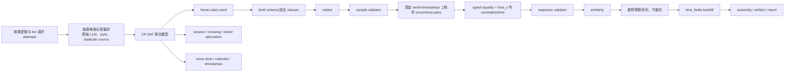

# 提案记录：时间流生成的序列规则

> 文档状态：**已被 v1.16 开发规格取代**。优先级：P0。版本：v1.16。记录日期：2026-08-20。
> 本文件保留需求核查、方案比较与被否决的原因；可执行字段、语义、状态机、接口和验收门以
> [`SPEC-sequence-rules.md`](SPEC-sequence-rules.md) 为唯一依据。

## 需求与现状

需求是让时间流生成表达帧类之间的兄弟关系、顺序关系、互斥关系、载荷关联和时间关系，同时保留
已有的多会话、交叉、噪音、重发、按类档位和时间字段回填。缺帧与序列中断不属于 v1.16 的新增能力，
已有分段形态的行为不被本特性重新解释。

当前 v1.15 的证据如下：

| 观察 | 现状 | 对本需求的限制 |
|---|---|---|
| 帧类构成 | `plan_schema` 的 enum 与 `contains` 只能表达某一档的构成恰等 | 没有顺序、基数、触发、互斥或重复 occurrence 语义 |
| 时间轴 | `_lay_timestamps` 在会话槽位上使用 `frame_gap_s` | 交叉与噪音会改变同一序列相邻成员的墙钟距离，不能承诺帧间关系 |
| 绝对时间 | 只有 `ts_start` 起点和会话间隔 | 没有日内半开窗口、星期窗口或跨日规划 |
| 跨帧载荷 | `sample_validator` 一次只能看到一个样本 | 无法表达两个结构化帧的 typed equality |
| 重放 | 工件行和回填后的载荷参与 id/session 计算 | LLM 返回后重排或重织会破坏预排程、id 和重放对账 |
| 依赖 | v1.15 白名单没有 CP 求解器 | 纯 Python DFA 与独立 STN 无法诚实覆盖联合 session、crossing、noise、calendar 和 match bool |

## 原提案为何不能原样采用

原提案的推荐实现是「每条 DECLARE 规则构造 DFA，再做 DFA 乘积」加「独立 STN」，并用零依赖
Python 实现；关联层采用 `eq:<field>:<field>` 字符串，LLM 返回后再做关联校验并重解时间轴。
这个方案作为调研假设有价值，但作为开发规格不可行，原因已冻结如下：

| 原提案决定 | 证据问题 | v1.16 修订 |
|---|---|---|
| 显式 DFA 乘积 | 规则、重复 occurrence、时间候选、session/crossing/noise 共享变量；乘积会制造不可控状态增长，并且不能自然表达同一模型里的日历析取与 owner alternation | 每条规则用 `CpModel.add_automaton` 或布尔约束接入同一个 CP-SAT 模型；不构造显式 DFA 乘积 |
| DFA 与 STN 两个独立求解器 | 两个解必须共同决定帧类词、成员 timestamp、会话边界和噪音空隙；分开求解无法证明组合结果可重放 | 固定版本 OR-Tools CP-SAT 做结构、时间、日历、session、crossing、noise 和 match-potential 的联合规划 |
| 零依赖实现 | OR-Tools 是成熟、可审计的 CP-SAT 实现；继续坚持零依赖会把关键求解器改成本仓自研代码，违背成熟组件优先原则 | `ortools==9.15.6755`，锁文件固定版本，不允许运行时替代实现 |
| `eq:` 字符串 | 没有 operator、source/target 字段的类型边界，解析歧义且无法安全扩展 | 内联 typed table：`{operator="equal", source_field="...", target_field="..."}`，精确校验键集 |
| LLM 后重解时间轴 | payload 返回后改变 word/session/timestamps 会使 brief、time_fields、artifact、id 与 replay 互相失配；作废后的 survivors 还会被重织 | CP-SAT 在 LLM 前冻结全部 attempts、frame-class word、session、crossing、noise slot 和 timestamps；LLM 后只在固定排程上枚举 pair 并判定 |
| correlation 参与求解 | payload 在 LLM 前未知，M1 不能假装证明 equality；负规则的 payload 匹配尤其不能预判 | M1 只证明 structural/time potential。realize 后按 canonical JSON typed equality 固定 eligible pairs；违规整序列删除预排序列，不重织 |
| `last` 配置名 | 与 LTLf 术语相近但不是本仓冻结配置名，且需求要求直接使用 `end` | 只接受 `end`；`last` 是定向 CONFIG_ERROR，不保留兼容别名 |

原提案因此不是可执行的“先做一个简单版本”。它在关键边界上无法同时满足 payload 未知、固定重放、联合
session 与严格时间上界；v1.16 直接采用修订后的联合模型，不保留 DFA+STN 的备用路径、兼容层或迁移脚本。

## 研究结论

本次选型只采纳一手来源中的已验证概念，不把外部工具的依赖或配置语言直接搬入 LabelKit：

| 来源 | 采用的概念 | 不采用的内容 |
|---|---|---|
| [DECLARE4Py 官方仓库](https://github.com/ivanDonadello/Declare4Py) | 标准 DECLARE/MP-DECLARE 模板与有限迹 conformance 语义 | 其 Clingo、Lydia、PM4Py 依赖链 |
| [MP-Declare 论文](https://www.sciencedirect.com/science/article/pii/S0957417416304390) | activation、correlation、time 三类条件在同一规则上的分工 | 不把 MP-Declare 的完整表达式语言作为配置 DSL |
| [LTLf/LDLf IJCAI 论文](https://www.ijcai.org/Proceedings/13/Papers/132.pdf) | 有限迹、vacuity、最终位置和有限自动机语义 | 不用论文链接中错误的旧编号；本链接固定为 `Proceedings/13/Papers/132` |
| [Temporal constraint networks](https://www.sciencedirect.com/science/article/pii/0004370291900066) | 时间点与差约束的建模背景 | 不再把 STN 当成独立于结构的第二个求解器 |
| [Disjunctive Temporal Problems under Structural Restrictions](https://ojs.aaai.org/index.php/AAAI/article/view/16489) | 日历析取带来的组合复杂度，说明必须交给约束求解器 | 不声称 DTP 的一般复杂度在本仓被消除 |
| [OR-Tools CP-SAT 官方文档](https://developers.google.com/optimization/cp/cp_solver) 与 [`add_automaton` API](https://or-tools.github.io/docs/python/classortools_1_1sat_1_1python_1_1cp__model_1_1CpModel.html) | 一个模型内的整数、布尔、automaton、日历析取与调度约束 | 不使用未固定版本或多线程求解 |
| [OR-Tools 9.15.6755 PyPI 发布页](https://pypi.org/project/ortools/9.15.6755/) | 固定可安装版本和 Python 3.11/3.12 wheels | 不允许按照本机可用版本漂移 |

## 修订后的实现方向

v1.16 把“序列规则在场”定义为时间流的一个规划分支：只要任一非零配额参与序列类的有效 rules 或 windows
非空，所有 attempts 都经过同一个联合 CP-SAT planner。planner 在任何 LLM 调用之前完成以下冻结面：



结构规则不是 prompt 愿望：每条规则以标准有限迹语义进入同一个 CP-SAT 模型，使用独立的
`add_automaton` 或布尔约束共享 `frame_class[i]` 变量；不显式构造规则 DFA 的笛卡尔积。时间关系、
日历析取、session/crossing、noise slot、严格微秒间隔和 `match_potential` 同样进入这个模型。

CP-SAT 的固定运行面：

- `ortools==9.15.6755`；`num_search_workers = 1`。
- 所有时间变量是整数微秒；`time_s` 为半开 `[lo, hi)`，并在解析时量化为整数微秒。
- 规划分支从 `ctx.rng` 消费一个固定范围的 solver seed；solver 选择的解可在同版本、同输入、同 seed、
  同单线程条件下复演，但不承诺均匀采样，也不承诺跨 OR-Tools 版本相同。
- `len_range` 不再先无条件抽取；每个 attempt 恰消费一次随机偏移形成循环长度偏好，长度本身与
  word、session/crossing、日历、timestamp 和 noise 在同一个模型里联合选择。偏好名次和为主目标，
  最大可行 noise 为次目标；不存在逐候选求解或失败后重抽。
- `INFEASIBLE` 在配置预检阶段报不可满足；`UNKNOWN` 报 deterministic budget 内无法完成验证且不宣称
  不可满足；`MODEL_INVALID` 是实现缺陷，恒转 `InternalError`（退出码 4）。违反已通过预检的同模型也
  转可观察的 runtime invariant failure，不走降级路径。

关联条件在 payload 产生前只有“可能存在可匹配 occurrence pair”的证明。realize 之后不再求解、不改时间轴，
而是在已冻结的 word、session、timestamps 上枚举标准允许的全部 occurrence pair，先按 typed equality、
再按 `time_s` 过滤。正规则要求每个 activation 至少一个 matching pair；负规则禁止任何 matching pair；
`co_existence` 与 `succession` 都执行双向义务；target occurrence 不被消费，可被多个 activation 复用。
带 correlation 的正规则在 equality 候选为空时计 `correlation_scrapped`，equality 候选存在但时间候选
为空时计 `temporal_scrapped`；带 correlation 的负规则失败统一计 `correlation_scrapped`。没有
correlation 的时间/控制违规是内部不变量错误，不得静默重排。

## 配置面草案

```toml
# 全局表可省略；它不是按类 rules/windows 的锚。
[[generate.stream.rules]]
template = "response"
source = "clock_in"
target = "arrive_gps"
time_s = [1200.0, 2400.0]     # [lo, hi)，秒；解析后是整数微秒
correlation = {operator = "equal", source_field = "company", target_field = "company"}

[[class.ticket_booking.generate.rules]]
template = "alternate_response"
source = "search"
target = "confirm"

[[generate.stream.windows]]
frame_class = "purchase"
of_day = [["06:00", "10:00"], ["16:00", "19:00"]]  # 半开、不可跨午夜、不可重叠
of_week = ["mon", "tue", "wed", "thu", "fri", "sat", "sun"]
```

rules 和 windows 均使用三态：未声明 `None` 继承全局表，显式空表清空本类，非空表整表覆盖；全局
表可以完全缺省。一元 rule 使用 `frame_class`，二元 rule 使用 `source` 与 `target`；binary rule 的
`source != target`；correlation 只能是 typed inline table，`operator` 只能为 `equal`，两个字段名均为
结构化 frame schema 的顶层属性且不能是 time_fields 绑定字段。`time_fields` 不是 rule/window 的合法键。

## 实施文件边界

完整的逐文件清单、零改动清单、验收矩阵与执行波次均已转入 `SPEC-sequence-rules.md`。本 proposal 不再
保留“实现前假设”或“以后再决定”的项目；所有未进入 v1.16 的能力在 SPEC 的非目标中明确写出。

## 保留的边界

- rules/windows 和 sequence validator 默认关闭时，v1.15 的调用顺序、抽签流、输出键序和旧 golden 不变。
- 缺帧、序列中断、跨序列时间先后和自由文本时间语境不在 v1.16 规则面中。
- 规则扩大的是时间流的结构/时间/关联约束，不改变 v1.15 tiers 的全局锚语义，也不改现有
  `[frame.class.<name>.generate.time_fields]` 的回填语义。
