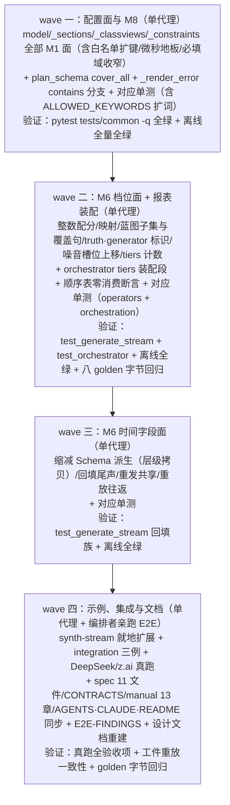

# 特性开发规格：帧类构成档位与时间字段回填（spec v1.14 拟）

> 2026-08-18。上游文档：`docs/dev/PROPOSAL-generation-tiers.md`（需求还原 + 业界调研 + 候选取舍；需求方三项裁决已闭：档位即帧类构成、tier_rank 即档位身份、时间字段回填方向）。
> 本文是**最终开发规格**。三方预实现审计（代码可行性/亲和性、文件修改清单穷尽、对抗性反证）已于 2026-08-18 完成，发现全部折入本文——最重一条：`report.generate.stream` 是 orchestrator **显式键装配**而非计数器前缀树，「orchestration 零改动」不成立，修改清单修正为七文件（E2E-FINDINGS 第 11 条「计数器被报表白名单静默丢弃」的同族教训，这次在规格层拦下）。凡与提案不一致处以本文为准。实现纪律（与 v1.13 同款）：不允许 defer 任何本文描述的内容；每条规格必须有对应测试用例；观测面与输出面逐字节按本文冻结；注释统一中文、代码/日志/报错英文；函数 ≤ 50 行、≤ 5 入参；异常分支必须有错误日志。
> 版本注记：spec 修订号 v1.14 于实现合入时落 `spec/00-frontmatter` 修订史与 §1.6 决策日志（本文裁决表誊入）；本文的「冻结」表述自实现合入起生效。两机制彼此独立、共用一个修订号；全部默认关闭，**双关 ⇒ 全系统与 v1.13 字节等价**（八个 dry-run golden 字节不动；例外一条：裁决·微秒地板是 v1.13 形态级缺陷修补，见该行）。E2E 验证端点（需求方 2026-08-18 指定）：`https://api.deepseek.com/anthropic` + `deepseek-v4-flash`，密钥经 `.env` 的 `LABELKIT_DEEPSEEK_KEY` 引用（git-ignored，与 v1.13 端点纪律一致）。

---

## 1. 结论与形态

一句话：v1.13 时间流形态新增两个正交增量——**帧类构成档位**（`[[generate.stream.tiers]]`：`tier_rank` 为档位身份、类配额按 `weight` 整数域最大余额法零抽签配分、蓝图调用以「enum 档内子集 + `contains` 逐类覆盖」双向硬约束构成、档位序数落 `_meta.source.generator.tier_rank` / 工件 `truth.tier_rank` / `report.generate.stream.tiers` 三点）与**时间字段回填**（`[frame.class.<name>.generate.time_fields]`：生成 Schema 内时间语义字段绑定闭集语义词表、从 LLM 面向的逐位 Schema 与契约行中剔除、ts 铺设后由机械回填尾声按已铺时间轴计算写回、先于行对象与 id 计算 ⇒ 工件重放逐字节一致）。两机制零 rng 消费（冻结的抽签消费顺序表原文不动）、零调用数变化（估算/golden/console 全不动）、零新 trace 事件与错误 kind；代码影响半径七个文件（M1 四模块 + `generate.py` + `schema_engine.py` + orchestrator 报表装配一段）。


## 2. 设计裁决记录（需求方三项已闭 + 本文设计裁决 + 审计折入；自然语言命名）

| 裁决 | 内容与理由 |
|---|---|
| 裁决·档位即帧类构成（需求方 2026-08-18） | 档位的定义**就是**该档序列的帧类构成集合（「有 x 类帧为 a 档，有 x+y 类帧为 s 档」），**不携带任何质量指令、不控制帧内部语义质量**——提案初稿的档位 instruction 键删除；帧内语义照旧由类生成指令与温度决定 |
| 裁决·tier_rank 即档位身份（需求方 2026-08-18） | 档位表不设 `name`；`tier_rank`（正整数）代表「第几个档位的要求」——表内唯一、全表**连续覆盖 1..N**（N = 表长，缺号/重号 = CONFIG_ERROR）；tier_rank 同时是配分平票与类内序数分块的确定性排序依据；**工具不赋予序数高低任何质量方向语义**（方向归用户） |
| 裁决·时间字段回填方向（需求方 2026-08-18） | 帧生成 Schema 内的时间语义字段（如 duration）与实际帧间隔不符的缺口，收编为「绑定即剔除 + 机械回填」——LLM 物理上无法生成该字段，值由 harness 按已铺时间轴计算；「构造既知量即真值」原则从标签面延伸到时间量面 |
| 裁决·零抽签配分 | 每参与类的配额按 `weight` 做最大余额法确定性配分，**算术冻结为整数域**：基额 = `(sequences × weight) // Σweight`，余额键 = `(sequences × weight) mod Σweight`，按余额键降序、平票按 tier_rank 升序逐档 +1 直至 Σ逐档 = sequences，**禁止任何浮点中间量**（平票判定喂给类内序数分块 → truth → 工件字节 → 成员 id，是冻结面，不悬在浮点比较语义上）。类内序数按 tier_rank 升序占**连续区间**；推论：`--limit` 前缀截断在每个类内从最高档位序数侧截起（低档序数在前），交换律成立（配分恒吃全量配额，截断只切前缀）。配分是 `(sequences, tiers)` 的纯函数、零 rng——抽签消费顺序表（计划期①②③/派发期零/交织期④–⑨）**原文不动**，配分插于配额展开与长度抽取之间的零消费步。**实现形收窄（审计折入）**：`expand_stream_quota` 返回形不动（二元组），档位映射走独立纯函数——扩列成三元组会破坏三处既有二元组解包断言（`tests/operators/test_generate_stream.py` 的配额展开断言与两个顺序表钉板），与「钉板原文回归」自相矛盾 |
| 裁决·蓝图双向硬约束 | 「不出档外类」由 `plan_schema` 的 enum 限档内子集保证（调用方传子集名集，构造器零感知）；「档内每类至少一次」由 `cover_all=True` 注入的 `allOf` + 逐类 `contains` 保证（draft 2020-12 原生关键字，一个 Schema 对象只有一个 contains 键位故多类分 allOf 支；jsonschema ≥ 4.21 实测 4.26.0 L2 直接可校验）。违约进 M8 既有修复环，穷尽按既有 `plan_failures` 作废——**零新失败机制**。机制注记（审计折入）：L3 修复轮的 PromptBundle 不带温度、生效温度回落 profile 默认（示例 profile 为 0.0）而非 `generate.temperature = 0.9`——高温首轮违约由低温修复轮收敛是既有机制事实，E2E 服从率按「首轮通过率 / 修复后通过率」两列记录。帧实现调用零改动（步类已被约束在档内） |
| 裁决·构成恰等 | 构成语义 = **恰等**：enum 给「⊆」、contains 给「⊇」，合成「members[] 帧类集合 ≡ 档声明集合」——档位身份可从数据反推对账（可审计性）；「至多这些类」宽松形态会使高低档的低配产物不可区分，列演进候选（去掉 contains 即得） |
| 裁决·档位标识三点落位 | ① `_meta.source.generator` 增 `tier_rank` 键（档位表在场时；rejects 侧 generator 既有携带逻辑自动跟随——被拒行留档可查）；② 工件 `truth` 增 `tier_rank`（任务帧 = 本档序数、噪音帧 = null、重发帧 = 源档；键序冻结见裁决·真值键序重冻结）；③ `report.generate.stream` 增 `tiers` 子块（装配点见裁决·报表显式装配）。§6.3「信封只增字段」惯例遵守，档位表缺省时三点全部不在场（字节回退） |
| 裁决·报表显式装配（审计折入） | `report.generate.stream` 由 orchestrator `_report_generate_stream` **显式键装配**（键序冻结、按声明表迭代，非计数器前缀树）——`tiers` 子块必须在该函数增一段条件装配：档位表非空时，按档位表 **tier_rank 升序迭代**零基铺开 `{"<rank>": {"planned": c(…), "produced": c(…)}}`（`"<rank>"` 为十进制字符串键；report 落盘无 sort_keys，键序 = 装配插入序）；**`tiers` 键位冻结在 `sequences` 之后、`frames` 之前**（配额族相邻）；缺省时键不在场。零额档与全作废档由装配保证在场（planned 0 / produced 0 如实呈现），不依赖计数器首触序。这是 E2E-FINDINGS 第 11 条（计数器被报表白名单静默丢弃）的同族陷阱，规格层拦下——**orchestrator.py 入修改清单（七文件）** |
| 裁决·真值键序重冻结 | truth 键序（v1.13 冻结面修订）：`session, sequence_class, sequence[, tier_rank], frame_class, noise[, duplicate_of]`——`tier_rank` 仅档位表在场时出现，位于 `sequence` 之后（序列身份组）、`frame_class` 之前；行文件字节序由此定，id 用 canonical_json（键排序）不受键序影响。CONTRACTS §9.5 truth 冻结块与 §12 工件行格式登记同步修订 |
| 裁决·重发帧承源档与同源载荷 | 重发帧 `truth.tier_rank` = 源序列档位、载荷与源序列同位帧为**同一回填后对象**——「内容逐字节同源」是 v1.13 冻结不变式，档位与时间字段皆内容属性；重发帧自身的流水时间轴仅体现在行 ts 字段（原样重发本就携带陈旧内容，语义自洽）。同源由**对象同一性**直接保证：重发槽位与源槽位本就引用同一载荷对象（`_duplicate_slots` 与 `_sequence_slots` 同取 `seq.payloads[i]`），回填就地写入共享对象后自动生效，无需任何回查机器 |
| 裁决·配分零额告警 | 小配额 × 权重悬殊时某 (参与类, 档) 配额为 0 是最大余额法的自然结果——WARN 一行（值-free：类名、tier_rank、权重表；非错误）；`tiers.<rank>.planned` 计数会如实呈现 0 |
| 裁决·语义词表四值 | 闭集：`ts`（本帧已铺时间戳 ISO 串——**任务帧上 = 行 ts 字段值；重发帧承源值、≠ 自身行 ts**，裁决·重发帧承源档与同源载荷的推论）、`gap_prev_s`（与本序列上一帧的间隔秒，首帧 0.0）、`gap_next_s`（与本序列下一帧的间隔秒，末帧 0.0）、`elapsed_s`（距本序列首帧秒，首帧 0.0）；数值 = `round(ts 差秒, 6)`（微秒精度与 isoformat 对齐；0.0 边界的无歧义性由裁决·微秒地板保证）。词表是冻结闭集，扩词走 spec 修订 |
| 裁决·序内间隔口径 | 间隔按**本序列相邻成员**的 ts 差计——交叉会话夹入的外序列帧与噪音帧本就占用其间墙钟，序内差值与下游从数据实测的口径一致；不提供「会话内相邻行」口径（那是重放侧可自行计算的流水量，非序列内容属性） |
| 裁决·绑定即剔除 | 被绑定字段从 LLM 面向的逐位 Schema 与契约行中**剔除**（`properties` 删键、`required` 减名（差集语义，容忍绑定键不在 required）、其余关键字原样），M8 按缩减 Schema 校验——不为注定被覆写的字段付 token 与修复环成本，契约无误导。工件里的载荷 = 缩减校验产物 + 回填字段，对用户声明的完整生成 Schema 的满足**限于类型层**（`ts` ⇒ string ISO 串、其余 ⇒ number，M1 静态保证）——绑定字段上除 `type` 外的约束关键字（minimum/maximum/pattern 等）不被强制也不被校验，M1 对携带此类关键字的绑定字段发一条 WARN（值-free：帧类名 + 字段名 + 关键字名），手册注明「时间量的值域由时间轴决定，不受 Schema 数值约束辖制」 |
| 裁决·回填后计 id | 回填尾声位于 ts 铺设之后、直装组装之前；行对象、成员 `Record.raw`/`text`/`id`、序列 id 全部按**回填后**载荷计算 ⇒ 工件重放（M2 摄取）逐字节同 id 同会话，v1.13 裁决·工件行即 raw 原文适用。重放侧判重档位语义（exact/near_text 随原会话噪音帧是否被 segment 吸收而浮动，E2E-FINDINGS 工件重放条目）不受回填扰动——判重配方吃成员文本不吃 id，重发帧与源帧文本字节同源不变 |
| 裁决·回填前钩子口径 | `sample_validator` 逐帧校验与序列相似度过滤作用于**回填前**载荷——时间字段是机械量，不参与内容校验与内容判重（两序列内容相同仅时间不同 ⇒ 照旧判近重，语义正确）；手册注明钩子看不到绑定字段 |
| 裁决·观测零增量与冻结锚不动 | 档位面仅增 `report.generate.stream.tiers`（counts-only 条件在场）；时间字段面**零观测增量**（确定性机械操作，无可计数失败模式）。两机制零调用数变化 ⇒ `estimate_run` 零改动、八个 dry-run golden 字节不动（示例扩展后 `dryrun-synth-stream.txt` 仍字节不动，列验收断言）、console 键集与面板零改动、trace 零新通道零新事件、§7.6 零新错误 kind |
| 裁决·静态预检上界照旧 | M1 静态预算预检的蓝图段照旧按**全帧类表**计量——档内子集恒 ≤ 全表，上界性质保持；realize 段在缩减后只降不升；`TEMPLATE_HEAD_TOKENS` 零改动（蓝图静态脚手架四常量不动——覆盖句落 user 行动态量；realize 契约行本就是动态量）；跨层等式测试原值回归 |
| 裁决·L0 待遇沿用 | `cover_all` 产物（`allOf`/`contains`）随 `supports_structured_output` 上行（anthropic 路由把 schema 整体作强制工具 input_schema），沿用 v1.13 裁决·用户生成 Schema 的 L0 待遇：不做关键字白名单 lint；strict 路由拒收 ⇒ 配置级 `supports_structured_output = false`。手册排障既有条目扩三句（审计折入）：① 拒收形态是**首个蓝图调用即 HTTP 400 快速失败**且计入熔断连击（连续 400 以退出码 4 收场，非逐序列作废）；② `openai_compatible` 的 strict 网关文档明载不支持 allOf/contains，处置同款（仓内两真端点均 anthropic 路由，此面无钉板，属已知未测暴露面）；③ L0 关端点上结构服从性靠提示词覆盖句 + 修复环（prefixItems 同款纪律），z.ai 一例钉 L0 透传 |
| 裁决·渲染缺类可见（审计折入） | M8 `_render_error` 增 **contains 分支**：contains 违规渲染出 `validator_value` 内的 `frame_class` const 值（形如 `steps: missing required frame_class "<name>"`），不再落 else 分支的裸数组 repr 消息——L0 关端点（DeepSeek 即是）上 L3 修复提示必须点名缺失帧类，否则修复指导性趋零。渲染文本英文（代码产出物），值-free 纪律不变（帧类名是配置量非数据内容） |
| 裁决·微秒地板（审计折入，v1.13 缺陷修补） | M1 增约束 `frame_gap_s.lo ≥ 1e-6`（微秒地板 = isoformat 精度与 `round(·, 6)` 的分辨率下界）：亚微秒 lo 下 `timedelta` 取整为 0 微秒，v1.13「ts 严格递增」声明本就存在破口，v1.14 词表的 0.0 边界哨兵更不容真零间隔。**属 v1.13 形态级缺陷修补而非双关面**：对 lo ≥ 1e-6 的一切现存工程零影响（全部示例 lo = 5），亚微秒配置在 v1.13 本就产出缺陷数据；spec 修订注记言明 |
| 裁决·指令必填域收窄（审计折入） | 档位表在场时，v1.13「每帧类 `generate.instruction` 必填」的检查域收窄为 **∪各档 frame_classes**（蓝图可能选中的闭集）——未入档帧类豁免必填（已写照常合法），否则用户被迫为永不选中的类写死指令（违反「禁止多此一举的配置」纪律）；「帧类未入档」WARN 照发并点名其 generate 面（含 time_fields 绑定）整体为死配置。同步修订 CONTRACTS §6.3 rule 51 理由句与 §10.14「The frame table is ALWAYS the whole table」绑定注记为条件化表述（无档位 = 全表、有档位 = 并集/档内子集） |

## 3. 规格正文

### 3.1 配置面（spec §5.2 增量 + §2.3.1 约束）

```toml
[generate.stream]                     # v1.13 既有七键零改动
enabled = true

[[generate.stream.tiers]]             # 档位表（可选；缺省 ⇒ 档位面整体不在场，字节等价 v1.13）
tier_rank = 1                          # 档位序数（第几档）：正整数、表内唯一、全表连续覆盖 1..N
weight = 2                             # 配额权重：整数 ≥ 1；类配额按整数域最大余额法配分
frame_classes = ["task_request", "followup"]   # 档位构成：恰用这些帧类、每类至少一次

[[generate.stream.tiers]]
tier_rank = 2
weight = 1
frame_classes = ["task_request", "followup", "confirmation"]

[frame.class.task_request.generate]    # v1.13 既有节
instruction = "……"
schema_inline = """{ "type": "object", "properties": { "utterance": {"type": "string"},
  "entities": {"type": "array", "items": {"type": "string"}},
  "duration": {"type": "number"} },
  "required": ["utterance", "entities", "duration"], "additionalProperties": false }"""

[frame.class.task_request.generate.time_fields]   # 绑定表（可选；仅结构化帧合法）
duration = "gap_next_s"                # 键 = 生成 Schema 顶层字段名；值 = 语义词表取值
```

M1 组合约束（全部 CONFIG_ERROR，除注明 WARN；报错文案给指引）：

| 约束 | 内容 |
|---|---|
| 档位表前提 | `[[generate.stream.tiers]]` 在场 ⇒ `generate_stream.enabled = true`（定向 CONFIG_ERROR：本表仅时间流形态合法） |
| 档位身份 | `tier_rank` 正整数、表内唯一、全表连续覆盖 1..N（N = 表长）；`weight` 整数 ≥ 1 |
| 档位构成 | `frame_classes` 非空、表内无重复、每名 ∈ `[[frame.classify.classes]]` 名集；各档构成**集合两两互异**（同构成即语义重复） |
| 长度可覆盖 | 逐 (参与类, 档) 非零配额对裁定（配分是纯函数，M1 期可算）：配额 ≥ 1 的每一对须满足该类 `len_range` 下界 ≥ `len(该档 frame_classes)`；**零额对豁免**（与配分零额 WARN 语义对齐——不为永不尝试的组合抬高下界） |
| 配分零额 | 某 (参与类, 档) 按整数域最大余额法配额为 0 ⇒ **WARN**（值-free：类名 + tier_rank + 权重表；非错误） |
| 帧类未入档 | 档位表在场时，某帧类不属于任何档的 `frame_classes` ⇒ **WARN**（该帧类不会出现在任何蓝图中，其 `[frame.class.<name>.generate]` 面成为死配置）；同时「每帧类 generate.instruction 必填」检查域收窄为 ∪各档 frame_classes（裁决·指令必填域收窄） |
| 微秒地板 | `frame_gap_s.lo ≥ 1e-6`（v1.13 缺陷修补，裁决·微秒地板；文案给出两个依据：严格递增与 0.0 边界哨兵） |
| 绑定表前提 | `[frame.class.<name>.generate.time_fields]` 仅当该帧类声明了 `schema_path`/`schema_inline`（结构化帧）时合法；纯文本帧带绑定表 ⇒ 定向 CONFIG_ERROR。**载荷恒为对象的保证**（回填就地写入的前提、封死对非对象载荷的运行级崩溃面）由 v1.13 既有的 `_load_schema_pair` 装载期强制承担——帧类生成 Schema 顶层 `"type": "object"` 本就是无条件必检（联合类型/缺失在装载期报错并使 `gen_schema` 退化 None），绑定簇对「声明过 Schema 源键但装载失败」的帧类保持沉默、不叠加第二错（以 Schema 源键在场性区分纯文本帧，wave 一实现裁量，测试钉住）。命名空间形态门沿用 v1.13 既有规则（generate 节仅时间流形态合法） |
| 绑定键与类型 | 每个绑定键 ∈ 该帧类生成 Schema 顶层 `properties`；绑定值 ∈ 语义词表 `{ts, gap_prev_s, gap_next_s, elapsed_s}`；声明类型匹配 = 该属性 Schema 的 `type` 关键字**字面恰等**于要求值——`ts` ⇒ `"string"`、其余三值 ⇒ `"number"`（联合类型数组、缺失、经 `$ref`/组合关键字间接声明均判不匹配，定向 CONFIG_ERROR）；绑定字段上携带 `type` 以外约束关键字 ⇒ WARN（裁决·绑定即剔除） |
| 剔除余量 | 生成 Schema 顶层 `properties` 键数 − 绑定键数 ≥ 1（LLM 至少有一个字段可生成；全绑定 ⇒ CONFIG_ERROR） |

解析产物：`TierSpec`（新 dataclass：`tier_rank: int` 档位序数 / `weight: int` 配额权重 / `frame_classes: tuple[str, ...]` 档位构成，逐字段语义注释）；`GenerateStreamConfig` 增 `tiers: tuple[TierSpec, ...] = ()`（按 tier_rank 升序存放，空元组 = 档位面不在场）；`FrameClassView` 增 `time_fields: Mapping[str, str] | None = None`（None = 无绑定）；M6 计划产物 `SequencePlan` 增 `tier_rank: int | None = None`（None = 档位面不在场；归属 operators，其默认值断言落 `tests/operators/test_generate_stream.py` 而非 test_config）。落点：`model.py` dataclass、`_sections.py` 表解析、`_classviews.py` 帧类视图合并（**`_FRAME_CLASS_SECTION_KEYS["generate"]` 白名单元组扩 `time_fields`**——否则子表被白名单循环判为 CONFIG_ERROR）、`_constraints.py` v1.13 形态约束簇扩两段 + 三条 WARN。

### 3.2 M6 档位面

- **配分纯函数**：`apportion_tiers(sequences: int, tiers) -> tuple[int, ...]`（按 tier_rank 升序返回逐档配额；整数域最大余额法——裁决·零抽签配分的算术冻结）。**落点下沉 common**（`labelkit/common/config/model.py`，TierSpec 伴生纯函数）：M1 的逐非零配额对约束与 M6 计划期共用同一实现，而分层纪律 common 不得依赖 operators，故由 M6 反向导入（operators → common 方向合法）；其性质单测随落点归 `tests/common/config/`。`(类, 类内序数) → tier_rank` 映射（配分结果的连续分块前缀和）留 M6 **独立纯函数**（`expand_stream_quota` 返回形不动——扩列破坏三处既有二元组解包断言）。`--limit` 前缀截断在其后、不扰动映射（类内从最高档位序数侧截起，属映射构造的确定性推论，示例头注一句言明）。零 rng——顺序表钉板测试原文回归 + 新增「配分零消费」断言（同 seed 有无档位表，长度/预抽抽签流逐字节一致）。
- **计划期计数**：逐序列 `generate.stream.tiers.<tier_rank>.planned`（与既有 `sequences.<class>.planned` 并行；`<tier_rank>` 为十进制字符串键）。
- **蓝图调用**：档内帧类 = 帧类表按声明序过滤 `tier.frame_classes`（tiers 按 rank 升序存放 ⇒ `tiers[plan.tier_rank - 1]` 直取）；`[帧类表]` 段只渲染档内类（`name: description` 行，声明序）；schema = `plan_schema(档内名集, L, cover_all=True)`；user 行取冻结变体（档位表在场时）：**「请为一条「{序列类名}」序列产出 {L} 步蓝图，且 [帧类表] 中每个帧类都至少出现一次。」**——句式于实现时 verbatim 冻结进 CONTRACTS §10.14（条件变体注记 + 「帧类表恒全表」绑定注记条件化，裁决·指令必填域收窄）。`render_plan_prompt_texts` 增 keyword `cover_all: bool = False`（4 → 5 入参恰触顶，参数演进余量归零——后续再增须参数对象化，注记）；`_stream_plan_call` 现约 41 行、增量后约 46 行 ≤ 50 不必拆（如需恢复余量可拆 `_plan_tier_face(plan)` 纯查表 helper，实现者裁量）。修复穷尽/不可装填 ⇒ 既有 `plan_failures` 作废语义原文适用。
- **标识落位**：`assemble_stream` 的成员 `ref.generator` 增 `tier_rank` 键（档位表在场时；`{"llm", "style", "tier_rank"}` 三键，emitter `_source_block` 零改动自然流出）；`_sequence_slots`/`_duplicate_slots` 的 truth 按裁决·真值键序重冻结增列（源自 `seq.plan.tier_rank`）。**噪音槽位构造上移**（审计折入）：`_noise_slot` 需知档位在场性才能条件写 `tier_rank: null`，而 `_insert_noise` 现 4 入参、直接加参触 5 参顶——噪音槽位构造挪至 `weave_stream`（持有 cfg），`_insert_noise` 改收已构造槽位列表（参数数不变）。
- **产出计数**：`_count_stream_product` 增逐档 `generate.stream.tiers.<tier_rank>.produced`（口径 = 最终进链，与 `sequences.<class>.produced` 同四关：蓝图、帧实现、逐帧钩子、序列相似度过滤）。
- **零改动声明**：帧实现调用、噪音批、机械交织器④–⑨、序列相似度过滤、直装信封构造（除 generator 键）、`--limit` 尾部 belt & braces——全部零改动。

### 3.3 M6 时间字段面

- **缩减 Schema 派生**（`_realize_step_faces` 落点，建议独立纯函数 `_reduced_gen_schema(view)` 可单测）：逐位 Schema 与契约行按「生成 Schema − 绑定键」派生——`properties` 删绑定键、`required` 减绑定名（差集语义）、其余关键字原样。**层级拷贝纪律（审计折入）**：现实现对 `gen_schema` 是浅拷贝，派生必须重建顶层与 `properties` 两层（其余关键字引用原样），**禁止就地改动共享的 `FrameClassView.gen_schema`**（M1 冻结产物，静态预检与契约行渲染同源读它）；逐位 Schema 面与契约行文本面取同一份派生产物。纯文本帧位与无绑定帧位逐字节不变。M8 按缩减 Schema 校验（L0 上行的也是缩减 Schema；LLM 越权输出绑定字段 ⇒ additionalProperties 违规进修复环要求删除，语义正确）。
- **回填尾声**：新纯函数 `backfill_time_fields(sessions, cfg) -> None`（零 rng 零 LLM 零 IO），调用点 = `generate_stream_all` 内 `weave_stream` 之后、`assemble_stream` 之前。只遍历任务帧槽位（owner 非 None）：按 owner 归组（会话序即序内成员序，交叉切片不改序内次序——v1.13 既有保证），对绑定帧类逐帧把绑定值**就地写入共享载荷对象**（M1 已保证载荷恒为对象——绑定表前提的顶层 type object 恰等约束）：`ts` = 该槽位已铺 ISO 串；`gap_prev_s`/`gap_next_s`/`elapsed_s` = 序内相邻/首帧 ts 差 `round(·, 6)`，首/末帧边界取 0.0。重发槽位不遍历、不触碰——它与源槽位引用同一对象，回填自动生效（裁决·重发帧承源档与同源载荷）；每个载荷对象恰被写入一次（一条序列在 owned 会话中恰出现一次）。噪音帧与无绑定帧类：不触碰。回填之后不得再有任何回填前语义的消费点（逐帧钩子与序列相似度过滤已在交织前完成，实现序由测试钉住）。
- **id 与重放**：回填先于行对象构造（裁决·回填后计 id）——`Record.raw`（行全对象）、`text`（M2 语义投影，结构化帧 canonical JSON；float 经 json 往返是同一 double）、成员 id、序列 id、session_id 全部含回填值；工件重放逐字节同 id 同会话（v1.13 重放回归测试扩一例含绑定字段的往返）；重放侧判重档位语义照旧由噪音吸收结论支配（裁决·回填后计 id 尾句），「逐字节一致」不得误读为「重放判重恒 exact」。
- **钩子口径**：`_stream_frames_valid`（sample_validator 逐帧）与 `_filter_stream_sequences`（序列相似度过滤）照旧吃 `RealizedSequence.payloads`（回填前）——裁决·回填前钩子口径；实现零改动，语义以测试钉住（绑定字段不进判重探针文本）。

### 3.4 M8 schema-engine

- `plan_schema` 增 keyword `cover_all: bool = False`（函数 3 入参，规则内）：True 时 steps 数组对象增 `"allOf": [{"contains": {"type": "object", "properties": {"frame_class": {"const": <name>}}, "required": ["frame_class"]}}, …]`——逐档内类一项、按传入名集序。enum 本就取传入名集（子集语义由 M6 传参承载，构造器零感知）；缺省 False 时输出与 v1.13 逐字节一致（既有调用点与测试零改动）。
- `_render_error` 增 **contains 分支**（裁决·渲染缺类可见）：从 `error.validator_value` 内提取 `frame_class` 的 const 值渲染 `steps: missing required frame_class "<name>"`；其余违规渲染路径零改动。
- `realize_schema` 零签名零行为改动（缩减 Schema 在 M6 侧派生后传入）。CONTRACTS §7.7 构造器清单同步签名；§10.7 蓝图内部 Schema JSON 样例补 cover_all 形态。

### 3.5 观测、估算与预算

| 面 | 增量 |
|---|---|
| report | `report.generate.stream` 增 `tiers` 子块：`{"<tier_rank>": {planned, produced}}`（counts-only；条件在场 = 档位表非空；键按 tier_rank 升序）——**装配点 = orchestrator `_report_generate_stream`**（裁决·报表显式装配：键序与零额在场由装配保证，非计数器首触序）；v1.13 既有十二键与 `report.run.artifact` 零改动；时间字段面零增量。CONTRACTS §9.3 与 §12 观测面登记同步修订 |
| estimate_run | **零改动**（两机制不改调用数；`plan_stream` 复演含零 rng 配分，产物只被取 len，数值不变）；估算行格式零改动 |
| dry-run golden | 八个全部字节不动（含示例扩展后的 `dryrun-synth-stream.txt`——调用数不随档位与绑定变化，`test_dry_run_plain_golden_files` 即验收执行器） |
| console | 零改动（`_ESTIMATE_CALL_KEYS`/`_STAGE_CALL_KEYS`/面板行） |
| budget | `TEMPLATE_HEAD_TOKENS` 零改动（裁决·静态预检上界照旧，`generate_plan = 189` 原值回归）；M1 静态预算预检零改动（全表计量为上界） |
| trace / 错误 | 零新通道、零新事件、零新错误 kind（覆盖违约复用 `schema_violation` 进修复环，作废复用 `plan_failures` 计数与值-free WARN） |
| 确定性 | 两机制零 rng；抽签消费顺序表原文不动（钉板测试回归）；新增「同 seed 双跑（档位 + 绑定开启）工件与主输出逐字节一致」回归 |

### 3.6 示例工程扩展（examples/synth-stream 就地）

`project.toml` 就地扩展（不另立示例——两机制是 v1.13 形态的教学延伸，示例是用户学习新功能用法的第一落点）：档位表两档——tier_rank 1 = `["task_request", "followup"]`、weight 2；tier_rank 2 = 全三类、weight 1（每类 `sequences = 3` ⇒ 配分 2 + 1，`len_range = [3, 5]` 下界 3 ≥ 最大构成 3 ✓）；`task_request` 生成 Schema 增 `duration` 数值字段 + `time_fields` 绑定 `duration = "gap_next_s"`。头注补教学说明（档位可从 members[] 帧类集合反推对账；duration 与相邻成员 ts 差相等、重放可验；`--limit` 类内从高档序数侧截起一句）。`config.toml` 零改动（DeepSeek 端点即需求方指定的 E2E 验证面）。验收面：dry-run golden 字节不动；真跑 `report.generate.stream.tiers` 形状与配分数；主输出逐行 `generator.tier_rank` 与 members[] 构成恰等对账；工件行 duration 值 = 相邻成员 ts 差（微秒精度；**`truth.duplicate_of` 在场的重发行除外——承源值，不与自身会话时间轴对账**）；工件重放同 id 同会话；`docs/manual/` ch.27 扩两节并全部样例真跑重采。

### 3.7 测试与验收

- **既有回归锚（保绿回归 + 断言须扩；审计核实双关字节等价设计下既有断言全部保绿）**：`test_config.py` 的 `GenerateStreamConfig()` 相等断言（两侧同升不红）+ 按既有先例**新增** tiers/time_fields 默认值断言；`test_schema_engine.py` plan_schema 缺省形状断言保绿 + **新增** cover_all=True 形态断言（**须扩 `ALLOWED_KEYWORDS` 白名单三词 `allOf`/`contains`/`const`，并补 `_schema_keywords` 辅助函数的 allOf 递归遍历**）；抽签消费顺序表两个钉板（`test_draw_order_pinned_lengths_then_llm_style_then_noise` / `test_draw_order_pinned_weave_phase_sample_shuffle_cross_noise_ts`）原文回归 + 配分回填零消费断言；truth 键序冻结断言（`test_artifact_row_shape_and_truth_key_set_frozen`）双关保绿 + 档位形态新用例；`SequencePlan.tier_rank` 默认值断言落 `tests/operators/test_generate_stream.py`。
- **新增覆盖**（offline，全部无 LLM）：M1 约束矩阵逐条正反例（档位表前提/身份连续性/构成互异与子集/逐非零配额对长度可覆盖/零额 WARN/未入档 WARN 与必填域收窄/微秒地板/绑定表前提含顶层 type object 恰等/键与类型字面恰等含联合类型拒绝/约束关键字 WARN/剔除余量/`_FRAME_CLASS_SECTION_KEYS` 白名单扩键）；配分性质（Σ逐档 = 类配额、整数算术钉板——含 `sequences × weight` 恰被 Σweight 整除与不整除两形、平票 tier_rank 升序——归 `tests/common/config/`，随 `apportion_tiers` 落点；映射与 `--limit` 交换律归 `tests/operators/`）；蓝图渲染（档内子集表、覆盖句冻结文本、无档位字节等价）；cover_all L2 正反例（缺类被拒、齐类通过、`_render_error` contains 分支点名缺失帧类）；缩减 Schema 派生（properties/required 差集/其余关键字原样、层级拷贝不污染 `FrameClassView.gen_schema`、纯文本位不变）；回填算术（首末边界 0.0、交叉夹帧序内口径、重发共享源对象、round 精度、同 seed 双跑确定性）；truth 键序与条件在场（噪音 null/重发承源）；generator 三键与 rejects 流出；双关字节等价（prompt/schema/交织/工件/报告五面）。
- **orchestrator 报表**（`tests/orchestration/test_orchestrator.py`）：tiers 形状 / 键序（rank 升序）/ 零额在场 / 缺省不在场四向；既有 stream 子块键序恰等断言双关保绿回归。
- **integration**（`tests/integration/test_generate_stream_llm.py` 扩展；端点纪律照旧——本文件是 DeepSeek 例外，密钥 `LABELKIT_DEEPSEEK_KEY`）：DeepSeek 档位真跑一例（逐行 members[] 帧类集合 ≡ 档声明构成、`tiers` 计数落账）；DeepSeek 时间字段真跑一例（解析工件，断言 duration = 相邻成员 ts 差，重发行除外）；z.ai glm-5.2 一例钉 `cover_all`（`allOf`/`contains`）的 L0 透传服从性（v1.13 prefixItems 钉板同族）。
- **E2E 验收**：3.6 示例真跑全部验收项 + 工件重放一致性 + `uv run pytest -q -m 'not integration'` 全绿 + 八个 dry-run golden 字节回归。

## 4. 文件修改清单（实现工序按此穷尽核销；三方审计已穷尽复核）

- **labelkit/**（8 改，第八处为纯注释同步）：`common/config/model.py`（TierSpec 新 + `apportion_tiers` 伴生纯函数 + GenerateStreamConfig.tiers + FrameClassView.time_fields）、`common/config/_sections.py`（档位表与绑定表解析）、`common/config/_classviews.py`（time_fields 并入帧类视图 + `_FRAME_CLASS_SECTION_KEYS["generate"]` 白名单扩键）、`common/config/_constraints.py`（约束两簇 + 零额/未入档 WARN + 微秒地板 + 必填域收窄；现 1685 行 + 约 120，余量最紧，后续演进落地时的拆分预案注记）、`operators/generate.py`（档位映射独立纯函数 + SequencePlan.tier_rank + 蓝图档位面 + 缩减 Schema 派生 + 回填尾声 + truth/generator 标识 + 噪音槽位构造上移 + tiers 计数；现 1621 行 + 约 135）、`common/runtime/schema_engine.py`（plan_schema cover_all + `_render_error` contains 分支）、`orchestration/orchestrator.py`（`_report_generate_stream` 增 tiers 条件装配段——裁决·报表显式装配）、`common/config/_schemas.py`（`_load_frame_gen` docstring 注记 time_fields 由视图侧解析——纯注释，零功能改动）。**零改动**（显式）：`operators/{annotate,verify,emitter,classify,quality,dedup,segment,stitch,extract,ingest}.py`、`orchestration/{factory,profile_usage,runtime}.py`、`common/runtime/{llm_client,budget}.py`、`common/observability/*`、`cli/*`。
- **tests/**（6 改）：`common/config/test_loader_generate_stream.py`、`operators/test_generate_stream.py`、`common/runtime/test_schema_engine.py`（含 ALLOWED_KEYWORDS 与 _schema_keywords）、`common/config/test_config.py`、`orchestration/test_orchestrator.py`、`integration/test_generate_stream_llm.py`；**零改动**：goldens（字节回归断言）、`cli/{test_cli,test_console}.py`（EXPECTED_TEST_PY 冻结文件集——本特性零新文件；golden 参数表不变）、`common/runtime/test_budget.py`（键集与跨层等式原值回归）、`operators/test_emitter.py`（tier_rank 流出断言落 test_generate_stream 的真 emitter 用例）。
- **spec/**（12 改，无新文件；重建 html/pdf）：`00-frontmatter`（v1.14 修订行 + 标题版本）、`10-ch1`（§1.5 背书表补行：整数域最大余额法/contains 覆盖/时间回填方法学 + §1.6 决策日志誊入本文裁决表）、`20-ch2`（§2.3.1 规范源头增两簇约束 + generator 键集句 + §2.6 确定性声明微秒地板注记）、`301-m1`（校验规则行扩两簇）、`306-m6`（§3.6.5 蓝图行「全类表」改条件化 + user 行变体 + 帧实现行缩减 Schema + 增档位与回填两行 + 观测行 tiers）、`308-m8`（plan_schema 签名句 + contains 渲染）、`40-ch4`（RecordRef.generator 键集注释两处）、`50-ch5`（`[[generate.stream.tiers]]` 三键表 + `[frame.class.*.generate]` 白名单增 time_fields + len_range 行交叉引用）、`60-ch6`（§6.3 generator 键、§6.4 report tiers、§6.5 truth 键集重冻结与回填字段注记 + 样例重采）、`80-ch8`（v1.14 不做段 + M6 演进候选行）、`85-ch9`（新引用登记：SteerLM/HelpSteer2、Camargo/BIMP、LogGenerator、AT-KDE）；`70-ch7` 加 v1.14 零增量声明句（v1.13 先例同款）。
- **docs/**：`CONTRACTS.md`——§6.1（TierSpec/GenerateStreamConfig.tiers/FrameClassView.time_fields）、§6.3（新规则 57 起 + rule 51 理由句条件化）、§7.5（公开面登记 `apportion_tiers`/`backfill_time_fields` + 冻结顺序表配分零消费注记 + 蓝图行 + generator 键集 + 计数登记）、§7.7（plan_schema 签名）、§7.9（report 键序冻结段增 tiers）、§9.1（generator 键集行）、§9.3（report 样块与键清单）、§9.5（truth 冻结块本体重冻结）、§10.7（plan_schema cover_all 形态样例）、§10.14（user 行条件变体 + 「恒全表」绑定注记条件化）、§12（条目 33 的 truth 键集/顺序表/观测面三处就地修订 + 新条目 35 登记）；`docs/manual/`——`27-synth-stream.md`（扩两节 + 全样例重采）、`appendix-a-cheatsheet.md`（A.8 约束 + A.9 白名单 + A.13 键表）、`16-observability.md`（generate.stream 键枚举）、`08-outputs.md`（generator 键注释 + 真跑样块重采）、`04-concepts.md`（约束合订表）、`07-project-toml.md`（节速览）、`14-schema-engine.md`（cover_all 排障句——裁决·L0 待遇沿用三句）、`17-tuning.md` 与 `22-tutorial-4-generate.md`（真跑数字重采/核对）、`18-troubleshooting.md`（produced<planned 档位句）、`05-data-preparation.md`（truth 枚举句）、`docs/manual/README.md`（章目题词）；`15-cli.md` 样块列字节回归验证项；`docs/dev/E2E-FINDINGS.md`（cover_all 首轮/修复后服从率、L0 透传结论、按发现追加）、`docs/dev/PROPOSAL-generation-tiers.md`（状态行已核销）。
- **根**：`AGENTS.md`/`CLAUDE.md` 逐字节同步（修订状态行 v1.14 + spec 枚举 + synth-stream 叙述句 + v1.14 长条目）+ `README.md`（示例叙述句扩档位与绑定）。
- **examples/**：`synth-stream/project.toml` 就地扩展（3.6）；`config.toml` 零改动。
- **零改动核实过的其他面**：`tools/build_design_doc.py`（无新 spec 文件；产物须重建）、`tests/conftest.py`、`pyproject.toml`、`examples/{text,ui,stream,mix}/*`。`.gitignore` 增一行 `out-run1/`（E2E 保留运行样本目录不入库——手册与 E2E-FINDINGS 引用其数字，目录留在本地）。

## 5. 实施工序（wave 制；每 wave 定义可失败的验证）



## 6. 非目标（本版明确不做；均列 §8.4 演进候选或维持既有归属）

平面生成形态的档位（无蓝图无帧类，档位无处附着）；按档绑定 llm profile（扰动冻结的 (llm, style) 预抽流与密钥引用集语义）；按档覆盖 `len_range`/`temperature`；档间序约束（构成子集链）与 tier_rank 高低的工具侧质量语义；宽松构成「至多这些类」（去 contains 即得，等真实工程再裁）；自由文本内时间表述对齐（提示词时间语境注入，须动顺序表另裁）；序列级/标注 Schema 侧的时间字段绑定（标注是抽取产物，非生成侧辖区）；`frame_gap_s` 间隔分布形扩展（BIMP 分布族/AT-KDE 经验分布，与本版正交）；语义词表扩词（闭集，扩词走修订）；绑定字段数值约束关键字的运行期强制（类型层保证 + WARN，见裁决·绑定即剔除）。

## 7. 引用

档位面：SteerLM / HelpSteer2（属性条件化生成与档位标签的下游价值——偏好对、课程学习）、Nemotron-CC（质量分档贯穿生成与观测，spec §1.5 已引）、Cosmopedia（分桶配比派生提示，spec §1.5 已引）、Schema-Guided Dialogue（构成声明在计划层、实现层零再标注——v1.13 已引）、JSON Schema draft 2020-12（`contains`/`allOf` 原生关键字）、Autolabel 闭集纪律（enum 硬校验形态，spec §1.5 已引）。时间字段面：数据驱动流程仿真 Camargo et al. / BIMP（时钟归仿真引擎，间隔与历时由分布采样）、LogGenerator（离散事件引擎盖章全部时间字段）、AT-KDE（到达时间建模是仿真侧长期演进面）、PLG2 与过程挖掘真值方法（真值在计划层注入并保留链接——v1.13 已引）。仓库先例：v1.13 裁决·抽签消费顺序表/工件行即 raw/真值不携最终 id/会话装箱定容/生成键效力矩阵/用户生成 Schema 的 L0 待遇、v1.12 帧 Schema 显式路由、v1.11 原始节探针与预算教义、v1.7 按类条件化与 inherited 幂等；E2E-FINDINGS 第 11 条（报表白名单静默丢弃计数器——裁决·报表显式装配的教训来源）、第 26 条（温度 0.9 违约作废先例）、第 27 条（工件重放判重档位语义）。
