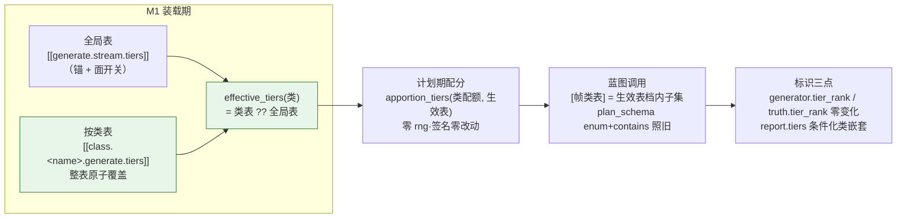

# SPEC：按类档位表（spec v1.15）——每个序列类独立配置帧类构成档位

> 2026-08-19 定稿。提案与调研记录见 `docs/dev/PROPOSAL-per-class-tiers.md`；两路预实现审计（代码可行性/亲和性、文件修改清单穷尽）已折入本文 §2 / §4。本文是 v1.15 的**单一实现依据**：字段名、默认值、错误文案、报表形状、规则编号以本文与随后修订的 spec 正文 / CONTRACTS 为准，实现不得偏离；发现矛盾先改文档再改码。
> 前置版本：v1.13 时间流生成（`SPEC-stream-generation.md`）、v1.14 帧类构成档位与时间字段回填（`SPEC-generation-tiers.md`）。本版是 v1.14 档位面的**按类化增量**，与 v1.14 的时间字段回填面完全正交（零触碰）。

---

## 1. 结论与形态

一句话：`[[class.<name>.generate.tiers]]` 按类档位表（行结构同全局表三键 `tier_rank` / `weight` / `frame_classes`），**表级原子覆盖**——类声明了就用类的整张表，未声明回落全局 `[[generate.stream.tiers]]`；**全局表为锚**（按类表要求全局表在场，档位面总开关恒 = 全局表非空，v1.14 的一切在场性判据零改动）；`tier_rank` 收窄为**类内身份**（每张生效表各自连续覆盖 1..N，N 可逐类不同；跨类同 rank 无工具语义、跨类同构成合法）；配分与序数映射（`apportion_tiers` / `tier_rank_for_ordinal`）**签名零改动**，调用点改传该类生效表（`effective_tiers` 单点查找，落 common）；报表 `tiers` 子块条件化——仅全局表 ⇒ v1.14 平面形**字节不变**，任一按类表在场 ⇒ **类嵌套形** `{"<class>": {"<rank>": {planned, produced}}}`；计数器键族按类重冻结（M6 恒喂类段键，平面形由编排器跨类求和）。零 rng（抽签消费顺序表原文不动）、零调用数变化（estimate_run / 八个 dry-run golden / console 键集全不动）、零新 trace 事件与错误 kind；按类表全部缺省时全系统与 v1.14 逐字节等价。



## 2. 裁决表

| 名称 | 议题 | 裁决 |
|---|---|---|
| 裁决·表级原子覆盖 | 按类档位如何与全局表合成？ | 类声明了就用类的**整张表**，不逐行合并（行级合并会让 rank 身份跨表漂移）。先例：`[class.*.quality].rubric` 内联子表整表替换、`[class.*.annotate].schema_*` 覆盖回落 |
| 裁决·全局表为锚 | 面统一性：部分类无档位可否混跑？ | **按类表要求全局表在场**（缺失 = CONFIG_ERROR，指引补全局表）。面开关恒 = 全局表非空 ⇒ 每个参与类恒有生效表，generator / truth / report 三点在场性**恒定不逐行漂移**；v1.14 的噪音槽位谓词（`generate.py` `_noise_slot(payload, bool(gs.tiers))`）、报表在场判断（`orchestrator.py` `if self.cfg.generate_stream.tiers`）等一切「档位面在场」判据零改动。先例：`output.schema` 恰一不因按类覆盖而豁免（v1.13，`examples/synth-stream/project.toml` 头注即教学此点）。「某类不想分档」的表达式 = 给它一张单档表（`tier_rank = 1`、构成任意）——退化形态，零机制成本 |
| 裁决·rank 类内身份 | tier_rank 的辖区 | 每张生效表各自正整数、表内唯一、**连续覆盖 1..N**（N = 该表长，逐类可不同）；跨类同 rank **无任何工具语义**（v1.14 本就不赋 rank 质量方向的自然收窄）；「构成两两互异」辖区收窄为**单表之内**——跨类同构成完全合法（各类都可有自己的「全类档」）。行级消歧免费：主输出行携 `classification.label`、工件行携 `truth.sequence_class`，与 `tier_rank` 同行相邻 |
| 裁决·空表拒收 | TOML 三态（缺省 / `tiers = []` / 非空）歧义 | 载体三态：`None` = 未声明（回落全局）、`()` = 显式空表（**CONFIG_ERROR**，指引删除键回落）、非空 = 覆盖。显式空表在档位面开启时没有合法语义（面统一下不存在「本类无档」态） |
| 裁决·载体 ClassView 顶层字段 | 按类表挂哪？ | `ClassView.tiers: tuple[TierSpec, ...] | None = None`（**不落** `GenerateConfig`）。两个理由：① `GenerateConfig` 载体会让 `orchestrator._class_overrides_exist` 把纯档位覆盖误判为「估算失真型按类覆盖」——而档位不改任何调用数，dry-run note 行不应因它出现（见裁决·note 行不因档位触发）；② v1.13 按类标注 Schema 的载体先例就是 ClassView 顶层字段（`ClassView.schema`），None = 回落语义同款 |
| 裁决·note 行不因档位触发 | dry-run 的 per-class-overrides note | `ClassView.tiers` **不加入** `_class_overrides_exist` 的比较项——该 note 警示「按类覆盖可能使估算失真」，而档位不改变任何调用数，警示不适用。显式写入本裁决以免检视误报遗漏 |
| 裁决·effective_tiers 下沉 common | 生效表查找点归属 | `effective_tiers(class_tiers, global_tiers)` 落 `common/config/model.py`（`apportion_tiers` 旁），M1 约束簇、M6 计划期、M10 报表装配三方共用同一实现——分层纪律不许 common import operators，M6/M10 正向导入（`apportion_tiers` 同款） |
| 裁决·计数器键按类重冻结 | CONTRACTS §9.3 把 `generate.stream.tiers.<rank>.{planned,produced}` 标 [FROZEN HERE]，类嵌套怎么落账？ | **解冻重冻结**：M6 恒喂类段键 `generate.stream.tiers.<class>.<rank>.{planned,produced}`（单一喂数纪律，禁双写两族键）；编排器平面形（仅全局表在场）按 rank **跨类求和**装配——数值与 v1.14 逐字节相等（v1.14 的平面计数本就是跨类聚合值）；嵌套形直铺。解冻须在 CONTRACTS §12 显式登记（条目 36） |
| 裁决·嵌套报表全类铺开 | 嵌套形外层铺哪些类？ | 外层 = **全部声明类按声明序**（`report.generate.stream.sequences` 与 `report.classify.classes` 同款零基铺开），内层 = 该类生效表 rank 升序；零配额类与全作废档呈现 0/0（裁决·报表显式装配的直接延伸——迭代声明表，不依赖计数器首触序）。嵌套形触发谓词 = `any(view.tiers is not None for view in class_views.values())`；`tiers` 键位仍冻结在 `sequences` 之后、`frames` 之前 |
| 裁决·校验域并集化 | 「帧类未入档死配置」WARN 与规则 51 指令必填域 | 两处检查域从「全局表构成并集」改为 **∪(各参与类生效表的构成并集)**（参与类 = 有效 `sequences ≥ 1`）。推论：若全部参与类都声明按类表，全局表沦为纯锚，其独有帧类照样判死配置——精确反映「哪些帧类真会被蓝图选中」 |
| 裁决·零额结构校验不豁免 | sequences = 0 的类声明了按类表怎么办？ | 结构校验（身份连续性、构成合法性、空表拒收、前提门）**照做**（坏配置早报），配额对约束与零额 WARN **豁免**（不为永不尝试的组合抬高 `len_range` 下界——v1.14 零额对豁免语义的直接沿用），其构成**不入**校验域并集（该类不产序列） |

## 3. 规格正文

### 3.1 配置面与 M1（CONTRACTS §6.3 增 rule 61，修订 rule 25 / 51 / 57 / 58 的措辞）

**配置形**（`project.toml`）：

```toml
[[generate.stream.tiers]]              # 全局表：锚 + 面开关 + 未声明类的回落（v1.14 原文语义）
tier_rank = 1
weight = 2
frame_classes = ["task_request", "followup"]

[[generate.stream.tiers]]
tier_rank = 2
weight = 1
frame_classes = ["task_request", "followup", "confirmation"]

[[class.ticket_booking.generate.tiers]]   # 按类表：本类整表取代全局表
tier_rank = 1
weight = 1
frame_classes = ["task_request", "followup"]

[[class.ticket_booking.generate.tiers]]
tier_rank = 2
weight = 2
frame_classes = ["task_request", "confirmation"]
# smart_home 不声明 ⇒ 回落全局两档表
```

**解析面**：

- `_classviews.py`：`_CLASS_SECTION_KEYS["generate"]` 六键 → 七键（`+ "tiers"`）；`_merge_class_generate` 增按类档位表解析——值须为数组表，经参数化后的 `_parse_tiers` 解析（rank 升序存放、正整数 / `weight ≥ 1` 解析期强制，全局表同一实现）；未声明 ⇒ `None`。零覆盖类经 `_inherit_class` 得 `tiers = None`。
- `_sections.py`：`_parse_tiers` 报错定位串参数化（3 入参 → 4 入参 `label`，仍 ≤ 5）：label 取**数组表头**（全局 `[[generate.stream.tiers]]` / 按类 `[[class.<name>.generate.tiers]]`），键级定位由表头派生——全局侧两族既有错误串（整表形状错 `[generate.stream].tiers: expected array of tables`、逐行错 `[[generate.stream.tiers]][N]`）v1.14 字节冻结不变；按类侧形状错渲染 `[class.<name>.generate].tiers`、逐行错渲染 `[[class.<name>.generate.tiers]][N]`（与用户实际书写的 TOML 同形）。（实现期裁决 2026-08-19：单一 label 直用会破全局两族之一的冻结串。）
- `model.py`：`ClassView` 增 `tiers: tuple[TierSpec, ...] | None = None`（None = 未声明，回落全局；空元组 = 显式空表，M1 拒收）；新增纯函数：

```python
def effective_tiers(class_tiers: tuple[TierSpec, ...] | None,
                    global_tiers: tuple[TierSpec, ...]) -> tuple[TierSpec, ...]:
    """v1.15（裁决·表级原子覆盖 + 裁决·全局表为锚）：取一个序列类的生效档位表。"""
    return global_tiers if class_tiers is None else class_tiers
```

  `TierSpec.tier_rank` / `apportion_tiers` 的 docstring 措辞由「全表连续覆盖 1..N」条件化为「每张生效表各自连续覆盖 1..N」；两者本体零改动。

**M1 约束簇**（`_constraints.py`；全部错误消息英文，定位串带类名）：

- **rule 61（新增）按类档位表前提**，三条子款：
  1. 仅时间流形态合法（parked 探针——`generate_stream.enabled = false` 时任何 `[class.*.generate]` 原始节含 `tiers` 键即定向报错；探针走 `class_raw` 原始节，表内容非法时也要照发，`_check_tiers_parked` 同族同点执行）：
     `{fp}:[class.{cname}.generate].tiers: the per-class tier table is only legal in the time-stream generation form ([generate.stream].enabled = true) - it overrides the global [[generate.stream.tiers]] table for sequences of this class`
  2. 全局表为锚（形态开启、任一按类表在场而全局表缺省）：
     `{fp}:[class.{cname}.generate].tiers: a per-class tier table overrides the global [[generate.stream.tiers]] table, which is absent - declare the global table (it is the fallback for classes without their own table and the switch of the whole tier face)`
  3. 空表拒收（`view.tiers == ()`）：
     `{fp}:[class.{cname}.generate].tiers: expected a non-empty array of tier tables - omit the key to fall back to the global [[generate.stream.tiers]] table`

  子款 2 与 3 **互斥**（实现期裁决 2026-08-19）：显式空表只报空表错，不叠报全局锚错——空表的修复动作（删键）与锚缺失的修复动作（补全局表）不同，叠报会误导。键值**非数组**的形状错误在解析层报出（`[class.<name>.generate].tiers: expected array of tables`）后按**未声明**落库——本簇任何错（空表/锚）都不叠报，同一个键一条错误一个修复动作（实现期裁决 2026-08-19，检视闭环补钉）。零额 WARN 的定位前缀**恒为 `[[generate.stream.tiers]]`**（配分机制的宿主表族名），类归属与生效权重清单在消息体内呈现——按类表在场时不改前缀（实现期裁决 2026-08-19，避免同一 WARN 两种定位形）。
- **rule 57 族逐表化（修订）**：`_check_tier_table` 簇改为**逐生效来源表**执行——全局表 + 每张已声明按类表各跑一遍身份连续性（`_check_tier_identity`）与构成合法性（`_check_tier_composition`：非空、档内互异、名 ∈ 帧类表、**单表内**构成两两互异），报错定位前缀分别为 `[[generate.stream.tiers]]` 与 `[class.<name>.generate].tiers`；跨表（跨类）同构成合法。零额类声明的表照跑本段（裁决·零额结构校验不豁免）。
- **配额对约束（修订）**：`_check_tier_quota_pairs` 逐参与类改吃 `effective_tiers(view.tiers, gs.tiers)`——零额 WARN 与 `len_range` 下界 ≥ 构成大小照旧，零额对豁免照旧；WARN 文案中权重清单取**该类生效表**。
- **校验域并集化（修订）**：`_warn_frame_classes_without_tier` 与 `_check_frame_gen_instructions` 的 domain 改为 ∪(各参与类生效表构成)（裁决·校验域并集化）；捆包 `v` 增 `class_views` 已在场，`v.tiers` 语义升级为「全局表」并新增按生效表推导（实现自由，语义如上）。
- **零改动确认**：rule 59（微秒地板）、rule 58/60（时间字段绑定簇）、`[frame.class.*.generate]` 白名单、帧类表本身的规则全部不动。

### 3.2 M6 生成（`operators/generate.py`）

取表点全部改经 `effective_tiers`（从 `labelkit.common.config.model` 正向导入，`apportion_tiers` 旁）：

1. **计划期** `plan_stream`：`ranks = [tier_rank_for_ordinal(view.sequences, effective_tiers(view.tiers, gs.tiers), ordinal) …]`——`tier_rank_for_ordinal` 本体零改动；类内序数仍按**本类生效表** rank 升序占连续分块，`--limit` 前缀截断「从每类最高档序数侧截起」的推论逐类原文成立。配分零 rng ⇒ **抽签消费顺序表本体原文不动**（306-m6 在 v1.14 零消费注记后追加一句「v1.15 按类配分同为零消费」，顺序表正文零增删——钉板测试原文回归）。
2. **蓝图取档** `_plan_tier_face`：`effective_tiers(…)[plan.tier_rank - 1]`（生效表连续 1..N ⇒ 下标法照旧）；`[帧类表]` 渲染（帧类表声明序过滤档内构成）、覆盖句冻结变体、`plan_schema(档内名集, L, cover_all=True)` 全部零改动——构成语义与 M8 不感知表来自哪张。
3. **truth / generator 零变化**：`_tier_truth`、`assemble_stream` 的 generator 三键装配、噪音帧 null、重发帧承源、`truth` 键序全部不动（rank 值来源变了，装配面不变）。
4. **计数器喂数（裁决·计数器键按类重冻结）**：planned / produced 两处喂数点键名改 `generate.stream.tiers.{class}.{rank}.planned|produced`（class 为序列类名原文）；估算路径（`estimate_run` 复演 `plan_stream`）保持纯函数零喂数。
5. 模块头注（v1.14 档位面段）补按类一句。

### 3.3 M10 报表与观测（`orchestration/orchestrator.py`）

- `_report_generate_stream`：在场判断 `if self.cfg.generate_stream.tiers` **零改动**（全局表为锚 ⇒ 面开关判据不变）；`tiers` 键位冻结原位（`sequences` 之后、`frames` 之前）。
- `_report_stream_tiers` 分两形（裁决·嵌套报表全类铺开）：
  - **平面形**（全部 `view.tiers is None`）：`{"<rank>": {"planned": Σ类, "produced": Σ类}}`——按全局表 rank 升序迭代、逐 rank 对**全部声明类**的类段计数求和；与 v1.14 报表**逐字节相等**。
  - **嵌套形**（`any(view.tiers is not None)`）：`{"<class>": {"<rank>": {"planned": …, "produced": …}}}`——外层全部声明类按声明序，内层该类生效表 rank 升序（十进制字符串键，落盘无 sort_keys ⇒ 键序 = 装配插入序）。
- estimate_run / console / `_ESTIMATE_CALL_KEYS` / 面板行零改动；**零新 trace 事件、零新 §7.6 错误 kind**（M1 新错误走既有 CONFIG_ERROR 面）。

### 3.4 输出三点与工件

`_meta.source.generator.tier_rank` 与工件 `truth.tier_rank`：**键、序、值语义零改动**（值 = 本行序列类生效表内的档序数；行内 `classification.label` / `truth.sequence_class` 天然消歧）。工件行 = raw、id 公式、重放逐字节同 id 同会话全部不动；重放判重档位照旧随分段判决浮动（E2E-FINDINGS #27/#32 结论继续适用，不得写死）。rejects 侧 generator 既有携带逻辑自动跟随。

### 3.5 示例扩展（`examples/synth-stream/project.toml` 就地扩展；`config.toml` 零改动）

- `ticket_booking` 声明按类表（教学面：整表原子覆盖 + 构成与权重双差异）：rank 1 = `{task_request, followup}` weight 1、rank 2 = `{task_request, confirmation}` weight 2 ⇒ 配额 3 配分 1 + 2（对照全局表下 smart_home 的 2 + 1，权重方向相反）；rank 2 构成教学「按类构成可与全局完全不同」（确认帧直达、无追问）。
- `smart_home` 不声明 ⇒ 回落全局表（教学面：回落语义 + 混合形态）。
- 头注扩两段：按类表语义（原子覆盖 / 全局锚 / rank 类内身份 / 跨类不可比）与报表类嵌套形读法、`--limit` 在按类表下逐类分块推论。
- **配额（3+3）、`len_range`、噪音、会话数全部不动** ⇒ 调用数不变 ⇒ `tests/cli/goldens/dryrun-synth-stream.txt` **字节不动**（三重依据：调用数不变；档位不入估算行；note 行因既有 `sequences` 覆盖本就在场，且裁决·note 行不因档位触发保证 ClassView 载体不新增触发面）。
- 约束自检：ticket_booking 构成大小 {2, 2} ≤ len_range 下界 3；smart_home 沿用全局 {2, 3} ≤ 3；`2 × max(hi) ≤ session_max_len` 不变。

### 3.6 测试计划（不允许 defer——每条规格断言都要有用例钉住）

**离线（全部落进既有 5 文件，不新建测试文件 ⇒ `tests/cli/test_cli.py` 的 `EXPECTED_TEST_PY` 零改动）**：

| 文件 | 新增用例（正反例齐备） |
|---|---|
| `tests/common/config/test_config.py` | `ClassView.tiers` 默认 None；`effective_tiers` 三态（None 回落 / 非空覆盖 / 空元组原样返回——拒收在 M1）；`apportion_tiers` 性质族原文回归 |
| `tests/common/config/test_loader_generate_stream.py` | rule 61 三子款正反例（形态关闭 parked 定向错、全局锚缺失错、空表错）；白名单第七键正例与白名单外键反例；按类表身份连续性（每表各自 1..N，长度可逐类不同）；单表内构成互异反例 + **跨类同构成正例**；配额对吃本类生效表（下界错误指向声明类）；零额 WARN 按生效表权重清单；死配置 WARN 与指令必填域的并集化（全类都声明按类表时全局独有帧类判死配置）；零额类声明表的结构校验不豁免；报错定位串带类名 |
| `tests/operators/test_generate_stream.py` | 混合形态（一类声明 / 一类回落）计划期 rank 映射；`--limit` 交换律逐类分块（按类表版）；蓝图 `[帧类表]` 与 `plan_schema` 取生效表档内子集；truth / generator 逐行与本类生效表一致；**按类配分零 rng 钉板**（`test_tier_apportionment_consumes_no_rng` 扩按类形，两个抽签顺序钉板测试原文回归）；同 seed 双跑（按类表在场）工件逐字节一致；按类表全缺省 ⇒ 与 v1.14 路径产物逐字节等价 |
| `tests/orchestration/test_orchestrator.py` | 嵌套形状与双层键序恰等断言（声明序 × rank 升序）；零配额类 0/0 在场；平面形回归（v1.14 三例保绿 + 平面形 = 类段计数跨类求和的等值断言）；混合形态嵌套触发谓词 |
| `tests/cli/test_console.py` / goldens | 八个 golden 字节回归照旧（参数表零改动） |

**集成**（`tests/integration/test_generate_stream_llm.py`，DeepSeek 路由例外纪律照旧，套件 6 → 7 例）：新增 `test_generate_stream_per_class_tiers_real_deepseek`——两类混合形态（一类独立表 / 一类回落全局），断言：逐行 `_meta.stream.members[]` 帧类集合 ≡ **本行类生效表**中该 rank 的构成；`report.generate.stream.tiers` 嵌套形逐键对账 planned/produced；`generator.tier_rank` 与工件 `truth.tier_rank` 逐行一致。z.ai `cover_all` L0 透传例保绿回归、无需新增。

**E2E 验收**（`examples/synth-stream`，DeepSeek 端点 `https://api.deepseek.com/anthropic` / `deepseek-v4-flash` / `.env` 的 `LABELKIT_DEEPSEEK_KEY`）：`mkdir -p out && set -a && source ../../.env && set +a && uv run labelkit run --config config.toml --project project.toml` 退出码 0；报表 tiers 嵌套形（ticket_booking 1+2、smart_home 2+1）；工件逐行反推对账构成恰等；`--dry-run` 输出与 golden 逐字节相等；手册样例数字从本次真跑重采。

### 3.7 零变更锚点（显式）

抽签消费顺序表原文（按类配分仍是①②之间的零消费步）；调用数恒 `2 × Σsequences + ⌈噪音/num_per_call⌉` ⇒ `estimate_run` 与估算行格式、**八个 dry-run golden 字节冻结**、console 键集与面板；`TEMPLATE_HEAD_TOKENS` / `realize_schema` / `plan_schema` 签名与构成语义；trace 通道（11）与事件目录、§7.6 错误 kind；truth 键序与工件重放同 id；`_noise_slot` 在场谓词与报表在场判断（全局表为锚的直接收益）；时间字段回填面（v1.14②）；`[frame.class.*]` 命名空间；按类表全部缺省 ⇒ 与 v1.14 逐字节等价（含报表）。

## 4. 文件修改清单（预实现审计穷尽产物；「零改动」项检视时须复核）

**生产代码（8 改）**：`common/config/_classviews.py`（白名单七键 + 按类解析 + `_inherit_class`）、`common/config/_sections.py`（`_parse_tiers` 标签参数化）、`common/config/_constraints.py`（rule 61 + 逐表化 + 并集域 + parked 探针）、`common/config/model.py`（`ClassView.tiers` + `effective_tiers` + docstring 条件化）、`operators/generate.py`（五取表点 + 计数器类段键 + 头注）、`orchestration/orchestrator.py`（`_report_stream_tiers` 双形装配）、`common/config/_schemas.py`（纯注释同步）、`common/config/__init__.py`（如增导出）。**零改动核实过**：`schema_engine.py` / `budget.py` / `console.py` / emitter / runtime / factory / profile_usage / 其余 operators / observability / cli / contracts / errors。

**测试（5 改 0 新建）**：见 §3.6 表。基线：离线 1980 passed（collected 2027，integration 47）。

**spec 正文（12 改 0 新建）**：`00-frontmatter.md`（版本 v1.15 + 修订史行）、`10-ch1-overview.md`（§1.5 档位行补按类表述、§1.6 新增 v1.15 决策块）、`20-ch2-overall-design.md`（§2.3.1 档位簇逐生效表 + rule 61 三子款）、`301-m1-config.md`（校验表镜像）、`306-m6-generate.md`（§3.6.5 契约块 / 档位构成行 / 蓝图行 / 观测行按类化，顺序表原文不动）、`50-ch5-config-spec.md`（全局档位表节增按类小节、白名单表 `[class.*.generate]` 行七键、`len_range` 交叉引用）、`60-ch6-io-formats.md`（§6.4 tiers 双形、样例重采；§6.3/§6.5 零改动）、`70-ch7-logging.md`（零增量声明句扩 v1.15）、`80-ch8-nongoals-roadmap.md`（v1.15 非目标段 + §8.4 M6 行）、`40-ch4-data-structures.md`（generator 注释两处条件化）、`85-ch9-references.md`（大概率零改动，确认）、其余 spec 文件零改动。

**CONTRACTS.md**：§1.2 测试归属一句；§6.1 `ClassView.tiers` + `effective_tiers` verbatim 登记 + `TierSpec` 注释条件化；§6.3 rule 25 白名单枚举增 `tiers`、rule 51 并集域、rule 57/58 逐表化措辞、**新增 rule 61**；§7.5 M6 取表点与**计数器键解冻重登记**；§7.9 M10 `tiers` 双形装配与键序冻结；§9.1 generator 条件表述；§9.3 tiers 样块双形 + **L5539 [FROZEN HERE] 显式解冻**；§9.5 零改动；§10.14 注记再条件化一档；**§12 新增条目 36**（含计数器键解冻说明）。

**手册（真跑重采后同步）**：`27-synth-stream.md`（主战场：27.4 扩按类节 / 27.7 报表嵌套形 / 27.10 排障 / 27.11 清单 / 全样例数字重采）、`24-classify.md`（§24.4 白名单表 generate 行）、`appendix-a-cheatsheet.md`（A.8 / A.9 / A.13）、`16-observability.md`（tiers 形状）、`08-outputs.md`（样块与 generator 句）、`04-concepts.md`（约束合订表一行）、`07-project-toml.md`（节表 + 叙述）、`18-troubleshooting.md`（produced < planned 两维定位）、`17-tuning.md`（成本账句）、`22-tutorial-4-generate.md`（导流句）、`05-data-preparation.md`（truth 枚举句）、`README.md`（ch.27 题词）；`14-schema-engine.md` / `15-cli.md` 零改动（后者做 golden 字节核对）。

**示例**：`examples/synth-stream/project.toml`（§3.5）；`config.toml` 与其余示例零改动。

**根与 dev 文档**：`AGENTS.md` + `CLAUDE.md`（状态行 v1.15、spec 枚举行、synth-stream 叙述句、Working with the spec 新增 v1.15 条目——**两文件逐字节同步**）；`README.md`（特性段 + 示例叙述）；`docs/dev/E2E-FINDINGS.md`（v1.15 实测追加段 + 测试留痕表新行；#27/#32 结论不得写死）；`SPEC-generation-tiers.md` §6 加一行「按类档位由 v1.15 核销」交叉引用（历史规格正文不改）；`PROPOSAL-generation-tiers.md` 状态行交叉引用一句。

**构建**：spec 全部改完后 `uv run python tools/build_design_doc.py --pdf` 重建 `docs/design/labelkit-design-v1.html` / `.pdf`，一并提交。

## 5. 实施工序

- **Wave 1a（代码）**：§4 生产代码 8 文件 + §3.6 离线测试 5 文件；完成判据 = 离线套件全绿 + 八 golden 字节回归 + 新用例覆盖 §3.6 每一行。
- **Wave 1b（规格，与 1a 并行、文件不相交）**：spec 12 文件 + CONTRACTS + 两份 dev 文档交叉引用行。
- **Wave 2（示例与真跑，依赖 1a+1b）**：synth-stream 扩展 + 集成用例 + DeepSeek E2E 真跑 + 手册 13 章重采 + AGENTS/CLAUDE/README/E2E-FINDINGS + 设计文档重建。
- **Wave 3（检视）**：对照本文逐条复核（含全部「零改动」声明的反向核实），离线 + 集成 + E2E 三面复跑。

## 6. 非目标（演进候选）

按类权重速记糖（`tier_weights` 数组）；跨类 rank 对齐声明；全局表 × 类过滤（`tier_ranks` 子集选取）；v1.14 遗留候选照旧停放（按档绑 llm profile、按档 `len_range`/`temperature`、档间序约束、宽松构成「至多这些类」、平面生成形态档位、时间语境对齐、`frame_gap_s` 分布族、语义词表扩词）。

## 7. 引用

按类档位面：Gretel Data Designer / NVIDIA NeMo Data Designer（subcategory 逐父值子配置、conditional_params 整套替换）、GLAN（分类树逐节点独立结构与配额）、Schema-Guided Dialogue（每服务一份 schema，v1.13 已引）、分层抽样理论（不成比例逐层配额、多路分层零格合法——Statistics Canada 12-001-X 6433、US Census RRS 2009-08）、Cosmopedia（全局网格反面参照，spec §1.5 已引）。仓库先例：v1.13 裁决·按类标注 Schema（覆盖回落 + ClassView 载体）、v1.7 `[class.*]` 白名单纪律（R25）、v1.14 裁决·零抽签配分 / 报表显式装配 / 构成恰等（全部原文继承）。
