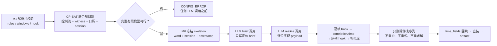
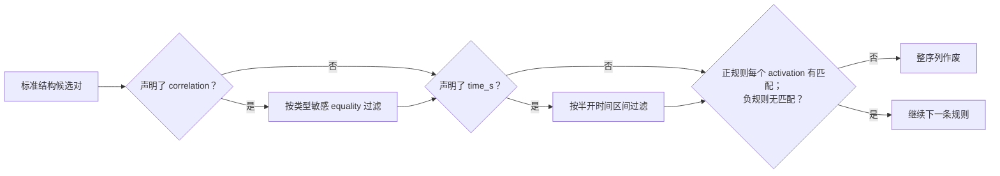
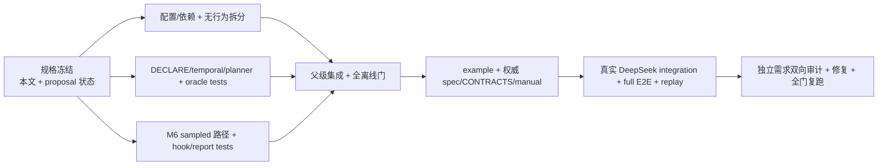

# 开发规格：时间流生成序列规则

> 日期：2026-08-20
> 状态：**v1.16 实现依据，已关闭设计裁决；不允许实现期降级、fallback、TODO 或待实现项。**
> 前置版本：v1.13 时间流生成、v1.14 档位与时间字段回填、v1.15 按类档位表。
> 规范优先级：本文先冻结 v1.16 增量；实现完成时必须同步 `spec/*.md` 与
> `docs/CONTRACTS.md`，完成后以二者为长期单一事实源。原提案
> `PROPOSAL-sequence-rules.md` 只保留论证历史，凡与本文冲突处一律以本文为准。

## 1. 结论与可行性裁决

序列规则能力可完整实现，但原提案的「控制流 DFA、单序列 STN、会话编织器分别求解」
不可实现其已经声明的语义。重复 occurrence 需要离散 witness 选择；每日多窗与星期窗是
非凸析取；crossing、会话分隔与窗口是跨序列约束；带 correlation 的负规则不能被类级
DFA 提前拒绝。v1.16 因而采用一个**全流联合约束规划器**，在任何 LLM 调用前同时确定
帧类词、occurrence potential、会话归属、任务帧时间戳与噪音时间槽。



### 1.1 三路审查后的裁决

| 议题 | v1.16 裁决 |
|---|---|
| 控制流与时间 | 同一个 CP-SAT 模型联合求解；不再分别声明「DFA 非空」与「STN 无负环」即可证明全流可行 |
| 成熟组件 | 精确锁定 `ortools==9.15.6755`；它是本仓第三方白名单的窄用途算法库例外，不是应用框架 |
| DECLARE 编译 | 规则以布尔约束和 `AddAutomaton` 施加到同一组位置变量；不显式构造乘积 DFA |
| occurrence | 按标准 DECLARE activation/target 方向枚举候选对；同一 target 可服务多个 activation，不采用第 i 个 A 配第 i 个 B |
| correlation | 改为类型化 inline table；payload 未知，因此 M1 只证明结构与时间 potential，运行期在冻结 skeleton 上判定 |
| 日历 | `of_day` 多窗与 `of_week` 直接作为 CP-SAT 析取域；不是一张普通 STN |
| crossing | 会话分配、真实 owner 交替、窗口、span、gap 同模；不在逐序列求解后盲目归并 |
| 作废 | LLM 或校验作废只删该预排序列；其余 skeleton、session、timestamp 与 RNG 结果不变 |
| 默认路径 | 所有生效 rules/windows 均为空时不调用联合规划分支，v1.15 prompt、Schema、RNG、report 与 artifact 字节锚不动 |
| 实例缺帧/中断 | 需求方已明确排除在本版之外；不是实现遗留项 |

### 1.2 被原提案错误表述、本文明确替换的内容

| 原表述 | 本文替换 |
|---|---|
| 多日历窗是一元 STN 边 | 多窗与星期是析取域；选定一个分支后局部差约束才退化为 STN |
| DFA 与 STN 可分别判可满足 | word、witness、窗口、session 与 crossing 必须联合判定 |
| occurrence 配对可以后再做 | 本版冻结全部二元模板的候选对、activation 方向与 target 复用语义 |
| `eq:a:b` 字符串 | 类型化 `{operator="equal", source_field="a", target_field="b"}` |
| `last` | 使用成熟 DECLARE 词 `end`，不保留旧名或兼容层 |
| 每序列实际恒两次调用 | 计划基数是一 brief + 一 realize；provider retry 与 Schema repair 仍按既有机制增加物理请求 |
| 零依赖自研数百行即可 | 析取日历和 occurrence 选择属于一般有限 CP；采用维护中的 OR-Tools，不自研求解器 |
| LTLf 引用 `/Papers/226.pdf` | 正确引用为 De Giacomo 与 Vardi 的 IJCAI 2013 `/Papers/132.pdf` |

### 1.3 LLM 思考模式配置

时间流教学路径固定使用 DeepSeek Anthropic 端点。LLM profile 新增可选的类型化键
`thinking = "enabled" | "disabled"`，缺省值为 `None`：缺省时 M9 不向请求体写入该字段，
因此既有请求体保持原样；profile 显式设置时在对应协议请求顶层追加
`{"thinking": {"type": <value>}}`。两种 provider 共用该明确字段，不引入
`extra_body` 或 fallback。`examples/synth-stream/config.toml` 显式设置
`thinking = "disabled"`，并保留 `max_output_tokens = 8192` 作为结构结果安全预算；该值
不是关闭 thinking 的替代方案。

## 2. 术语与规则语义

规则只在一条原始生成任务序列的成员上求值。crossing 插入的另一条序列成员与 noise
不进入该序列的词，因此不改变 `chain_*` 的相邻定义。轨迹非空，位置从零开始；`#A`
表示帧类 A 的 occurrence 数。

`source` 与 `target` 是规则声明参数的稳定名称。对 `precedence` 与
`chain_precedence`，DECLARE activation 是较晚的 target occurrence；配置参数顺序仍是
`source, target`，墙钟差恒按 `timestamp(target) - timestamp(source)` 表达。二元规则
强制 `source != target`，首版不引入自关联退化语义。

### 2.1 一元与二元模板闭集

| template | 配置参数 | 有限迹语义 |
|---|---|---|
| `existence` | `frame_class`, `count` | `#A >= count` |
| `absence` | `frame_class`, `count` | `#A < count`；`count = 1` 才是完全禁止 |
| `exactly` | `frame_class`, `count` | `#A == count` |
| `init` | `frame_class` | 第一个任务帧是 A |
| `end` | `frame_class` | 最后一个任务帧是 A |
| `responded_existence` | `source`, `target` | 每个 source occurrence 的任意方向上至少有一个 target occurrence |
| `co_existence` | `source`, `target` | 两个方向的 `responded_existence`；二者同时缺席也成立 |
| `response` | `source`, `target` | 每个 source occurrence 后方至少有一个 target occurrence |
| `precedence` | `source`, `target` | 每个 target occurrence 前方至少有一个 source occurrence |
| `succession` | `source`, `target` | `response` 与 `precedence` 的合取，不是一对一配对 |
| `alternate_response` | `source`, `target` | 每个 source 后、下一个 source 前至少有一个 target；最后一个 source 后同样需要 target；额外 target 合法 |
| `chain_response` | `source`, `target` | 每个 source 的下一任务帧必须是 target |
| `chain_precedence` | `source`, `target` | 每个 target 的上一任务帧必须是 source |
| `not_co_existence` | `source`, `target` | 不得存在满足修饰条件的任意方向 source/target occurrence 对 |
| `not_succession` | `source`, `target` | 不得存在满足修饰条件且 source 在前、target 在后的 occurrence 对 |

`count` 在三个基数模板中必填且为正整数；其他模板禁止写 `count`。蕴含型模板在
activation 不出现时 vacuously true。`co_existence`、`succession` 的两个方向分别产生
义务；同一 target occurrence 可同时解除多个 activation 的义务。完全相同的规则重复
声明是 CONFIG_ERROR。生效规则按有效表声明顺序判定，规则内 activation 按位置升序，
双向模板先 source→target、再 target→source；声明顺序只影响首错诊断计数，不改变接受语义。

### 2.2 occurrence 候选对

| 模板族 | activation | 候选 target |
|---|---|---|
| `responded_existence` | 每个 source | 任意不同位置的 target |
| `co_existence` | 每个 source；再反向每个 target | 任意不同位置的另一类 occurrence |
| `response` | 每个 source | 所有更晚的 target |
| `precedence` | 每个 target | 所有更早的 source |
| `succession` | response 与 precedence 两组义务 | 两组有序候选对的并集 |
| `alternate_response` | 每个 source | 它之后且下一个 source 之前的 target |
| `chain_response` | 每个 source | 仅下一位置 |
| `chain_precedence` | 每个 target | 仅上一位置 |
| `not_co_existence` | 无正义务 | 任意不同位置的 source/target 对 |
| `not_succession` | 无正义务 | 所有 source 在前、target 在后的对 |

规划期为每个正规则 activation 选择一个**potential witness**；target 可复用。选择只用于
证明固定 word 与时间轴存在可满足解，以及裁定相邻显式时间边是否替代默认间隔。最终
规则判定不把 potential witness 当作第 i 对第 i 的承诺，而是重新枚举冻结 skeleton 上的
全部标准候选对。

对不带 correlation 的规则，planner 完整施加其控制流与 `time_s` 语义。对带 correlation
的正规则，planner 暂时把 equality 视为可成立，为每个 activation 强制至少一个满足结构
与 `time_s` 的 potential witness。对带 correlation 的负规则，planner 不提前禁止任何
occurrence 对，也不为了规避未来 equality 而改变 timestamp；该规则只在运行期取得最终
真假，不建立 potential witness。因此 M1 对它只校验字段前提与其余规则的联合模型，不
声称证明该负规则的 payload satisfiability。

### 2.3 `time_s` 修饰符

`time_s = [lo, hi]` 表示半开区间 `[lo, hi)` 秒。两个数必须可无损量化为整数微秒，且
`1µs <= lo < hi`。有序模板使用 `timestamp(target) - timestamp(source)`；
`responded_existence`、`co_existence` 与 `not_co_existence` 使用绝对时间差。

对正规则，候选对还须落入 `time_s` 才能解除 activation；对负规则，只有落入区间的
候选对才被禁止。多个规则可以选中同一对，所有显式区间同时成立，相当于取交集。

每条序列内相邻任务帧始终满足 `1µs <= delta <= stream.gap_s`，因此任一 crossing 同伴
作废后，剩余 owner 单独 replay 也不会被拆 session。默认 `frame_gap_s` 只作用于没有被
任何**声明 `time_s` 的已选正规则 potential witness**覆盖的 owner 相邻对；被覆盖的相邻
对由显式 `time_s` 取代默认区间，但仍与 replay guard 相交。没有 `time_s` 的规则 witness
不移除默认 gap。非相邻显式关系约束总墙钟差，沿途未覆盖的相邻对继续服从默认区间。

联合规划路径把既有 `frame_gap_s` 解释为实数闭区间，并用 `Decimal(str(value))` 转换：
`lo_us = ceil(lo × 1_000_000)`、`hi_us = floor(hi × 1_000_000)`；`lo_us > hi_us` 是
CONFIG_ERROR。默认相邻边为闭区间 `[lo_us, hi_us]`。`time_s` 继续要求端点无损量化，
编码为 `[lo_us, hi_us)`。显式正规则 witness 覆盖相邻对时只移除默认 gap 边，显式区间
仍与闭区间 `[1, stream.gap_s × 1_000_000]` 相交。

M1 的边界激活条件保持精确：只有 `--limit` 后的实际非零配额前缀含生效 rules/windows
时，受约束 v1.16 路径才允许 `frame_gap_s.hi == stream.gap_s`；无 rules/windows，或只有
`sequence_validator` 而没有 rules/windows 时，仍执行 v1.15 冻结的严格 `hi < gap_s`。

### 2.4 `correlation` 修饰符

配置形只有一个成熟、可审计的谓词：类型敏感相等。

```toml
correlation = {
  operator = "equal",
  source_field = "subject_id",
  target_field = "subject_id"
}
```

字段必须同时满足：位于对应帧类生成 Schema 的顶层 `properties`、位于 `required`、两侧
JSON Schema `type` 完全一致、不是 `time_fields` 绑定字段。纯文本帧不能参与 correlation。
比较发生在回填前，先比较 JSON 运行时类型，再比较 canonical JSON bytes；因此 `true`、
`1` 与 `1.0` 互不相等，对象键序不影响相等，数组顺序影响相等。

带 correlation 的规则在 M1 只能证明「若将来字段相等，则存在结构与时间 potential」；
它不能证明 LLM payload。运行期在固定 word 与 timestamp 上按如下次序判第一条失败：



每条规则先形成结构候选集 `C0`；声明 correlation 时得到类型敏感相等子集 `Ce`，否则
`Ce = C0`；声明 `time_s` 时再得到区间子集 `Ct`，否则 `Ct = Ce`。正规则逐 activation
判定：声明 correlation 且对应 `Ce` 为空时计 `correlation_scrapped`；`Ce` 非空但 `Ct`
为空时计 `temporal_scrapped`。负规则在 `Ct` 非空时失败；若它声明 correlation，统一计
`correlation_scrapped`，不再把同一次失败归因给 time。不带 correlation 的规则若运行期
失败，说明 planner 不变式被破坏，记录 ERROR 并抛 `InternalError`，不伪装成普通作废。

## 3. 配置面

### 3.1 全局规则与窗口

```toml
[[generate.stream.rules]]
template = "init"
frame_class = "task_request"

[[generate.stream.rules]]
template = "exactly"
frame_class = "task_request"
count = 1

[[generate.stream.rules]]
template = "chain_response"
source = "task_request"
target = "acknowledgement"
time_s = [1200, 2400]
correlation = {
  operator = "equal",
  source_field = "subject_id",
  target_field = "subject_id"
}

[[generate.stream.rules]]
template = "end"
frame_class = "confirmation"

[[generate.stream.windows]]
frame_class = "task_request"
of_day = [["08:00", "11:00"], ["14:00", "17:00"]]
of_week = ["mon", "tue", "wed", "thu", "fri"]

[generate]
sequence_validator = "hooks:validate_sequence"
```

`rules` 与 `windows` 均缺省为空。任一非零配额参与类的生效表非空时，整个生成流走联合规划路径；
没有约束的类仍由 planner 机械选择词，而不是让 LLM 重新拥有帧类结构。

### 3.2 按类原子覆盖

`[[class.<name>.generate.rules]]` 与 `[[class.<name>.generate.windows]]` 分别采用三态整表语义：

| 解析值 | 生效语义 |
|---|---|
| `None` | 未声明，继承对应全局表 |
| `()` | 显式 `rules = []` / `windows = []`，本类清空对应全局表 |
| 非空 tuple | 本类整表取代全局表，不逐行 merge |

两张表互相独立，允许只有按类表而没有全局表；它们不采用 v1.15 tier 的「全局表为锚」。
零配额类也执行语法、字段、模板和每长度潜在可满足性检查，不因配额为零豁免。

### 3.3 窗口语义

一张生效窗口表内每个 `frame_class` 至多一行；重复行是 CONFIG_ERROR。`of_day` 必填、
非空，元素支持 `HH:MM`、`HH:MM:SS` 或微秒精度，语义为本地墙钟半开区间。v1.16
不支持一个逻辑窗口跨午夜：每个分支须在同一自然日满足 `start < end`，区间不得重叠；
不得把 weekday-specific 的跨午夜窗口描述成两个分支的等价写法。序列与 session 本身仍
可跨午夜，只要每个 occurrence 分别落入自己的合法同日窗口。`of_week` 缺省为全周，
显式值使用 `mon` 至 `sun`，不得重复。

每个被指定帧类的 occurrence 都必须落入 `of_day × of_week` 的并集。时区固定取
`ts_start` 的 ISO offset；naive `ts_start` 按 UTC；不接受 IANA 时区名，不计算 DST。
同一生成流从头到尾使用该固定 offset。

### 3.4 M1 校验边界

M1 一次聚合并报告以下错误，不发送 LLM 请求：

- rules/windows 只在 time-stream generate_only 形态合法；关闭形态下显式 parked 键报错。
- 模板参数矩阵、闭集值、`source != target`、count、重复规则、帧类引用与窗口引用。
- correlation 的 Schema 顶层字段、required、同型与 time-field 排除条件。
- `time_s` 微秒可表示性、半开非空区间与 replay guard 的明显交空。
- 每个序列类 × 生效 tier × `len_range` 中**每个候选长度**的局部结构/时间 potential；不能
  只证明区间里某一个长度可行。实际整流长度还必须使用 §4.2 的一次联合偏好选择，不能
  沿用无条件 `randint(lo, hi)` 或逐候选重复求解。
- 按实际配额、sessions、noise 与 crossing 构造的全流模型可行性。
- OR-Tools model proto 的变量数加约束数不得超过 250,000；超过即明确 CONFIG_ERROR，
  不在运行期超时或降级。
- 所有 solve 固定 `max_deterministic_time = 10.0`，不设置 wall-clock timeout。无 noise
  objective 时接受 FEASIBLE/OPTIMAL；存在 noise 最大化时只接受 OPTIMAL。
- solver 的 `INFEASIBLE` 报模型不可满足；`UNKNOWN` 报在冻结 deterministic budget 内
  无法验证且不声称不可满足；`MODEL_INVALID` 是实现缺陷，抛 `InternalError`、退出码 4，
  不进入用户 ConfigError 聚合。

## 4. 联合规划器

### 4.1 依赖与确定性

生产依赖精确锁定 `ortools==9.15.6755`，并更新 `uv.lock`。CP-SAT 只接受整数；所有时间
量在建模前转为微秒。solver 固定 `num_search_workers = 1`，使用 CP-SAT 自动搜索；
一个 31-bit solver seed 从 `ctx.rng` 冻结取得；所有 solve 固定
`max_deterministic_time = 10.0` 且不设 wall-clock timeout。同一 LabelKit 版本、
OR-Tools 版本、配置、seed 与固定 LLM 产物可复演；不承诺跨 solver 版本同解，也不宣称
CP-SAT 对全部可行词或时间表做均匀采样。

M1、`estimate_run` 与 M6 必须调用 `common/runtime/sequence_planner.py` 的同一问题构造与
求解入口。M1 使用独立的同 seed RNG 副本，不改变运行期 RNG；estimate 与 M6 均从
`Random(f"{run.seed}:0:generate")` 重放冻结消费顺序。

### 4.2 计划期消费顺序

联合路径的单流 RNG 顺序冻结为：配额展开零消费；抽一个 31-bit planner solver seed；
逐 attempt 按既有类名字典序与类内序抽取长度偏好；逐 attempt 预抽 llm/style；预抽 duplicate
source 排列；noise payload 调用计划。solver 不反向消费 Python RNG。默认路径仍走 v1.15
原顺序表，本文顺序不替换它。

长度选择不是求解失败后的 retry，也不为每个候选重复求解。每个 attempt 对自己的闭区间
消费一次 `ctx.rng.randrange(width)`，把该偏移旋转成候选长度的稳定偏好次序；同一个全流
CP-SAT 模型让位置 active 前缀长度保持自由，并最小化各 attempt 的偏好名次之和。solver
返回的单个长度向量已经与 word、日历、witness、session、crossing 和 gap 一起证明可行；
并列最优由固定 solver seed 决定，不宣称均匀采样。`INFEASIBLE`、`UNKNOWN` 或
`MODEL_INVALID` 均按 §3.4 终止，不能改偏好、改长度或重试。长度、timestamp 与 noise
由这一次求解共同定稿，不再启动第二个模型。M1 使用 RNG 副本执行相同算法；每个
class×tier×length 的局部
potential 仍由 §3.4 独立覆盖，联合选择不替代该完整静态矩阵。

### 4.3 CP-SAT 变量与约束

每个计划 attempt 按 `len_range` 上界建立带 active 前缀的位置类变量、帧类布尔视图和
整数 timestamp；同一个模型用 active 总数表达最终长度，并共同定稿时间轴。每个
session 建立 start/end。`--limit` 依旧先截断配额前缀；设截断后 attempt 数为 `N`，
则 `sessions_eff = min(generate.stream.sessions, N)`，与 v1.15 的小样本语义一致。只有实际前缀中
存在生效 rules/windows 的 attempt 才启用全流 planner 和条件报表；被 `--limit`
完全截掉的约束类不改变默认路径。每个 attempt 恰分配到一个 session，每个 session
恰有一或两条 attempt。`N - sessions_eff` 个 session 含两条，其余含一条。每个 tier 的构成
仍是恰等集合：
只允许表内类，且每类至少出现一次。

规则基数、init/end 与有限迹关系直接约束位置类变量。正规则的每个 activation 建立
potential witness 选择，恰选一个；同一 target 不设容量。日历分支、time 区间与 witness
Bool 同模。全局任务帧 timestamp 唯一且在 session 内严格递增。

双序列 session 必须存在至少一个真实 owner 交替：`A_i < B_j < A_k` 或
`B_i < A_j < B_k`。只有时间跨度相交但没有三点 owner 交替不算 crossed session。任务帧
加计划 noise 不得超过 `stream.session_max_len`；`session_max_span_s > 0` 时对首尾总跨度
生效。相邻 session 满足
`next.start - previous.end >= stream.gap_s × 1_000_000 + 1`。

所有 primary task timestamp 均不得早于 `ts_start`。设
`G = stream.gap_s × 1_000_000`；owner 长度为 L 时 span 上界为 `(L−1)G`，一个 session
的联合 span 上界取其所有 owner span 之和。第一个 session 的搜索下界为 `ts_start_us`；
后续 session 的下界为 `previous.end + G + 1`。每个 session 的 `start` 上界为该下界加
`7 days − 1µs`，`end` 上界再加本 session 联合 span 上界。周期窗口若有解，整体平移
七日仍有解，因此该递推覆盖最早合法周期。duplicate 对当前流尾使用同一递推，并选择
满足 gap 的最小整周平移。公式与 proto 大小预估均由 temporal 单测钉住。

### 4.4 LLM 作废后的稳定布局

planner 在调用前冻结全部 primary attempt 的 word、session 与 task timestamp。LLM plan、
realize、逐帧 hook、correlation/time、序列 hook 或相似度任一作废后：

- 删除整条 attempt 的任务帧；不为其换 word、换窗口、换 session 或重求时间。
- 空 session 删除，剩余 session 按时间重编号；不移动任何 timestamp。
- 双序列 session 只有两个 owner 都存活且仍保留真实交替时才计 `crossed_sessions`。
- 单 owner 存活时，其序内相邻 gap 仍受 replay guard 保证。

这不是 fallback；它是预排布局的确定性投影。

### 4.5 noise

`noise_target = round(noise_ratio × planned_task_frames)` 仍是目标而非保证值。planner 为
每个候选 noise 建立 presence Bool，并以 `maximize(sum(presence))` 为唯一 objective；最优
值是 `planned_noise_slots`。每个在场槽都有唯一微秒 timestamp，并位于某个 session 首尾
任务帧的**开区间**；noise 不扩大 session span、不参与规则与窗口，任务帧加 noise 受
`session_max_len` 限制。`planned_noise_slots < noise_target` 不使配置不可满足，运行期只发
一条 value-free WARN；noise 调用基数按 `planned_noise_slots` 计算。有 noise objective 时
只有 OPTIMAL 才能冻结最大槽数，FEASIBLE 不足以继续。

作废投影后，仅保留仍严格位于该 session 最早与最晚 survivor 之间的槽；空/单帧 session
没有合法 noise。noise LLM 返回不足时按计划 timestamp 顺序填充，剩余槽删除，不追加调用。

### 4.6 duplicate

duplicate source 排列在 LLM 前预抽；运行期从该排列中顺序取 survivor，最多
`min(duplicates, survivors)` 条。payload、tier、frame-class word 与回填后的 time-field
对象均与 source 同源；duplicate 自身流水 timestamp 不触发重新回填。

无窗口 source 采用流尾 session gap 后的最小微秒平移；有任一窗口的 source 采用满足流尾
gap 的最小正整数周平移，保持 fixed-offset 下的 of_day、weekday、相对间隔与显式 time。
每条 duplicate 独占尾部 session，时间戳继续全局唯一递增。

## 5. LLM、Schema 与验证

### 5.1 sampled brief 路径

联合路径的帧类词已由 planner 决定。蓝图调用保留，但 Schema 改为
`brief_schema(length)`：逐位只返回 `brief`；prompt 明列每个位置的固定 frame class、
生效规则、窗口与 correlation 要求。M6 把返回 brief 与固定 word 配对后进入既有
`realize_schema(prefixItems)`。联合路径的 realize prompt 必须再次带入同一份规则与
correlation 文本，并把对应 `[frame.class.<name>.generate].instruction` 写进每个位置的
内容契约；不能指望 brief 替 payload 记住字段相等要求。默认路径不增加这些文本，保持
v1.15 prompt bytes。

受约束路径的纯文本帧契约使用实现冻结的字面量
`JSON 字符串（如 "..."），不得用对象包裹`：它只明确 JSON string 表示，输出语义仍是自由
文本，不把自由文本变成对象，也不改变调用或 `realize_schema`。无约束的 v1.15 默认路径仍
保留字面量「自由文本一段」，以维持默认 prompt 字节锚。

有 correlation 的序列必须在一次 realize 调用中覆盖全部位置，禁止 reactive halving；
M1 预算预检须证明最坏 sampled prompt + realize contract 可装填。仍发生 overflow 或输出
截断时按既有 `realize_failures` 作废该序列，不做拆半兼容路径。无 correlation 的序列沿用
既有有界 halving。

计划调用基数仍是一条 attempt 一次 brief + 一次 realize，故 estimate 公式和 console 行
不新增调用类别。真实物理请求仍可能包含 provider retry、Schema repair；文档与测试不得写
成「实际恒两次」。

### 5.2 序列级 hook

`generate.sequence_validator = "module:function"` 的冻结签名为：

```python
def validate_sequence(value: SequenceValidationInput) -> list[str]: ...
```

`SequenceValidationInput` 含 `sequence_class`、`tier_rank` 与声明序 frames；每个 frame 含
`position`、`frame_class`、payload 的 JSON-compatible 深拷贝。hook 修改副本不能改变内部
对象。返回值规则复用 `normalize_violations`；异常按违规作废，只记录 hook 引用、异常类型
与 violation 数，不记录异常 message、payload 或 prompt。

hook 与进程同权限，是用户信任代码而非 sandbox。它读取墙钟、网络或自行随机时，相应
结果不属于 LabelKit reproducibility 保证；工具不增加兼容层或隔离层。

### 5.3 冻结验证顺序

```text
realize Schema
→ generate.sample_validator（逐帧、位置序）
→ declarative correlation/time（规则规范序）
→ generate.sequence_validator（每序列一次）
→ sequence similarity filter
→ primary survivor 投影与 noise 槽过滤
→ primary time_fields 回填
→ 从预抽排列选择 survivor source
→ duplicate 取已回填 payload 的深拷贝并计算平移 timestamp
→ primary + noise + duplicate 全局排序
→ row / Record / sequence id 计算与 assembly
```

duplicate 永不以自身 timestamp 重新计算 time_fields；其 payload 在 source 完成回填后
复制，后续不得修改 source 或 duplicate payload。

首个失败终止该序列后续内容校验。`validator_scrapped` 是逐帧、correlation、temporal 与
sequence hook 作废数的总和；各子计数只能在自身阶段单点递增，禁止双记。

## 6. 输出、观测与错误面

联合面在场时，`report.generate.stream` 在既有 `tiers` 后、`frames` 前按如下键序增量装配：

```json
{
  "rules": {
    "sampled": 6,
    "correlation_scrapped": 0,
    "temporal_scrapped": 0
  },
  "sample_validator_scrapped": 0,
  "sequence_validator_scrapped": 0,
  "windows": {
    "calendar_days_spanned": 8
  }
}
```

`rules` 在任一非零配额参与类的生效规则非空时出现；`sampled` 是完成机械 word 规划并进入
brief 调用的 attempt 数。v1.16 报表面在实际配额前缀有 rules/windows 或配置了 sequence hook
时激活；`sample_validator_scrapped` 只在该面已激活且既有逐帧 hook 配置时出现，避免逐帧 hook
单独在场改变 v1.15 报表字节。`sequence_validator_scrapped` 只在 sequence hook 配置时出现。
`windows` 在任一非零配额参与类的生效窗口非空时出现；
零配额类仍做 M1 校验，但不能单独激活 planner/report。`calendar_days_spanned` 以 fixed
offset 下首个至最后一个 survivor
非-noise 任务帧所跨本地自然日数计，包含首尾与 duplicate；没有 survivor 时为零。
所有条件在场块显式写零值，report 不依赖 counter 首触。

冻结恒等式：
`validator_scrapped = sample_validator_scrapped + correlation_scrapped + temporal_scrapped + sequence_validator_scrapped`。
每条序列只在首个失败阶段增加一个子计数和一次总计数；similarity elimination 不进入该式。

solver 的 `INFEASIBLE` 只在 M1 作为配置错误；`UNKNOWN` 使用预算耗尽文案；
`MODEL_INVALID` 恒为 `InternalError`。M6 若在已经通过 M1 的同模型上得到任何不允许状态，
记录 value-free ERROR 并抛 `InternalError`，CLI 退出码 4。零新 trace channel，机械规划不写数据内容日志；API key
永不进入日志、report、artifact 或异常文本。

artifact 行形、truth 键序、generator tier、id 公式与回放输入格式不变。规则与窗口是
生成约束，不向每一行复制配置；用户从 `truth.sequence_class`、frame class、timestamp 与
payload 对账。

## 7. 教学示例

`examples/synth-stream` 是 v1.16 唯一主教学例，继续保留两序列类、各三条 attempt、五个
primary session、一个 crossed session、约 10% noise 与一条尾部 duplicate，同时保留
v1.15 的「同 rank 必须连同 sequence class 解读」教学点。

帧类改为：结构化 `task_request{subject_id, utterance, entities, duration}`、结构化
`acknowledgement{subject_id, utterance}`、纯文本 `followup`、`progress`、`confirmation`。
两类各自的两档构成均包含 request、acknowledgement、confirmation，再以 followup/progress
形成不同档。`len_range = [4, 5]`，第五帧允许重复 filler。

生效规则至少教学：request `init` + `exactly(1)`；acknowledgement `exactly(1)`；
`chain_response(request, acknowledgement)` 携 `[1200,2400)` 秒与 `subject_id` equality；
confirmation `end` + `exactly(1)`；acknowledgement 到 confirmation 的 `response`。request
窗口使用工作日白天的多窗；按类窗口使用整表覆盖并与另一类保留可 crossing 的公共区。

`duration = gap_next_s` 必须逐行等于 request 到 acknowledgement 的显式墙钟差。为保证
artifact replay 不拆 session，示例把 `stream.gap_s` 提高到大于 2400 秒，并同步设置足够
的 session span。`config.toml` 已经是
`https://api.deepseek.com/anthropic`、`deepseek-v4-flash`、
`LABELKIT_DEEPSEEK_KEY`，保持不改且绝不写入 key value。

示例新增一个确定性 `hooks.py` 演示 sequence validator；它不读环境、网络、墙钟或随机数。
手册数字、report 样块与 E2E-FINDINGS 只能来自本次真实运行，不手写猜测。

## 8. 测试与验收矩阵

| 能力 | 离线验收 | 真实端点 / E2E 验收 |
|---|---|---|
| 15 模板 | `{A,B,C}`、长度 1–6 穷举，对比直接 evaluator 与 CP-SAT；vacuity、AAB、ABB、ABA、额外 target、chain 首尾 | 幸存序列逐规则重放 evaluator |
| correlation | 字段前提、类型敏感 canonical equality、多个 occurrence、target 复用、正负规则、首错计数 | DeepSeek 生成 request/ack 同 subject_id；所有 survivor 成立，作废守恒成立 |
| time | 半开端点、微秒、邻边替代默认、多规则交集、非相邻总差、负 time | artifact 实测差值与 duration 回填一致 |
| windows | 多窗非凸、weekday、UTC/fixed offset、跨午夜单分支 CONFIG_ERROR、session 跨日正例、重叠错、每 occurrence | 所有 survivor task frame 落合法日历窗 |
| joint planner | 每 class×tier×length、不可满足、MODEL_INVALID/UNKNOWN 映射、proto 上限、同 seed | 一 crossed session 有真实 owner 交替 |
| survivor 投影 | 作废单 owner、空 session、session 重编号、timestamp 不移动 | report crossed/sessions 与 artifact 对账 |
| noise | 内部开区间、唯一微秒、满 session、单帧 session、LLM 缺额 | noise 不扩 session 边界、不参与规则/window |
| duplicate | 无窗最小平移、有窗整周平移、source payload/tier/time_fields 同源 | 尾部 duplicate 窗口合法；artifact replay 命中 dedup |
| hook | pass、violation、异常、非法返回、深拷贝不污染、日志 value-free、调用顺序 | example hook 真跑且计数对账 |
| prompt/Schema | brief 只含固定位置 brief、realize 逐位 Schema、correlation 禁 halving、预算等式 | DeepSeek L0-off 仍能完成 sampled brief + realize |
| report | 条件门、零值、键序、子计数总和、calendar day 口径 | report 与 artifact 逐项对账 |
| 默认关闭 | 旧 prompt、plan_schema、draw order、report、artifact 固定样本与八份 dry-run golden 字节不变 | 既有 DeepSeek/z.ai integration 全部回归 |

质量门必须同时满足：spec 功能用例覆盖率 100%、函数覆盖率 100%、生产代码行覆盖率至少
85%、分支覆盖率至少 75%；离线与 real integration 覆盖报告分开保留。真实 LLM 测试不
要求六条 attempt 全部幸存，但必须断言：`sum(sequences.*.produced) >= 2`、
`crossed_sessions == 1`、`duplicates == 1`、至少一个 correlation-bearing survivor、至少
一个实际 noise frame，以及 replay 后 duplicate 命中 `dropped_dup`。任一条件未满足即
本次 E2E 不具证明力并失败，禁止用空集的「所有 survivor 合规」代替。

验收命令：

```bash
uv run pytest -q -m 'not integration'
uv run pytest -q -m 'not integration' --cov=labelkit --cov-branch --cov-report=term-missing
uv run pytest tests/integration/test_generate_stream_llm.py -q -m integration
uv run python tools/build_design_doc.py --pdf

cd examples/synth-stream
set -a && source ../../.env && set +a
uv run labelkit validate --config config.toml --project project.toml --probe
uv run labelkit run --config config.toml --project project.toml
```

完整 E2E 后必须把 artifact 作为 process input replay，验证 session conservation、成员 id、
time-field bytes 与 duplicate dedup。密钥只经现有环境变量注入；任何验证脚本不得打印值。

## 9. 完整文件修改清单

### 9.1 生产代码与依赖

| 文件 | 修改责任 |
|---|---|
| `pyproject.toml`, `uv.lock` | 精确新增并锁定 OR-Tools 9.15.6755；`.gitignore` 取消对 `uv.lock` 的忽略后，`uv.lock` 作为新交付文件纳入版本库 |
| `.gitignore` | 移除 `uv.lock` 忽略规则；继续保留 `AGENTS.md` 与 `CLAUDE.md` 忽略规则 |
| `labelkit/common/config/model.py` | `SequenceRuleSpec`、`CorrelationSpec`、`SequenceWindowSpec`、两张按类三态表、`sequence_validator`、effective helpers、LLM profile 的可选 `thinking` 类型 |
| `labelkit/common/config/_sections.py` | 全局 rules/windows、typed correlation 与 presence probes 解析 |
| `labelkit/common/config/_sections.py` | v1.16 LLM profile `thinking` 枚举解析 |
| `labelkit/common/config/_collect.py` | 保留数值区间解析职责；澄清 `frame_gap_s` 的跨节条件边界由形态约束簇裁定 |
| `labelkit/common/config/_classviews.py` | 按类白名单、空表/继承/整表覆盖 |
| `labelkit/common/config/_constraints.py` | 只留总驱动；现有 stream 约束簇迁出，避免 1998 行文件越界 |
| **新** `labelkit/common/config/_generate_stream_constraints.py` | 既有 v1.13–v1.15 stream 约束与 v1.16 语法、Schema、每长度/全流 planner 校验 |
| `labelkit/common/config/__init__.py` | 公开新增配置类型与 helper |
| `labelkit/common/contracts/types.py` | `SequenceValidationInput`、`SequenceValidationFrame` |
| `labelkit/common/extensions/hooks.py` | 序列 hook 契约与安全归一化 |
| **新** `labelkit/common/runtime/declare.py` | 15 模板直接 evaluator、候选对与 CP-SAT 编译 helper |
| **新** `labelkit/common/runtime/temporal.py` | 微秒、fixed-offset 日历域、窗口与 duplicate 平移 helper |
| **新** `labelkit/common/runtime/sequence_planner.py` | 唯一联合问题构造、check/sample、session/noise layout |
| `labelkit/common/runtime/schema_engine.py` | `brief_schema(length)`；旧 `plan_schema` 原样保留默认路径 |
| `labelkit/common/runtime/budget.py` | sampled brief 静态模板预算键；旧键值不动 |
| `labelkit/common/runtime/llm_client.py` | v1.16 两种 provider 的顶层 thinking 字段装配；缺省保持请求体形态 |
| **新** `labelkit/operators/generate_stream.py` | 从 1840 行 `generate.py` 移出既有 time-stream dataclass、plan/weave/backfill/assembly 纯逻辑并接 constrained layout |
| `labelkit/operators/generate.py` | sampled brief/realize、验证调度、作废投影与计数；平面生成不动 |
| `labelkit/orchestration/orchestrator.py` | estimate 复演与 rules/windows/report 显式装配 |

明确零改动但最终须反向核实：errors kind 闭集、emitter、observability、console、
CLI parser/commands、factory/profile_usage/runtime，以及 annotate/classify/dedup/extract/ingest/
quality/segment/stitch/verify。

### 9.2 测试

| 文件 | 修改责任 |
|---|---|
| **新** `tests/common/runtime/test_declare.py` | 模板穷举 oracle 与 occurrence 语义 |
| **新** `tests/common/runtime/test_temporal.py` | 日历、微秒、窗口、平移 |
| **新** `tests/common/runtime/test_sequence_planner.py` | 联合可满足性、session/cross/noise、状态与确定性 |
| `tests/common/config/test_config.py` | dataclass/effective 三态 |
| `tests/common/runtime/test_llm_client.py` | thinking 缺省（请求体无字段）以及显式 enabled/disabled 的两种 provider 请求体 |
| `tests/common/config/test_loader_generate_stream.py` | 解析、parked、字段、每长度和全流错误矩阵 |
| `tests/common/contracts/test_types.py`, `tests/common/extensions/test_hooks.py`, `tests/hook_samples.py` | hook input、深拷贝、异常与返回值 |
| `tests/common/runtime/test_budget.py` | brief/realize 模板预算 |
| `tests/operators/test_generate_stream.py` | 默认字节锚、sampled prompt、验证顺序、投影、backfill、duplicate |
| `tests/orchestration/test_orchestrator.py` | estimate 与 report 条件形/键序/公式 |
| `tests/integration/test_generate_stream_llm.py` | 真实 DeepSeek 新路径与 replay；既有 z.ai case 保留 |
| `tests/cli/test_cli.py` | 新生产/测试文件清单；八份 golden 内容不改 |

审计确认零改动：

- `tests/common/runtime/test_schema_engine.py`：`brief_schema` 的覆盖由
  `tests/operators/test_generate_stream.py` 直接验证；本文件不为匹配清单制造重复用例。
- `tests/operators/test_ingest.py`：replay boundary 已由现有 ingest 测试与 temporal/planner
  测试共同覆盖（`delta == gap_s` 不切 session、`delta == gap_s + 1µs` 切 session）；本文件不改动
  既有 ingest 测试。

### 9.3 权威 spec、契约、设计生成物

| 文件 | 修改责任 |
|---|---|
| `docs/dev/PROPOSAL-sequence-rules.md` | 保留 v1.16 可行性论证历史；与实现冲突时不作为事实源 |
| `docs/dev/SPEC-sequence-rules.md` | v1.16 序列规则实现依据与冻结裁决；本清单明确 `uv.lock` 取消忽略后的交付状态 |

必须同步：`spec/00-frontmatter.md`、`10-ch1-overview.md`、`20-ch2-overall-design.md`、
`30-ch3-modules-intro.md`、`301-m1-config.md`、`302-m2-ingest.md`、`306-m6-generate.md`、
`308-m8-schema-engine.md`、`310-m10-orchestrator.md`、`40-ch4-data-structures.md`、
`311-m11-emitter.md`、`312-m12-logging.md`、`50-ch5-config-spec.md`、
`60-ch6-io-formats.md`、`70-ch7-logging.md`、
`80-ch8-nongoals-roadmap.md`、`85-ch9-references.md`、`90-appendix-a-rubrics.md`、
`309-m9-llm-client.md` 与
`docs/CONTRACTS.md`。

完成后重建 `docs/design/labelkit-design-v1.html` 与 `.pdf`；修订历史增长后同步修改
`tools/build_design_doc.py` 与 `tools/design_figures/_style.css`，把封面、修订历史和目录分别
分页，避免长修订行叠入目录。M11/M12 算法不改，但相应 spec 只在模块职责/零新增事件的
总览需要交叉引用，不伪造生产修改。

### 9.4 示例与用户文档

必须修改 `examples/synth-stream/project.toml`、`examples/synth-stream/config.toml`，新增
`examples/synth-stream/hooks.py` 与 `examples/synth-stream/project-replay.toml`；config 的
endpoint/model/env-name 保持不变，`thinking = "disabled"` 与结构结果安全预算显式冻结。同步
`README.md`、`docs/dev/E2E-FINDINGS.md`、
`docs/manual/04-concepts.md`、`07-project-toml.md`、`08-outputs.md`、`12-generate.md`、
`14-schema-engine.md`、`15-cli.md`、`16-observability.md`、`17-tuning.md`、`18-troubleshooting.md`、
`22-tutorial-4-generate.md`、`25-stream.md`、`27-synth-stream.md`、
`appendix-a-cheatsheet.md` 与 `docs/manual/README.md`。

上述清单与最终工作树一致，共 81 个版本化交付文件。仓库本地指导镜像 `AGENTS.md` 与
`CLAUDE.md` 也同步为 v1.16 且保持逐字节一致；两者受 `.gitignore` 排除，不计入版本化交付
文件数。`examples/synth-stream/out/` 下的真实运行产物同样受忽略，仅由
`docs/dev/E2E-FINDINGS.md` 记录其机械摘要，不作为源文件提交。

`AGENTS.md` 与 `CLAUDE.md` 的当前版本、依赖白名单、示例叙述和 v1.16 条目必须
byte-identical 更新。

## 10. 实施波次与完成定义



每个开发波次必须由 Luna Max 子代理执行有边界文件所有权的实现与对应测试；父级保留架构、
依赖顺序、冲突消解、最终测试和文档事实同步。代理声称完成不等于完成，只有 requirement →
code → test → example → E2E 五向证据闭合才可结束。

## 11. 非目标

需求方已经排除序列缺帧与中断，因此本版不生成不完整 truth。规则只约束同一任务序列，
不新增「一条业务序列必须发生在另一条之后」的用户配置；session crossing 是生成布局约束，
不是跨业务序列 DECLARE。帧仍是时间点事件，不引入 duration interval 与 Allen 区间代数。
这些边界没有对应待实现代码或 TODO。

## 12. 一手参考

- [De Giacomo & Vardi, Linear Temporal Logic and Linear Dynamic Logic on Finite Traces, IJCAI 2013](https://www.ijcai.org/Proceedings/13/Papers/132.pdf)
- [Declare4Py 官方模板文档](https://declare4py.readthedocs.io/en/latest/tutorials/2.Managing_Process_Models.html)
- [MP-Declare 数据与时间条件论文](https://arxiv.org/pdf/1503.04957)
- [Dechter, Meiri & Pearl, Temporal Constraint Networks](https://cse.unl.edu/~choueiry/Documents/DechterMeiri-AIJ.pdf)
- [Disjunctive Temporal Problems 的复杂度与求解](https://ojs.aaai.org/index.php/AAAI/article/view/16489)
- [OR-Tools CP-SAT 官方文档](https://developers.google.com/optimization/cp/cp_solver)
- [OR-Tools Python `AddAutomaton` API](https://or-tools.github.io/docs/pdoc/ortools/sat/python/cp_model)
- [OR-Tools 9.15.6755 PyPI 元数据](https://pypi.org/project/ortools/)
