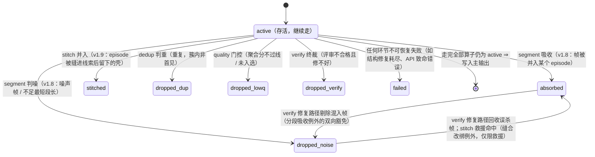

# 第 4 章　核心概念：记录、批、状态与流水线

> 本章是全书的「语法书」：记录如何获得身份，批如何流动，状态如何变迁，算子开关有哪些合法组合。
> 后面每一章都建立在这些概念上，值得慢读一遍。

## 4.1 记录（Record）：流水线上的最小单元

**一条记录 = 流水线处理的最小数据单元。**

- 文本模态下，记录 = 输入 JSONL 的一行；
- UI 模态下，记录 = 一对文件（`uitree_<N>.jsonl` + `image_<N>.png/jpg`）。

每条记录在进厂时（ingest 算子）拿到一个**确定性 id**——16 位十六进制字符串：

- 文本模态：`sha256(整行 JSON 的规范化序列化)` 取前 16 位。规范化 = 键排序、紧凑分隔，所以**内容相同的两行，无论出现在哪个文件第几行，id 必然相同**；
- UI 模态：`sha256(树文件字节 + 图像文件字节)` 取前 16 位。

id 贯穿一切：主输出的 `_meta.id`、拒绝通道、trace 事件里的 `record_ids`，全都用它指代记录。你可以拿着一个 id 在各个产物文件之间对账。

记录本体是**不可变**的——去重不改它，打分不改它，标注是「另附标签」而不是改写原文。唯一会动到「已产出标注」的是 verify 的修复路径（第 13 章）。

## 4.2 状态机：每条记录的一生

每条记录在流水线上背着一个状态牌，从 `active` 出发，只会发生这些变迁：



两个 v1.8 新状态只在开启分段算子（流模式，第 25 章）时出现：`absorbed` 表示这条帧记录被吸收为某个 episode（序列信封）的成员——它不进主输出也不进拒绝通道，账记在序列信封名下；`dropped_noise` 表示这一帧被判为噪声（弹窗、误触等插入帧）或所在段不足最短段长而被剔除，进拒绝通道。v1.9 新状态 `stitched` 只在再开启缝合算子（第 26 章）时出现：一个 episode 被缝进另一条线索后，成员已转移到幸存信封名下，原信封成了「壳」——壳既不进主输出也不进拒绝通道，仅计数（`counts.stitched`）。

三条铁律（出自 Stage 契约，spec §4.3）：

1. **仅处理 active 条款**：算子只处理 `active` 的记录——被前面算子淘汰的，后面算子看都不看（也就不再为它花钱）；
2. **不删元素条款**：算子永远不从批里删除元素，只改状态——账目因此永远算得平。v1.7 起有一个**只增不删**的例外——**多标签扇出例外**：分类算子在 `classify.assignment = "multi"` 下可向批**尾部**追加扇出的兄弟信封（一条记录命中多个类别时每类一个信封），既有元素仍一个不动（第 24 章）。v1.8 又添一个同族的**分段吸收例外**：分段算子可把批内成员帧信封置为 `absorbed` / `dropped_noise`，并向批尾追加以这些成员拼装的序列信封（每帧至多被一个 episode 吸收）；verify 的缺陷修复路径还可在本批内把成员帧状态在 `absorbed` 与 `dropped_noise` 之间**双向**改写（回收误杀帧 / 剔除混入帧）——这是「状态只进不退」的唯一反向豁免，且永远不会把成员翻回 `active`（第 25 章）。v1.9 再添**缝合改绑例外**：缝合算子把被并入线索的 episode 信封置为 `stitched`（壳）、幸存信封的成员集重绑为两方成员按序合并，救援命中时还可把过短被剔的收尾帧从 `dropped_noise` 翻回 `absorbed`——这是分段吸收例外的双向豁免在缝合算子上的延伸，仅限救援命中（第 26 章）；
3. **失败不逃逸条款**：单条记录的失败绝不升级为整批失败——异常被收进该记录的 `errors` 列表，状态置 `failed`，运行继续。

最终去向：`active` → 主输出；`dropped_*` / `failed` → 拒绝通道（按 `output.rejects` 档位落盘）；所有状态计数 → 报告。于是有了那条**守恒恒等式**：

```
emitted + dropped_dup + dropped_lowq + dropped_verify [+ dropped_noise] + failed + bad_input [+ absorbed] [+ stitched]
  = scanned + generated [+ fanout] [+ episodes]
```

（v1.13 的时间流生成（`[generate.stream]`，第 27 章）**不给这条等式添项**：合成流的成员帧只活在时间流工件里、不构造信封，一条序列 = 一个信封 = 一行，等式取 generate_only 的退化形 `emitted + dropped_* + failed = generated`——`absorbed` / `episodes` 是分段算子的记账项，本形态不出现。`bad_input` 是 ingest 阶段就不成记录的坏行/缺对，没有 id，不走拒绝通道，只计数。`fanout` 仅在 `classify.assignment = "multi"` 时出现于 `counts`——multi 扇出净增的信封数，右侧随之补平，第 24 章。`absorbed` / `dropped_noise` / `episodes` 是 v1.8 的 stream 三项，仅 `segment.enabled = true` 时出现：分段吸收的帧与剔除的噪声帧记在左侧，净增的 episode 信封数记在右侧补平，第 25 章。`stitched` 是 v1.9 缝合项，仅 `stitch.enabled = true` 时出现：被并进线索的 episode 壳作为终态记在左侧，与右侧的 `episodes` 一对一抵扣（线索数 = episodes − stitched），第 26 章。未启用的项恒为 0，等式退化回原形。另注意残差项 `unprocessed`：熔断中止时左侧另加它；流模式下**优雅中断（SIGINT/SIGTERM）也会**产生该项——会话缓冲让中断时可能有已扫描但未走完流水线的帧；非流模式的中断残差恒为 0、不出现此键。）

## 4.3 批（Batch）：流动与屏障

记录不是一条条流过流水线，而是**成批**流动（`run.batch_size`，默认 256）。批内规则：

- **同一算子内，记录级并发**——一批 256 条的标注调用会在并发额度内同时发出；
- **算子之间，批内串行（屏障）**——一批必须整体走完去重，才整体进入打分。

为什么要屏障？因为 pairwise 质量打分需要「同一批的记录互相比较」（第 10 章），批不齐没法比。这带来一个你必须记住的推论：

> **批 = pairwise 打分的比较池。** `batch_size` 不只是内存/吞吐参数，它直接决定质量分的统计口径。pairwise 分数是「批内相对排名」，批间不可直接比较。

批走完最后一个算子就**立即落盘并释放内存**——这是「无状态」的微观实现：任何时刻内存里最多只有一批的中间态（外加全局去重索引；开启 generate 时，还会短暂驻留排队等待回流的生成子批，见第 12 章）。

## 4.4 运行（Run）：一次进程的生命周期

一次 `labelkit run` = 读入 → 分批处理 → 写出 → 退出。要点：

- **可复现**：所有随机行为（配对采样、顺序随机化、种子抽样）都由 `run.seed` 播种的伪随机数发生器驱动；temperature 默认 0。同输入 + 同配置 + 同 seed，除 LLM 服务端本身的非确定性外，流程路径完全一致。
- **原子输出**：主输出先写临时名（`*.jsonl.part`），全部完成后 fsync + 原子改名。你永远不会读到半截的主输出文件。
- **增量落盘**：每批处理完即追加写出并 flush。两种中途结束的语义不同：**熔断**（退出码 4）时报告照常写出（以 `exit_code: 4` 体现，`interrupted` 保持 `false`），但主输出不改名交付（`.part` 留在原地）；**优雅中断**（SIGINT/SIGTERM）时停止取新批、当前批最多等 30 秒，随后正常收尾——已完成批的主输出照常 fsync + 原子改名交付，报告标记 `interrupted: true`。
- **熔断器**：连续 `run.fatal_error_threshold`（默认 20）次不可恢复的 API 错误会触发熔断，以退出码 4 终止——防止对着一个坏掉的端点把整个任务的钱烧完。两个细则：**认证类错误（401/403）第一次出现就立即熔断**（凭据坏了不会自愈）；重试耗尽的调用同样计入连续窗口。任何一次成功调用都会清零计数。v1.11 再补一组细则：上下文预算（第 6 章）拦下的超窗记录（`context_overflow` 的预检与最小单元形态）**不计入**连续窗口——它们死在任何 API 交互之前，说明不了端点健康；输出写满上限被截断的记录（`output_truncated`）与端点以成功响应报超窗的形态同样不计——HTTP 交互本身成功，成功已把计数清零。唯一例外：预算开启下请求真实发出、端点以 400 报超窗、有界降级重试仍失败的**反应态终局，恰好计入一次**——连续 20 条记录连降级都救不回来，说明估算体系与端点现实全面脱节，值得按端点故障停机排查（第 18 章）。

## 4.5 算子开关：合法组合与约束

九个可开关算子（segment / stitch / dedup / classify / extract / quality / generate / annotate / verify）由 `project.toml` 各节的 `enabled` 控制。但 M1 配置校验会拦下无意义或矛盾的组合：

| 约束 | 理由 |
|---|---|
| `annotate` 与 `quality` **至少开一个** | 两个都关，这次运行既不打分也不标注，没有产出意义 |
| `verify` 开 ⇒ `annotate` 必须开 | 没有标注就没有可评审的对象 |
| `generate` 开 ⇒ 模态必须是 `text` | LLM 无法生成配套截图 |
| `generate` 开 + process 模式 ⇒ `quality` 必须开 | 生成的种子来自「过质量门」的记录 |
| `mode = "generate_only"` ⇒ `generate` 必须开，且 `run.input` 必须**不设** | 纯生成模式没有输入 |
| `quality.threshold` 与 `quality.selection="top_ratio"` **互斥** | 两种淘汰机制不能同时生效 |
| `segment` 开 ⇒ `mode = "process"` 且 `generate` 必须关且 `annotate` 必须开（v1.8） | 分段加工的是既有时序流，与生成互斥（序列合成属路线图）；episode 的产出物就是标注 |
| `extract` 开 ⇒ `segment` 必须开且模态必须是 `ui`（v1.8） | 动作摘取的对象是屏幕帧序列——没有分段就没有 episode，文本序列 v1 不适用 |
| `stitch` 开 ⇒ `segment` 必须开（v1.9） | 缝合的对象是分段产出的 episode 碎片——没有分段就没有可缝的东西（仅流模式可用） |
| `stitch.votes` 若大于 1 必须为奇数（v1.9） | 偶数票可能平票，严格多数决失去意义 |
| `segment` 开 ⇒ `quality.llm` **免除** `supports_vision` 要求（v1.8 放宽项；v1.9 的 `stitch.llm` 同样恒不要求视觉） | 序列打分是纯文本（步骤序列 + 帧摘要，无图），UI 模态也不需要视觉能力；缝合判定同理（摘要卡证据，无图） |
| `frame.classify` / `frame.annotate` 任一开 ⇒ `segment` 必须开（v1.12） | 帧粒度是流模式内的第二层产物——帧的载体是 episode 的成员集；非流工程想按类定制标注，用 `[class.<名>.annotate]`（第 24 章） |
| 帧粒度任一开 ⇒ `output.meta_mode` 不得为 `"none"`（v1.12） | 帧产物仅经 `_meta.stream.members[]` 承载——丢弃元信息 = 丢弃全部帧产物 |
| `[frame.class.*]` 在场 ⇒ `frame.classify` 必须开，且节名 ∈ 帧类表（v1.12；v1.13 放宽为 `frame.classify` 开 **∨** `generate.stream` 开——后者用 `[frame.class.<名>.generate]` 声明帧内容契约） | 按帧类覆盖以帧类判决为前提；`frame.classify.fallback_class` 同样必须 ∈ 帧类表 |
| `generate.stream` 开 ⇒ `mode = "generate_only"` ∧ 模态 `text` ∧ `generate` 开 ∧ `classify` 开 ∧ `stream.order_by = "meta:<字段>"` ∧ `output.meta_mode ≠ "none"`（v1.13） | 时间流生成从零合成流：类表是配额与标签继承的载体、`order_by` 声明的字段名即工件的时间戳字段名（重放靠它）、帧类真值仅经 `_meta` 承载 |
| `generate.stream` 开 ⇒ `frame.classify` / `frame.annotate` 必须关（v1.13） | 帧类真值在生成期已知（蓝图即真值），帧级判决与帧级标注在本形态下没有对象——显式开启是定向配置错误 |
| `generate.stream` 开 ⇒ 序列类表放宽为 **≥1 类**、`fallback_class` **免填**（v1.13） | 标签继承（`inherited`）没有判决路径，「≥2 类才分得动」与兜底类这两条规则保护的对象不存在 |
| `[[generate.stream.tiers]]` 在场 ⇒ `generate.stream` 必须开；**每张生效表**各自 `tier_rank` 连续覆盖 1..N、**表内**各档 `frame_classes` 两两互异、每个非零配额的 (类, 档) 组合须满足该类 `len_range` 下界 ≥ 该档构成大小（v1.14；v1.15 逐表化） | 档位即帧类构成，构成语义是**恰等**（档内每类至少出现一次）——步数装不下构成就必然产出缺类序列，故在启动时拦下；零配额组合豁免（不为永不尝试的组合抬高下界） |
| `[[class.<名>.generate.tiers]]`（按类档位表，v1.15）在场 ⇒ 全局 `[[generate.stream.tiers]]` 必须在场；显式空表 `tiers = []` 拒收；仅时间流形态合法 | 类声明了就**整表取代**全局表，未声明回落全局表——全局表既是回落源、又是「档位面开没开」的唯一判据，缺了它按类表就没有锚；`tier_rank` 因此收窄为**类内身份**（跨类不可比、跨类同构成合法） |
| `[frame.class.<名>.generate.time_fields]` 在场 ⇒ 该帧类必须声明 `schema_path` / `schema_inline`，绑定值 ∈ 闭集 `{ts, gap_prev_s, gap_next_s, elapsed_s}`，声明类型字面恰等（`ts` ⇒ string、其余 ⇒ number），且剔除后至少剩一个字段（v1.14） | 绑定字段从 LLM 面剔除、由时间轴机械回填——纯文本帧没有字段可绑，类型不符则回填值不满足用户 Schema，全绑定则这次调用没有任何内容要生成 |
| `[[generate.stream.rules]]` / `[[generate.stream.windows]]`（v1.16）在场 ⇒ 只能用于时间流生成；规则引用和窗口帧类必须来自帧类真值表 | 任一非零配额类的生效表非空时，OR-Tools CP-SAT 在内容调用前联合冻结长度、帧类词、session、crossing、微秒时间戳与噪音槽；不是先生成再靠重试碰运气 |
| `[[class.<名>.generate.rules]]` / `windows` 采用三态整表语义（v1.16） | 缺键继承全局表；显式空数组清空本类；非空数组整表取代全局表。两张表彼此独立，也不要求全局表充当锚 |
| `generate.sequence_validator`（v1.16）只在时间流生成合法 | hook 每条序列调用一次，接收帧类与 payload 的深拷贝；它不激活联合 planner，异常或非空违规列表只作废该序列 |

`classify`（v1.7，默认关）与上表各开关**正交**：分类不改变组合合法性，任意合法组合都可以叠加分类——multi 扇出后的每个信封走同一套阶段组合（第 24 章）。v1.12 的帧粒度双开关（`frame.classify` / `frame.annotate`）不是新算子，而是 classify / annotate 两个算子在流模式下的第二层粒度；帧级没有多标签也没有自洽采样——在 `[frame.classify]` 里写 `assignment` 或在 `[frame.annotate]` 里写 `self_consistency` 是定向配置错误（第 25 章 25.6）。

几个常用组合的「菜谱」：

| dedup | classify | quality | generate | annotate | verify | 这是什么玩法 |
|:-:|:-:|:-:|:-:|:-:|:-:|---|
| ✓ | — | ✓ | — | ✓ | — | **默认套餐**：清洗 + 打分 + 标注 |
| ✓ | — | ✓ | — | — | — | **纯治理**：只去重打分，输出原始数据 + 分数，标签以后再说 |
| — | — | — | — | ✓ | ✓ | **纯标注**：数据已经治理过，只标注 + 复核 |
| ✓ | — | ✓ | ✓ | ✓ | ✓ | **全流程**：治理 + 扩充生成 + 标注 + 复核（成本最高，质量最高） |
| ✓ | — | 可选 | ✓ | 可选 | — | **纯生成**（`generate_only`）：无中生有 → 治理 →（标注）→ 输出 |
| ✓ | ✓ | ✓ | — | ✓ | — | **按类分治**（v1.7）：先分类，再按类 rubric 打分、按类指令标注（第 24 章） |
| ✓ | — | ✓ | — | ✓ | 可选 | **时序流分段标注**（v1.8）：另开 `[segment]`（UI 下可再开 `[extract]`），把连续采集的帧流切成 episode、摘出动作序列，再整段打分与标注（第 25 章） |
| ✓ | ✓ | ✓ | ✓ | ✓ | 可选 | **时间流生成**（v1.13）：`generate_only` + `[generate.stream]`，从零合成一条带时间戳的多会话流——一条序列一行，另落一份可重放的时间流工件（第 27 章） |

## 4.6 两份配置文件：为什么是两份

LabelKit 把配置切成两半，职责严格分离：

| | `config.toml`（工具配置） | `project.toml`（工程配置） |
|---|---|---|
| 回答什么 | 「我有哪些 LLM 可用？」 | 「这一次任务怎么加工？」 |
| 变化频率 | 随部署环境变，跨任务复用 | 每个任务一份 |
| 内容 | LLM/embedding profile（地址、模型、密钥名、并发、重试、能力声明）、日志格式 | 输入输出、模态、批大小、seed、各算子开关与参数、评价准则、标注指令、输出 Schema |
| 谁维护 | 平台/运维同学一次配好 | 做任务的你 |

这个切分的实际价值：换一个 LLM 网关，只动 `config.toml`，所有任务照跑；把一个任务交给同事，只发 `project.toml`（和数据），对方用自己的 `config.toml` 就能复现。

**优先级**：CLI 参数 > `project.toml` > `config.toml`。比如 `--output` 覆盖 `run.output`，`--log-level` 覆盖 `tool.log_level`。

**启动校验（快速失败，全量反馈）**：M1 在启动时把两份文件、CLI 覆盖、内联 Schema、rubric、few-shot 示例全部校验一遍，**所有错误一次性列出**，然后以退出码 2 结束。你不会遇到「跑了十分钟才发现第二个配置错误」的情况。校验通过后配置被冻结为不可变对象——运行期间不存在配置歧义。

```
ConfigError: 2 config error(s) (all aggregated)
project.toml:[run].output: missing required key, expected string (may be supplied by CLI --output)
project.toml:[quality].llm: referenced profile "gpt4" does not exist in config.toml [llm.*], available: default, judge
```

## 4.7 数据只去它该去的地方

最后把「无状态 + 隐私」的承诺说满：

- **落盘的只有这几样**：主输出、拒绝通道、`report.json`、（显式开启时的）trace 日志，外加 v1.13 时间流生成的**时间流工件**（`{输出名}.stream.jsonl`，与主输出同级的数据输出通道，仅该形态开启时产生，第 27 章）。没有临时文件、缓存、checkpoint——「无中间态落盘」的原则不变，工件是显式的产物而非中间态。
- **报告永远不含数据内容**——只有计数、分布、耗时、token 统计。
- **stderr 运行日志永远不含数据内容与提示词**。会含数据的只有两个你**显式选择**的地方：`output.rejects = "full"` 和 `trace.content` 的高档位（第 16 章有明确的风险提示）。
- **API 密钥在任何通道都不落盘**。
- 数据只发往 `config.toml` 里声明的端点，无遥测。

理解了这些概念，就可以开始准备你自己的数据了。
