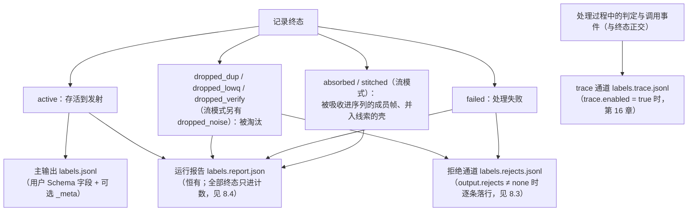

# 第 8 章　读懂五个产物：主输出、_meta、拒绝通道、运行报告与时间流工件

> 一次运行最多产出五个文件。本章逐字段解读它们，并给出几个「拿到产物之后」的实用姿势：
> 后筛、对账、剥离元信息。

## 8.1 产物一览

设 `run.output = "./out/labels.jsonl"`，同目录下会出现：

| 文件 | 何时产生 | 内容 |
|---|---|---|
| `labels.jsonl` | 恒有 | 主输出：每行 = 用户 Schema 字段（+ 可选 `_meta`） |
| `labels.rejects.jsonl` | `output.rejects ≠ "none"`（运行开始即创建；无淘汰时为 0 行空文件） | 拒绝通道：被淘汰记录的环节、原因与引用 |
| `labels.report.json` | 恒有 | 运行报告：纯统计，无数据内容 |
| `labels.trace.jsonl` | `trace.enabled = true` | 事件流（第 16 章专讲） |
| `labels.stream.jsonl` | `[generate.stream].enabled = true`（v1.16，`--dry-run` 不写） | **时间流工件**：合成流的逐帧落盘（时间戳 + 文本 + 逐帧真值），行号即 `_meta.stream.member_sources[].line_no`；它是与主输出同级的数据输出通道，可当输入原样重放（第 27 章） |

每条记录的终态决定它流进哪条路由；四条路由一图看全：



注意 absorbed 成员帧与 stitched 壳只进报告计数、不落拒绝通道——它们的内容已由所属序列行经主输出承载（8.3 末尾与 8.4 的 `--strict` 交互提醒）。v1.16 的时间流工件与 trace 一样**与终态路由正交**：它写的是合成流的每一帧（含从不成为信封的噪音帧与重发帧），不参与守恒恒等式；合成序列的终态照常走上面四条路由（第 27 章）。

主输出的交付是**原子**的：运行中写 `labels.jsonl.part`，全部完成后 fsync + 改名（时间流工件与它**同批** fsync + 改名，要么一起交付、要么一起留 `.part`）。运行结束后仍看到 `.part` 文件，说明那次运行没走到交付——进程硬崩溃或输出路径不可写留下的残骸。注意：Ctrl-C 的**优雅中断**会正常收尾交付（`.part` 被改名、报告标记 `interrupted: true`），不留残骸；v1.6 起**熔断中止也交付**——已完成批的 `.part` 同样 fsync + 原子改名，退出码仍是 4（此前版本熔断直接丢弃 `.part`，长跑末段一次配额死亡就赔掉全部已完成产出）。

> **消费方判定规则变了（v1.6）**：最终文件名出现，仍然保证**已交付的每一行完整且合法**——永远读不到半截行；但它**不再等价于「全部输入处理完毕」**。判定一次运行是否完整，唯一可靠的信号是报告里的 `run.interrupted = false` **且** `run.circuit_broken = false`。退出码不充分：优雅中断的运行同样交付且以 0 退出，熔断交付则以 4 退出但文件照样出现。熔断交付的主输出是「已完成批的完整前缀」，缺了多少可拿 `counts.unprocessed` 对账（见 8.4 节）。下游若有自动消费流水线，把这条判定写进去。

## 8.2 主输出与 `_meta`：每行的完整履历

`meta_mode = "inline"`（默认）时，一行长这样（真实运行产物，格式化展示）：

```json
{
  "intent": "qa",                                    ← 你的 Schema 字段（顶层平铺）
  "topic": "光合作用暗反应（卡尔文循环）的发生部位与三个阶段",
  "difficulty": "medium",
  "_meta": {
    "id": "a8aa181766eebd97",                        ← 记录的确定性 id（第 4 章）
    "run": {                                         ← 这次运行的指纹
      "tool": "labelkit/1.0.0",
      "started_at": "2026-07-23T04:41:06.239007+08:00",
      "project_file": "project.toml",
      "rubric": "default:text",
      "seed": 42
    },
    "source": {                                      ← 溯源：这行数据从哪来
      "file": "input.jsonl",
      "line_no": 4,                                  ← 文本模态：行号；UI 模态换成 pair_index
      "generated_from": [],                          ← 若是合成样本：种子记录的 id 列表
      "fields": {"source": "ime-log"},               ← passthrough_fields 透传的原始字段
      "generator": null                              ← 若是合成样本：{"llm": …, "style": …}，
                                                        时间流生成开了档位表时再多一个 tier_rank（v1.14；它是
                                                        **类内**序数，须连着 classification.label 读，第 27 章）
    },
    "stream": null,                                  ← 时序流元信息（v1.8 恒在键；未启用恒为 null，第 25 章；
                                                        v1.9 缝合启用时另含 thread_id / fragments 等线索键，第 26 章；
                                                        v1.12 帧粒度启用时另含 members[]，见下文）
    "scores": {                                      ← 质量分（quality 开启时）
      "educational_value": 0.6,                      ← 每条准则一个 [0,1] 分
      "facts_trivia": 0.8,
      "required_expertise": 0.6,
      "writing_style": 0.4,
      "__aggregate__": 0.6000000000000001,           ← 加权聚合分（质量门用的就是它）
      "mode": "pointwise",                           ← 打分模式；pairwise 时为 "pairwise_bt"
      "batch_no": 1,                                 ← 在第几批打的分（pairwise 下跨批不可比）
      "pool": "qa"                                   ← classify 启用时出现：在哪个类池里打的分（第 24 章）
    },
    "dedup": {"kind": "unique"},                     ← 去重判定（存活者恒为 unique）
    "classification": {"label": "qa",                ← 分类结果（v1.7 恒在键；classify 未启用恒为 null——
                        "labels": ["qa"],               本行来自开着 classify 的 quickstart 工程）
                        "source": "llm"},
    "annotation": {"model": "glm-5.2", "attempts": 1},  ← 标注用的模型与尝试次数
    "verification": {"verdict": "pass", "rounds": 1}    ← verify 未启用恒为 null；启用后 {"verdict","rounds"}
  }
}
```

几个字段的深意：

- **`annotation.attempts`**：1 = 一次通过；2 = 经过一轮结构修复才合法（第 14 章）。批量看这个字段能感知「模型输出结构的稳定性」。开了 self-consistency 时另含 `sc: {n, agreement_ratio}`，此时 attempts 是各合法样本尝试次数之和（与 `sc.n` 对照才有意义，见第 11 章）。
- **`scores.batch_no`**：pairwise 模式下分数是批内相对量，跨批比较分数时先看这个字段是不是同一批（第 10 章反复强调）。
- **`classification`**（v1.7 恒在键）：分类算子未启用时恒为 `null`；启用后为 `{"label", "labels", "source"}`——`label` 是本行的路由类别，`labels` 是该记录命中的类别全集（multi 模式下同一 `id` 可产多行，行唯一键变为 (`id`, `label`)），`source` 标记标签来源（`llm` / `fallback` / `inherited`）。启用时 `scores` 里另出现 `pool` 键（= 类名，自述这行分数是在哪个类池里打的）。详见第 24 章。
- **`generator` / `generated_from`**：区分真实与合成数据的**唯一可靠判据**是 `generator ≠ null`（`generated_from` 在纯生成模式下恒为空数组，不可作判据）。
- **校验语义**：inline 模式下「剥除 `_meta` 后的对象」保证通过你的 Schema。启动时已禁止用户 Schema 声明 `_meta`，不会撞名。

**v1.12 帧粒度的 `stream.members`**：流模式下开启帧级分类/标注（第 25 章 25.6）后，`_meta.stream` 内多一个 `members` 数组（`member_sources` 之后、`session_split` 之前）——逐成员帧的帧类标签与帧级标注。真实样例（`examples/mix` UI 主工程本次真跑主输出 `out/mix-labels.jsonl` 第 1 行的外卖下单 episode，帧分类 + 帧标注同开；条目字段序 `index, id, label, annotation, status`）：

```json
"members": [
  {"index": 0, "id": "7cfb0c25f855b2d7", "label": "list_screen",
   "annotation": {"screen_role": "美食外卖首页",
                  "key_widgets": ["搜索美食", "搜索", "推荐餐厅", "金牌黄焖鸡 4.9 分",
                                  "老面坊牛肉面 4.7 分", "青禾轻食沙拉 4.5 分"]},
   "status": "annotated"},
  …index 1–3（detail_screen / form_screen / confirm_screen）status 均为 "annotated"
  {"index": 4, "id": "96cb96ed666583b1", "label": "transition", "annotation": null, "status": "skipped"},
  {"index": 5, "id": "347864af1bc54006", "label": "confirm_screen",
   "annotation": {"screen_role": "支付成功结果页",
                  "key_widgets": ["支付成功", "订单号 FD20260812001", "黄焖鸡米饭 大份 ×1 实付 ¥38",
                                  "预计 40 分钟内送达", "查看订单", "返回首页"]},
   "status": "annotated"}
]
```

**v1.16 时间流生成的 `_meta.stream`**：合成流（第 27 章）的一行也是一条序列，`_meta.stream` 用的是同一族键但形态更简——`order_span` 是**工件路径 + 行号**、`members[]` 只有 `{index, id, label}` 三键（label 是生成期就已知的**帧类真值**，没有 annotation / status 列）、`steps` 恒 `null`（extract 不参与）、`thread_id` / `fragments` 不出现（stitch 不参与）。以下是当前成功真跑 `examples/synth-stream/out/synth-labels.jsonl` 第 1 行的 `_meta` 节选；完整验收结果见第 27 章：

```json
"source": {"file": "out/synth-labels.stream.jsonl", "line_no": 15, "generated_from": [],
            "fields": {}, "generator": {"llm": "default", "style": null, "tier_rank": 2}},
"stream": {
  "episode_id": "05ef6939e072415e", "session_id": "05ef6939e072415e",
  "order_span": ["out/synth-labels.stream.jsonl:15", "out/synth-labels.stream.jsonl:19"],
  "member_count": 5,
  "member_ids": ["098e275fdd5fd45f", "15e6d7e16d06e65e", "34fe8a624e081b7c", "51aae0cad1a817b5", "bfef5f0641a5cab4"],
  "member_sources": [{"file": "out/synth-labels.stream.jsonl", "line_no": 15}, …共 5 项],
  "members": [{"index": 0, "id": "098e275fdd5fd45f", "label": "task_request"},
               {"index": 1, "id": "15e6d7e16d06e65e", "label": "acknowledgement"},
               {"index": 2, "id": "34fe8a624e081b7c", "label": "progress"},
               {"index": 3, "id": "51aae0cad1a817b5", "label": "progress"},
               {"index": 4, "id": "bfef5f0641a5cab4", "label": "confirmation"}],
  "session_split": false, "repaired": false, "degraded": null, "steps": null
}
```

`source.file` 指向的是**时间流工件**（合成品的溯源判据仍是 `generator ≠ null`），拿 `member_sources[].line_no` 能把每一帧回查到工件行；`session_id` 与 `episode_id` 不等就说明这个会话里还有别的帧（噪音帧，或交叉进来的另一条序列）。`generator.tier_rank`（v1.14，仅档位表在场时）说明这条序列按哪一档的帧类构成生成——它与 `members[]` 的帧类集合**恰等对账**，档位身份因此可从数据反推。但要注意 v1.15 起序列类可以各有一张档位表（`[[class.<名>.generate.tiers]]` 整表覆盖全局表），**`tier_rank` 是类内序数、跨类不可比**：对账时先按同行的 `_meta.classification.label` 选出该类的生效表再比集合（第 27 章 27.4）。同一份主输出里**不同序列类的行字段集可以不同**（按类标注 Schema，第 27 章 27.6），下游按 `_meta.classification.label` 分流后再解析。

回到 v1.12 的帧粒度，读法三句：`label` 键仅帧分类开启时在场（segment 降格的 episode 全员 label=null）；`annotation` / `status` 两键仅帧标注开启时在场，`status` 闭集 `annotated | skipped | failed`——skipped = 该帧类按 `[frame.class.<名>.annotate].enabled = false` 跳过（本例 index 4 的支付处理过渡屏，帧类 transition），failed = 修复穷尽或写前帧 Schema 校验不过（annotation 置 null）；帧失败**不产生 rejects 行、不触发 `--strict`**，账在报告的帧子块（8.4）。完整读法与配置见第 25 章 25.6（文本帧路径的同款样例看姊妹工程输出 `out/mix-text-labels.jsonl`）。

`meta_mode = "sidecar"` 时主输出是纯用户结构，`_meta` 逐行写 `{stem}.meta.jsonl`，行序与主输出对齐、以 id 关联。`none` 则彻底不产元信息——分数与溯源都没了，除非下游明确拒绝任何附加字段，否则别选它。

### 下游常用姿势

```bash
# 1. 按聚合分后筛：门槛留宽、下游收紧（拿高分子集，同时剥掉 _meta）
jq -c 'select(._meta.scores["__aggregate__"] >= 0.6) | del(._meta)' \
   out/labels.jsonl > out/labels.hq.jsonl

# 2. 只剥 _meta，得到纯净训练文件
jq -c 'del(._meta)' out/labels.jsonl > out/labels.clean.jsonl

# 3. 只看合成样本
jq -c 'select(._meta.source.generator != null)' out/labels.jsonl

# 4. 统计意图分布
jq -r '.intent' out/labels.jsonl | sort | uniq -c
```

这就是「门控可以留宽」策略的基础：分数随行落盘后，**当次没淘汰的，下游随时可以再筛**；而当次淘汰掉的，想找回来就得重跑。拿不准阈值时，宁可放宽 `quality.threshold` 甚至不设，把裁量权留给后筛。

## 8.3 拒绝通道：被淘汰记录的去向

`rejects = "refs"`（默认）档，每行长这样（quickstart 工程的第一行，classify 开启所以带 `label` 键）：

```json
{"_meta": {"id": "6e60ce3c2d59f04d",
           "source": {"file": "input.jsonl", "line_no": 1, "generated_from": []},
           "stage": "quality", "reason": "below_threshold", "errors": [], "label": "writing"}}
```

- `stage` + `reason` 告诉你**在哪个算子、因为什么**被淘汰。常见组合：`dedup` / 判重类别（`exact` / `near_text` / `near_image` / `near_both`，开语义层时另有 `near_semantic`，与第 9 章一致）、`quality / below_threshold`（top_ratio 模式下为 `top_ratio`）、`verify / verify_fail`；流模式（第 25 章）另有 `segment` / `noise`、`segment` / `below_min_len` 与 `verify` / `off_task_member`；v1.9 的 `stitch` / `stitch_invalid` 仅在 `stitch.on_error = "fail"` 时出现（缝合判定失败的 episode 候选信封，第 26 章）。记录处理**失败**（状态 `failed`）时，`stage` 为出错算子、`reason` 为首个错误的**错误码**（如 `schema_violation`、`provider_fatal`；v1.11 增两值——`context_overflow` 上下文超预算、`output_truncated` 响应写满输出上限被终局拒绝，任何走 LLM 调用的算子都可能出现，全表见第 18 章），`errors` 列表为具体的错误信息文本。反向的提醒：缝合产生的 `stitched` 壳与救援命中的短段帧**不落 rejects**——救援把帧从 `dropped_noise` 翻回 `absorbed`，同一份输入开启缝合后 rejects 行数可能变少（`--strict` 交互见 8.4 末尾）；
- `refs` 档**不含数据内容**——想看被淘汰的原文，要么拿 `line_no` 回输入文件查，要么把 `rejects` 改成 `"full"`（原文随行落盘，注意这就是一份数据副本了）；
- `rejects = "none"` 时不写此文件，淘汰只反映在报告计数里。**调优期强烈建议至少 refs**：质量门帮你扔掉了什么，是判断阈值合不合理的第一手材料。

## 8.4 report.json 逐节解读

以下是一次真实运行的完整报告（quickstart 工程：14 条输入 + 12 条生成样本回流；classify / generate 的专属节以 `{…}` 略）：

```json
{
  "run": {
    "tool_version": "1.0.0",
    "started_at": "2026-07-23T04:41:06.239007+08:00",
    "finished_at": "2026-07-23T04:45:01.401648+08:00",
    "interrupted": false,                ← 仅 SIGINT/SIGTERM 优雅中断时为 true
    "circuit_broken": false,             ← 熔断的显式标志（触发时为 true，exit_code 同为 4）
    "exit_code": 0,
    "modality": "text",
    "seed": 42,
    "config_digest": "sha256:1c1c1158…", ← 两份配置文件的指纹：
    "project_digest": "sha256:b648d1cc…"    对账"这份产物是哪套配置跑的"就靠它
  },
  "counts": {                            ← 过磅单（守恒等式见第 4 章）
    "scanned": 14, "ingested": 14, "bad_input": 0,
    "dropped_dup": 1, "dropped_lowq": 11, "dropped_verify": 0,
    "failed": 1, "generated": 12, "emitted": 13
  },
  "dedup": {                             ← 去重明细：各层各拦了几条
    "exact": 1, "near_text": 0, "near_image": 0, "near_both": 0,
    "clusters": 1,                       ← 重复簇个数
    "image_decode_failures": 0           ← 解码失败（跳过图像层）的张数
  },
  "quality": {
    "mode": "pointwise",
    "rounds": 4,
    "judgment_failures": 0,              ← 裁决输出不合法的次数（>5% 要警惕，见第 16 章）
    "aggregate_histogram": {             ← 聚合分 10 桶直方图：
      "0.0-0.1": 4, "0.1-0.2": 4, "0.2-0.3": 5, "0.3-0.4": 7,
      "0.4-0.5": 0, "0.5-0.6": 1, "0.6-0.7": 3, "0.7-0.8": 1, "…": 0
    },                                       画质量线之前先看它！
    "per_criterion_mean": {              ← 每条准则的均值：哪条准则在拖后腿一目了然
      "educational_value": 0.29600000000000004, "facts_trivia": 0.18333333333333335,
      "required_expertise": 0.21600000000000005, "writing_style": 0.424
    },                                   ← pairwise 模式下均值恒 ≈0.5，另有 per_criterion_tie_rate
                                            （每准则平局率，只统计拿到裁决的比较——rubric 区分度的直接读数）
    "by_class": {…}                      ← classify 启用时出现：按类分池的直方图与均值（第 24 章）
  },
  "schema_engine": {                     ← 结构引擎四层的命中分布（第 14 章）
    "resolved_at": {"l0_or_clean": 11, "l1": 2, "l3_1": 0, "l3_2": 0, "rejected": 0}
  },
  "generate": {"buckets": {…}},          ← generate 启用时出现：分桶产出统计（第 12 章）
  "classify": {…},                       ← classify 启用时出现：逐类命中计数（第 24 章）
  "budget": {                            ← v1.11：被引用 profile 声明 context_window 时出现（见下文）
    "profiles": {
      "default": {"context_window": 131072, "input_budget": 113868},
      "judge":   {"context_window": 131072, "input_budget": 115916}
    },                                   ← 声明窗，与扣除输出预留、安全边距后的输入预算（16.4 启动 INFO 行同源）
    "truncations": {},                   ← 各算子按预算裁剪证据的次数（仅列非零阶段；{} = 全程没裁）
    "overflow_records": 0,               ← 以 context_overflow 被拒的记录数
    "image_cost": {},                    ← 每图 token 成本的校准终值（纯文本运行恒空；UI 工程见第 21 章）
    "degrade_retries": 0,                ← 溢出降级重试次数（如 segment 窗对半改切、annotate 减帧）
    "escalations": 0                     ← verify 修复路径的质量升档次数（第 13 章）
  },
  "trace": {"enabled": true, "path": "out/text-labels.trace.jsonl",
             "events": 163, "dropped_events": 0},
  "llm_usage": {                         ← 分 profile 的用量账单
    "default": {"calls": 134, "prompt_tokens": 46399,
                 "completion_tokens": 16183, "retries": 0},
    "judge":   {"calls": 13, "prompt_tokens": 4559,
                 "completion_tokens": 2323, "retries": 0}
  },                                     ← 配了单价时另有 est_cost_usd
  "timing": {"wall_s": 234.94,
              "per_stage_s": {"dedup": 0.01, "classify": 41.874, "quality": 139.574,
                               "generate": 9.055, "annotate": 18.748, "verify": 25.677}}
}
```

（分数与耗时是真实运行的快照，逐次运行会有浮动；计数守恒与字段结构不变。这份 text 报告里**没有** `stream` 节——它与 `counts` 里的 `episodes` / `absorbed` / `dropped_noise` 一样，仅流模式（segment 启用）时出现，第 25 章。）

读报告的三板斧：

1. **先看 `counts` 对不对账**——各状态数量符合预期吗？`failed` 非零就去拒绝通道翻 `errors`（上面这份的 `failed=1` 是一次打分调用写满输出上限、按 v1.11 的 `output_truncated` 记录级拒收——第 3、18 章）；
2. **再看 `quality.aggregate_histogram`**——分布形状决定阈值画哪里。比如上面这份：0.2-0.4 两桶挤了 12 条，而本工程的三条类线（writing 0.2 / 全局 0.25 / qa 0.4）恰好全画在这片人堆里——阈值动一格、打分漂一格都会成批改变去留（第 20 章的「阈值敏感区」）。分类开启时按类画线要看 `by_class` 的分池直方图（第 24 章）——混合分布的汇总图会把几个类的峰糊在一起。如果直方图整体右移，同一条线就几乎不淘汰东西；
3. **最后看 `llm_usage` 和 `timing`**——哪个阶段最烧钱/最耗时（几乎总是 quality），是否要换模式、调并发（第 17 章）。

另有两个按需出现的块：`annotate.sc_disagreements`（开 self-consistency 时：全体分歧、回退首样本的次数）与 `generate.buckets`（开生成时：每个「模型×风格」桶的调用数 / 产出数 / 去重存活数，配置 `sample_validator` 时另有回调剔除数 `rejected_by_validator`——某桶存活率明显低说明它在产重复货或不合规货，第 12 章）。

v1.6 增补了三处按需出现的字段（不出现时语义同旧版，已有的报告解析脚本不受影响）：

- **`run.partial_delivery`**：仅熔断交付时出现且恒为 `true`（恒伴随 `circuit_broken: true`）——标记这份主输出是**部分交付**，消费方完整性判定见 8.1 节的警告框；
- **`counts.unprocessed`**：仅熔断中止时增列——已扫描/已生成但因中止没走完流水线的记录数。守恒恒等式相应扩展为 `emitted + dropped_* + failed + bad_input + unprocessed = scanned + generated`（第 4 章的原式是它在 `unprocessed = 0` 时的特例）；
- **`llm_usage` 的密钥池明细**（profile 用第 6 章的 `api_key_envs` 配了多把密钥时）：profile 对象增 `"keys": {"<环境变量名>": {"calls", "rate_limited", "disabled"}}`，按密钥拆分调用数、被限流（429）次数与是否被认证禁用——密钥一律以**环境变量名**标识，密钥值不会出现在任何日志或报告里；另有 `parked_calls` / `parked_ms`（池 >1 或数值非零时出现——单密钥驻留也留痕）：因「全部存活密钥都在限流冷却」而**驻留**等待的逻辑调用数与累计毫秒数。`disabled` 非零该换密钥，`parked_ms` 持续走高说明并发压过了密钥池的配额承受力——该加密钥或降 `max_concurrency`（驻留上限 `run.max_park_s` 见第 7 章；对应的 `llm.key_cooldown` / `llm.key_disabled` / `llm.pool_parked` 事件见第 16 章）。

v1.7（分类算子，第 24 章）再增三处按需出现的字段（未启用时报告形状与旧版逐字段一致）：

- **`classify` 节**（仅 `classify.enabled = true` 时出现）：`assignment`、逐类命中计数 `classes`、兜底归类数 `fallback_count` 与失败数 `failures`（multi 模式另有 `multi_label_records`）；`quality` 节同时增 `by_class` 分池统计——各池独立的直方图与准则均值；
- **`counts.fanout`**（仅 `assignment = "multi"` 时增列）：多标签扇出净增的行数，守恒恒等式右侧相应 `+ fanout`（第 4 章）；
- **`generate.buckets` 的桶 key**：classify 启用时由「`<llm>×<style>`」两段扩展为「`<class>×<llm>×<style>`」三段（关闭时格式不变，第 12 章）。

v1.8（流模式，第 25 章）再增两处按需出现的块（未启用时报告形状与旧版逐字段一致）：`counts` 增列 `episodes` / `absorbed` / `dropped_noise`，且 `counts` 之后新增顶层 `stream` 节（会话数、段长均值、`below_min_len`、摘要贫瘠帧数，extract / verify 各一个子块）——两者都仅 segment 启用时出现。守恒恒等式相应扩展为全展开形：左侧另加 `dropped_noise + absorbed`、右侧另加 `episodes`（未启用项恒 0 时退化回第 4 章原式；真实验算见第 25 章）；且流模式下 `counts.unprocessed` 的出现条件从「仅熔断」扩为「熔断或优雅中断」。

v1.9（线索缝合，第 26 章）再增两处按需出现的字段（仅 `stitch.enabled = true` 时出现，未启用时报告与 v1.8 逐字节一致）：`counts` 增列 `stitched` / `threads`（被并进线索的 episode 壳数、线索数，恒满足 `threads = episodes − stitched`），`stream` 节内新增 `stitch` 子块（`{stitched, rescued_short, seams, judgments, repass_judgments, failures}`，逐键读法见第 26 章）；守恒恒等式左侧相应另加 `stitched`（第 4 章）。一处**无条件**的例外：流模式下 verify 的缺陷词表是闭集，`stream.verify.defects` 从五行扩为六行——即便 stitch 关闭，`wrong_stitch: 0` 这一行也在场（第 13、25 章）。`--strict` 交互提醒：stitched 壳与被救援的帧都不构成 rejects，同一份输入开启缝合后 `--strict` 的结果可能从 1 变 0（短段被救援、不再落 rejects）——属预期，不是账目错误。

v1.11（上下文预算，第 6、16 章）再增两处按需出现的字段，另有 rejects 词表的两个新 reason（见 8.3 节）：

- **`budget` 节**（上面的样例里已在场）：仅当本次运行**被引用**的 profile 里至少一个声明了 `context_window` 时出现——全都不声明时报告与 v1.10 逐字节一致。键义见样例内注，三个值得盯的读数：`truncations` 某阶段持续走高 = 声明窗对这份数据偏小（预算裁剪在吃你的证据，考虑调大声明或换用更大窗口的 profile）；`overflow_records` 非零 = 有记录连最小装填单元都塞不进（rejects 里对应 `context_overflow` 行）；`image_cost` 是按真实 usage **校准**的每图 token 成本终值（样本不足 8 个的 profile 维持先验读数——第 21 章有一对真实的校准值/先验值对照：240 vs 1882）。segment 启用时另有 `w_min` 键：`{"segment.window": [窗上限, 最坏装填量]}`，与启动 INFO 行同源（16.4）；
- **`stream.windows`**（`stream` 节内，v1.11 增键）：segment 实际切出的窗数，仅当 `segment.llm` 所指 profile 声明了 `context_window` 时出现（预算不声明时 `stream` 节与 v1.10 逐字段一致）。预算装填下 dry-run 的 `segment_calls` 按最坏装填量报**上界**，实跑拿这个键对账——examples/stream 真跑估 5、实 5（最坏装填量 ≥ 窗上限时装填顶格，上界收紧为准确值；成本账见第 25 章）。

v1.12（帧级分类与标注，第 25 章 25.6）再增两个按需出现的子块——都在 `stream` 节内，对应开关开启才出现（帧粒度全关时报告与 v1.11 逐字段一致）：

- **`stream.frame_classify`**（仅 `frame.classify.enabled = true` 时出现，位于 `stitch` 子块之后、`extract` 之前）：`{calls, fallback, window_failures, skipped_degraded}`——批量判决调用数（每存活 episode 一次）、落兜底帧类的成员数、整窗判决失败数、降格会话跳过的 episode 数。本次真跑（`examples/mix` UI 主工程）：`{"calls": 2, "fallback": 0, "window_failures": 0, "skipped_degraded": 0}`——3 个 episode 判重掉 1 个（s3 复刻会话），只付 2 次批量调用；
- **`stream.frame_annotate`**（仅 `frame.annotate.enabled = true` 时出现，位于 `extract` 之后、`verify` 之前）：`{annotated, skipped, failed, discarded}`——成功标注、按类跳过、标注失败与沉没（帧标注已产出但信封终态非 active、未交付）的成员数。本次真跑：`{"annotated": 9, "skipped": 1, "failed": 0, "discarded": 0}`——两条交付 episode 的 10 个成员里，1 个 transition 过渡屏按类跳过。

帧失败**不改变** `counts`、不产生 rejects 行（rejects 的 stage/reason 词表零新增）、不触发 `--strict`：members[] 的状态位加这两个子块就是帧粒度的全部账面（第 18 章的排查口径）。

v1.16（时间流生成，第 27 章）再增两处按需出现的字段（形态关闭时报告与 v1.12 逐字段一致），另外**不出现** `stream` 节（那是分段算子的观测面，别拿它对账合成流）：

- **`run.artifact`**（仅工件实际写出时在场）：`{path, sha256, lines}`——与主输出同款的摘要三件套，拿 `lines` 与 `generate.stream` 的帧数对账。本次真跑：`{"path": "out/synth-labels.stream.jsonl", "sha256": "sha256:3786ba94808febd6fde9145418a87cb9805c10d0e22dba97ee84785250abc488", "lines": 30}`；
- **`generate.stream`** 子块（仅形态开启时在场，counts-only）：

```json
"stream": {
  "sessions": 5, "crossed_sessions": 0,
  "sequences": {"ticket_booking": {"planned": 3, "produced": 2},
                 "smart_home":     {"planned": 3, "produced": 3}},
  "tiers": {                                           ← v1.14，仅档位表在场时；
    "ticket_booking": {"1": {"planned": 1, "produced": 0},     此处是 v1.15 的类嵌套形
                        "2": {"planned": 2, "produced": 2}},
    "smart_home":     {"1": {"planned": 2, "produced": 2},
                        "2": {"planned": 1, "produced": 1}}
  },
  "rules": {"sampled": 6, "correlation_scrapped": 0, "temporal_scrapped": 0},
  "sequence_validator_scrapped": 0,
  "windows": {"calendar_days_spanned": 8},
  "frames": 23, "noise_frames": 3, "duplicates": 1,
  "plan_calls": 6, "realize_calls": 6, "noise_calls": 1,
  "plan_failures": 0, "realize_failures": 1, "validator_scrapped": 0
}
```

读法：`planned` vs `produced` 的差额来自 plan/realize 作废、四类内容验证作废与序列相似度淘汰；`sessions` **不含**重发的流尾会话。v1.16 起 `crossed_sessions` 必须在最终 survivor 投影的固定时间轴上仍存在真实 A-B-A 或 B-A-B owner 交替，不能再由幸存数减 session 数反推。作废只删除整条 owner，不移动时间戳、不重新装箱。同一次运行里 `classify` 节的逐类计数恒全零（标签继承、零判决调用），这是预期。

约束面在场时，`tiers` 后还会按条件加入 `rules`、`sample_validator_scrapped`、`sequence_validator_scrapped` 与 `windows`。`rules` 给出 sampled attempt、correlation 作废和 temporal 作废；`windows.calendar_days_spanned` 按 fixed offset 统计最终 primary 与 duplicate 所跨的本地自然日。四个 validator 子计数之和必须精确等于 `validator_scrapped`。实际配额前缀有 rules/windows 或配置了 sequence hook 才激活 v1.16 报表面；既有 sample hook 只有在该面激活时才加入自己的子计数，单独配置不改变 v1.15 报表字节。没有有效规则或窗口时不激活联合 planner；sequence hook 可以独立激活验证与报表，但不激活 planner。

`tiers` 子块（v1.14）仅在声明了档位表时出现，键位固定在 `sequences` 之后、`frames` 之前。它有**两种形状**：全部序列类都吃全局 `[[generate.stream.tiers]]` 时是平面形 `{"<tier_rank>": {planned, produced}}`；任一序列类声明了自己的 `[[class.<名>.generate.tiers]]`（v1.15）时整块切成**类嵌套形** `{"<类名>": {"<tier_rank>": {planned, produced}}}`——外层按类表声明序、内层按该类**生效表**的 rank 升序（十进制字符串键）。两形都是零配额档与全军作废档照样在场、如实呈现 0，且内层键集**逐类可以不同**（各类档数不必一致），所以消费脚本先探形状再迭代、别写死键名。它与 `sequences` 是同一笔配额的**两个切法**（按档 vs 按类），`planned` 合计相等——作废时对照着看就知道缺口落在哪个类的哪一档（第 27 章 27.4）。

> **报告写失败怎么办**：主输出成功、报告写失败时，进程以退出码 1 结束——产物可用但账本缺失，别当成功处理。

## 8.5 产物管理的三个提醒

1. **同一输出路径重跑会覆盖全部产物**。trace 文件在**首个事件写出时**截断——死于配置或输入校验的运行不会碰它，但正常启动的重跑会。正式任务建议输出文件名带日期/批次号：`out/ime-intent-0703.jsonl`；
2. **`--dry-run` 的产物写独立文件**：`{stem}.dryrun.report.json` 与 `{名}.dryrun{后缀}` 的 trace，不会覆盖上一次真实运行的账本，放心 dry-run；
3. **rejects=full / trace 高档位的文件里有数据**，清理和保管是你的责任——LabelKit 只在你显式选择时才写它们。v1.13 的时间流工件同理**是一份数据文件**（合成出来的每一帧都在里面），但它是这个形态的正式产物、不是副本：主输出只承载序列级标注，成员帧内容只有工件里有——要重放或要逐帧材料就得留着它（第 27 章）。
