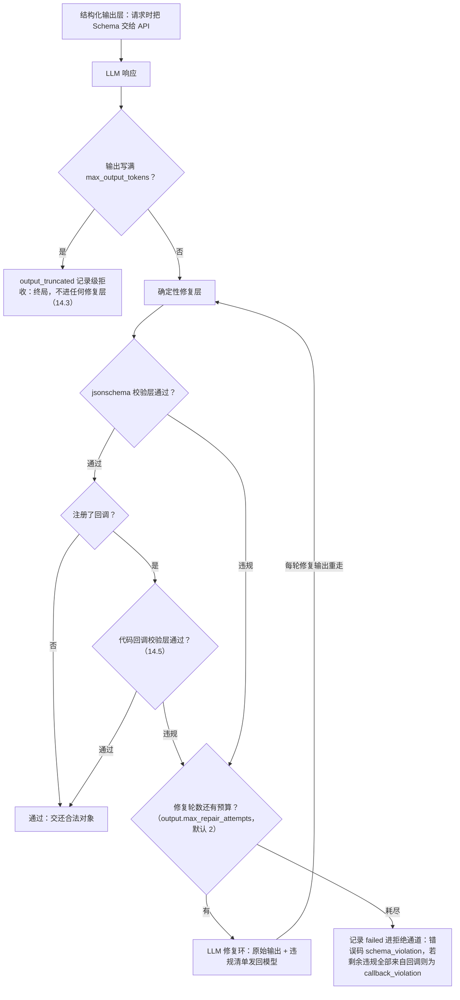

# 第 14 章　结构引擎：四层防线与 Schema 编写指南

> 结构引擎（schema engine）不是一个可开关的算子，而是所有 LLM 输出的**总验收台**——
> 标注、打分裁决、评审结论、生成样本，统统要过它的手。
> 本章讲四层防线如何兜住不守规矩的模型输出，以及怎样写一份「模型容易答对」的 JSON Schema。

## 14.1 直觉：不可信输出的层层安检

第 1 章立过铁律：**LLM 的输出不可信**。它可能——

```
```json                        ← 套了 Markdown 围栏
{
  "intent": "writing",         ← 枚举值答错（应为 writing_assist）
  "topic": "请假条写作",
  "difficulty": "easy",        ← 多了个尾逗号
}
```
```

结构引擎的职责：无论模型输出多不像话，**要么**交还一个通过你 Schema 校验的对象，**要么**明确宣告失败（该记录进拒绝通道）——绝无第三种结局。主输出里每一行都必然走过校验通过的分支，这是机制而非概率。

四层防线，从便宜到贵：

| 层 | 名字 | 干什么 | 成本 |
|---|---|---|---|
| **L0** | 结构化输出层 | 供应商原生结构化输出：请求时就把 Schema 塞给 API，让模型「戴着镣铐生成」 | 零（一个请求参数） |
| **L1** | 确定性修复层 | 纯代码修文本：剥围栏 → 取花括号平衡子串 → `json_repair` 修尾逗号/单引号（v1.11 起输出写满上限的截断响应**不进任何修复层**，见 14.3） | 零 |
| **L2** | jsonschema 校验层 | `Draft 2020-12` 全量校验，收集**全部**违规（不是只报第一条） | 零 |
| **L2.5** | 代码回调校验层（可选） | 你注册的 Python 函数对已过 Schema 的对象做**业务级硬校验**（跨字段、外部词表、坐标合法性……），违规意见与 Schema 违规同路进 LLM 修复环 | 零（跑你的代码） |
| **L3** | LLM 修复环（有界） | 把原始输出 + 违规清单发回给模型：「只输出修正后的 JSON」 | 每轮一次调用 |

流转规则如图。结构化输出层只是让确定性修复层与 LLM 修复环少触发的优化——**它不豁免 jsonschema 校验层**（各家供应商的 Schema 特性覆盖都有缺口，校验永远执行）：



v1.11 补两条边界规则：

- **截断响应不进这套循环**——输出写满 `max_output_tokens` 的响应（`finish_reason=length` / `stop_reason=max_tokens`）被终局化为 `output_truncated` 记录级拒收，从确定性修复层到 LLM 修复环都不再碰它（14.3）；
- **修复调用自己也受上下文预算约束**——所引 profile 声明了 `context_window`（第 6 章）时，某轮修复请求本身超预算则该轮记失败并**短路至预算耗尽**（修复提示词恒定，余轮必然同败；`[原始输出]` 修复原文永不截断——截断即破坏修复语义），拒收归因维持 `schema_violation` / `callback_violation` 不变。

## 14.2 一次真实的抢救过程

上面那段三重问题的输出，引擎是这么救的：

1. **确定性修复层**：剥掉 ` ```json ` 围栏 → 取平衡花括号子串 → `json_repair` 修掉尾逗号。得到可解析对象——注意 `"intent": "writing"` 的枚举错误这一层管不了（它只管「能不能解析」，不看 Schema）；
2. **jsonschema 校验层**：校验发现 1 条违规：`/intent: expected one of enum ["writing_assist", "qa", "translation", "chitchat", "other"], got "writing"` ⇒ 进 LLM 修复环；
3. **LLM 修复环第 1 轮**：向 `repair_llm`（默认同调用方 profile）发一条修复消息（[违规清单] 就是 jsonschema 校验层渲染出的违规原文，只加序号、不改写）：

   ```
   [原始输出]
   （原文全文照贴）

   [违规清单]
   1. /intent: expected one of enum ["writing_assist", "qa", "translation", "chitchat", "other"], got "writing"

   只输出修正后的 JSON。
   ```

4. 修复响应 `{"intent": "writing_assist", ...}` 重走确定性修复层与 jsonschema 校验层 ⇒ 通过。记录的 `_meta.annotation.attempts = 2`（1 次原始 + 1 次修复），报告里 `resolved_at.l3_1` 计 1。

## 14.3 读懂修复分布：resolved_at

报告的 `schema_engine.resolved_at` 是模型「结构纪律」的体检单（仅统计**用户 Schema** 的标注调用——含 v1.13 走按序列类 Schema 的调用；裁决/评审/生成等内部结构不计入，v1.12 走独立帧 Schema 的帧级标注同样不计入——三者的分界见 14.5 末尾那张表）：

```json
"schema_engine": {"resolved_at": {"l0_or_clean": 4141, "l1": 87, "l3_1": 30, "l3_2": 3, "rejected": 9}}
```

| 桶 | 含义 | 健康线 |
|---|---|---|
| `l0_or_clean` | 一次到位（原生结构化输出或本来就干净） | 绝大多数 |
| `l1` | 代码修复就够了（围栏/尾逗号级别的小毛病） | 几个百分点很正常 |
| `l3_1` / `l3_2` | 花了 1/2 轮 LLM 修复 | 合计 >5% 该警惕：Schema 对模型不友好 |
| `rejected` | 修不好，进拒绝通道 | 接近 0 |

`l3_*` 高企的第一反应**不是**调大 `max_repair_attempts`（那是花钱掩盖问题），而是先问两个问题：Schema 能简化吗（见 14.4）？profile 能开 `supports_structured_output` 吗？另注意 `max_output_tokens` 太小的症状在 v1.11 变了位置：输出写满上限的截断响应**不再进任何修复层**（把截断 JSON「硬修」成结构合法的对象，可能带着语义残缺混进主输出——这是数据质量隐患，终局化是正确性修复、不设开关），而是按 `output_truncated` 记录级拒收——它体现在 rejects 而不是 `resolved_at`，看到该码批量出现就调大 `max_output_tokens`（第 17、18 章）。

## 14.4 Schema 编写指南：让模型容易答对

你的 Schema 会**逐字出现在提示词里**（第 11 章），它同时是「合同」和「说明书」。写得好，记录在结构化输出层或确定性修复层就一次到位；写得差，每条记录都在 LLM 修复环烧钱。

**枚举值取自解释的名字。**模型看得懂 `writing_assist`，看不懂 `type_3`。枚举本身就是最强的提示。

**给字段写 `description`。**它出现在提示词里，等于给每个字段配了内联判据：

```json
"difficulty": {
  "type": "string", "enum": ["easy", "medium", "hard"],
  "description": "以通用大模型完成该请求的难度衡量：easy 一步可答；medium 需多步推理；hard 需专业知识"
}
```

**`required` + `additionalProperties: false` 是标配。**前者防漏字段，后者防模型自作主张加字段——两者都让错误在 jsonschema 校验层被精确定位，而不是静默混进输出。

**结构越平越稳。**三层嵌套 + 数组套对象的 Schema，LLM 修复环触发率显著高于平铺结构。问自己：这层嵌套是下游真需要，还是顺手画的？能拆成两个顶层字段就别嵌套。

**约束要「模型可感知」。**`maxLength: 200` 这类数值约束，模型经常越界（它不数字数）——要么放宽，要么在 instruction 里用自然语言强调「一句话、50 字以内」。`pattern` 正则约束同理，慎用。

**需要推理的任务，给个 reasoning 字段。**严格格式约束可能压缩模型的思考空间（"Let Me Speak Freely?" 的实测结论）。缓解：在 Schema 里加一个 `reasoning` 字段**放在结论字段之前**，让模型先说理再作答，下游忽略该字段即可。（LabelKit 自己的内部 Schema 大多也这么设计：评审结论的 critiques 在 verdict 之前、pointwise 评分的 reason 在 score 之前；例外是成对裁决——其 reason 仅在 `quality.judgment_reasons` 生效时才有，且位于 winner 之后。）

**版本纪律。**Schema 必须是合法 draft 2020-12、顶层 object、不声明 `_meta`。启动时元校验，写错退出码 2，不会浪费一次调用。

## 14.5 代码回调校验层：把你的业务规则接进防线

JSON Schema 说不清的约束——跨字段关系（`bounds` 必须 l<r、t<b）、外部一致性（label 必须在动态词表里）、业务规则（日期真实存在）——可以注册一个 **Python 回调**来把关：

```toml
[output]
validator = "my_validators:check_annotation"   # "module:function"，importlib 加载
```

```python
# my_validators.py —— 放在 PYTHONPATH 可达的位置
def check_annotation(obj: dict, record: dict | None) -> list[str]:
    """返回违规描述列表，空列表 = 通过。
    obj    = 已通过 Schema 校验的标注对象（防御性副本，改了不影响流水线）；
    record = 该记录的原始行对象（文本/生成记录），UI 记录为 None。"""
    problems = []
    if obj["difficulty"] == "hard" and len(obj["topic"]) < 4:
        problems.append("hard 难度的 topic 不应如此空泛，请给出具体主题")
    if record is not None and obj["topic"] == record.get("instruction"):
        problems.append("topic 不得整句复述原文，请压缩为名词短语")
    return problems
```

工作机制的关键在于：**回调不只是门卫，还是 LLM 修复环的教练**。它返回的违规文本会以 `(validator) 你的消息` 的形式并入 LLM 修复环提示词的违规清单——LLM 拿着你的意见自我修正，所以违规消息要写成「给模型看的改进指示」（说清楚错在哪、该怎么改），而不是只给人看的错误码。

规则速览：

- 只作用于**用户 Schema 的标注调用**（quality/verify/generate 的内部结构不经过它）；
- 与 Schema 违规**共享** `max_repair_attempts` 预算；预算耗尽且剩余违规全部来自回调 ⇒ 记录 `failed`、错误码 `callback_violation`（第 18 章）；
- **启动即体检**：M1 校验引用格式、可导入、可调用，并把每条 few-shot 示例的 output 干跑一遍——示例过不了你自己的回调，是配置错误（退出码 2），不会浪费一次调用；
- **回调抛异常不吞**：该记录按 `internal_error` 失败，运行继续（记录级隔离）；
- 回调以运行者同权限执行任意代码——信任边界与你亲手写的配置文件一致；建议保持纯函数（幂等、无 IO 副作用），它会被每条记录、每轮修复调用；
- 回调模块须位于**可导入路径**——LabelKit 不会隐式把工程目录塞进 `sys.path`。最省事的做法：把 `my_validators.py` 放在工程目录并在运行前 `export PYTHONPATH=.`（或做成已安装的包）。

生成侧有一个孪生钩子 `generate.sample_validator`（签名 `fn(text) -> list[str]`），语义是**过滤器**而非 LLM 修复环：违规样本直接剔除、计入桶统计，详见第 12 章。

### 三种用户 Schema，三种待遇

到 v1.13 为止，「你声明的 Schema」有三份，各自的待遇不同——这张表是它们的分界线：

| Schema | 声明在哪 | 管什么 | 四层防线 | 代码回调校验层 | 计入 `resolved_at` | 失败去哪 |
|---|---|---|---|:-:|:-:|---|
| 全局输出 Schema | `[output].schema_path` / `schema_inline` | 主输出每一行的标注对象 | 全在 | ✓ | ✓ | rejects（`schema_violation` / `callback_violation`） |
| **按序列类输出 Schema**（v1.13） | `[class.<类名>.annotate].schema_path` / `schema_inline`（至多其一） | **该类**的行；未声明的类回落全局 | 全在 | ✓ | ✓ | 同上 |
| 帧级 Schema（v1.12） | `[frame.annotate].schema_path` / `schema_inline` | `_meta.stream.members[]` 里的帧标注对象 | 全在 | ✗ | ✗ | members[] 的 `status="failed"`，**不入 rejects** |

**按类 Schema 与全局 Schema 待遇完全相同**（v1.13 特意如此：显式换一份 Schema 不该顺带丢掉回调校验与账目）——回调照常执行、`resolved_at` 照常计数，第 8 章那条「`resolved_at` 加总 = 进入标注算子的记录级标注调用数」的恒等式因此不变。它多出来的只有启动期的两条校验：每份类 Schema 各自过 draft 2020-12 元校验与 `_meta` 禁令，且**该类的 few-shot 示例用该类的 Schema 干跑**（v1.13 修掉了旧版「类示例统一过全局 Schema」的错配）。落盘前 emitter 还会按**该行类的有效 Schema** 再纯校验一次。用法与真实对照见第 27 章 27.6。

帧级 Schema 是那个特例（v1.12，第 25 章 25.6）：它与 `output.schema` 互相独立（各自元校验、各自的 few-shot 各自干跑、互不引用），但调用**不经过代码回调校验层**（`output.validator` 只管主输出行的标注对象），也不计入 `resolved_at`（14.3）。结构化输出层、确定性修复层、jsonschema 校验层与 LLM 修复环四层照常全在；修复穷尽的成员落 members[] 的 `failed` 状态位而非 rejects（第 11、25 章），emitter 落盘前同样有一次纯校验兜底——非法帧对象永不落盘。

## 14.6 配置参考

```toml
[output]
schema_path = "./schema.json"     # 与 schema_inline 恰好二选一
# schema_inline = """{...}"""
max_repair_attempts = 2           # LLM 修复环轮数预算（代码回调校验层违规同样消耗此预算）
# repair_llm = "fixer"           # 省略此键 = 同调用方；可指定便宜小模型专职修 JSON
                                  # （注意：显式写空字符串会报配置错误，退出码 2）
# validator = "mod:fn"           # 可选：代码回调校验层（见 14.5；同样禁止空字符串）
```

`repair_llm` 的使用时机：主力模型很贵、而 `l3_*` 又降不下来时，把修复外包给小模型——修 JSON 不需要智力，需要的是服从。注意小模型也要能把你的 Schema 看明白，太复杂的 Schema 外包修复反而修不动。

## 14.7 内部结构也走同一个引擎

一个容易忽略的事实：不只你的标注 Schema，**LabelKit 自己的内部输出**——质量裁决 `{"judgments": [...]}`、pointwise 评分、评审结论 `{"critiques": [...], "verdict"}`、生成样本 `{"samples": [...]}`、分类结果 `{"class": ...}` / multi 模式的 `{"classes": [...]}`（v1.7），以及 v1.8/v1.9 stream 一族的四个：分段的**窗口关系表** `{"frames": [{index, relation}]}`（逐帧关系用封闭五词表枚举锁死，LLM 答不出词表外的边界判断）、摘取的**动作对象** `{"action_type", "target", "value", "description"}`（动作类型用 11 值词表锁死，target/value 是可空联合）、序列评审的**缺陷表** `{"critiques", "defects", "verdict"}`（缺陷种类用六值枚举锁死——v1.9 起含 `wrong_stitch`，意见与缺陷在前、结论在后）、缝合的**判定对象** `{"verdict", "thread_ref", "task_name", "reason", "confidence"}`（v1.9：resume/new 二值 verdict 加可空线索编号，编号越界由代码侧收窄为保守的 new），v1.12 帧分类的**帧标签数组** `{"labels": [<帧类枚举>, …]}`（enum 锁死帧类词表、条目数锁死为窗口成员数，缺项由代码侧落兜底帧类），以及 v1.13 时间流生成的两个（第 27 章）：蓝图的**步骤表** `{"steps": [{frame_class, brief}]}`（帧类 enum 锁死、条目数锁死为抽定的序列长度 L；v1.14 开了帧类构成档位后 enum 只列**档内**的类，再加一组 `allOf` + 逐类 `contains` 把「档内每类至少一次」也锁死——合起来即构成恰等）与帧实现的**逐位帧数组** `{"frames": [...]}`（用 draft 2020-12 的 `prefixItems` 给第 i 帧套上第 i 个帧类的 Schema、长度锁死为 L；v1.14 绑定了时间字段的帧类，其逐位 Schema 是**剔除绑定字段后**的那一份——注定被机械回填覆写的字段不该让模型花 token 去猜，也不该进修复环）——全部经由同一个 `complete_validated()` 入口、同一套四层防线。所以：

- 裁决输出偶尔非法不会炸：修不好按平局计（`judgment_invalid`，对 Bradley-Terry 中性），计入 `report.quality.judgment_failures`；
- 内部修复调用同样计入 token 计量与 `llm.call` trace 事件——账一分不少；
- 分类结果的内部 Schema（v1.7）用 enum 封闭集锁死类名词表——标签不可能落在你的类别表之外；multi 模式刻意**不写** `uniqueItems`（部分供应商的结构化输出实现会硬拒该关键字），重复标签由 classify 算子在校验通过后做确定性去重归一化；
- 帧实现的 `prefixItems`（v1.13）是 draft 2020-12 的正规关键字、jsonschema 校验层原生支持，但个别对结构化输出关键字挑剔的路由可能对含它的请求直接 400——处置是配置级的：把该 profile 的 `supports_structured_output` 声明为 `false`，让这类调用走「文本 + 确定性修复层解析」的路径（`examples/synth-stream` 的 DeepSeek 端点就是这么配的，第 27 章 27.5）。
- **v1.14 的档位覆盖约束走同一条路**（第 27 章 27.4）：声明了帧类构成档位后，蓝图的内部 Schema 多一组 `allOf` + 逐类 `contains`，用来硬保证「档内每个帧类至少出现一次」。三句实操结论。① **L0 关掉的端点上，覆盖靠提示词 + 修复环**：结构化输出层不上行时，服从性由蓝图提示词里那句「[帧类表] 中每个帧类都至少出现一次」承担，违约由校验层逮住后进修复环——修复提示会**点名缺了哪个帧类**（形如 `steps: missing required frame_class "confirmation"`，不是一坨裸数组），所以修复轮有指导性；与 `prefixItems` 是同一套纪律。② **strict 路由拒收的形态是快速失败，不是逐序列作废**：对 `allOf` / `contains` 挑剔的网关会让**第一个蓝图调用就吃 HTTP 400**，而这类错误计入熔断连击——连续 400 会以退出码 4 收场，而不是安静地把序列一条条作废（看到「刚开跑就 4」先怀疑这里）。③ **处置同款且只有一处**：把该 profile 的 `supports_structured_output` 声明为 `false`；`openai_compatible` 的 strict 结构化输出网关在文档里就明载不支持 `allOf` / `contains`，遇上照此处置，不需要动任何调用级参数、也不需要改档位表。

这就是「LLM 输出不可信」原则的完整落地：**没有任何一条 LLM 文本能绕过校验进入任何下游**。
