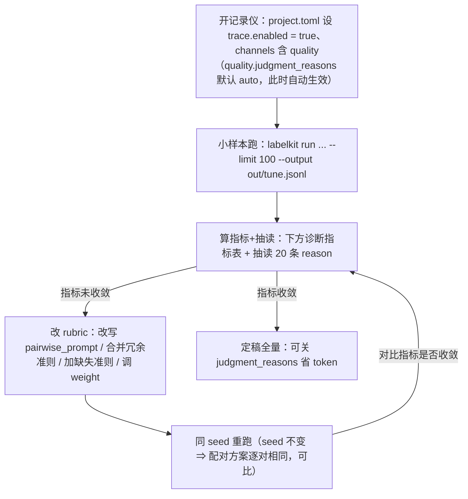

# 第 16 章　可观测性：日志、trace 与 rubric 调优闭环

> 本章回答两个问题：**运行时发生了什么**（日志与事件），以及**如何把"发生了什么"变成"下次跑得更好"**——
> 后者的核心是用 trace 驱动 rubric 迭代的闭环，这是把 LabelKit 用出高水平的分水岭。

## 16.1 三个输出面，各司其职

| 面 | 开关 | 内容 | 给谁看 |
|---|---|---|---|
| **stderr 运行日志** | 恒开（级别可调） | 只有运维事件：生命周期、警告、错误、调用摘要，v1.11 增启动期预算参数 INFO 行（16.4）。**绝不含数据内容与提示词** | 人排障；日志采集系统 |
| **trace 事件流** | `trace.enabled`（默认关） | 结构化事件 JSONL，一行一事件：每次去重判定、每次质量裁决及理由、每轮评审结论、每次结构修复 | rubric 调优；质量审计 |
| **进度显示（console）** | 恒开，三档 `--console auto/rich/plain`（v1.10，16.6） | rich = 双区实时面板：批进度、流水线段棋盘、各状态计数、LLM 用量/密钥池/熔断；plain = 现行批级进度行（非 TTY 无进度输出，可看 `batch.end` 的 INFO 日志行）；auto 按终端环境自动选档 | 坐在终端前的你。**不属于日志**——不经日志设施、不产生 trace 事件（16.6） |

心法：**stderr 告诉你「跑得顺不顺」，trace 告诉你「判得对不对」。**

## 16.2 trace 事件速查

每行恒有七个字段：`ts / run_id / batch_no / stage / ev / record_ids / payload`。事件名前缀即通道名（`trace.channels` 过滤的就是它），两个例外：`run.*`、`batch.*` 生命周期事件不受过滤恒写；`error` 事件无前缀，按产生它的 stage 归属通道——订阅某 stage 的通道（如 `"quality"`）即可同时收到该 stage 的 error 事件。

| 事件 | 何时发出 | payload 里最有用的东西 |
|---|---|---|
| `run.start` / `run.end` | 首行 / 末行 | 配置指纹；终版 counts 与 exit_code |
| `batch.start` / `batch.end` | 每批 | 各状态计数、耗时 |
| `ingest.bad_line` / `missing_pair` / `index_conflict` | 接入跳过时 | 文件、行号/index、原因 |
| `ingest.disorder` | 流式单调性校验拒绝一条记录时（乱序或时间戳解析失败，v1.8 流模式）；skip 策略下每记录一事件、stderr 全运行只 WARN 一次 | 文件、行号（文本）/ index（UI）、原因（乱序 \| 时间戳解析失败） |
| `segment.session` | 会话装配器闭合一个候选会话时（v1.8）。仅 trace、无 stderr 镜像；通道为 `"segment"`（发出方是接入层，但按事件名前缀归 segment 通道），不在默认订阅里 | session_id、首末帧、长度、断开原因（gap / key / max_len / max_span / eof / limit） |
| `segment.boundary` | 每个滑窗边界裁决经校验通过后（v1.8）。仅 trace、无 stderr 镜像；通道 `"segment"` | session_id、窗口区间、成员 id、逐帧关系判决（封闭五词表）；**reason** 仅当订阅了 segment 通道时才请求并携带（零额外 token 原则，同 classify） |
| `stitch.judge` | 每个缝合候选判定定案后（一遍与二遍都发；votes 分裂回落保守结局时也发，v1.9）。仅 trace、无 stderr 镜像；通道 `"stitch"` | session_id、candidate（episode/rescue 候选两型）、repass（false=一遍/true=二遍）、verdict、thread_ref、priors（机械先验命中腿 ⊆ {app_overlap, entity_overlap, same_page}）、merged（是否实际并入——LLM 判 resume 而先验未过时 verdict 与 merged 分离）、confidence（仅观测不进门槛）；task_name / reason 自 `refs` 档起携带；votes 分裂时另带 votes_split=true |
| `stitch.thread` | 会话缝合定案后每条幸存线索一条（v1.9）。仅 trace、无 stderr 镜像；通道 `"stitch"` | session_id、thread_id、task_name、fragments 碎片跨度表（与 `_meta.stream.fragments` 同构）、seam_indexes 接缝位置 |
| `dedup.duplicate` | 每次判重（判为 unique 不发事件） | kind、簇键、kept_id；近似重复另带**恰一项实测相似度**（文本 jaccard / 图像 hamming / 语义 cosine），exact 精确重复无相似度字段 |
| `classify.decision` | 每条记录分类定案时（v1.7）。仅 trace、无 stderr 镜像；通道为 `"classify"`——独立通道值（通道全集 v1.8 起共十个、v1.9 增 `"stitch"` 后共**十一**个），不在默认订阅里，要看它须在 `trace.channels` 显式加入 | label（本信封的路由标签）、labels（multi 时的命中全集）、source（llm / fallback / inherited）；**reason** 仅当订阅了 classify 通道时才请求并携带（零额外 token 原则）；self-consistency 启用时另带 sc（n 与一致率） |
| `classify.frame` | 每个 episode 的帧级批量判决定案后（v1.12）。仅 trace、无 stderr 镜像；前缀自动归 `"classify"` 通道（通道枚举维持十一值，零新增） | record_ids = episode id；members / windows / fallback 三个计数——逐帧标签不进 payload，看主输出的 members[]（第 25 章 25.6） |
| `extract.step` | 每对相邻帧的动作摘取定案后（含 fallback 兜底步，v1.8）。仅 trace、无 stderr 镜像；通道 `"extract"` | episode_id、步序号、action_type；description 自 `refs` 档起携带；target / value 自 `excerpt` 档起（见下方分级细则） |
| `quality.judgment` | 每次成对裁决 | 呈现顺序、每准则 winner + **reason**（评审团时每评审一条，带 judge 字段） |
| `quality.pointwise` | 每次单点打分 | criterion、0–5 原始分、reason |
| `quality.bt_fit` | 每批每准则拟合完 | 是否收敛、迭代数、比较数 |
| `quality.gate` | 每条门控判定 | 聚合分、keep/drop、阈值或名次 |
| `annotate.done` | 每条标注成功 | attempts；self-consistency 的 n 与一致率 |
| `annotate.frame` | 每个成员帧的帧级标注定案后（annotated / skipped / failed 三种结局都发，v1.12）。仅 trace、无 stderr 镜像；归 `"annotate"` 通道 | record_ids = episode id；member_id、status、attempts（skipped 时为 0）；标注内容仅经既有 excerpt 键（自 `excerpt` 档起携带、200 字截断） |
| `verify.verdict` | 每轮评审 | verdict、round、critiques 全文 |
| `schema.repair` | 每次非清洁路径 | 在哪层解决（l1/l3_1/l3_2/rejected）、违规清单（JSON Pointer，不含数据值） |
| `llm.call` | 每次 API 调用 | profile、延迟、input/output token、重试数、状态（命名对齐 OpenTelemetry GenAI 约定）；语义去重的 embedding 调用另带 `operation="embedding"`（缺省即对话补全）；密钥池 >1 的 profile 另带 `key_env`（v1.6）——本调用**最后一次尝试**所用密钥的环境变量名，成功失败同义；零尝试即中止的调用（如入口即驻留超限、熔断中止）不带。v1.11 注：这行的 usage 同时是**图片成本校准器**的采样源——报表侧校准终值在 `report.budget.image_cost`（第 8 章），审计预算估算质量就拿 `input_tokens` 对照它 |
| `llm.key_cooldown` | 密钥进入 429 冷却时（v1.6；任意池大小含 1——单密钥的 429 等待亦走冷却路径）。仅 trace，不上 stderr | profile、`key_env`、`cooldown_s`（本次冷却秒数）、`retry_after`（bool，时长是否来自 `Retry-After` 头） |
| `llm.key_disabled` | 密钥 401/403 被本运行永久禁用时（v1.6；每密钥每运行至多一次）。同时发 stderr WARN 一次 | profile、`key_env`、`status_code` |
| `llm.pool_parked` | 某 profile 全部存活密钥均在冷却、调用开始驻留时（v1.6；每次驻留一事件）。同时发 stderr WARN | profile、`wait_s`（预计驻留秒数）、`live_keys`（存活密钥数） |
| `error` | 每次 StageError | stage、错误码 kind（第 18 章）、message、是否可重试 |

内容脱敏四档（`trace.content`）回顾：`none`（只有结构化字段）→ `refs`（+LLM 产出的理由文本，默认）→ `excerpt`（+输入内容前 200 字）→ `full`（+完整提示词与响应，需订阅 `llm` 通道；**等于存了一份数据副本，短期调试用完即清**）。v1.8 补一条分级细则：`extract.step` 的 `target` / `value` 是**输入数据派生**字段（目标控件文本、用户键入文本），归入专门的数据键剥除集——`none` 与 `refs` 档一律剥除、自 `excerpt` 档起才携带，守住 refs 档「不含任何输入数据内容」的红线；`description` 是 LLM 产出文本，与 reason / critiques 同级（`refs` 档起携带）。v1.9 再补一条：`stitch.judge` / `stitch.thread` 的 `task_name` 与 `reason` 同为 LLM 自由文本，进同一脱敏集（`none` 档剥除、`refs` 档起携带）；缝合 payload 的其余字段全是结构字段，各档保留。

一条与脱敏档位无关的恒定规则（v1.6）：`llm.key_*` / `llm.pool_*` 事件与 `llm.call` 的 `key_env` 字段里，密钥恒以**环境变量名**标识——密钥值本身在任何档位（含 `full`）都不写入 trace、运行日志与报告。

**v1.13 时间流生成：零新通道、零新事件、零新错误码。**第 27 章那个形态在上面这张表里**一行都不加**：蓝图与帧实现是普通的 LLM 调用，订阅 `llm` 通道就能在 `llm.call` 事件里看到它们的延迟、token 与重试（`full` 档还能看到提示词与响应全文——那是一份数据副本，用完即清）；序列作废、噪音批作废这类判决只走 stderr 的 WARN 与报告计数，不单开事件。通道枚举维持十一值，`error` 事件的错误码词表（第 18 章）零新增。它的账全在报告里——见下节末尾的两处新读数。

## 16.3 rubric 调优闭环：让准则跟着证据迭代

**为什么 rubric 不可能一次写对**：EvalGen（UIST 2024）的实验结论——评估准则存在 *criteria drift*，人往往要**看到裁决的具体输出**才知道自己真正想要什么准则。所以 LabelKit 把每一次裁决和理由都暴露出来（`quality.judgment` 事件），供你迭代。

标准闭环六步，环形推进、指标收敛即出环：



### 诊断指标表（「算指标+抽读」的量化部分）

| 信号 | 参考线 | 诊断 | 处置 |
|---|---|---|---|
| 某准则 tie 率（直接读 report.quality.per_criterion_tie_rate，或按下方 jq 从 trace 算） | > 0.4 | 准则区分度不足——问什么都答"差不多" | 把比较问句改具体（给出可判的判据）；或降该准则权重 |
| 同 seed 重跑翻转率 | > 0.3 | 准则表述含糊 / 模型不稳定 | 细化 description；确认 temperature=0；必要时换裁决模型 |
| 两准则胜负一致率 | > 0.9 | 准则冗余（换着说同一件事） | 合并为一条（权重相加）或删一条 |
| reason 高频出现 rubric 没写的维度 | — | 准则缺口（criteria drift 的正常表现） | 新增 criterion |
| judgment_failures 率 | > 0.05 | 裁决提示词太长/太怪，模型输出结构崩 | 精简 rubric 文案；确认 profile 结构化输出能力 |

### 现成的 jq 计算

```bash
T=out/tune.trace.jsonl

# 某准则的 tie 率
jq -s '[.[] | select(.ev=="quality.judgment") | .payload.judgments[]
        | select(.criterion=="facts_trivia")]
       | (map(select(.winner=="tie")) | length) / length' $T
# → 0.4375  高于 0.4：这条准则对你的数据没有区分度

# 两条准则的胜负一致率（冗余检测）
jq -s '[.[] | select(.ev=="quality.judgment").payload.judgments
        | {a: (.[] | select(.criterion=="writing_style").winner),
           b: (.[] | select(.criterion=="educational_value").winner)}]
       | (map(select(.a == .b)) | length) / length' $T

# 抽读某条被淘汰记录的全部裁决理由
jq -c 'select(.ev=="quality.judgment" and (.record_ids | index("6e60ce3c2d59f04d")))
       | .payload.judgments[] | {criterion, winner, reason}' $T
```

一个真实的 `quality.judgment` 事件（UI 工程，refs 档；classify 开启时 payload 另带 `pool`——这场比较发生在哪个类池）感受一下 reason 的信息量：

```json
{"ev": "quality.judgment", "record_ids": ["194a2dd2…", "f8fc254f…"],
 "payload": {"order": {"A": "f8fc254f…", "B": "194a2dd2…"}, "model": "glm-5.2",
   "judgments": [
     {"criterion": "tree_screen_consistency", "winner": "tie",
      "reason": "两组的UI控件树节点文本与截图内容均能对应吻合，没有明显不一致之处。"},
     {"criterion": "interaction_richness", "winner": "B",
      "reason": "记录B包含轮播图、推荐卡片、换一批按钮等多种交互元素，信息量和交互丰富度明显高于记录A的纯文本设置列表。"}],
   "pool": "browse"}}
```

这两句理由就是 rubric 工作状态的直接证据：判据被理解了、比较是逐维度独立的。当 reason 开始反复提到某个你没写进 rubric 的维度（比如「B 的隐私信息未打码」），那就是加新准则的信号。

## 16.4 运行日志与调用级观测

`--log-level debug` 后，stderr 会多出每次 LLM 调用的摘要行；`tool.log_format = "jsonl"` 让经日志模块输出的运行日志每行都是可解析的 JSON（console 强制 plain 档，显式 rich 不可覆盖，16.6）。注意仍有少量不经日志模块的纯文本 stderr 输出——结束时的三行终版摘要、配置装载期的 `warning:` 行、`--dry-run` 的估算行——采集侧需容忍或过滤非 JSON 行：

```
# text 格式（默认）
2026-07-03T01:19:03+08:00 INFO  run  batch=1 batch.end active=8 dropped_dup=1 dropped_lowq=5 ... duration_ms=87434

# jsonl 格式（采集系统用）
{"ts":"2026-07-03T01:19:03+08:00","level":"info","stage":"run","batch":1,"msg":"batch.end active=8 ..."}
```

### 启动期预算 INFO 行（v1.11）

本次运行引用的 profile 里只要有一个声明了 `context_window`（第 6 章），`run.start` 之后就多一行**预算参数 INFO**：逐 profile 给出「声明窗/输入预算」；stream 工程（segment 启用且所引 profile 声明了窗）再多一行 segment 的静态最坏装填量。真实两行（examples/stream 工程）：

```
2026-07-23T04:46:24+08:00 INFO  run     batch=0 budget: default=131072/113868 judge=131072/115916
2026-07-23T04:46:24+08:00 INFO  run     batch=0 segment: w_min=46 window=16 (budget)
```

读法：`113868` = 声明窗 131072 扣掉输出预留（该 profile 的 `max_output_tokens`）与 10% 安全边距后**真正拿来装输入**的预算（judge profile 输出预留小，可用输入反而更多）；`w_min=46` 是按最坏单帧成本（满长摘要 + diff 常数 + 每图先验）算出的单窗保底装填量——它 ≥ 窗上限 `window=16` 时装填顶格、行为与定长窗一致，它 < window 时实际窗会变小变多（对账细则见第 25 章成本账）。两行都是数据无关的参数与计数。**报告侧的对应读数是 `report.budget`**（profiles / w_min / truncations / overflow_records / image_cost / degrade_retries / escalations——第 8 章逐键解读），预算相关的记录级失败则以 `context_overflow` / `output_truncated` 两个新错误码落 rejects（第 18 章）。

想要完整的调用审计（每次请求的 token、延迟、重试、状态），订阅 trace 的 `llm` 通道即可——`llm.call` 事件字段命名对齐 OpenTelemetry GenAI 语义约定（`gen_ai.usage.input_tokens` 等），现成的 OTel 生态分析工具可以直接吃。

### 时间流生成的两处报告读数（v1.13，v1.14 增档位子块）

这个形态（第 27 章）不加事件——v1.14 的两个增量同样零新通道、零新事件、零新错误码——观测面全部落在 `report.json` 的两处按需字段上：

- **`run.artifact`**：时间流工件的摘要三件套 `{path, sha256, lines}`（主输出同款形态），仅工件实际写出时在场（`--dry-run` 不写工件，自然也没有它）。`lines` 是逐帧账的总闸——拿它与下面的帧数交叉验证；
- **`generate.stream`**：`{sessions, crossed_sessions, sequences: {<类>: {planned, produced}}, frames, noise_frames, duplicates, plan_calls, realize_calls, noise_calls, plan_failures, realize_failures, validator_scrapped}`，counts-only。日常盯三个比值：`produced / planned`（作废率——三项 failures 与序列相似度过滤的合力）、`crossed_sessions`（交叉演示位还在不在，它 = Σ幸存 − sessions）、`noise_frames / frames`（掺噪比是否如你所愿）。声明了帧类构成档位（`[[generate.stream.tiers]]`，v1.14）时，这里**多一个 `tiers` 子块**——键位在 `sequences` 之后、`frames` 之前，形状 `{"<tier_rank>": {planned, produced}}`（十进制字符串键、按 tier_rank 升序；零配额档与全军作废档也在场，如实报 0）。它是同一笔配额的按档切法，与 `sequences` 的按类切法互为对照：`planned` 两边合计相等，作废时看缺口压在哪一档（第 27 章 27.4）。档位表缺省时该键整块不在场；时间字段回填（v1.14 的另一半）**零观测增量**——机械算术没有可计数的失败模式。

同一份报告里还有两处「反直觉但正确」的读数：`classify` 的逐类计数**恒全零**（标签生成期已知、继承，零判决调用），`stream` 节**不出现**（那是分段算子的观测面）。逐键解读与真跑数字见第 8 章 8.4 与第 27 章 27.7。

### 密钥池的分密钥视角（v1.6）

profile 配置了密钥池（`api_key_envs`，第 6 章）后，调用级观测多出一层**分密钥**读数：

- **trace 侧**：三个 `llm.key_*` / `llm.pool_*` 事件（16.2 表）回答限流落在哪把密钥、有没有密钥被 401/403 禁用、全池冷却导致的驻留发生了几次多久（驻留上限 `run.max_park_s`，第 7 章）；`llm.call` 的 `key_env` 字段则把每次调用归到具体密钥。
- **报告侧**：`report.json` 的 `llm_usage.<profile>` 增列 `keys`（仅密钥池 >1 时出现）——按环境变量名分密钥给出 `calls` / `rate_limited` / `disabled`，一眼看出流量与限流是否集中在某把密钥、有没有密钥中途被禁；另有驻留统计 `parked_calls` / `parked_ms`（池 >1 或数值非零时出现——单密钥配置发生过驻留同样留痕）。

诊断口诀：某密钥 `rate_limited` 独高 ⇒ 该密钥配额偏小，限流被轮换吸收、不必动手；`disabled: 1` ⇒ 该密钥凭据坏了，查对应环境变量；`parked_ms` 持续非零 ⇒ 整池都在限流里打转，加密钥或降 `max_concurrency`（第 17 章）。

## 16.5 日志的可靠性契约

- **日志写失败绝不中断运行**：trace 文件不可写时 warn 一次、关闭通道、继续跑，丢弃的事件数计入 `report.trace.dropped_events`（trace 文件落点见 `report.trace.path`）；
- trace 首行恒为 `run.start`（携带 `trace_schema_version: 1`），末行恒为 `run.end`——两行俱在即文件完整；
- 事件目录是稳定契约：后续版本**只增不改**（新增事件或字段，不改既有字段语义），你写的 jq/分析脚本不会被升级弄坏；
- trace 文件默认路径随输出走，在**首个事件写出时**截断：死于配置/输入校验的运行与 dry-run（写 `{名}.dryrun{后缀}` 独立文件）都不会再动它；但正常启动的重跑仍会覆盖——归档要趁早。

## 16.6 Console 实时面板（v1.10）

16.1 表里的第三个输出面在 v1.10 从单行进度条升级为三档 **console**。先说定位：进度显示**不属于日志**——直接写 stderr 而不经日志模块、无级别概念、不产生任何 trace 事件，report.json 也零新键；它只是运行账目的实时预览，关掉或渲染失败都不影响任何产出。

### 三档与判定链

三档 `auto` / `rich` / `plain`，来源优先级 CLI `--console` > config.toml `[console].mode`（第 6 章）> 内置默认 `auto`。auto 的判定链是四项合取：

```
auto → rich 当且仅当：stderr 是 TTY ∧ tool.log_format = "text"
                    ∧ TERM 非 "dumb"/空 ∧ rich 库可导入
其余一律 plain。
```

判定链的四个细节：

- **NO_COLOR 不降档**：设置 `NO_COLOR` 环境变量得到的是**无色的 rich 面板**——rich 原生剥掉颜色、保留布局与重绘，不会退到 plain；`TERM` 为 dumb 或空才降 plain（终端没有光标控制能力，这是终端能力探测，与 TTY 判定同级）；
- **显式 rich 尊重显式档**：`--console rich` 在非 TTY 下也照样渲染（CI 录 ANSI 回放的场景）；
- **jsonl 铁律**：`tool.log_format = "jsonl"` 强制 plain，**显式 rich（CLI 或 config）都不能覆盖**——「stderr 运行日志逐行可 `json.loads`」的承诺优先，显式冲突时启动 WARN 一次；
- 判定结果在启动校验收尾时冻结为解析产物 `mode_resolved`（rich/plain 二值），这是内部字段，用户永远不写它。

plain 档就是 16.1 表描述的现行行为，与 v1.9 输出等价（`heartbeat_s = 0` 默认下）——它是三档中的回归锚，日志采集、既有脚本零迁移。

### rich 档：双区面板与六个区块

rich 档下终端分两区：**上方日志照常滚动**（行文本与 plain 档逐字节一致，scrollback 完整保留），**底部画布原地重绘**（按 `console.refresh_hz` 节流，默认每秒 5 次）；**永不进入全屏 alternate screen**。运行结束时画布最后一次重绘后**定格**为静态终版面板（counts 表、各阶段耗时横条、llm_usage 小表与 rejects/trace 路径行），滚动区里留着完整日志——终版面板可以直接截屏贴工单。画布六个区块：

| 区块 | 显示什么 | 数据从哪来 |
|---|---|---|
| 标头 | run_id、模式/模态（stream/stitch 徽标）、seed、已用时长、ETA（仅批总数分母可得时显示，吞吐外推、标 `~`） | 启动时注入的运行上下文与 `run.start` 事件 |
| 批进度 | UI 模态恒为 `batch i/N` + 已扫描数（复用启动预扫描，零额外 I/O）；文本模态默认 `batch i` 无分母，`console.estimate = true` 换取分母与 ETA（第 6 章）；generate_only 相位内退化为 `generate ▶ calls i/N · produced n` | 批生命周期事件 + 启动估算 |
| 段棋盘 | 仅启用的算子按链序排开：`✓` 本批已过 / `▶` 进行中（附「已完成调用数 / 分母」，分母来自与 dry-run 同源的运行级估算、标**估算**；估算不可得时只显示分子）/ `·` 待走 | 阶段开始信号 + LLM 调用事件按在途阶段归集 |
| 状态账 | 各状态计数，与 report.counts 同口径；stream/stitch 的键（noise / absorbed / stitched / threads）仅对应算子启用时在场 | 每批批末的计数拉取 |
| LLM | 每 profile 一行：在途/并发上限、calls、重试、tokens ↑↓、成本（未配单价显示 `—`）、p50 延迟；密钥池行（环境变量名 + ok/冷却剩余秒/禁用）；熔断计数，触发时红色横幅 | LLM 客户端只读快照，每次重绘拉取一次 |
| 键位提示 / 中断横幅 | 键盘开关一览（下表；交互未启用时不显示）；Ctrl-C 后画布顶部显示 `graceful interrupt in progress (≤30s)…` 横幅 | 中断信号的进程内旁路 |

`validate --probe` 与 dry-run 在 rich 档下也有对应的表格呈现（数值与行式逐项一致，probe 表仅当 stdout 是 TTY 时渲染，15.2）；`rubric --show` 恒为行式——它的 stdout 是给机器消费的。

### 键盘开关

生效条件是四项合取：rich 档 ∧ stdin 是 TTY ∧ `console.interactive = true`（默认）∧ termios 可用（POSIX；Windows 一期纯渲染、无键盘）。任一不满足即纯渲染，键位提示行也不显示。键位是**封闭集**，未列出的键一律忽略：

| 键 | 行为 |
|---|---|
| `?` / `h` | 键位帮助展开/收起 |
| `l` | LLM 区块展开（每密钥一行）/收起 |
| `e` | 最近错误条开/关：最近 5 条 error 事件的 stage + 错误码（第 18 章封闭词表，无数据内容） |
| `+` / `-` | 画布行数上限增/减（4–16 行） |
| `p` | 暂停/恢复画布重绘（日志照常滚动，调试与复制粘贴友好） |
| `q` | 面板脱离：余下运行降级 plain（不终止运行、不影响退出码） |

**Ctrl-C 语义不变**：面板不消费 Ctrl-C（cbreak 模式保留 ISIG），SIGINT 仍走优雅中断（第 15 章），面板只负责显示中断横幅。交互启用时 stdin 被面板占用——粘贴的后续命令会被吞掉，介意就设 `console.interactive = false`（纯渲染，stdin 完全不被占用）。

### 降级与失败语义

渲染是旁路，永远伤不到运行：渲染期间任何异常都被自吞、打一次 WARN、当场降级 plain 续跑——**退出码与数据产出零影响**；`q` 键脱离同理。终端宽度 < 60 列时画布退化为现行单行 `\r` 形态。rich 库缺失或损坏时 auto 判定自动落 plain，显式 `--console rich` 也只是降级加一条 WARN——面板在任何故障下都不会成为运行失败的原因。

### plain 非 TTY 的可选心跳

无人值守长批在 CI 日志里「像死机」的缓解：`console.heartbeat_s > 0` 且 plain 档且非 TTY 时，每 N 秒直写 stderr 一行数据无关的固定键集心跳：

```
heartbeat batch=3 stage=quality llm_calls=182 elapsed=312s
```

默认 0（关）——保证 plain 档输出与 v1.9 的回归等价。

### 面板长什么样

examples/stream 工程（stream + stitch 全开，面板信息最全）真实运行的两帧（100 列伪终端捕获，剥除 ANSI 色彩后原样收录）。运行中的一帧——quality 阶段进行中，段棋盘的分母是与 dry-run 同源的**下界估算**（此帧分子 24 已越过下界 20，正是流模式估算「episodes ≈ sessions 报下界」语义的实景；段棋盘行超出 100 列自然折行）：

```
────────────────────────────────────────────────────────────────────────────────────────────────────
 labelkit run · 36c7fbe8beae · process/ui/stream+stitch · seed 42 · elapsed 04:35
 project project.toml → ./out/stream-labels.jsonl

 batch 1/1  ████████████████████████  records 53/53 (scanned)

 stages  segment ✓   stitch ✓   dedup ✓   classify ✓   extract ✓   quality ▶ 24/20   annotate ·   verify
·

 account  emitted 0   dup 0   lowq 0   verify 0   failed 0   noise 0   absorbed 0   stitched 0   threads
0

 LLM  default  in_flight 4/4  calls 89  retries 0  tok 74k↑ 7k↓  —  p50 6.1s
      judge    in_flight 0/4  calls 0  retries 0  tok 0↑ 0↓  —  p50 —
      breaker 0/20
 [?]help [l]LLM expand [e]errors [p]pause [q]detach
```

运行结束时定格的终版面板帧（留在 scrollback 里，可直接截屏贴工单；两帧均捕获自 v1.10 验收期的一次真实运行——那次 53 帧 → 12 episodes → 缝合 3 → 9 线索落盘。面板布局与键位自那以来未变；分段判决逐次运行会漂移，当前基线的账目数字以第 26 章为准）：

```
────────────────────────────────────────────────────────────────────────────────────────────────────
 labelkit run done · 36c7fbe8beae · process/ui/stream+stitch · elapsed 06:04
 counts (= report.counts)
┏━━━━━━━━━━━━━━━━┳━━━━━━━┓
┃ key            ┃ value ┃
┡━━━━━━━━━━━━━━━━╇━━━━━━━┩
│ scanned        │    53 │
│ ingested       │    53 │
│ bad_input      │     0 │
│ dropped_dup    │     0 │
│ dropped_lowq   │     0 │
│ dropped_verify │     0 │
│ failed         │     0 │
│ generated      │     0 │
│ emitted        │     9 │
│ episodes       │    12 │
│ absorbed       │    45 │
│ dropped_noise  │     8 │
│ stitched       │     3 │
│ threads        │     9 │
└────────────────┴───────┘
 stage time (approx: summed on_stage intervals, not report timings)
 segment   ████ 22.3s
 stitch    ████████████████████ 120.7s
 dedup     █ 0.0s
 classify  ████ 22.3s
 extract   █████████ 56.0s
 quality   ████████████████ 96.6s
 annotate  ████ 23.9s
 verify    ████ 22.4s
 llm_usage
┏━━━━━━━━━┳━━━━━━━┳━━━━━━━━━┳━━━━━━┳━━━━━━┳━━━━━━┳━━━━━━┓
┃ profile ┃ calls ┃ retries ┃ tok↑ ┃ tok↓ ┃ cost ┃  p50 ┃
┡━━━━━━━━━╇━━━━━━━╇━━━━━━━━━╇━━━━━━╇━━━━━━╇━━━━━━╇━━━━━━┩
│ default │   123 │       0 │ 103k │  14k │    — │ 6.1s │
│ judge   │     9 │       0 │  11k │   2k │    — │ 7.9s │
└─────────┴───────┴─────────┴──────┴──────┴──────┴──────┘
 rejects → out/stream-labels.rejects.jsonl
 trace → out/stream-labels.trace.jsonl
```

### 隐私红线

面板与心跳行遵守与 stderr 运行日志同级的信息纪律：只显示计数、枚举、profile 名与密钥的**环境变量名**——绝无数据内容、LLM 自由文本（理由、任务名、评审意见）与 record id，且这条纪律由转发层脱敏机制保证，不依赖渲染代码自觉。
