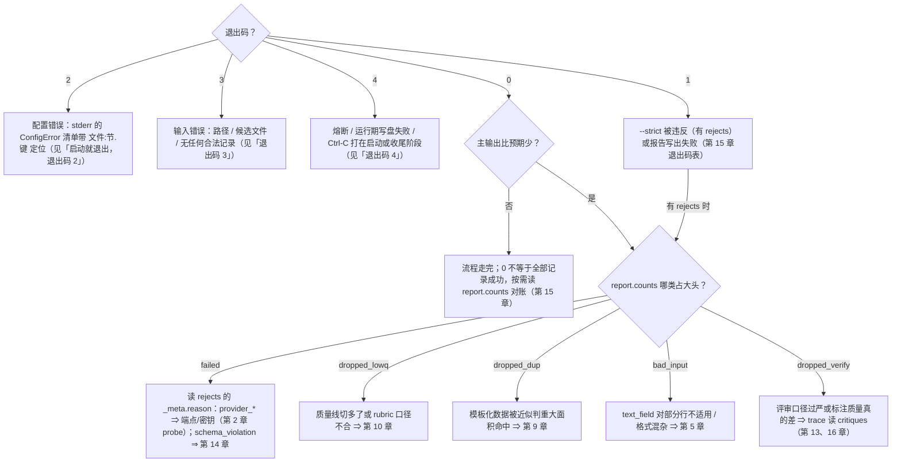

# 第 18 章　故障排查：错误码表与高频问题

> 出问题时按顺序查三处：**stderr 最后几行**（直接死因）→ **report.json 的 counts**（哪类记录出了问题）→
> **rejects 里的 `_meta.reason`** 或 **trace 的 error 事件**（每条记录的具体错误码）。
> 本章给出错误码全表和一份按症状组织的 FAQ。

## 18.1 记录级错误码（StageError.kind）

这些错误码出现在 trace `error` 事件 payload 的 `kind` 字段；在 rejects 行里，failed 记录的 `_meta.reason` 即首个错误的 kind（`_meta.errors` 数组只存人类可读的错误消息文本，不含码）。注意 ingest 的四类（`bad_input_line` / `missing_pair` / `index_conflict` / `image_too_large`）是分类口径：坏数据在成为记录之前就被跳过或触发退出码 3，**不进 rejects、也不产生 error 事件**，只体现为 trace 的 `ingest.*` 事件与 report 的 `bad_input` 计数：

| kind | 谁发出 | 含义与处置 |
|---|---|---|
| `bad_input_line` | ingest | 坏行（非 JSON object / text_field 未命中）。按 `input.on_bad_line` 跳过或退出码 3。集中出现 ⇒ 先查 `text_field` 拼写 |
| `missing_pair` | ingest | UI 单侧文件。按 `on_missing_pair` 处理 |
| `index_conflict` | ingest | UI 同编号多文件。默认退出码 3——回去整理目录（第 5 章） |
| `image_too_large` | ingest | 超过 `max_image_mb`，该记录跳过 |
| `image_decode_error` | dedup / annotate / verify | 图解码失败：dedup 跳过图像层按树判；标注/评审阶段遇到则该记录 failed |
| `segmentation_invalid` | segment | 单窗边界裁决修复耗尽（v1.8），两种形态：默认 `on_error="keep"` ⇒ 该会话**整体成一个 episode 存活**（不精化、不剔噪），留痕在 `_meta.stream.degraded`（含失败窗数）、trace segment 通道的 error 事件与 report 的 `stream.segment_failures`——不写记录 errors；`on_error="fail"` ⇒ 会话成员全部 failed 进 rejects。批量出现 ⇒ segment.llm 结构化输出能力不足或 window 过大 |
| `stitch_invalid` | stitch | 单次缝合判定修复耗尽（v1.9），候选两型处置不对称：默认 `on_error="keep"` ⇒ episode 候选**开新线索存活**（task_name 为空、摘要卡渲染「（未命名）」）、救援候选维持 dropped_noise——都不写记录 errors，留痕 = trace stitch 通道的 error 事件 + report 的 `stream.stitch.failures`；`on_error="fail"` ⇒ **仅 episode 候选信封** failed 进 rejects（成员帧维持 absorbed；救援候选不适用 fail，判定失败一律按未命中处理）。二遍复评的判定失败无论配置一律按 keep 等价处理。批量出现 ⇒ stitch.llm 结构化输出能力不足，第 26 章 |
| `classification_invalid` | classify | 分类输出修复耗尽（v1.7），两种形态：默认 `on_error="fallback"` ⇒ 归兜底类、记录**存活不进 rejects**（痕迹在 `_meta.classification.source="fallback"`、trace classify 通道的 error 事件与 report 的 `classify.fallback_count`）；`on_error="fail"` ⇒ 记录 failed 进 rejects。fallback_count 偏高 ⇒ 类别表描述区分度不足，第 24 章 |
| `extraction_invalid` | extract | 单个转移的动作摘取修复耗尽（v1.8），两种形态：默认 `on_error="fallback"` ⇒ 该步记 `action_type="other"` 并留痕于该步 detail（episode **存活不进 rejects**，不写记录 errors，计 `stream.extract.fallback_steps`）；`on_error="fail"` ⇒ episode failed 进 rejects。fallback_steps 偏高 ⇒ 截图不可读或摘取指令需要补域说明，第 25 章 |
| `judgment_invalid` | quality | 单次裁决修复后仍非法 ⇒ 按平局计入 Bradley-Terry（不失败记录），计 `report.quality.judgment_failures`。率 >5% 见第 16 章诊断 |
| `schema_violation` | 结构引擎 | LLM 修复环预算耗尽 ⇒ 记录 failed。批量出现 ⇒ 第 14 章（Schema 对模型不友好）。v1.11 两注：「输出被截断」不再是本码的成因——截断已独立成 `output_truncated`（见下）；修复调用自身超上下文预算的轮失败短路（14.1）归因也维持本码/`callback_violation` 不变 |
| `callback_violation` | 结构引擎 | LLM 修复环耗尽且剩余违规全部来自 `output.validator` 回调（14.5）⇒ 记录 failed。批量出现 ⇒ 回调规则模型学不会——把违规消息改写成更明确的改进指示，或放宽规则 |
| `context_overflow` | llm-client / 各算子 | 超出上下文预算（v1.11，仅相关 profile 声明了 `context_window` 时才会出现，第 6 章），三种形态：**预检**——调用发出前估算即超限，或连语义最小单元都装不下（单记录 / 2 帧窗 / 1 条种子 / 2 张关键帧；pairwise 的一对装不下**不拒收记录**——按裁决粒度折算平局，仅记错误与事件，第 10 章）；**反应态 400**——端点以 400 报超窗、有界降级重试（segment 窗对半改切 / annotate 减帧 / quality 收紧文本份额）耗尽仍失败；**反应态 200**——端点以成功响应报 `model_context_window_exceeded` 且降级耗尽（或该调用点无可降级项）。处置一致：记录 failed 进 rejects，计 `report.budget.overflow_records`；降级重试独立计数（`degrade_retries`）、不烧常规重试。熔断交互：预检不计连击（没碰端点）、反应态 200 不补喂（HTTP 交互成功）、**唯反应态 400 的终局计入连击一次**。批量出现 ⇒ 记录真的超大：核对 `context_window` 是否欠声明过狠（可按实测实效窗上调），或接受拒收 |
| `output_truncated` | llm-client | 输出写满 `max_output_tokens` 被截断（v1.11：`finish_reason=length` / `stop_reason=max_tokens`）——输入合窗、输出溢出。**终局化**：记录 failed 进 rejects 独立成桶；不进任何修复层（硬修截断 JSON 会产出结构合法但语义残缺的对象，第 14 章）；不喂熔断（交互成功）。处置 ⇒ 调大配置里的 `max_output_tokens`——工具刻意**不做**「加大 max_tokens 自动重试」（会破坏预算不变式与确定性）；声明了 `context_window` 时注意调大它会挤占输入预算（第 17 章） |
| `provider_retryable_exhausted` | llm-client | 重试 max_retries 次仍失败（网络/超时/429/5xx），v1.6 起也包括驻留超限（全部存活密钥均在 429 冷却、累计等待超 `run.max_park_s`）⇒ 记录 failed。批量出现 ⇒ 端点在持续故障或限流，见 18.2「运行频繁被 429 限流拖慢 / 中断」 |
| `provider_fatal` | llm-client | 不可重试错误（401/403/400/404）⇒ 记录立即 failed 并计入熔断窗口。v1.6 密钥池下 401/403 先按密钥禁用、池内尚有存活密钥时**不产生本错误**（见 18.2「某把密钥被吊销…」）。v1.11：预算开启（声明了 `context_window`）时，错误体被识别为「上下文超长」的 400 不落本码——先走有界降级重试，耗尽按 `context_overflow` 收场（终局补计一次连击）；未识别的 400 照旧走本码。批量出现 ⇒ 密钥/权限/模型名问题 |
| `internal_error` | 任意 | 未预期异常（含输出前终检兜底）⇒ 记录 failed，堆栈在 debug 级日志。理论上不该出现，出现请留存日志报告 |

v1.12（流模式帧粒度，第 25 章 25.6）**零新增错误码**：帧级分类/标注的失败复用既有 kind（结构修复耗尽照旧是 `schema_violation` 等），且**不产生 rejects 行**——帧分类失败落兜底帧类（计 `report.stream.frame_classify.fallback` / `window_failures`），帧标注失败落 members[] 的 `status="failed"`（计 `frame_annotate.failed`），episode 信封照常发射。排查入口见 18.2 的「members 里大量 status="failed"」。

v1.13（时间流生成，第 27 章）同样**零新增错误码**，且它的失败也**不进 rejects**：蓝图/帧实现的修复穷尽、逐帧校验钩子违规都按「该序列整条作废」处置——不产 failed 记录、不补生成，账记在 `report.generate.stream` 的 `plan_failures` / `realize_failures` / `validator_scrapped` 三项上（排查入口见 18.2 的「合成序列大批作废」）。噪音批调用作废则更轻：缺额的噪音帧从交织中缺席，仅此而已。

## 18.2 按症状排查

先用这棵决策树从退出码与 counts 特征定位到病灶小节，再进小节细查：



### 「启动就退出，退出码 2」

读 stderr——所有配置错误都带**文件:节.键**定位与期望值提示，且一次列全：

```
ConfigError: 2 config error(s) (all aggregated)
project.toml:[run].output: missing required key, expected string (may be supplied by CLI --output)
config.toml:[llm.default].api_key_env: environment variable "LABELKIT_ZAI_KEY" is not set or empty
```

高频前六名：环境变量没加载（`set -a && source .env && set +a`）；引用的 profile 名拼错（错误里会列出可用名单）；Schema 不是合法 draft 2020-12 / 顶层不是 object / 声明了 `_meta`；`selection = "top_ratio"` 时仍设了 `threshold`（两种淘汰机制互斥，第 10 章）；UI 模态引用的 profile 没开 `supports_vision`；输出父目录不存在（忘了 `mkdir -p out`）。反向情形（`selection` 保持默认 `"threshold"` 时写了 `top_ratio`）不报错但会打一条 warning 提示「该键不会生效」——看到它就补上 `selection = "top_ratio"`。

另注意**警告不是错误但更阴险**：「未知键，已忽略（前向兼容）」意味着你拼错了某个参数名、它压根没生效——看到这条警告立刻回头对拼写（对照附录 A）。

### 「退出码 3」

输入路径不存在 / 目录下没有候选文件（文本模态：没有 `.jsonl`；UI 模态：找不到 `uitree_*` 与 `image_*`）/ **无任何合法记录**（读完输入 `ingested=0`）/ UI index 冲突（默认 fail）/ 坏行、缺对显式配了 fail 策略。stderr 都会给出定位信息，按提示修数据或字段名即可。

其中「无任何合法记录」的经典病根是 **`text_field` 与数据字段名不匹配**——每行都成了坏行，默认 skip 策略逐行告警后在流末尾统一报错：

```
InputError: no valid records: input.jsonl (scanned=14 bad_input=14 missing_pair=0 index_conflict=0)
```

只要有部分行合法，skip 策略照常跑完（坏行计入 `bad_input`，退出码 0）——见下文「`bad_input` 占大头」一行。

### 「退出码 4」

- **熔断**：report 照常写出，显式标志是 `run.circuit_broken: true`（`interrupted` 保持 `false`——那个字段仅在 SIGINT/SIGTERM 中断时为 true）。v1.6 起已完成批的主输出与 rejects **照常改名交付**（v1.5 及以前是 `.part` 不改名丢弃），report 另标 `partial_delivery: true`——读法见下文「运行以退出码 4 结束，但主输出文件存在」。认证类错误（401/403）**首次出现即熔断**（v1.6 密钥池下指该 profile **最后一把**存活密钥被认证禁用——此前的单把 401/403 只静默禁用那把密钥，见「某把密钥被吊销…」）；400/404、重试耗尽等按连续计数达阈值熔断。查密钥、模型名、网关状态。**一类可根治的 400 熔断（v1.11）**：个别超大记录（超长文本、巨型控件树、多图长序列）连续把端点打出「上下文超长」的 400，也会攒满连击触发熔断——对策是**先给该 profile 声明 `context_window`**（第 6 章）：预算机制会在调用发出前把装不下的记录转成记录级 `context_overflow` 拒收，run 继续、熔断不再触发（预检形态不计连击；只有降级重试也救不回的反应态 400 终局才补计一次——那种连续失败值得停机排查）。另一个实测事实可省你排查时间：z.ai 的 anthropic 路由**根本不用 400 报超窗**——它返回 200 响应 + `stop_reason="model_context_window_exceeded"`（零计费、空内容），这种 200 形态 v1.11 起被自动识别为 `context_overflow`、天然不喂熔断，所以在该端点「超大记录攒熔断」本就不会发生，rejects 里直接找 `context_overflow` 即可；
- **输出不可写（运行期才失败）**：启动时输出目录还正常、运行中途写入失败——目录被删/改名、磁盘写满、权限被中途收回等。注意：忘了 `mkdir -p out` 或目录一开始就没有写权限，会在启动校验被拦下 → **退出码 2**（消息「输出父目录不存在或不可写」）；
- **Ctrl-C 打在流水线之外**：运行中的 Ctrl-C 走优雅中断（正常交付、退出码 0/1，见「`.part` 文件是什么」）；但打在启动/收尾阶段（配置装载、probe 等）或信号处理不可用的平台上时，进程以 `interrupted` + 退出码 4 收场。

顺带说明 stderr 的死因行格式：真正逃逸到进程级的异常，首行为「异常类名: 消息」——现实中会出现的有 `InputError`（退出码 3）、运行期写盘失败的 `LabelKitError` 与各种未预期异常类名（退出码 4）；配置错误则是 `ConfigError: N config error(s) (all aggregated)` 抬头加逐条错误行的聚合格式。注意**熔断不产生异常死因行**——它走正常收尾，stderr 特征是连续 provider 错误日志之后的 `run.end exit_code=4` 与终版摘要；`ProviderFatalError` 也总是被转成记录级错误（落在 rejects 的 `_meta.reason`），不会以死因行出现。

### 「运行以退出码 4 结束，但主输出文件存在」

v1.6 起这是正常组合，不是文件系统闹鬼。熔断中止的收尾**照常交付已完成批**——`.part` 被 fsync 后原子改名为最终文件（v1.5 及以前熔断丢弃 `.part`，长跑末段配额耗尽会把几小时的产出全部作废；v1.6 不再如此）。读法三步：

1. **认标志**：report 的 `run.partial_delivery: true`——仅熔断交付时出现，恒伴随 `circuit_broken: true`；
2. **对账**：`counts` 增列 `unprocessed`（已扫描/已生成但因中止没走完流水线的记录数），守恒恒等式相应扩展为 `emitted + dropped_* + failed + bad_input + unprocessed = scanned + generated`（第 8 章）；
3. **用数**：主输出是「已完成批的完整前缀」——每一行照旧完整合法，可直接拿去评估或救急；缺口就是 `unprocessed`。修好熔断死因（密钥、配额、模型名，见上文「退出码 4」）后**整份重跑**补齐——工具无状态、无断点续跑，部分交付的产出救急可以，正式交付以完整重跑为准。

**给下游脚本的判定规则（v1.6 必改）**：「最终文件名出现」不再等价「全部输入处理完毕」。判定一次运行是否完整，唯一可靠的判据是：

```bash
jq -e '.run.interrupted == false and .run.circuit_broken == false' out/report.json
```

退出码不充分——优雅 Ctrl-C 的运行同样交付且以 0 退出（见下文「`.part` 文件是什么」）。

### 「退出码 0，但主输出是空的 / 比预期少很多」

这是最需要冷静读账的一类。按 counts 分诊：

| counts 特征 | 病因 | 去哪治 |
|---|---|---|
| `failed` 占大头 | 看 rejects 的 `_meta.reason`：`provider_fatal` = 模型名/路径类错误（400/404）没攒够熔断阈值——密钥错误（401/403）如今会立即熔断、不会走到这里；`schema_violation` = Schema 问题 | 第 2 章 probe / 第 14 章 |
| `dropped_lowq` 占大头 | 质量线切多了，或默认 rubric 的口径不适合你的数据 | 第 10 章：看直方图重新画线 / 换 rubric |
| `dropped_dup` 占大头 | 模板化数据被近似判重大面积命中 | 第 9 章场景二：阈值提到 0.92+ |
| `bad_input` 占大头（但仍有部分合法行） | text_field 对部分行不适用 / 文件格式混杂（全员坏行不会走到这里——那是退出码 3「无任何合法记录」） | 第 5 章自查清单 |
| `dropped_verify` 占大头 | 评审口径过严，或标注质量真的差 | trace 读 critiques（第 13/16 章） |

### 「跑得比 dry-run 估的贵」

估算不含重试与修复。查 `llm_usage.retries`（限流？）与 `schema_engine.resolved_at.l3_*`（LLM 修复环烧钱？）。

### 「开了分段，会话被切得粉碎 / episode 只有两三帧」（v1.8）

病根多半在会话化阈值：`stream.gap_s`（默认 300 秒）对你的采集节奏偏小——用户盯着屏幕想了一分钟没操作，时间差就把一次任务硬切成两截。**调大 gap_s**（方向感：欠分割不可怕，LLM 边界精化还能再切；过分割不可逆）；按编号断开的工程同理调 `gap_steps`。判断依据：trace 订阅 `"segment"` 看 `segment.session` 事件的 `cause` 分布——大量 `"gap"` 断开、且相邻两个会话明显本属同一流程，就是阈值偏小。

### 「dropped_noise 率不对劲（异常高，或明明有弹窗却是零）」（v1.8）

先抽读裁决：`trace.channels` 加 `"segment"`，逐条看 `segment.boundary` 事件里每帧的 relation 判决（订阅该通道后事件自带 reason，能看到判噪理由）。正常推进帧被大量判 `interruption` ⇒ 给 `segment.context` 补一句域上下文，或换更强的 `segment.llm`；确知采集里有弹窗误触却一帧没剔 ⇒ 查 `strategy` 是否是 `"rules"`（规则层不做噪声标记）、`noise_filter` 是否被关。

### 「stream 工程配 --strict 总以退出码 1 结束」（v1.8）

**预期行为，不是故障**。工程噪声帧（弹窗、误触、短段丢弃）是流模式的正常产物，它们进拒绝通道（reason 为 `noise` / `below_min_len`），而 `--strict` 的语义是「有任何拒绝即退出 1」。stream 工程要么不配 `--strict`，要么让脚本改读 report 计数（如 `failed` 与 `dropped_verify`）判断健康度。v1.9 再注意**反向变化**：开启 `[stitch]` 短段救援后，命中救援的 `below_min_len` 帧不再落 rejects——同一份输入 strict 结果可能从 1 变 0，同样属预期（第 26 章）。

### 「该缝的没缝上（漏缝）」（v1.9）

现象：报告 `stream.stitch.stitched` 为 0 或明显偏低，肉眼可见被打断的任务在主输出里仍是几条互不关联的短线索。按序排查：① trace 订阅 `"stitch"` 通道抽读 `stitch.judge`——若 `verdict` 就是 `new`，多半是证据面不够：给 `stitch.context` 声明域知识（这条流是多任务穿插、切回挂起任务属恢复），或调大 `digest_max_chars` 让摘要卡装下关键实体；② 若 `verdict = "resume"` 而 `merged = false`，是机械先验没过——看 `priors` 哪条腿空了：跨 App 恢复依赖实体重叠（采集侧摘要里有没有订单号/商品名这类跨碎片实体？）、`same_page` 腿依赖 UI 树 `extra` 里的 activity（采集侧没 dump 就静默失效）；③ 确认 `repass = true` 没被关掉——一遍贪心的漏缝正靠二遍复评修正；④ 穿插特别深的流把 `max_open` 上调（线索被过早逐出池就没机会被恢复）。

### 「不该缝的缝上了（错缝）」（v1.9）

现象：verify 报出 `wrong_stitch` 缺陷（只标记不拆线），或人工抽查发现一条线索里混着两个任务的碎片。处置：① 保持 `bias = "conservative"`（别为解决漏缝切到 `"llm"`——LLM 单腿的系统性偏差方向就是过连接）；② 抽读 `stitch.judge` 里错缝那次判定的 `priors`——若只靠 `app_overlap` 单腿命中（同 App 不同任务是它的天然盲区），给 `stitch.context` 写清「同 App 内的独立任务不算恢复」；③ 判定在同类场景上反复摇摆时开 `votes`（3 或 5，奇数）用采样多数决压漂移；④ 给 `stale_gap_steps` 设阈，让久挂线索的并入要求两条先验腿。错缝的验收线是「错缝帧数 = 0」——它比漏缝代价高（下游拿到的是被污染的轨迹），调参时始终朝保守方向偏。

### 「members 里大量 status="failed"」（v1.12）

现象：主输出 episode 行的 `_meta.stream.members[]` 里 `status="failed"` 占比异常、对应 `annotation` 全是 null——而 rejects 里**找不到任何对应行**、`--strict` 也不红。后半是设计语义不是遗漏：成员失败不是信封失败，帧失败不入 rejects、不触发 `--strict`（第 25 章 25.6），账面就在 members[] 状态位与 report 的帧子块。按序排查：① **帧 Schema 复杂度**——帧标注输出越深越难修，第 14 章的编写指南对帧 Schema 同样成立（平铺、语义化枚举、`required` + `additionalProperties: false`），先把帧 Schema 改简单；② **上下文预算**——帧 prompt 是最小单元、无降级梯，所引 profile `context_window` 声明过狠时预检直接把成员判 failed（查 `report.budget.overflow_records` 与 trace error 事件里的 `context_overflow`）；③ **对账计数**——`report.stream.frame_annotate.failed`（emitter 写前帧校验兜底翻掉的也计入此数）；④ **逐成员定位**——trace 订阅 `"annotate"` 通道读 `annotate.frame` 事件（member_id / status / attempts，第 16 章），attempts 偏高说明修复环在反复失败，回到帧 Schema 与模型能力。

### 「工件重放时会话对不上」（v1.13）

现象：把时间流工件（`{输出名}.stream.jsonl`，第 27 章）拷去当输入重放，摄取侧切出的会话数与生成侧的 `report.generate.stream.sessions` 对不上——多半是重放工程的 `[stream]` 没抄对。三处逐一核对：① `order_by` 必须是**同一个** `meta:<字段>`（字段名由生成侧的 `[stream].order_by` 决定，工件行的时间戳键就叫这个名字，写错即全员坏行、退出码 3）；② `gap_s` 必须与生成侧一致——交织器铺的会话间隔恒为 `gap_s + frame_gap_s` 区间内的一个值，比生成侧调大就会把相邻两个会话粘成一个，调小则可能把会话内的长间隔切开；③ 重放侧别设 `key` / `gap_steps`（生成侧要求它们为空/0，重放侧多设一条断开规则自然会多切）。还要记得**加上重发的那个尾会话**：生成侧的 `sessions` 不含它，实测 5 + 1 = 6（第 27 章 27.8）。

### 「按类标注 Schema 没生效」（v1.13）

现象：给某个类配了 `[class.<类名>.annotate].schema_inline`，产出行的字段集却还是全局那份。按序排查：① **节名逐字对**——`<类名>` 必须精确等于 `[[classify.classes]]` 里的 `name`，拼错的节名会在启动时报配置错误（白名单机制不静默，第 24 章 24.4）；② **看那一行的 label**——`_meta.classification.label` 才是取 Schema 的依据，行被判成了别的类自然用别的类的 Schema，multi 扇出时更要按 (`id`, `label`) 看；③ **确认没写成 `schema_path` 与 `schema_inline` 同时给**（至多其一，同时给是配置错误）；④ 类 few-shot 示例报错时注意定位串——v1.13 起类示例是用**该类的 Schema** 干跑的，错误里的 `[[class.<类名>.annotate.examples]][N]` 指的就是它。

### 「合成序列大批作废 / 交叉演示位没了」（v1.13）

现象：时间流生成的 `report.generate.stream` 里 `produced` 明显小于 `planned`，或 `crossed_sessions` 掉到 0。**开了帧类构成档位（v1.14）时先做一次分档定位**：`tiers.<rank>.produced` 与同档 `planned` 的缺口直接告诉你作废压在哪一档——缺口清一色落在最高档（构成最全、要求每类都出现），处置是给该档减一个帧类或放宽该类 `len_range` 上界；各档均摊则与档位无关，按下面的三项 failures 治。`tiers` 与 `sequences` 是同一笔配额的按档/按类两个切法，两边 `planned` 合计相等，对照着读最省事（第 27 章 27.4 有一份真实缺口读法）。再分三项 failures 定位：`plan_failures`（蓝图阶段修复耗尽——帧类表太大或 Schema 对模型偏难）、`realize_failures`（帧实现违反逐位契约或写满输出上限——降 `generate.temperature`、缩 `len_range`、给帧类 Schema 减字段；结构化输出层关掉的端点上这条更敏感，第 27 章 27.5）、`validator_scrapped`（`generate.sample_validator` 逐帧执行，任一帧违规**整序列作废**——这是拒绝采样语义，不是 bug）。`crossed_sessions` 是**派生量**（= Σ幸存 − `sessions`），幸存少了它先被吃掉——先治作废率，别去调 `sessions`。反方向的症状是桶统计的 `survived_dedup ≪ produced`：同类序列彼此太像被序列级相似度过滤淘汰，处置是提温度、把类 instruction 写出更多可变要素，**不要**放松 `[dedup]` 阈值。作废路径全都有 stderr WARN（带序列序号与类名），要看提示词与响应就临时订阅 `llm` 通道 + `trace.content = "full"`（数据副本，用完即清）。

### 「运行频繁被 429 限流拖慢 / 中断」

症状链是渐进的：stderr 反复出现重试告警、批间耗时越拉越长，report 的 `llm_usage.<profile>.retries` 偏高；恶化到重试耗尽时 rejects 里 `provider_retryable_exhausted` 批量出现；再攒够连续失败就熔断（退出码 4）。

v1.6 的药方是**密钥池**：给该 profile 多配几把密钥——`api_key_envs = ["LABELKIT_KEY_A", "LABELKIT_KEY_B"]`（与 `api_key_env` 恰写其一，池内共享其余全部参数，第 6 章）。此后一把密钥挨了 429 只冷却**它自己**（带 `Retry-After` 遵从全时长；不带则按该密钥的连续 429 计数指数冷却、封顶 300 秒），下一次尝试立即换池内可用密钥重发——**只要还有存活密钥，限流等待恒为零**。全部存活密钥同时冷却时调用才**驻留**原地等待（有界，上限 `run.max_park_s`，默认 3600 秒，第 7 章），驻留超限按重试耗尽让该记录 failed。

限流形势看四条线索（事件详情见第 16 章）：

| 线索 | 在哪 | 读法 |
|---|---|---|
| `llm.key_cooldown` | 仅 trace（llm 通道），不上 stderr | 每次冷却一条：`key_env`、`cooldown_s`、`retry_after`。零星出现 = 池在正常消化限流 |
| `llm.pool_parked` | stderr WARN + trace | 全部存活密钥同时在冷却、调用开始驻留（`wait_s`、`live_keys`）。频繁出现 = 池整体容量不够 |
| `keys.<env名>.rate_limited` | report `llm_usage.<profile>` | 每把密钥各挨了多少次 429 |
| `parked_calls` / `parked_ms` | report `llm_usage.<profile>` | 驻留总账。`parked_ms` 持续走高 ⇒ 加密钥，或降 `max_concurrency` |

两个容易想当然的点：`max_concurrency` 是池内全部密钥的**总**在途上限，不随密钥数放大——加了密钥想提吞吐要同时上调它；单密钥配置不加池也受益于 v1.6——无 `Retry-After` 的 429 冷却封顶 300 秒、超长 `Retry-After`（小时级配额信号）受 `run.max_park_s` 约束，不再无界干等。

### 「某把密钥被吊销，整池只剩部分吞吐」

数据一条没坏、运行也不报错，但吞吐明显低于密钥数应有的水平。v1.6 密钥池对 401/403 的处置是**按密钥禁用**：那把密钥本运行内永久下线，同一尝试立即换存活密钥重发——不消耗重试预算、不喂熔断计数。池内还有存活密钥时这故障被**静默吸收**（配额耗尽以 403 形态上报的服务商同样按禁用处理，不做错误体嗅探），代价只是池容量悄悄缩水；只有**最后一把**存活密钥也被禁用时才回到 v1.5 语义——立即熔断、退出码 4。

定位三处：

- stderr 的 WARN（每把密钥每次运行至多一条，长跑日志里容易被刷走——grep `key_disabled`）；
- trace 的 `llm.key_disabled` 事件：`key_env`（环境变量名）与 `status_code`（401/403）；
- 事后看 report——`llm_usage.<profile>.keys` 里哪把 `"disabled": true`：

```bash
jq '.llm_usage | map_values(.keys // {} | with_entries(select(.value.disabled)))' out/report.json
```

密钥一律以**环境变量名**标识，密钥值不会出现在任何日志或报告里——这些排障材料可放心转发。找到后换掉该环境变量指向的密钥值（或先从 `api_key_envs` 里移除它）再跑。

### 「一遇 429 记录就立即失败」

查 project.toml 是不是把 `run.max_park_s` 设成了 `0`、而该 profile 只有一把密钥。`0` = 不驻留：全池冷却的瞬间就按重试耗尽处理；单密钥池的「全池冷却」= 「这把密钥挨了一次 429」——哪怕 `Retry-After` 只有几秒，该记录也立即 failed（`provider_retryable_exhausted`）并计入熔断窗口，限流稍一持续整个运行就熔断。trace 特征：`llm.key_cooldown` 之后**没有** `llm.pool_parked`，`llm.call` 直接以 `status="retryable_exhausted"` 收场。处置：单密钥配置恢复默认 `max_park_s = 3600`（宁等勿失）；`0` 只该配在多密钥池上——在那里它的含义是「全池都被限流时快速失败、尽早暴露容量问题」，而不是「一次 429 即死」（第 7 章）。

### 「同配置两次运行结果不一样」

流程路径（配对、抽样、顺序）在同 seed 下是完全可复现的；**LLM 服务端本身的非确定性**（即使 temperature=0，部分服务的输出也非严格确定）无法由工具消除。判定翻转率高时参考第 16 章「同 seed 重跑翻转率」的诊断与处置。

### 「trace 文件怎么没了 / 变小了」

trace 默认路径随输出走，在**首个事件写出时**截断（覆盖前 stderr 有一条 `trace file ... already exists — truncating` 的 WARN）。死于配置/输入校验的运行与 dry-run（写 `{名}.dryrun{后缀}` 独立文件）都不会碰它；正常启动的重跑仍会覆盖——要历史就归档或换 `trace.path`。

### 「`.part` 文件是什么」

主输出的临时名。运行中存在是正常态；运行结束后还在 = 那次运行没走到交付：运行期写盘失败、进程被强杀/崩溃或异常中途退出。注意两类中止**会**正常交付、不留残骸——已完成批次的 `.part` 被 fsync 后改名为最终输出：优雅中断（Ctrl-C / SIGINT/SIGTERM），report 标记 `interrupted: true`；熔断（退出码 4）v1.6 起同样交付，report 标记 `partial_delivery: true`（v1.5 及以前熔断才留 `.part`，见上文「运行以退出码 4 结束，但主输出文件存在」）。残骸可删，以 report 为准。

## 18.3 求助前收集什么

- stderr 全文（放心，里面没有你的数据内容）；
- `report.json`（同样只有统计）；
- 复现命令与两份配置（**删掉 api_key_env / api_key_envs 指向的真实密钥值**——配置文件本身不含密钥，可直接给）；
- 若为记录级问题：rejects 里对应行的 `_meta.errors`。

## 18.4 一分钟自检脚本

```bash
# 逐级体检：语法 → 连通 → 输入 → 小样本
uv run labelkit validate --config config.toml --project project.toml --probe && \
uv run labelkit run --config config.toml --project project.toml \
    --dry-run --output out/check.jsonl && \
uv run labelkit run --config config.toml --project project.toml \
    --limit 5 --output out/check.jsonl --strict
echo "exit=$?"   # 0 = 五条全过；1 = 有淘汰（去 out/check.rejects.jsonl 看原因）
```
