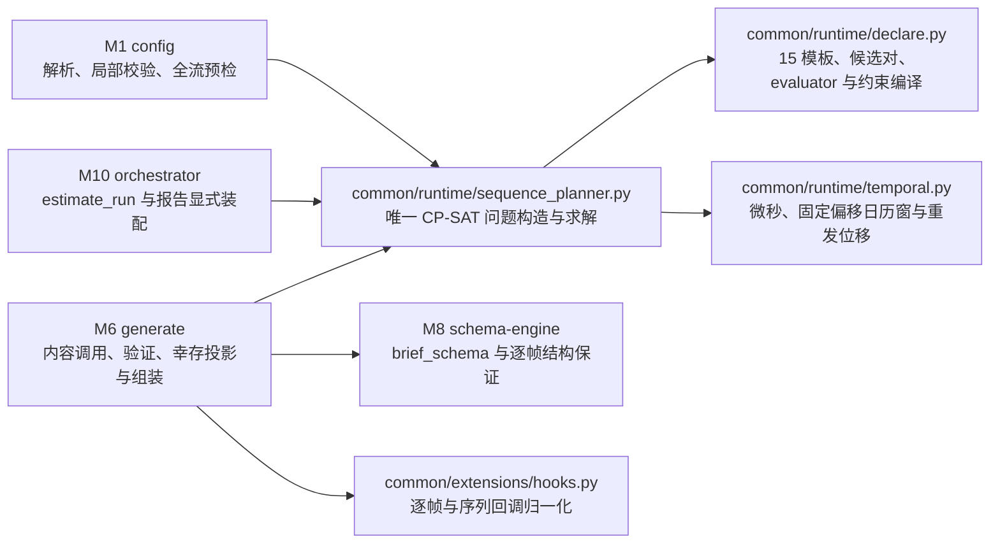

# 3. 模块详细设计

本章每个模块按统一模板描述：**职责与边界 → 输入/输出 → 数据结构与 API → 算法与流程 → 配置项 → 错误处理 → 背书**。所有代码签名为 Python 3.11+，公共数据结构（`Record`、`PipelineItem` 等）的完整定义集中在第 4 章。

## 3.0 v1.16 时间流序列规则的跨模块落点

v1.16 不增加新的流水线 Stage 或模块编号。它在时间流生成的既有 M1/M6/M8/M10 接缝上增加共享 common 运行时算法；M11、M12、CLI、M9 与其他算子不增加行为分支。约束路径的单一依赖方向如下：

| 责任面 | 规范落点 | 强制边界 |
|---|---|---|
| M1 配置 | 3.1：解析全局/按类 rules/windows 与 `sequence_validator`，校验 15 模板、correlation Schema、每个候选长度、全配额前缀和 planner 状态 | 用同 seed 独立 RNG 副本，不推进运行期随机源；UNKNOWN 不得伪报不可满足 |
| M6 生成 | 3.6：实际前缀重放联合计划；约束路径生成 brief/frames，依次执行逐帧回调、声明式 evaluator、序列回调、相似度、幸存投影、噪音过滤、回填、重发与组装 | 首个 LLM 调用前冻结 word/session/timestamps/noise slots；失败后不重解、不重织、不补齐 |
| M8 结构引擎 | 3.8：新增 `brief_schema(length)`；既有 `plan_schema` 完整保留给 v1.15 默认路径 | brief Schema 只允许逐位置 `brief`，不让约束路径 LLM 决定 frame class |
| M10 编排 | 3.10：`estimate_run` 复用同一 planner；按固定键位显式装配 rules、回调 scrap 与 windows 报告块 | 不自行推导另一套计划；显式零值块不依赖计数器首触 |
| common 配置/契约/扩展 | 第 4–5 章：冻结 `SequenceRuleSpec`、`CorrelationSpec`、`SequenceWindowSpec`、`SequenceValidationInput`、三态 effective helpers 与 hook 契约 | common 不导入 operators/orchestration；回调拿 JSON-compatible 深拷贝，突变不回写 |
| M11 与 M12 | 第 6–7 章：沿用既有工件、报告交付、trace 与日志纪律 | 工件行形和 truth/generator 键序不变；零新 trace 通道、事件或错误 kind |

联合规划器不是一个新算子：它在 M1、`estimate_run` 与 M6 之间共享同一个问题构造与求解入口。生产依赖精确锁定 `ortools==9.15.6755`，模型固定单线程与确定性预算；不提供自研替代实现、运行时版本替换或失败后的 fallback。没有实际生效 rules/windows 且没有 `sequence_validator` 时，调用链必须直接落回 v1.15 原分支并保持逐字节等价。
